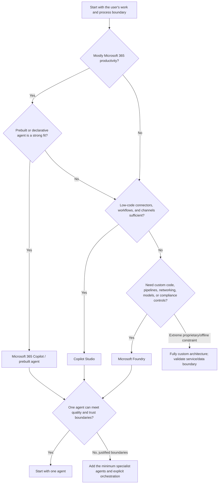

# Day 3: D1.2 Multi-Agent Platform Strategy

**Date**: 2026-08-14
**Domain**: Plan AI-powered business solutions (25-30%)
**Subtopics**: Microsoft 365 Copilot vs Microsoft Copilot Studio vs Microsoft Foundry; prebuilt agent use cases; justified multi-agent design
**Estimated study time**: 1 hour

---

## TL;DR (60-second skim)

- Choose **Microsoft 365 Copilot** when the primary goal is productivity in Microsoft 365 apps, grounded in work content the user is already permitted to access.
- Choose **Microsoft Copilot Studio** when business makers need a graphical, low-code platform for configurable agents, connectors, workflows, knowledge, and multiple channels.
- Choose **Microsoft Foundry** when developers need code-first control over models, custom pipelines, APIs, networking, identity, evaluation, tracing, deployment, or regulated boundaries.
- Prefer a **prebuilt agent** when its supported business process substantially matches the requirement; configure and govern before deciding to rebuild.
- Do not create multiple agents merely for modularity. Split only for meaningful domain ownership, trust boundaries, independent lifecycle, privilege separation, or reliability limits.
- For dependent steps, use explicit sequential orchestration; for independent checks, consider parallel work; keep a clear orchestrator and bounded handoffs.
- Each agent and tool should have the minimum identity, data, and action permissions required. A convenient broad credential is not an acceptable architecture.
- Start with one or two agents that deliver most of the value, measure quality and cost, and scale only after evidence shows that additional boundaries are justified.

---

## Learning Objectives

After this session, you should be able to:

1. Select among Microsoft 365 Copilot, Copilot Studio, and Microsoft Foundry from business, technical, and compliance requirements.
2. Recognize when a Microsoft 365 or Dynamics 365 prebuilt agent is preferable to building from scratch.
3. Explain when multi-agent architecture improves a solution and when it only adds cost and failure modes.
4. Design architect-level boundaries for orchestration, identity, permissions, grounding, tools, governance, observability, evaluation, and auditability.
5. Apply a start-small validation strategy before scaling agent count or autonomy.

---

## Naming and Scope as of 2026-08-14

### Verified Microsoft facts

- **Microsoft Foundry** is the current platform name used in Microsoft Learn. Older material can still contain **Azure AI Foundry** while the rename rolls out.
- **Foundry Agent Service** is the managed platform for building, deploying, and scaling agents. It supports prompt agents, hosted agents, supported models, tools, SDK/REST use, and the Responses API.
- **Microsoft Copilot Studio** is a graphical, low-code studio for building and managing agents and workflows, connecting business data and systems, and publishing to channels.
- Copilot Studio currently documents multiple harnesses. The product's low-code identity does not mean every agent is only a simple topic-based chatbot.
- **Microsoft 365 Copilot** is a productivity experience integrated with Microsoft 365 apps. Agents can specialize and extend that experience with organizational knowledge, skills, and workflows.
- **Microsoft Agent 365** is documented as an enterprise control plane for agents. Treat it as cross-estate governance, not as a replacement for the three creation/runtime choices in this session.

### Architectural recommendation

For exam questions, focus on the stable ownership boundary rather than a transient feature checklist:

- Microsoft 365 Copilot owns the **productivity experience**.
- Copilot Studio owns the **low-code business agent and workflow experience**.
- Foundry owns the **developer-controlled AI application and runtime experience**.

---

## Key Concepts

### 1. Microsoft 365 Copilot: productivity-first SaaS assistance

#### Verified Microsoft facts

Microsoft 365 Copilot works in the flow of Microsoft 365 work. It helps users query work data, summarize, draft, analyze, and streamline tasks. Microsoft 365 extensibility supports agents, Copilot connectors, Work IQ APIs, and Copilot APIs.

Microsoft 365 and SharePoint agents respect access controls. SharePoint agents respond based on the requesting user's access permissions; an agent is not an administrative bypass around restricted content. Microsoft guidance emphasizes remediating oversharing and governing SharePoint, OneDrive, Exchange, and Copilot interactions.

Representative first-party experiences include:

- **Standard Copilot chat**: quick summaries, short replies, drafting, and lightweight brainstorming.
- **Researcher**: deeper, multi-step research across the web and work content the user can access, producing source-cited reports.
- **Analyst**: data exploration and analysis, including cross-file patterns and data-driven insights.
- **Idea Coach and Surveys agent**: supported examples for creative thinking and survey design in Microsoft Learn training.

#### Select it when

- The user's natural work surface is Teams, Outlook, Word, Excel, PowerPoint, SharePoint, or Copilot Chat.
- The task is primarily read, summarize, draft, analyze, or assist rather than operate a custom regulated pipeline.
- Existing Microsoft 365 identity, permissions, compliance, and administrative controls fit the requirement.
- A prebuilt or declarative agent covers the task with limited specialization.

#### Do not select it merely because

- The organization already owns Microsoft 365.
- It is the fastest option, while requirements demand custom data transformation, strict workflow enforcement, custom runtime behavior, or detailed action-level control.
- Someone proposes giving the agent broad service-account access to overcome poor source permissions.

### 2. Copilot Studio: low-code business process agents and connectors

#### Verified Microsoft facts

Copilot Studio combines instructions, knowledge, tools/actions, orchestration, agents, and workflows in a graphical SaaS authoring experience. It can connect through prebuilt or custom connectors, REST APIs, MCP servers, and workflows, and can publish to Teams, Microsoft 365 Copilot, websites, mobile apps, and other channels.

The standard harness supports generative or classic orchestration. Generative orchestration can select topics, tools, connected agents, and knowledge based on their descriptions and can react to event triggers. Classic orchestration uses explicit topic matching and is suitable when predictability is more important than flexible planning.

Copilot Studio also supports child/inline agents and connected agents. Connected agents have their own orchestration, tools, and knowledge. Microsoft guidance warns that differing privileges and knowledge require governance and audit controls.

#### Select it when

- Business owners and professional makers must iterate quickly without maintaining a custom application runtime.
- The solution centers on Dataverse, Power Platform, Microsoft 365, Dynamics 365, common connectors, agent flows, or supported APIs.
- The process needs configurable topics, deterministic workflow steps, generative orchestration, event-triggered work, or multi-channel publication.
- Out-of-box analytics, evaluations, environment governance, and Power Platform ALM are sufficient.

#### Escalate toward Foundry when

- The solution needs custom ingestion or transformation pipelines over inconsistent lake data.
- Developers need custom code/frameworks, model/runtime selection, network topology, compute, storage, or protocol control.
- Compliance requires controls or telemetry beyond the platform's supported abstractions.
- Complex API orchestration, custom evaluation gates, or data-level audit behavior is central rather than incidental.

### 3. Microsoft Foundry: developer-controlled custom AI solutions

#### Verified Microsoft facts

Foundry Agent Service supports:

- **Prompt agents** managed by Foundry without application code or customer-managed agent compute.
- **Hosted agents** for custom code and supported frameworks, packaged and run with managed endpoints, scaling, identity, and observability.
- Custom models and platform tools through a managed development and operations environment.
- Microsoft Entra identity, Foundry RBAC, agent identities, tool authentication, private networking options, and customer-managed resources in standard setup.
- Tracing, evaluation, and monitoring. Built-in evaluators cover quality, RAG measures, safety, and agent measures such as tool-call accuracy and task completion; custom evaluators are also supported.

Foundry documentation recommends Microsoft Entra ID for production because it enables granular RBAC and traceability. Agent identities can authenticate to downstream systems without embedding secrets. Standard agent setup can keep agent state in customer-managed Storage, AI Search, and Cosmos DB resources for data control and isolation.

#### Select it when

- A mature engineering team must own custom code, APIs, data processing, deployment, or orchestration.
- Workflows cross regulated boundaries or require explicit separation of duties.
- The solution needs scoped agent identities, private endpoints/VNet design, model choice, custom storage, or custom pipeline integration.
- Repeatable evaluations, traces, operational telemetry, and deployment gates are required.
- The organization needs custom compliance processing or audit evidence at the data/action level.

#### Important boundary

Foundry provides the controls to implement a compliant design; choosing Foundry does not make the design compliant automatically. The architect must define retention, redaction, access, network egress, approval, audit, and evaluation policies.

---

## Decision Framework

### Five-question exam method

1. **Where does the user work?** Microsoft 365 apps, a business process/channel, or a custom application?
2. **What must the agent do?** Assist, retrieve, automate, decide, or execute high-impact actions?
3. **What cannot be abstracted away?** Custom pipelines, networking, runtime, identity, model, retention, audit, or evaluation?
4. **Is a prebuilt agent a close process fit?** Prefer configure/extend before rebuild, unless constraints disqualify it.
5. **Why multiple agents?** Name the trust, ownership, lifecycle, context, or reliability boundary. If you cannot, keep one agent.

---

## Concise Decision Matrix

| Requirement signal        | Microsoft 365 Copilot                        | Copilot Studio                                         | Microsoft Foundry                                             |
| ------------------------- | -------------------------------------------- | ------------------------------------------------------ | ------------------------------------------------------------- |
| Primary goal              | Personal/team productivity                   | Business process agent and automation                  | Custom AI application/platform                                |
| Main builders             | Users, admins, declarative-agent makers      | Business makers, functional consultants, pro makers    | Developers, ML/platform engineers                             |
| Natural surface           | Microsoft 365 apps and Copilot Chat          | Teams, M365, web, apps, many channels                  | Custom apps, APIs, services, background workloads             |
| Grounding sweet spot      | Microsoft 365 work context and connectors    | Configured knowledge, Dataverse, connectors, APIs, MCP | Custom retrieval, ingestion, transformation, stores, models   |
| Actions                   | Specialized skills/workflows in M365 context | Connectors, REST, MCP, workflows, tools                | Custom tools/APIs, SDKs, code/framework orchestration         |
| Control level             | SaaS/productivity-first                      | Managed low-code configuration                         | Code/runtime/data/network/evaluation control                  |
| Regulated custom pipeline | Weak fit by itself                           | Fit only if supported controls are sufficient          | Strongest Microsoft platform fit                              |
| Time to first value       | Usually fastest                              | Fast for supported processes                           | More engineering and operations work                          |
| Best exam cue             | "In the flow of Microsoft 365 work"          | "Low-code, connectors, workflows, channels"            | "Custom pipeline, APIs, strict audit/network/runtime control" |

---

## Prebuilt Agents: When to Use Them

### Verified Microsoft facts

Microsoft documents preinstalled Microsoft 365 experiences and a store/admin lifecycle for agents. Copilot Studio's Agent Library provides curated templates and reusable components that can be deployed and customized. Dynamics 365 ships Microsoft-provided agents as managed solutions, with a deployment wizard that validates environments and applies required configuration.

Dynamics 365 Sales documents out-of-box agents including:

| Agent                     | Representative supported use case                                                       |
| ------------------------- | --------------------------------------------------------------------------------------- |
| Sales Qualification Agent | Research leads, determine fit, send outreach, and engage leads                          |
| Sales Opportunity Agent   | Research opportunities, identify risks, and highlight promising opportunities           |
| Sales Close Agent         | Support an end-to-end sales cycle, recommendations, objections, outreach, and follow-up |
| Sales Research Agent      | Answer complex natural-language questions over sales data                               |
| Recommended Actions Agent | Prioritize seller actions for opportunities                                             |

Dynamics 365 broadly embeds agents, Copilot experiences, and AI capabilities across sales, service, finance, supply chain, commerce, and other apps. Availability, licensing, geography, language, and preview status must be checked for the specific agent.

### Architectural recommendation

Use a prebuilt agent when all of these are true:

- The business process substantially matches the documented use case.
- The system of record and user experience already align with the target Microsoft application.
- Required identity, data movement, audit, and human-approval controls are supported.
- Configuration and extension cost less than recreating and operating the capability.

Build or extend instead when proprietary differentiators, unsupported process rules, custom data engineering, strict isolation, or required evidence cannot be achieved by configuration.

---

## Multi-Agent Architecture: Justification Before Design

### Valid complexity drivers

- **Regulated or trust boundary**: separate agents prevent one role from crossing into another data/action domain.
- **Separation of duties**: requester, evaluator, approver, and executor require distinct identities and action scopes.
- **Domain ownership**: HR, finance, sales, and compliance teams independently own knowledge, tools, releases, and approvals.
- **Context/tool overload**: one agent becomes less reliable as too many documents or tools compete for selection.
- **Independent lifecycle/SLA**: components need different release cadence, scale, availability, or evaluation criteria.
- **Reusable specialization**: a specialist serves multiple parent agents through a stable contract.

### Weak reasons

- "Multi-agent is more advanced."
- "Seven departments means seven agents" without separate ownership or permissions.
- "More agents means better accuracy."
- Splitting a simple deterministic sequence that a workflow can express more safely.

### Orchestration patterns

| Pattern           | Use when                                            | Architect concern                                         |
| ----------------- | --------------------------------------------------- | --------------------------------------------------------- |
| Sequential        | Step B depends on validated output from step A      | State contract, retries, idempotency, approval gates      |
| Parallel          | Independent analyses/checks can run together        | Cost, fan-out, timeout, conflict resolution               |
| Router/dispatcher | Requests map clearly to specialist domains          | Routing accuracy, fallback, ambiguous intent              |
| Supervisor        | A coordinator plans and synthesizes specialist work | Excessive autonomy, traceability, bounded loops           |
| Human checkpoint  | Action is irreversible, regulated, or high impact   | Evidence presented, approver identity, timeout/escalation |

### Boundary checklist for every agent

- **Role**: one clear responsibility and owner.
- **Identity**: unique workload/agent identity where supported; no shared broad credential.
- **Permissions**: least privilege for each data source and tool; distinguish user-delegated from agent/application access.
- **Grounding**: authorized, relevant, current sources with ownership and freshness rules.
- **Tools/actions**: narrow schemas, allow-listed destinations, input validation, output validation, and approval for consequential actions.
- **Memory/state**: documented retention, encryption, residency, deletion, and sensitive-data policy. Use ephemeral handling when persistence is prohibited.
- **Observability**: correlation IDs, traces, tool calls, latency, errors, model/version, and cost without indiscriminate sensitive logging.
- **Evaluation**: task completion, groundedness, tool-call accuracy, safety, latency, and domain-specific compliance tests.
- **Auditability**: who/what initiated, which identity acted, data/tool accessed, approval received, result, and policy/version used.

---

## Scenario-Based Decision Patterns

1. **Executive needs summaries, drafts, meeting insights, and research from permitted Microsoft 365 content**  
   Choose Microsoft 365 Copilot and suitable prebuilt agents. Fix oversharing at the source; do not elevate the agent to bypass permissions.

2. **Benefits-enrollment agent needs guided conversation, Dataverse, connectors, deterministic approval flow, and Teams/web channels**  
   Choose Copilot Studio. Use deterministic workflow steps where policy requires predictability; reserve generative orchestration for bounded flexible tasks.

3. **Claims solution must transform inconsistent lake data, invoke custom pipelines, enforce regulated audit controls, and expose a custom application**  
   Choose Foundry/custom engineering. Low-code delivery speed does not outweigh unsatisfied data and compliance controls.

4. **Loan process calls internal APIs, has multi-step approvals and separation of duties, and needs full action tracing**  
   Use Foundry with scoped agent identities/actions, explicit orchestration, evaluation gates, and audit evidence. Add human approval for consequential decisions.

5. **Proprietary scientific workflow cannot permit data exposure outside an approved boundary and the team has mature engineering capability**  
   Validate every service/data-processing boundary. A fully custom deployment can be required; a prebuilt or low-code choice is not correct solely because it is faster.

6. **Team requests seven agents in sprint one, but routing and dispatch provide 80% of value**  
   Build one routing agent or a minimal two-agent proof first. Measure business outcome, routing errors, latency, cost, and operational burden before expanding.

7. **Agent calls pricing, inventory, and shipping APIs while sensitive customer data must not persist**  
   Use ephemeral state for prohibited data, a distinct least-privilege scope per tool, approved egress destinations, redacted traces, and explicit retention controls.

8. **Patient intake crosses regulated systems, while another requirement is merely consistent HR responses across departments**  
   Use separated agent boundaries for the regulated crossing. For HR consistency, central prompt/instruction governance may solve the problem without adding agents.

---

## Cost and Operational Tradeoffs

| Added capability        | Benefit                               | Cost/risk introduced                                                            |
| ----------------------- | ------------------------------------- | ------------------------------------------------------------------------------- |
| Another agent           | Specialization and ownership boundary | More calls, latency, routing failures, identities, versions, tests, and support |
| More tools              | Broader action capability             | Larger attack surface and tool-selection ambiguity                              |
| Persistent memory       | Continuity and personalization        | Retention, privacy, residency, deletion, and leakage risk                       |
| Custom pipeline/runtime | Exact control and differentiation     | Engineering, on-call, scaling, patching, and lifecycle cost                     |
| Parallel orchestration  | Lower wall-clock time                 | Higher token/API spend and reconciliation complexity                            |
| Detailed traces         | Better debugging and audit evidence   | Sensitive-data exposure unless access, retention, and redaction are designed    |

**Start-small rule**: ship the smallest architecture that proves the high-value path. Define success measures before adding agents: task completion, quality, human escalation, latency, cost per successful task, security findings, and operational incidents.

---

## Common Exam Traps and Misconceptions

- **Trap: choose the prebuilt option because it is fastest.** Correct only when its boundaries satisfy proprietary, regulatory, integration, and audit requirements.
- **Trap: Copilot Studio is always too simple for orchestration.** It supports tools, workflows, generative/classic orchestration, event triggers, and connected agents; choose by required control, not a dated feature assumption.
- **Trap: Foundry automatically guarantees compliance.** It supplies controls; the architecture and operating policies establish compliance.
- **Trap: a service account can let an M365 agent read everything.** Agents must not be designed to bypass users' content permissions; remediate source access and oversharing.
- **Trap: persistent logs are always required for audit.** Auditability can require metadata and action evidence while sensitive payloads remain redacted, minimized, or ephemeral.
- **Trap: broad API/network access improves performance.** Prefer approved destinations, explicit tool contracts, and least privilege.
- **Trap: every department needs a separate agent.** Central instruction/prompt governance can solve consistency without extra runtime boundaries.
- **Trap: dependent tasks imply autonomous supervisor orchestration.** A controlled sequential workflow is often clearer and more auditable.
- **Trap: many agents are future-proof.** Every agent increases routing, identity, testing, latency, cost, and operational surface.
- **Trap: prebuilt means no governance.** Prebuilt agents still require licensing, deployment, permissions, data readiness, monitoring, and lifecycle decisions.

---

## MS Learn In-Exam Lookup Strategy

Use short product-plus-decision searches rather than broad conceptual searches:

| Need                  | Search phrase                                                                                                             |
| --------------------- | ------------------------------------------------------------------------------------------------------------------------- |
| Product boundary      | `Microsoft 365 Copilot extensibility overview`                                                                            |
| Low-code capabilities | `Copilot Studio overview knowledge tools workflows channels`                                                              |
| Multi-agent guidance  | `Copilot Studio multi-agent orchestration patterns`                                                                       |
| Code-first runtime    | `Foundry Agent Service overview prompt hosted agents`                                                                     |
| Identity              | `Foundry agent identity least privilege RBAC`                                                                             |
| Evaluation/trace      | `Microsoft Foundry observability evaluation tracing`                                                                      |
| M365 permissions      | `SharePoint agents access permissions`                                                                                    |
| Dynamics inventory    | `Dynamics 365 AI agents overview Sales`                                                                                   |
| Current status        | Open the feature page and check **Important/Note**, preview status, geography, language, licensing, and last-updated date |

During the exam, extract the decisive noun phrases first: **flow of work**, **low-code connector**, **custom pipeline**, **private network**, **separation of duties**, **full auditability**, **per-user permissions**, **dependent sequence**, or **80% value**.

---

## Quick Reference Card

### Selection shorthand

- **M365 Copilot** = productivity + work context + existing user permissions.
- **Copilot Studio** = low-code business agent + connectors/workflows + channels.
- **Foundry** = developers + custom data/runtime/network/model/evaluation controls.
- **Fully custom** = constraints exceed managed-platform boundaries and engineering maturity supports ownership.

### Multi-agent gate

Add an agent only if you can name at least one concrete boundary:

- Different privilege or regulated data domain
- Independent business owner or release lifecycle
- Reusable specialist with a stable contract
- Reliability/context limit demonstrated by tests
- Distinct SLA, scale, or evaluation requirement

Otherwise, prefer one agent plus deterministic tools/workflows.

### Security shorthand

`unique identity -> least privilege -> approved tools/egress -> minimized state -> trace/evaluate -> audit consequential actions`

---

## Suggested 1-Hour Study Flow

- **10 min**: Read the TL;DR, naming, and three platform sections.
- **10 min**: Recreate the decision matrix from memory.
- **15 min**: Study prebuilt-agent and multi-agent justification sections.
- **15 min**: Work through all eight scenarios and explain the decisive constraint aloud.
- **10 min**: Review traps and practice the MS Learn lookup phrases.

There is **no formally assigned Day 3 quiz and no `day-assignments.json` in this exam folder**. Do not treat nearby practice-bank concepts as a Day 3 assignment. Today's goal is study and decision-pattern recognition.

---

## Sources (verified during this session)

- [Microsoft 365 Copilot extensibility overview](https://learn.microsoft.com/en-us/microsoft-365/copilot/extensibility/overview)
- [Agents for Microsoft 365 Copilot Chat](https://learn.microsoft.com/en-us/copilot/agents)
- [Researcher agent in Microsoft 365 Copilot](https://learn.microsoft.com/en-us/microsoft-365/copilot/researcher-agent)
- [Manage access to agents in SharePoint](https://learn.microsoft.com/en-us/sharepoint/manage-access-agents-in-sharepoint)
- [Secure and governed foundation for Microsoft 365 Copilot](https://learn.microsoft.com/en-us/microsoft-365/copilot/configure-secure-governed-data-foundation-microsoft-365-copilot)
- [Microsoft Copilot Studio overview](https://learn.microsoft.com/en-us/microsoft-copilot-studio/fundamentals-what-is-copilot-studio)
- [Copilot Studio agents overview](https://learn.microsoft.com/en-us/microsoft-copilot-studio/agents-overview)
- [Multi-agent orchestration patterns and best practices](https://learn.microsoft.com/en-us/microsoft-copilot-studio/guidance/multi-agent-patterns)
- [Add other agents in Copilot Studio](https://learn.microsoft.com/en-us/microsoft-copilot-studio/authoring-add-other-agents)
- [What is Microsoft Foundry Agent Service?](https://learn.microsoft.com/en-us/azure/foundry/agents/overview)
- [Agent identity concepts in Microsoft Foundry](https://learn.microsoft.com/en-us/azure/foundry/agents/concepts/agent-identity)
- [Role-based access control for Microsoft Foundry](https://learn.microsoft.com/en-us/azure/foundry/concepts/rbac-foundry)
- [Observability in generative AI](https://learn.microsoft.com/en-us/azure/foundry/concepts/observability)
- [Standard agent setup and customer-managed resources](https://learn.microsoft.com/en-us/azure/foundry/agents/concepts/standard-agent-setup)
- [Agents, Copilot, and AI capabilities in Dynamics 365 apps](https://learn.microsoft.com/en-us/dynamics365/copilot/ai-get-started)
- [AI agents in Dynamics 365 Sales](https://learn.microsoft.com/en-us/dynamics365/sales/ai-agent-overview)
- [Deploy Dynamics 365 agents with the agent deployment wizard](https://learn.microsoft.com/en-us/dynamics365/fin-ops-core/dev-itpro/copilot/agent-deployment)
- [Copilot Studio Agent Library](https://learn.microsoft.com/en-us/microsoft-copilot-studio/guidance/agent-library-overview)

---

## Notes (your own words - fill this in after studying)

- My three strongest platform-selection signals:
- A case where I would reject the faster prebuilt/low-code option:
- The minimum evidence I need before adding another agent:
- One security boundary I must never solve with broad permissions:
