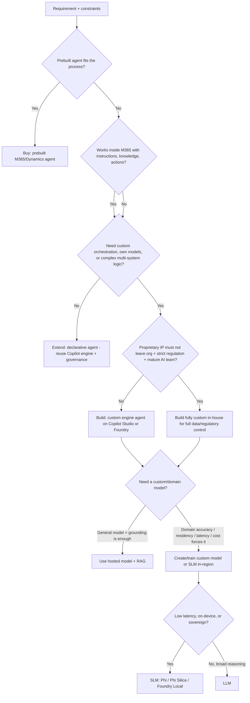

# Day 4: D1.2 Custom vs Extend, SLMs, and the AI Center of Excellence

**Date**: 2026-08-15
**Domain**: Plan AI-powered business solutions (25-30%)
**Subtopics**: Build custom agents vs extend Microsoft 365 Copilot; when to create/train custom models; small language model (SLM) use cases (Phi family) vs large models; prompt library and prompt management best practices; AI Center of Excellence (CoE) elements and operating model
**Estimated study time**: 1 hour

---

## TL;DR (60-second skim)

- **Extend before you build.** Prefer a declarative agent that reuses Copilot's orchestrator, foundation models, and Microsoft 365 security/compliance. Build a **custom engine agent** only when you need custom orchestration, your own models, or complex multi-system business logic.
- **Build/Buy/Extend order**: buy (prebuilt) → extend (declarative/Copilot Studio) → build (custom engine / Foundry). Escalate only when a real constraint disqualifies the lighter option.
- **Build fully custom** when proprietary IP cannot leave the org, workflows are strictly regulated, and the team has mature AI engineering capability (classic AB-100 "Build" answer).
- **Create/train a custom model** only when general models cannot meet domain accuracy, latency, residency, or cost constraints — not because "custom sounds better."
- **SLMs (Phi family)** win on **low latency, on-device/edge, data residency, and cost** for narrow, well-scoped tasks. **LLMs** win on broad reasoning across complex, open-ended content.
- **Phi Silica** runs **locally on the NPU of Copilot+ PCs**; **Foundry Local** hosts SLMs on-device. Both keep data on the device — a strong fit for sovereignty and offline scenarios.
- **Prompt management**: use **Copilot Prompt Gallery** (Suggested / Your Prompts / Teams) plus **organizational prompts** to promote consistency, reuse, and governance — often a better fix than spinning up more agents.
- **AI CoE**: a multidisciplinary team that prevents fragmented, ungoverned AI. It **evaluates and prioritizes** use cases by value/feasibility/risk/readiness, and **evolves from centralized → advisory** as adoption matures.

---

## Learning Objectives

After this session, you should be able to:

1. Decide between **extending Microsoft 365 Copilot** (declarative agent) and **building a custom engine agent / custom solution**, using concrete constraints rather than preference.
2. Apply the **Build / Buy / Extend** decision in the correct order and recognize the exact signals that force a "Build" answer.
3. Determine **when to create or train a custom model** versus using a hosted general model.
4. Select an **SLM (Phi) vs an LLM** based on latency, residency, cost, task scope, and reasoning complexity, and explain **Phi Silica** and **Foundry Local** on-device patterns.
5. Recommend **prompt library / prompt management** practices (Prompt Gallery, organizational prompts) to drive consistency and governance.
6. Describe the **AI Center of Excellence** elements, responsibilities, prioritization method, and the **centralized → advisory** operating-model evolution.

---

## Naming and Scope as of 2026-08-15

### Verified Microsoft facts

- **Microsoft Foundry** is the current platform name used in Microsoft Learn (older pages may still say **Azure AI Foundry** during the rename). Custom engine agents and custom models are hosted here or on other Azure services.
- Microsoft 365 Copilot extensibility documents two agent types: **declarative agents** (extend Copilot) and **custom engine agents** (build your own engine).
- **Copilot Studio** can be used for both low-code declarative work and as a low-code path to custom engine agents; **Visual Studio / VS Code + Agents Toolkit** is the pro-code path.
- **Copilot Prompt Gallery** is the Microsoft 365 surface for curated and user/team-saved prompts, with **organizational prompts** and admin analytics.
- **AI Center of Excellence** guidance lives in the **Cloud Adoption Framework (CAF)**, plus an MS Learn training module "Introduction to the AI Center of Excellence."

### Architectural recommendation

For exam questions, anchor on stable boundaries:

- **Extend (declarative agent)** = reuse Copilot's engine, models, and Microsoft 365 governance.
- **Build (custom engine agent / Foundry)** = own the orchestration, models, hosting, and controls.
- **CoE** owns strategy, standards, prioritization, and enablement — not delivery forever.

---

## Key Concepts

### 1. Extend Microsoft 365 Copilot vs build a custom agent

Microsoft 365 Copilot extensibility gives you two agent shapes:

#### Declarative agents (extend)

A declarative agent **configures Copilot** for a specific scenario by adding **custom instructions, additional knowledge, and custom actions**. Crucially, it **uses Copilot's own AI infrastructure, model, and orchestrator**, so it automatically inherits Microsoft 365 **security, compliance, and Responsible AI** requirements.

- **Hosting**: hosted in Microsoft 365 (no separate model hosting to run or pay for).
- **Tooling**: low-code (Agent Builder) or pro-code (VS Code + Agents Toolkit).
- **Deployment**: within your org, or publish to the commercial store as an ISV.
- **Build a declarative agent when**:
  - You want the agent to work **within Copilot's orchestration and models** for consistent security/compliance.
  - You want **faster / no-or-low-code** implementation.
  - The user's workflow is **inside Microsoft 365 apps** (SharePoint, OneDrive, Teams) — e.g., an IT helpdesk agent answering `@mentions` in Teams, or a SharePoint document-summarization agent.

#### Custom engine agents (build)

A custom engine agent is a **fully customized AI assistant**. You provide **custom orchestration**, optionally **your own models** (LLM, SLM, fine-tuned, or industry-specific), and **agentic autonomy**.

- **Hosting**: requires **additional hosting outside Microsoft 365** (typically Azure), at additional cost.
- **Tooling**: low-code Copilot Studio, or pro-code (VS Code / Visual Studio, .NET/Python/JS, Semantic Kernel/LangChain).
- **You own RAI/compliance**: because you leave Copilot's built-in engine, you must ensure the agent is compliant, secure, and adheres to Responsible AI.
- **Build a custom engine agent when**:
  - You need **custom orchestration** for complex workflows, precise business rules, or multiple system integrations (e.g., a **loan approval agent** with credit-check systems and strict decision rules).
  - You want to **use your own / domain-specific / multimodal models**.
  - You need agent-to-agent collaboration or channels beyond what declarative agents cover.

#### The exam framing: Build / Buy / Extend

AB-100 phrases the same decision as **Build / Buy / Extend**, applied in order:

- **Buy** = prebuilt Microsoft 365 Copilot / Dynamics 365 agent when the process matches out-of-box.
- **Extend** = declarative agent or Copilot Studio configuration when you need instructions, knowledge, and actions but not a custom engine.
- **Build** = custom engine agent / Foundry / fully custom when constraints disqualify the lighter options.

The forced-**Build** signal set (memorize): **highly proprietary IP that cannot leave the organization + strict regulated workflows + a mature AI engineering team.** When all three appear, "Build fully custom" is correct even though it is slower.

### 2. When to create or train a custom model

Reuse a hosted general model by default. **Create or train (fine-tune / customize) a model only when a concrete requirement forces it**:

- **Domain accuracy**: highly specialized vocabulary/tasks (e.g., drug-interaction classification) where general models underperform.
- **Data residency / sovereignty**: data cannot leave a region → you need a model you can host **in-region**.
- **Latency**: a hard budget (e.g., **< 200 ms**) that a large hosted LLM cannot meet reliably.
- **Cost at scale**: high-volume, narrow tasks where a smaller customized model is far cheaper per call.
- **IP / isolation**: the model and data must stay inside an approved boundary.

If none of these apply, **grounding (RAG) on a general model** usually beats training a custom model — cheaper, faster to ship, easier to govern. Training is a **last resort**, not a differentiator for its own sake.

### 3. Small language models (SLMs) vs large language models (LLMs)

#### SLMs (Phi family)

The **Phi** family is Microsoft's line of small, efficient models. Verified facts:

- Phi variants such as **Phi-4-mini-reasoning** support large context (up to **128,000 tokens**) while remaining small enough for constrained hosting.
- **Phi Silica** runs **locally on the NPU** of **Copilot+ PCs** — the language model runs **on-device**, not in the cloud (powers features like Click to Do summarization).
- **Foundry Local** hosts SLMs **on-device** for local inference.

**Choose an SLM when**:
- **Latency** must be low (near-real-time, sub-200ms goals).
- Data must stay **on-device / in-region** (sovereignty, privacy, offline/edge).
- The task is **narrow and well-scoped** (classification, extraction, routing, short summaries).
- **Budget is moderate** and volume is high — SLMs cost less per token and can run on cheaper compute.

**Choose an LLM when**:
- The task needs **broad reasoning** across long, complex, open-ended content.
- Quality/coverage across many domains matters more than latency or per-call cost.

**Hybrid pattern (model routing)**: route **simple tasks → SLM**, **moderate → fine-tuned**, **complex → LLM**. Match model capability to task complexity instead of sending everything to one big model.

### 4. Prompt library and prompt management best practices

Consistency across many users/teams is frequently a **prompt-governance** problem, not an "add more agents" problem.

**Copilot Prompt Gallery** (Microsoft 365 Copilot / Copilot Chat):

- **Suggested** = Microsoft-curated prompts; **Your Prompts** = user-saved; **Teams** = shared with a team.
- Prompts can be **saved and shared across teams** to **promote consistency and collaboration**; each includes personalization/extension tips.
- Admins get **analytics** on saved/liked/shared prompts and can **export** prompt data; **organizational prompts** let the org publish approved prompts centrally.

**Prompt management best practices for the exam**:
- Centralize approved prompts (organizational prompts / shared Gallery) to enforce **consistency** and reduce drift.
- Treat prompts as **governed, versioned assets** (review, ownership, update cadence) — not scattered personal text.
- Use prompt libraries to **scale good patterns** before building new agents.
- Keep prompts **permission- and compliance-aware**; do not embed secrets or content users shouldn't see.

### 5. AI Center of Excellence (CoE)

Per the Cloud Adoption Framework, an **AI CoE** is an **internal team of experts** that drives valuable AI outcomes and **prevents fragmented or ungoverned AI adoption**.

#### Building the team

- **Assign a dedicated leader** as the single point of contact for AI strategy.
- **Assemble a multidisciplinary team**: business leaders (use cases, data, value) + AI technical experts (data scientists, ML engineers, **governance**, **security**, **AI operations**).
- **Placement**: build on existing teams — **integrate into a Cloud CoE (CCoE)** if you have one. Create a **standalone AI team only** if existing teams can't support AI or critical risks exist. Avoid unnecessary complexity.
- **Operating model**: start **centralized** early (consolidate expertise, accelerate adoption), then move to **advisory** as adoption matures.

#### Core responsibilities

- **Set AI strategy** (use the Microsoft AI decision tree; define a **responsible AI strategy**).
- **Skill the org** (learning pathways, hands-on experimentation).
- **Lead pilot projects** and prove value.
- **Define and enforce AI standards** (governance policies, security standards).
- **Manage AI services (optional)**: lifecycle, monitoring, and a **library of templates/code repositories/compliance tools** with reusable patterns.

#### Prioritizing use cases (the q036 method)

When capacity is limited and a sponsor wants to "approve everything," the CoE's **FIRST** step is to **evaluate each use case for business value, technical feasibility, risk level, and organizational readiness**, then **prioritize a subset**. Never approve all in parallel just because a sponsor asks.

#### Evolving the operating model (the q047 method)

Once the CoE has **standardized governance and published reusable templates that teams adopt**, and business units complain about **delays/bottlenecks**, the next step is to **transition to a hybrid/advisory model**: product/platform teams **own delivery**, the CoE **sets guardrails and consults**. Do **not** dissolve it, and do **not** just add more central staff to preserve gatekeeping.

---

## Decision Framework



### Five-question exam method

1. **Can a prebuilt agent do it?** If yes, **buy**; don't rebuild.
2. **Does it live inside Microsoft 365 and only need instructions/knowledge/actions?** If yes, **extend** with a declarative agent.
3. **Do I need custom orchestration, my own models, or complex multi-system rules?** If yes, **build** a custom engine agent.
4. **Do proprietary/regulatory constraints + a mature team force full ownership?** If yes, **build fully custom**.
5. **Does a general model meet accuracy/latency/residency/cost?** If not, **train/customize** or pick an **SLM** (Phi) — especially for on-device/sovereign/low-latency.

---

## Concise Decision Matrix

| Signal in the question                                | Declarative agent (Extend)          | Custom engine agent / Foundry (Build)                | SLM (Phi)                                  | LLM                                    |
| ----------------------------------------------------- | ----------------------------------- | ---------------------------------------------------- | ------------------------------------------ | -------------------------------------- |
| Primary goal                                          | Configure Copilot in M365           | Own orchestration/models/hosting                     | Fast, narrow, cheap task                   | Broad, complex reasoning               |
| Hosting                                               | In Microsoft 365 (no extra host)    | Outside M365 (Azure), extra cost                     | On-device / in-region                      | Cloud-hosted                           |
| Security/compliance                                   | Inherited from Copilot/M365         | You must implement it                                | You control the boundary                   | Provider-hosted                        |
| Custom multi-system business logic                    | Weak fit                            | Strong fit                                            | N/A (model choice)                         | N/A                                    |
| Data residency / offline                              | Depends on M365                     | Configurable                                          | **Strongest** (on-device NPU / Foundry Local) | Weak unless region-hosted              |
| Latency budget (e.g., <200ms)                         | Not guaranteed                      | Configurable                                          | **Best**                                   | Often too slow                         |
| Best exam cue                                         | "extend Copilot / inside M365 apps" | "custom orchestration / own model / full audit"      | "sovereign + low latency + moderate budget" | "complex reasoning across documents"   |

---

## Real-World Scenarios

1. **Regulatory compliance officers, proprietary compound data that cannot leave the org, FDA-governed workflows, mature AI team** → **Build fully custom.** Speed of a prebuilt/extend option does not outweigh IP isolation + regulation + team maturity. *(q005)*

2. **Drug-interaction classification, domain-specific data, sovereign residency, <200ms latency, moderate budget** → **Customized SLM hosted in-region.** Domain + residency + latency + cost all point away from a general cloud LLM. *(q026)*

3. **Loan approval agent: multi-step workflow, three internal APIs, strict separation of duties, full auditability, strong dev team** → **Build with Microsoft Foundry** using role-scoped agents, explicit action boundaries, evaluation pipelines, and audit trails. Copilot Studio's built-in filters don't satisfy separation-of-duties + data-level audit. *(q044, q056)*

4. **12 AI use cases, limited CoE capacity, sponsor wants all 12 at once** → **Evaluate each for value/feasibility/risk/readiness first**, then prioritize a subset. Don't approve all in parallel. *(q036)*

5. **CoE at 18 months: standardized governance + adopted templates, but business units complain of delays** → **Transition to hybrid/advisory**: teams own delivery, CoE keeps standards and consults. *(q047)*

6. **Warehouse staff who rarely leave the operational workspace need demand-planning insights** → **Embedded AI** (surface insights in-workspace) beats a sidecar Copilot, reducing navigation overhead. *(q048, q057)*

7. **High-volume enterprise workflow automation needing dynamic insights, developer extensibility, automated suggestions** → **Combine generative pages, agent feed, and code-first enhancements** — a recommended extend/build architecture pattern. *(q050)*

8. **Healthcare org with no CoE, no governance, HIPAA data, four agents demanded in 90 days** → Start with the **HR Policy Q&A agent** (existing M365 data, minimal compliance risk) to show value while minimizing risk — not the highest-volume or patient-facing agent first. *(q059)*

---

## Common Traps & Misconceptions

- **Trap: "Build/custom is more advanced, so choose it."** Extend first; build only when a real constraint (orchestration, own model, IP, regulation) forces it.
- **Trap: "Prebuilt is fastest, so always buy."** Only when its boundaries satisfy proprietary/regulatory/integration/audit needs. The FDA/IP scenario forces **Build**.
- **Trap: "Declarative agents can't be secure/compliant enough."** They **inherit** Microsoft 365 security, compliance, and RAI because they reuse Copilot's engine — often the *safer* default.
- **Trap: "Custom engine agent = automatically compliant."** You leave Copilot's engine, so **you** own RAI, security, and hosting.
- **Trap: "Train a custom model for better quality."** Prefer grounding/RAG on a general model unless domain accuracy, residency, latency, or cost truly force training.
- **Trap: "LLM is always better than SLM."** For sovereign + low-latency + narrow tasks, a **Phi SLM** is the correct answer; big models can be worse on latency and cost.
- **Trap: "SLMs run only in the cloud."** **Phi Silica runs on-device on the Copilot+ PC NPU**, and **Foundry Local** hosts SLMs locally — key for offline/sovereign scenarios.
- **Trap: "Inconsistent responses across departments → build more agents."** Central **prompt governance** (organizational prompts / shared Prompt Gallery) often solves it without new runtime boundaries.
- **Trap: "CoE should approve every project forever."** Mature CoEs move from **centralized gatekeeper → advisory guardrails**; teams own delivery.
- **Trap: "Sponsor says approve all use cases, so do it."** The CoE's first job is to **evaluate and prioritize** by value/feasibility/risk/readiness.
- **Trap: "Create a standalone AI CoE immediately."** Build on existing teams / CCoE; go standalone only if current teams can't support AI or critical risks exist.

---

## MS Learn In-Exam Lookup Strategy

Use short product-plus-decision searches:

| Need                         | Search phrase                                                        |
| ---------------------------- | ------------------------------------------------------------------- |
| Extend vs build agents       | `Agents for Microsoft 365 Copilot declarative custom engine`        |
| When to build custom engine  | `custom engine agent when to build Copilot`                         |
| SLM / Phi guidance           | `Phi small language model` / `Phi Silica Copilot+ PC`               |
| On-device model hosting      | `Foundry Local on-device models`                                    |
| Prompt management            | `Copilot Prompt Gallery organizational prompts`                     |
| AI CoE elements              | `Establish an AI Center of Excellence Cloud Adoption Framework`     |
| CoE prioritization/evolution | `AI CoE operating model centralized advisory`                       |
| Current status               | Open the feature page; check Important/Note, preview, region, date  |

During the exam, extract the decisive noun phrases: **inside Microsoft 365**, **custom orchestration**, **own model**, **proprietary IP can't leave**, **sovereign residency**, **sub-200ms latency**, **prioritize use cases**, **centralized vs advisory**, **on-device**.

---

## Quick Reference Card

### Extend vs Build shorthand

- **Declarative agent (Extend)** = reuse Copilot engine/models + inherit M365 security/compliance + hosted in M365 + fast/low-code.
- **Custom engine agent (Build)** = custom orchestration + own models + external hosting (Azure) + you own RAI/security.
- **Build fully custom** = proprietary IP can't leave + strict regulation + mature AI team.

### Model choice shorthand

- **SLM (Phi)** = low latency + on-device/edge + sovereign residency + narrow task + moderate budget.
- **LLM** = broad reasoning over complex, open-ended content.
- **Model routing** = simple→SLM, moderate→fine-tuned, complex→LLM.
- **Phi Silica** = on-device on Copilot+ PC NPU; **Foundry Local** = on-device SLM hosting.

### Train-a-model gate

Train/customize only for: **domain accuracy**, **residency**, **latency**, **cost at scale**, or **IP isolation**. Otherwise ground a general model.

### AI CoE shorthand

`multidisciplinary team → prevent ungoverned AI → set strategy/standards → skill + pilot → prioritize (value/feasibility/risk/readiness) → centralized → advisory`

### Prompt management shorthand

`Prompt Gallery (Suggested / Your Prompts / Teams) + organizational prompts → consistency, reuse, governance → often beats adding agents`

---

## Suggested 1-Hour Study Flow

- **10 min**: Read TL;DR, naming, and the extend-vs-build section (declarative vs custom engine).
- **10 min**: Recreate the decision matrix and the Build/Buy/Extend order from memory.
- **10 min**: Study SLM vs LLM, Phi Silica / Foundry Local, and the "when to train a model" gate.
- **10 min**: Study the AI CoE elements, prioritization, and centralized→advisory evolution.
- **10 min**: Review prompt management + all traps.
- **10 min**: Work the scenarios aloud, then run the quiz.

---

## Related Questions in questions.json

Ten existing questions mapped to Day 4 (all verified present; all topics fit — no substitutions needed):

| ID   | Topic                          | What it tests                                                                    |
| ---- | ------------------------------ | -------------------------------------------------------------------------------- |
| q005 | Build/Buy/Extend Decision      | Forced **Build** when proprietary IP can't leave + regulated + mature AI team    |
| q026 | Model Selection / SLM          | Choosing a **customized SLM in-region** for domain + residency + latency + budget |
| q036 | AI CoE / Prioritization        | CoE's **first** step: evaluate & prioritize use cases, not approve all           |
| q044 | Platform Selection / Foundry   | **Build on Foundry** for separation of duties + auditability + dev expertise     |
| q047 | AI CoE / Operating Model       | Evolve **centralized → hybrid/advisory** once standards/templates are adopted    |
| q048 | AI Experience Model            | **Embedded AI** vs sidecar for in-workspace insights                             |
| q050 | Architecture Patterns          | Combining generative pages + agent feed + code-first as a recommended pattern    |
| q056 | Platform Selection / Foundry   | **Foundry** for custom pipelines + data-level HIPAA audit over Copilot Studio    |
| q057 | AI Experience Model            | Repeat of embedded-vs-sidecar (reinforcement)                                    |
| q059 | Use Case Prioritization        | First agent = **HR Policy Q&A** (existing M365 data, minimal compliance risk)    |

Quiz command:

```powershell
cd "d:\Projects\microsoft-exam-prep\AB-100 Prep"
python quiz_runner.py questions.json --ids q005,q026,q036,q044,q047,q048,q050,q056,q057,q059 --shuffle
```

---

## Sources (verified during this session)

- [Extend Microsoft 365 Copilot (extensibility documentation)](https://learn.microsoft.com/en-us/microsoft-365/copilot/extensibility/)
- [Agents for Microsoft 365 Copilot — declarative vs custom engine, choose what to build](https://learn.microsoft.com/en-us/microsoft-365/copilot/extensibility/agents-overview)
- [Choose the right tool to build a declarative agent](https://learn.microsoft.com/en-us/microsoft-365/copilot/extensibility/declarative-agent-tool-comparison)
- [Understand Prompt Gallery in Copilot](https://learn.microsoft.com/en-us/microsoft-365/copilot/copilot-prompt-gallery)
- [Establish an AI Center of Excellence — Cloud Adoption Framework](https://learn.microsoft.com/en-us/azure/cloud-adoption-framework/ai/center-of-excellence)
- [Introduction to the AI Center of Excellence (training module)](https://learn.microsoft.com/en-us/training/modules/intro-ai-center-excellence/)
- [Get started with Phi Silica in the Windows App SDK (on-device SLM on Copilot+ PC NPU)](https://learn.microsoft.com/en-us/windows/ai/apis/phi-silica)
- [Windows AI — local models and Foundry Local](https://learn.microsoft.com/en-us/windows/ai/)
- [Featured/partner models on Microsoft Foundry (Phi-4-mini-reasoning context/limits)](https://learn.microsoft.com/en-us/azure/ai-foundry/concepts/models-featured)

---

## Notes (your own words - fill this in after studying)

- My clearest signal that a question wants **Extend** (declarative) vs **Build** (custom engine):
- The exact trio that forces a fully **custom Build**:
- When I would pick a **Phi SLM** over an LLM, in one sentence:
- The CoE's first move when asked to "approve everything," and when it goes advisory:
