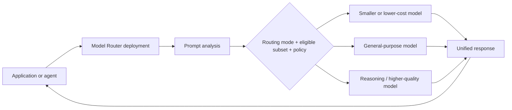

# Day 5: ROI, TCO, Model Router, and Domain 1 Quiz

**Date**: 2026-08-16
**Domain**: Plan AI-powered business solutions (25-30%)
**Subtopics**: ROI/TCO criteria; ROI analysis; build, buy, or extend economics; Microsoft Foundry Model Router; Domain 1 consolidation
**Estimated study time**: 2 hours

---

## TL;DR (60-second skim)

- Build an ROI case from a measured baseline: task time, volume, labor cost, error/rework rate, cycle time, and adoption. A vendor benchmark is not a substitute for internal evidence.
- Benefits must be realized, not merely available. Apply adoption, eligible-work, and realization factors to gross savings.
- TCO includes more than licenses and tokens: implementation, integration, data preparation, security, testing, change management, support, monitoring, evaluation, and model/data maintenance all count.
- Present conservative, expected, and optimistic scenarios. State assumptions and run sensitivity analysis instead of showing one precise-looking forecast.
- Use payback period, ROI, net benefit, and cost per successful outcome together; one metric rarely tells the whole story.
- Build/buy/extend is an economic and risk decision: compare time-to-value, fit, control, skills, compliance, lock-in, and ongoing operations over the same horizon.
- Microsoft Foundry Model Router is one deployment that analyzes each prompt and selects an eligible underlying model according to routing mode and model subset.
- Balanced is the default mode; Cost favors savings within a wider quality band; Quality selects the highest-rated option without considering cost.
- Router governance still matters: restrict the model subset, apply Azure Policy and content filters, test quality/latency/cost, and monitor changes in routing behavior.
- Today’s quiz is the 44 unanswered questions in the practice bank. It deliberately includes refreshers from later domains, so use the cross-domain table before starting.

---

## Learning Objectives

After this session, you should be able to:

1. Select business, financial, operational, risk, and adoption criteria for an AI investment.
2. Calculate TCO, net benefit, ROI, benefit-cost ratio, payback period, and unit economics.
3. Create conservative, expected, and optimistic scenarios from explicit assumptions.
4. distinguish gross capacity released from cashable savings and from revenue or risk value.
5. compare build, buy, and extend alternatives on a common time horizon.
6. explain how Microsoft Foundry Model Router chooses models, how to configure it, and where its limitations matter.
7. recognize the architecture, governance, security, ALM, monitoring, and Responsible AI patterns tested by the remaining Domain 1 practice set.

---

## Key Concepts

### 1. Start with the business process, not the model

An ROI analysis begins with a process boundary and a measurable outcome:

- Which users and steps are in scope?
- How often does the process run?
- What is the current time, cost, error rate, cycle time, and service level?
- Which portion of the work is technically eligible for AI assistance?
- What behavior must users adopt for value to be realized?
- What quality, safety, compliance, and human-review constraints remain?
- What would happen without the investment? This is the counterfactual baseline.

A useful baseline window captures normal variation. For a seasonal process, one unusually quiet week is weak evidence. Record data source, owner, measurement dates, and known exclusions.

**Baseline before forecast** is the exam pattern. Without measured current task time, volume, and error/rework, a percentage productivity claim cannot be converted into credible value.

### 2. ROI criteria: use a balanced scorecard

| Category | Criteria |
| --- | --- |
| Financial | Labor capacity or avoided hiring; contribution-margin uplift; cost/penalty avoidance; license, consumption, infrastructure, and support cost; NPV; payback; benefit-cost ratio |
| Operational | Cycle time; throughput/backlog; first-contact or straight-through resolution; errors/rework/escalations; availability; latency; successful-task rate |
| Experience and adoption | Active/repeat users; task completion and abandonment; satisfaction; time to proficiency; percentage of eligible work performed with AI |
| Quality, risk, governance | Groundedness; accuracy; policy adherence; guardrail and unsafe-output rates; human overrides; auditability; fairness; privacy/security/regulatory exposure |

Financial ROI is necessary, but a regulated workflow can be a poor investment even with positive projected savings if controls, auditability, or fairness are unacceptable.

### 3. Benefit model: gross value is not realized value

For time savings:

$$
\text{Gross labor value} = V \times T \times C
$$

where $V$ is task volume, $T$ is baseline hours saved per task, and $C$ is fully loaded labor cost per hour.

Then discount for what can actually be captured:

$$
\text{Realized labor value} = V \times T \times C \times E \times A \times R
$$

where:

- $E$ = eligible-work rate
- $A$ = adoption/utilization rate
- $R$ = realization factor, the share of saved capacity converted into useful work or cash impact

Avoid double counting. If saved hours create capacity for more cases, do not also claim the full hours as headcount reduction unless staffing really changes.

Other benefit categories:

- **Quality value** = avoided errors × cost per error
- **Revenue value** = incremental conversions × contribution margin, not gross revenue
- **Risk value** = probability reduction × expected impact, with assumptions clearly labeled
- **Speed value** = earlier cash flow, reduced backlog, or service-level improvement

### 4. Total cost of ownership

TCO uses a defined horizon, usually one to three years for an initial business case:

$$
\text{TCO} = C_{build} + C_{run} + C_{change} + C_{risk}
$$

#### Build and launch costs

- Discovery, process analysis, and architecture
- Licenses, environments, and initial capacity
- Data cleaning, labeling, indexing, and migration
- Agent/model configuration or custom development
- Connectors, APIs, integration, and identity setup
- Security, privacy, legal, and regulatory assessment
- Evaluation datasets, red teaming, testing, and UAT
- Training, communications, workflow redesign, and rollout

#### Run costs

- Model input/output tokens or provisioned capacity
- Agent or Copilot consumption credits
- Search, storage, network, observability, and logging
- Human review and exception handling
- Support, incident response, and platform operations
- Recurring licenses and third-party services

#### Change and lifecycle costs

- Prompt, agent, connector, and model regression testing
- Knowledge refresh, data-quality remediation, and re-indexing
- Model/version updates and re-evaluation
- Monitoring, tuning, governance reviews, and audit evidence
- Skills, specialist staffing, and Center of Excellence support
- Decommissioning, migration, and exit costs

#### Risk and uncertainty allowances

Do not hide uncertainty inside a single number. Use contingency for integration risk, adoption delay, unexpected review load, and consumption growth. Keep risk-adjusted cost visible.

### 5. Core financial calculations

- Net benefit: $\text{Total benefits} - \text{TCO}$
- ROI: $\frac{\text{Total benefits} - \text{TCO}}{\text{TCO}} \times 100\%$
- Benefit-cost ratio: $\frac{\text{Total benefits}}{\text{TCO}}$
- Payback months: $\frac{\text{Up-front investment}}{\text{Monthly net recurring benefit}}$

Track unit economics too:

- Cost per successful outcome: $\frac{\text{Run cost}}{\text{Successful completed tasks}}$

A cheap model with a high correction rate may have worse unit economics than a more expensive model with higher task success.

### 6. Worked ROI example: claims data-entry assistant

Assumptions for one year:

| Input | Expected case |
| --- | ---: |
| Annual claims | 120,000 |
| Baseline handling time | 12 minutes |
| AI time reduction | 35% |
| Eligible claims | 80% |
| Adoption | 75% |
| Realization factor | 60% |
| Loaded labor cost | $45/hour |
| Avoided errors | 1,200 |
| Cost per error | $35 |
| Year-1 TCO | $310,000 |

Time saved per eligible, adopted claim is $12 \times 35\% = 4.2$ minutes, or $0.07$ hours.

$$
120{,}000 \times 0.07 \times 0.80 \times 0.75 \times 0.60 \times \$45 = \$136{,}080
$$

Quality value:

$$
1{,}200 \times \$35 = \$42{,}000
$$

Total quantified benefit is $178,080. Year-1 net benefit is therefore negative:

$$
\$178{,}080 - \$310{,}000 = -\$131{,}920
$$

This does not automatically kill the proposal. Separate one-time launch cost from recurring cost and test years 2-3, a narrower pilot, better adoption, or a higher-value process. It does mean the expected Year-1 case should not be presented as positive.

### 7. Worked TCO and sensitivity example

Suppose launch cost is $180,000 and annual recurring cost is $130,000. Annual realized benefit after ramp-up is $260,000.

Three-year undiscounted values:

$$
\text{TCO}_{3y} = \$180{,}000 + 3(\$130{,}000) = \$570{,}000
$$

$$
\text{Benefit}_{3y} = 3(\$260{,}000) = \$780{,}000
$$

$$
\text{ROI}_{3y} = \frac{780{,}000 - 570{,}000}{570{,}000} \times 100\% \approx 36.8\%
$$

Now vary adoption and consumption:

| Scenario | Adoption | Annual benefit | Annual run cost | 3-year ROI |
| --- | ---: | ---: | ---: | ---: |
| Conservative | 45% | $170,000 | $155,000 | negative |
| Expected | 70% | $260,000 | $130,000 | 36.8% |
| Optimistic | 85% | $325,000 | $120,000 | materially higher |

The point is not false precision. Identify which variables change the decision. Adoption, correction load, task volume, and model consumption are common high-sensitivity drivers.

### 8. Build, buy, or extend through an economic lens

Use the same requirements, benefit forecast, horizon, and risk assumptions for all alternatives.

| Dimension | Buy / prebuilt | Extend | Build / custom |
| --- | --- | --- | --- |
| Time to value | Usually fastest | Moderate | Usually slowest |
| Initial cost | Lower | Medium | Highest |
| Process fit | Standardized | Configurable knowledge/actions | Maximum control |
| Operations | Vendor carries more | Shared | Organization carries most |
| Skills | Product/admin | Low-code plus integration | Engineering, AI, platform, SecOps |
| Compliance control | Product boundary | Product plus configuration | Custom controls and evidence |
| Model choice | Limited | Moderate | Broad |
| Lock-in/exit | Product dependency | Platform dependency | Code, model, and infrastructure migration |

Decision sequence:

1. Can a prebuilt capability meet requirements and controls? Evaluate **buy**.
2. Can instructions, knowledge, actions, connectors, or workflow configuration close the gap? Evaluate **extend**.
3. Do proprietary IP, custom orchestration, unique models, hard residency, or specialized compliance require ownership? Evaluate **build**.
4. Compare TCO and risk-adjusted time-to-value, not just feature fit.

Custom models and custom platforms introduce upkeep, data pipelines, evaluation, specialist skills, infrastructure, and lifecycle costs. Microsoft’s AI workload guidance says prebuilt models or managed services are usually preferable when they satisfy the requirement.

### 9. Microsoft Foundry Model Router: what it is

Model Router is itself a trained language model deployed as a single Microsoft Foundry model endpoint. For each request it analyzes prompt attributes such as complexity, reasoning needs, and task type, then selects an eligible underlying model.



Key architecture facts verified on 2026-08-16:

- The current listed router version is `2025-11-18` and is actively maintained.
- It supports Global Standard and Data Zone Standard deployment types where available.
- It honors access, deployment type, data-zone boundaries, model deployment Azure Policy, routing mode, and configured model subset.
- The router does not store prompts.
- Supported non-Claude underlying models do not need separate deployment. Claude models must be deployed first if included.
- Content filter and tokens-per-minute settings apply at the router deployment level.

### 10. Routing modes

| Mode | Selection behavior | Good fit | Main tradeoff |
| --- | --- | --- | --- |
| Balanced (default) | Considers models in a narrow quality range and chooses a cost-effective option | General workloads | Neither absolute cheapest nor absolute highest quality |
| Cost | Allows a wider quality band and favors savings | High-volume, budget-sensitive work | More quality variation |
| Quality | Selects the highest quality-rated model for the prompt without cost optimization | Complex or critical outputs | Higher and less predictable cost |

Routing mode is not a safety classification. A Quality deployment still needs grounding, content filters, evaluation, authorization, and human controls where required.

### 11. Model subsets, policy, and failover

A custom subset limits which models can be selected. Use it to enforce:

- Approved publishers and models
- Data-location or compliance boundaries
- Required context windows and modalities
- Cost ceilings and quality profiles
- Tool-calling compatibility

New base models are not automatically added to an explicit subset. Azure Policy can restrict which models a developer may include, consistently across portal, REST, CLI, and ARM deployment paths.

Automatic failover is enabled by default. For a custom subset, the subset is also the fallback set; include at least two models to gain fallback resilience without sending prompts to an unapproved model.

### 12. Router limitations and operational considerations

- Effective context is constrained by the smallest eligible underlying model. Use a subset whose members all meet the context requirement.
- Image inputs are accepted when supported, but the routing decision is based only on text input.
- Audio input is not processed.
- Prompt caching depends on the selected underlying model; variable routing can reduce cache reuse.
- Regional availability and eligible underlying models vary. Verify the target region and deployment type.
- Routing mode or subset changes can take up to five minutes to take effect.
- Auto-updating router versions can change the underlying model set, performance, and cost; regression testing and cost monitoring remain necessary.
- The router optimizes per prompt. It does not understand your full business risk unless you encode restrictions through policy, subset, application logic, and evaluation gates.

### 13. Managed routing versus application routing

There are two legitimate patterns:

- **Managed Model Router**: one endpoint dynamically analyzes prompts and selects among eligible models. Best when task mix is varied and you want ongoing cost/quality optimization.
- **Application/router logic**: explicit deterministic rules classify known task types and call fixed deployments. Best when routing must be explainable, contractual, or tightly controlled.

A hybrid is common: business rules first restrict the lane or subset, then Model Router optimizes within that approved lane. Do not assume equal weighted distribution is intelligent routing; it ignores task complexity and model suitability.

### 14. Model Router implementation checklist

1. Inventory prompt classes, modalities, context sizes, tool needs, latency targets, quality thresholds, and data boundaries.
2. Establish a baseline using one or more fixed models.
3. Choose deployment type and region.
4. Start with Balanced unless cost or critical-quality requirements justify another mode.
5. Configure an approved subset; include at least two models when failover is required.
6. Apply Azure Policy, identity, networking, content filters, rate limits, and logging.
7. Evaluate representative prompts by quality, latency, cost, successful-task rate, and safety.
8. Canary release and monitor route mix, tail latency, cost per successful task, failures, and regressions.
9. Re-test when the router version, subset, model versions, prompts, tools, or grounding changes.

Illustrative request shape after deploying a router uses the router deployment name as the model/endpoint target. The application does not choose the underlying model on every call; the deployment does.

---

## Decision Frameworks

### Is the business case ready?

```text
Measured process baseline available?
  No  -> measure time, volume, errors, cost, and service levels first
  Yes -> define eligible work and adoption assumptions
          -> quantify labor, quality, revenue, and risk benefits without overlap
          -> build complete TCO over a fixed horizon
          -> create conservative / expected / optimistic cases
          -> test sensitivity and define pilot success gates
```

### Which model strategy fits?

| Condition | Decision |
| --- | --- |
| One model meets quality, latency, cost, residency, and modality requirements | Keep one model; routing adds unnecessary complexity |
| Task classes are deterministic and tightly governed | Use explicit application routing to approved deployments |
| Task mix is variable and per-prompt optimization is useful | Use Model Router, select a mode, constrain the subset, and evaluate cost per successful outcome |
| Expected case is viable, conservative downside is tolerable, and controls pass | Proceed |
| Adoption, quality, correction effort, or consumption is uncertain but measurable | Pilot with explicit success/stop gates |
| Value requires implausible adoption, double-counting, or unresolved safety/fairness | Stop or redesign |

---

## Important Details for the Exam

- ROI needs an internal baseline before percentage savings can be trusted.
- Present ranges and assumptions, not only an expected case.
- Productivity does not automatically equal headcount savings.
- Use contribution margin for revenue benefit and probability-adjusted impact for risk benefit.
- Include human review, monitoring, retraining/re-evaluation, integration, data, governance, and change management in TCO.
- Compare build/buy/extend over the same time horizon.
- Model Router is one deployment; it selects an underlying model for each request.
- Balanced is the default; Cost and Quality change the optimization objective.
- A model subset constrains routing for compliance, cost, context, and performance.
- Model Router’s effective context limit follows the smallest eligible model.
- Image routing decisions use text only; audio input is unsupported.
- Governance, content filters, identity, and evaluation are not replaced by routing.

---

## Cross-Domain Quiz Question Refreshers

The assigned bank is labeled as one practice domain, but 42 of today’s 44 questions test adjacent design/deploy skills rather than ROI or Model Router directly.

| Assigned IDs | Concept | Key decision pattern | Trap to avoid |
| --- | --- | --- | --- |
| q001 | Power Platform Well-Architected | Diagnose resiliency/availability failures separately from ALM, security, and scaling concerns | Treating every peak-load symptom as performance only |
| q002, q042 | Legal and regulatory review | Complete applicable privacy, data-term, and jurisdiction review before production architecture/deployment | Letting deadline pressure defer mandatory review |
| q004, q007 | Prompt injection and content safety | Use layered input sanitization, file controls, output filtering, tool/code restrictions, and testing for internal and external agents | Assuming authentication removes prompt-injection risk |
| q006 | Copilot Studio language understanding | Match deterministic intent handling versus open-ended generative orchestration to audit and phrasing needs | Choosing generative behavior when deterministic responses are required |
| q008, q021, q039 | Multi-agent orchestration | Sequential for dependencies; parallel for independent work; split agents at real trust/security boundaries | Adding agents or parallelism without a complexity driver |
| q009 | On-behalf-of vs autonomous identity | Preserve user permissions for delegated work; use narrowly scoped workload identity for background work | One elevated identity for every mode |
| q010, q029, q041, q058 | ALM and release readiness | Define data/compliance first; separate environments; validate in pre-production; require regression tests and monitoring before release | Shipping to production because a deadline or demo is read-only |
| q011 | Environment identities | Give each agent/environment an owned, lifecycle-managed identity | Sharing one identity across DEV/TEST/PROD |
| q012, q013, q028, q031 | Human oversight and behavior envelopes | State what an agent may recommend versus decide/execute and enforce approval for high-impact actions | Disclaimers, low temperature, or built-in safeguards as substitutes for control |
| q015 | Shared semantics and data governance | Establish governed definitions and data foundations for consistent cross-domain reasoning | Expecting models to reconcile fragmented meanings automatically |
| q016 | Least privilege for autonomous actions | Scope every action/tool to minimum permissions and add approval for material transactions | Broad ERP rights for convenience |
| q017, q023, q025, q027, q051 | Monitoring and diagnostics | Use segmented dashboards and targeted alerts; inspect telemetry/transcripts before changing models, knowledge, or guardrails | Disabling controls or escalating vendors before root-cause analysis |
| q020 | Foundry security constraints | Combine ephemeral state where required, per-tool least privilege, and domain allowlists | Broad external access or persistent sensitive logs |
| q022, q030 | Solution scoping | Start with one high-value bounded workflow; scale after validating complexity and value | Building the full multi-agent vision in sprint one |
| q024, q034 | Data readiness and sensitivity labels | Complete, standardize, classify, and permission data before enabling AI | Licensing or piloting over known data-readiness gaps |
| q028, q035, q060 | Responsible AI | Fairness, transparency, accountability, reliability/safety, privacy/security, and inclusiveness must be operational controls | Launching with known bias or no accountable human owner |
| q032 | Incident response | Contain, preserve evidence, and restore a known-good version before extended diagnosis | Waiting for certainty while potential exposure continues |
| q033 | Operating model | Clarify platform, security/compliance, architecture, and shared operations responsibilities | Assigning all AI duties to one team |
| q043, q045 | SharePoint/M365 permissions | Agents respect the requesting user’s access boundaries | Global service-account read access to bypass permissions |
| q046 | Regulated grounding | Restrict answers to validated internal sources until broader knowledge risk is assessed and approved | Enabling general knowledge first and governing later |
| q052, q055 | Managed identity | Prefer secretless managed identity for Azure-to-Azure authentication; Key Vault is for secrets that cannot be eliminated | Treating encrypted stored credentials as equivalent to no credentials |
| q053 | Custom connectors | Separate technical environment capability from governance: connectors are environment-scoped and DLP/ownership/review still apply | Assuming technical creation means production approval |

---

## Common Traps and Misconceptions

- **“A 60% productivity estimate is enough.”** It is not a business case without baseline volume, time, quality, and adoption evidence.
- **“Every saved minute is cash.”** Saved capacity becomes cash only when staffing or external spend changes; otherwise value may be throughput or service improvement.
- **“Tokens and licenses are TCO.”** They are only part of run cost.
- **“One expected case is executive-friendly.”** It hides uncertainty; show a range and sensitivity.
- **“The largest model gives the best ROI.”** Evaluate cost per successful outcome, not raw model quality.
- **“The cheapest model gives the best ROI.”** Corrections, failures, latency, and abandonment can erase token savings.
- **“Model Router is random load balancing.”** It analyzes prompt attributes and applies an optimization mode within an eligible set.
- **“Quality mode makes outputs safe.”** It optimizes rated response quality, not business authorization or Responsible AI controls.
- **“Router means deploy every underlying model.”** Usually one router deployment is enough; Claude is the documented exception when included.
- **“A subset of one is still resilient.”** It removes meaningful failover choice.
- **“Key Vault and managed identity are interchangeable.”** Prefer eliminating credentials; vault unavoidable secrets.
- **“Internal agents are safe from prompt injection.”** Untrusted documents, emails, and connectors can carry indirect instructions.
- **“Built-in safeguards permit autonomous regulated decisions.”** Use explicit behavior boundaries, least privilege, and human checkpoints.
- **“A deadline changes release criteria.”** Missing regression tests, monitoring, fairness remediation, or regulatory review remains a blocker.

---

## Quick Reference Card

### ROI sequence

`baseline -> eligible work -> adoption -> realized benefit -> full TCO -> scenarios -> sensitivity -> pilot gates -> benefits tracking`

### Formulas

- Net benefit = benefits - TCO
- ROI = (benefits - TCO) / TCO
- Benefit-cost ratio = benefits / TCO
- Payback = up-front investment / monthly net recurring benefit
- Cost per successful outcome = run cost / successful tasks

### TCO buckets

`discovery + data + build/configure + integration + security/compliance + testing + licenses/consumption + human review + monitoring/support + lifecycle/change + exit`

### Router shorthand

- **Balanced**: default, narrow quality band, cost-aware
- **Cost**: wider quality band, savings priority
- **Quality**: highest-rated model, cost ignored
- **Subset**: approved models only; use 2+ for failover
- **Limits**: smallest-model context; text-only route decision for images; no audio

### Release gates

`data ready + legal/compliance reviewed + permissions scoped + safety/fairness tested + prompts regression-tested + pre-prod accepted + monitoring live + rollback ready`

---

## Assigned Quiz Coverage

Exact set: all unanswered questions in the single Domain 1 practice domain after excluding the six Day 2 IDs and ten Day 4 IDs recorded in progress/session artifacts.

| ID | Spoiler-free service / concept / trap summary |
| --- | --- |
| q001 | Identify the relevant Power Platform Well-Architected pillar for intermittent connector failures and missing resilience controls |
| q002 | Decide how third-party connector privacy/legal review affects an urgent deployment |
| q004 | Assess whether prompt-injection risk applies to authenticated internal agents |
| q006 | Select a language-understanding style for predictable, auditable, non-generative interactions |
| q007 | Choose a layered mitigation strategy for indirect prompt injection hidden in uploaded files |
| q008 | Recognize an orchestration pattern for dependent stages that must halt on failure |
| q009 | Separate delegated user access from autonomous background workload authorization |
| q010 | Identify the first governance/data step in AI feature ALM planning |
| q011 | Design workload identities across development, test, pre-production, and production |
| q012 | Evaluate the need for human review before external communications |
| q013 | Assess safeguards, approval checkpoints, and content safety in a regulated autonomous workflow |
| q014 | Determine what evidence is required before constructing an ROI forecast |
| q015 | Evaluate whether fragmented data and definitions can support governed cross-domain reasoning |
| q016 | Identify the critical permission risk in autonomous financial actions |
| q017 | Decide whether high observed success justifies reducing continuous monitoring |
| q018 | Evaluate single-point ROI projections versus scenario ranges |
| q020 | Combine memory, tool permission, and external-domain constraints for a Foundry agent |
| q021 | Match regulated boundaries, prompt governance, compliance pipelines, and dependent orchestration to solution patterns |
| q022 | Scope an initial agent solution when a small subset delivers most of the value |
| q023 | Choose the first diagnostic action for a low-performing production agent |
| q024 | Sequence CRM completeness and information protection before Copilot for Sales rollout |
| q025 | Reinforce telemetry/transcript diagnosis before changing a production agent |
| q027 | Redesign dashboards, alerts, and SOC routing to reduce alert fatigue |
| q028 | Enforce a prohibition on autonomous final decisions through behavior and workflow controls |
| q029 | Assess environment consolidation as an ALM cost optimization |
| q030 | Choose an initial scope for an autonomous supplier workflow |
| q031 | Balance speed against governed human review for patient-facing generated content |
| q032 | Select the first incident-response action for suspected model/PII compromise |
| q033 | Match platform engineering, security/compliance, architecture, and operations responsibilities |
| q034 | Reinforce data completeness, standardization, and sensitivity-label readiness |
| q035 | Identify Responsible AI principles implicated by unexplained autonomous high-impact decisions |
| q037 | Route simple, moderate, and complex tasks while balancing model capability and cost |
| q039 | Select boundary separation and sequential/parallel patterns in a regulated field-service workflow |
| q041 | Apply pre-production validation before a direct production release |
| q042 | Sequence jurisdictional regulatory evaluation before architecture finalization |
| q043 | Assess whether Microsoft 365 agents can override SharePoint user permissions |
| q045 | Enforce the permission boundary for a cross-department SharePoint agent |
| q046 | Apply validated-internal-knowledge restrictions to a regulated grounding scenario |
| q051 | Diagnose increased guardrail interventions without prematurely disabling controls |
| q052 | Choose secretless Azure authentication over embedded credentials |
| q053 | Distinguish custom-connector environment capability from governance approval |
| q055 | Compare Key Vault-stored service-principal secrets with managed identities |
| q058 | Apply release-readiness gates when prompt regression tests and dashboards are missing |
| q060 | Decide how a known fairness disparity affects launch readiness |

**Assigned IDs (44):** `q001,q002,q004,q006,q007,q008,q009,q010,q011,q012,q013,q014,q015,q016,q017,q018,q020,q021,q022,q023,q024,q025,q027,q028,q029,q030,q031,q032,q033,q034,q035,q037,q039,q041,q042,q043,q045,q046,q051,q052,q053,q055,q058,q060`

Quiz command:

```powershell
cd "d:\Projects\microsoft-exam-prep\AB-100 Prep"
python quiz_runner.py questions.json --ids q001,q002,q004,q006,q007,q008,q009,q010,q011,q012,q013,q014,q015,q016,q017,q018,q020,q021,q022,q023,q024,q025,q027,q028,q029,q030,q031,q032,q033,q034,q035,q037,q039,q041,q042,q043,q045,q046,q051,q052,q053,q055,q058,q060 --shuffle --web --port 8765
```

The runner supports exact comma-separated IDs through `--ids`. `--day-lock 5` is not appropriate for AB-100 because this exam folder has no `day-assignments.json`.

---

## Session Results

**Completed:** 2026-08-16  
**Quiz:** 44 / 44 assigned questions attempted in two segments  
**Score:** 40 / 44 (90.9%)  
**Time:** 21m 13s

| Segment | Result | Time |
| --- | ---: | ---: |
| Questions 1-29 | 28 / 29 (96.6%) | 12m 20s |
| Questions 30-44 | 12 / 15 (80.0%) | 8m 53s |

### Remediation Notes

| Question | Review point |
| --- | --- |
| q024 | Data readiness is a release gate: standardize and complete CRM fields and apply required sensitivity labels before enabling Copilot for Sales. |
| q039 | Split agents at meaningful trust or security boundaries. Use sequential orchestration for dependent steps and parallel execution only for independent retrieval; isolating every model by default is unnecessary. |
| q052 | Prefer managed identities for Azure-hosted services. They avoid stored credentials and reduce secret exposure and rotation work. |
| q053 | A custom connector can technically be created in any Power Platform environment, including the default environment. Environment strategy, DLP, and organizational governance separately determine whether it should be created or used there. |

**Next session:** Day 6 — D2.1 Copilot in Dynamics 365 + Agent Types.

---

## Sources (verified live during this session on 2026-08-16)

- [Study guide for Exam AB-100: Agentic AI Business Solutions Architect](https://learn.microsoft.com/en-us/credentials/certifications/resources/study-guides/ab-100)
- [Model router concepts for Microsoft Foundry](https://learn.microsoft.com/en-us/azure/foundry/openai/concepts/model-router)
- [Use model router for Microsoft Foundry](https://learn.microsoft.com/en-us/azure/foundry/openai/how-to/model-router)
- [AI workloads on Azure - Well-Architected Framework](https://learn.microsoft.com/en-us/azure/well-architected/ai/get-started)
- [Cost Optimization - Azure Well-Architected Framework](https://learn.microsoft.com/en-us/azure/well-architected/cost-optimization/)
- [Power Platform Well-Architected pillars](https://learn.microsoft.com/en-us/power-platform/well-architected/pillars)
- [Managed identities for Azure resources](https://learn.microsoft.com/en-us/entra/identity/managed-identities-azure-resources/overview)
- [Responsible AI principles and dashboard](https://learn.microsoft.com/en-us/azure/machine-learning/concept-responsible-ai)

Research notes:

- The live AB-100 guide explicitly lists ROI criteria including TCO, ROI analysis, build/buy/extend, and intelligent model routing under Domain 1.3.
- The current Model Router documentation names version `2025-11-18`, Balanced/Cost/Quality modes, custom subsets, policy enforcement, automatic failover, and modality/context limitations.
- The AI workload guidance emphasizes data control, customization, cost/upkeep, performance, expertise, compute cost, data-processing cost, model decay, and specialist operations when comparing custom and managed approaches.
- The cross-domain refreshers were checked against current Microsoft guidance for Power Platform pillars, managed identity, and Responsible AI principles.

---

## Notes (your own words - fill this in after studying)

- My measured baseline and counterfactual:
- The difference between gross time saved and realized value:
- TCO item I am most likely to forget:
- When I would choose Cost, Balanced, or Quality routing:
- Router limitation most likely to appear as an exam trap:
- Quiz items to revisit after completion:
