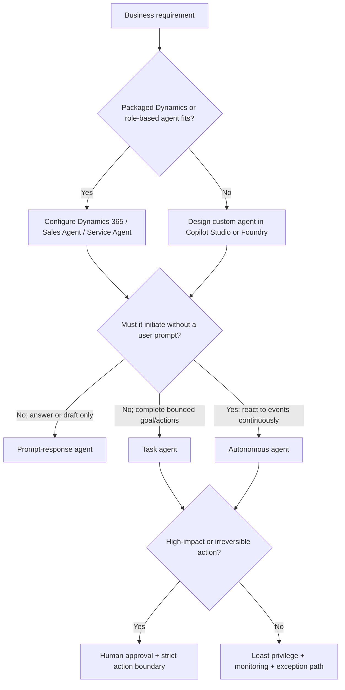

# Day 6: D2.1 Copilot in Dynamics 365 and Agent Types

**Date**: 2026-08-17
**Domain**: Design AI-powered business solutions (25-30%)
**Subtopics**: Business terms and customizations for Dynamics 365 customer experience and service; Sales connectors; task, autonomous, and prompt-response agents
**Estimated study time**: 1 hour

---

## TL;DR (60-second skim)

- Separate the product surfaces: Dynamics 365 Sales and Customer Service provide in-app capabilities; Sales Agent and Service Agent are role-based Microsoft 365 Copilot agents; Copilot Studio is the low-code platform for custom agents.
- Current Learn calls the former Microsoft 365 Copilot for Sales experience **Sales Agent**. It brings CRM context from Dynamics 365 Sales or Salesforce into Outlook and Teams.
- **Service Agent** is a Microsoft 365 Copilot agent grounded in Dynamics 365 Customer Service and connected knowledge; it can summarize, retrieve knowledge, and perform permitted case actions.
- In Customer Service, customize summaries by mapping the correct records and fields, describing fields in business language, selecting paragraph or structured output, and testing representative cases.
- A connector gives an agent controlled access to data or actions; it does not repair incomplete CRM records, bypass source permissions, or remove legal, DLP, consent, and governance requirements.
- A prompt-response agent waits for a user prompt and returns information; a task agent completes a bounded goal, often through tools; an autonomous agent starts from events and acts without waiting for a prompt.
- Increasing autonomy increases the need for narrow scope, least privilege, authenticated triggers, approval gates, fail-safes, monitoring, and audit logs.
- Exam cue: choose the least autonomous design that satisfies the business outcome.

---

## Learning Objectives

After this session, you should be able to:

1. Distinguish Dynamics 365 Sales, Dynamics 365 Customer Service, Sales Agent, Service Agent, and Microsoft Copilot Studio.
2. Translate business vocabulary and Dataverse schema into useful Customer Service Copilot summaries.
3. Design Sales data connections without confusing connectivity with data readiness or governance.
4. Select prompt-response, task, or autonomous behavior from trigger, action, risk, and oversight requirements.
5. Apply permissions, human approval, testing, and monitoring appropriate to an agent's autonomy.

---

## Key Concepts

### 1. Product map and current terminology

| Product or experience         | Primary work surface                                             | Grounding / system of record                                                   | Architect's job                                                                 |
| ----------------------------- | ---------------------------------------------------------------- | ------------------------------------------------------------------------------ | ------------------------------------------------------------------------------- |
| Dynamics 365 Sales            | Sales application                                                | Dataverse sales records and configured sources                                 | Configure embedded sales experiences, records, roles, and supported agents      |
| Dynamics 365 Customer Service | Customer Service / Copilot Service workspace                     | Cases, accounts, contacts, interactions, Dynamics knowledge, connected sources | Configure service Copilot, summaries, knowledge, permissions, and case actions  |
| Sales Agent                   | Outlook, Teams, Microsoft 365 Copilot                            | Connected Dynamics 365 Sales or Salesforce CRM plus Microsoft 365 context      | Install, connect CRM, consent, assign roles, govern data sharing, validate data |
| Service Agent                 | Microsoft 365 Copilot and supported Dynamics/Power Apps surfaces | Dynamics 365 Customer Service environment plus connected knowledge             | Enable the role-based service agent and control sources, skills, and privileges |
| Microsoft Copilot Studio      | Custom agent channels and business processes                     | Configured knowledge, connectors, APIs, tools, flows, Dataverse                | Build and govern custom agents when packaged experiences do not fit             |

**Naming note as of 2026-08-17:** current Learn presents the former Microsoft 365 Copilot for Sales documentation as **Sales Agent**. Older exam material can still say **Microsoft 365 Copilot for Sales**. Current Customer Service documentation similarly uses **Service Agent** for its Microsoft 365 Copilot role-based agent. Recognize both names; answer from the described product boundary.

Do not treat every item containing "Copilot" as interchangeable. Ask:

1. Where does the user work?
2. Which system owns the business records?
3. Is this packaged configuration or a custom agent?
4. Does the experience assist a person, execute a bounded task, or initiate work independently?

### 2. Business terms for Customer Service Copilot

A model cannot infer an organization's semantics reliably from cryptic schema names alone. A good design maps user vocabulary to the correct Dataverse tables, columns, relationships, status values, and knowledge sources.

Examples:

| Business term      | Possible technical representation                             | Design check                                        |
| ------------------ | ------------------------------------------------------------- | --------------------------------------------------- |
| VIP customer       | Account category, service tier, or entitlement                | Which field is authoritative and current?           |
| Open escalation    | Case status plus escalation flag or related escalation record | Is "open" a state, status reason, or SLA condition? |
| Resolution due     | SLA KPI failure time or custom deadline                       | Which time zone and breach rule apply?              |
| Product affected   | Case product lookup or installed asset                        | Is the relationship populated consistently?         |
| Recent interaction | Activity, conversation, email, chat, or voice transcript      | What window and channels count as recent?           |

Architecture sequence:

1. Gather terms from representatives, supervisors, process owners, and policy documents.
2. Define each term precisely, including synonyms, exclusions, owner, and source of truth.
3. Map it to records, fields, relationships, status values, and permitted knowledge.
4. Check completeness, sensitivity, freshness, and role-based access.
5. Use representative language in summary instructions and field descriptions.
6. Test with normal, incomplete, sensitive, multilingual, and edge-case records.

A glossary improves consistency, but it is not authorization. If a representative cannot access the source record, a business-term mapping must not grant access indirectly.

### 3. Customer Service summary customization

Current Customer Service administration supports management of case summaries and custom record summaries. Important design controls include:

- Select the record type to summarize.
- Choose the fields that carry decision-relevant context.
- Describe fields in natural language so generated output reflects business meaning.
- Include related-record summaries only when the relationship and permission boundary are valid.
- Choose paragraph output for narrative reading or structured output for repeatable scanning.
- Add named sections with explicit extraction instructions.
- Suppress unavailable information rather than encouraging invented content.

Example structured design:

| Section         | Instruction intent                                       | Candidate data                           |
| --------------- | -------------------------------------------------------- | ---------------------------------------- |
| Customer issue  | State the reported problem without adding a diagnosis    | Case title, description, conversation    |
| Business impact | Identify documented impact and urgency                   | Priority, service tier, affected product |
| Actions taken   | List completed troubleshooting in time order             | Notes, activities, conversation          |
| Next action     | State assigned follow-up and deadline only when recorded | Owner, task, SLA KPI                     |

Keep instructions testable. "Write a helpful summary" is weak. "Summarize the reported issue, completed actions, current status, and recorded next step; do not infer missing causes or commitments" is auditable.

Evaluate factual consistency, omission of critical facts, unsupported claims, sensitive-data exposure, readability, and representative usefulness. Human review remains necessary before high-impact or external communication.

### 4. Service Agent versus in-app Customer Service Copilot

Service Agent is a Microsoft 365 Copilot agent for customer service representatives. Current Learn documents assisted scenarios including:

- Review and prioritize cases.
- Summarize case details and customer interactions.
- Retrieve answers from Dynamics 365 knowledge and SharePoint.
- Add notes, update case status or priority, and create child cases when permitted.

In Copilot Service workspace, the active case or work item can supply context automatically. In another Microsoft 365 surface, the user might need to identify the record. The selected Dynamics 365 Customer Service environment under **Sources** determines the records available for the session.

This differs from a customer-facing autonomous service agent. A representative-facing Service Agent assists an authenticated employee. A customer-facing agent converses on service channels, resolves bounded issues, and hands off with context when escalation is required.

### 5. Sales connectors and CRM grounding

Sales Agent brings CRM insights into Outlook and Teams. Current Learn documents connections to **Dynamics 365 Sales** or **Salesforce**. Connection requires administrative setup, appropriate CRM roles/privileges, user consent where applicable, and governance of data shared outside Microsoft 365.

Use this connector design checklist:

- **Purpose:** Which sales question or action requires the source?
- **Operation:** Read, search, create, or update? Avoid write scope when read is enough.
- **Identity:** User-delegated access or application identity? Preserve source authorization.
- **Schema:** Which entities, fields, relationships, and business meanings are exposed?
- **Data readiness:** Are opportunity fields complete, standardized, current, and labeled?
- **Consent and terms:** Has the organization approved data sharing and third-party terms?
- **DLP:** Is the connector allowed in the environment and data group?
- **Reliability:** What are timeout, retry, throttling, and failure behaviors?
- **ALM:** How are connection references and environment-specific values promoted?
- **Observability:** Can admins audit connector calls, failures, and write actions?

A custom connector can expose an API described by OpenAPI and an authentication scheme. Creation capability does not imply production approval. A connector may technically be created in an environment while DLP, legal review, certification, or deployment policy prevents its use.

**Data readiness precedes enablement.** A connector faithfully retrieves incomplete CRM fields and unlabeled documents; it does not make them trustworthy. Clean and standardize records, apply sensitivity labels, confirm permissions, and then pilot.

### 6. Prompt-response agents

A prompt-response agent starts when a user asks something and primarily returns an answer, synthesis, or draft.

Good fits:

- "Summarize this opportunity."
- "Find the return policy for this product."
- "Draft a reply using the approved knowledge article."

Typical controls are grounded sources, source permissions, prompt instructions, citations where supported, content safety, and user review. Do not give write permissions to an agent that only needs retrieval.

### 7. Task agents

A task agent completes a bounded goal. It may reason over several steps and call tools, but its start condition and finish state are explicit.

Examples:

- A seller invokes "Prepare account briefing," and the agent retrieves CRM history, summarizes meetings, and drafts next steps.
- A representative asks an agent to create a child case and copy approved context.
- A workflow sends a validated case to an agent for classification and routing.

Define inputs, allowed tools, action sequence or constraints, success criteria, retries, idempotency, exception path, and approval requirements. A task agent is not automatically autonomous merely because it uses multiple tools.

### 8. Autonomous agents

Copilot Studio describes autonomous agents as acting without waiting for a user prompt. They perceive events, make decisions, and execute tasks using triggers, instructions, and guardrails.

Examples:

- Monitor overdue supplier items and initiate reminders.
- Detect a new high-priority case and start a triage process.
- React to an authenticated data change and escalate unresolved work.

Required controls grow with consequence:

- Narrow goal and explicit authority boundary.
- Authentic, validated event triggers.
- Least-privileged identities and tools.
- Allow-listed actions and fail-safe stop conditions.
- Human approval for financial, legal, safety, customer-impacting, or irreversible actions.
- Sandboxed testing, staged rollout, continuous monitoring, and audit logs of trigger, decision, and action.

"Autonomous" does not mean "uncontrolled." A refund agent with unrestricted ERP write access and no approval is an architecture failure, not an advanced design.

---

## Decision Frameworks



Quick selection rule: use the least autonomy that meets the requirement. More autonomy adds trigger, identity, action, failure, monitoring, and accountability risk.

---

## Comparisons

| Dimension      | Prompt-response                        | Task agent                             | Autonomous agent                                         |
| -------------- | -------------------------------------- | -------------------------------------- | -------------------------------------------------------- |
| Starts from    | User prompt                            | User/workflow invokes a bounded goal   | Event, condition, or schedule                            |
| Main outcome   | Answer, summary, recommendation, draft | Completed multi-step task              | Ongoing background action toward a goal                  |
| Tool use       | Optional, often read-heavy             | Common; read/write as scoped           | Common; event-driven read/write                          |
| Human presence | User is in the interaction             | User may start/review task             | User might not be present                                |
| Primary risk   | Hallucination or disclosure            | Incorrect action or partial completion | Unauthorized/repeated action at scale                    |
| Key controls   | Grounding, permissions, review         | Input contract, idempotency, approvals | Trigger authenticity, guardrails, stop conditions, audit |

| Need                                      | Configure packaged product     | Build in Copilot Studio                             |
| ----------------------------------------- | ------------------------------ | --------------------------------------------------- |
| Standard case summary fields/format       | Customer Service configuration | Only if packaged controls cannot meet process       |
| CRM insights in Outlook/Teams             | Sales Agent connected to CRM   | Custom build only for unsupported behavior          |
| Representative service work across M365   | Service Agent                  | Extend/build for custom channels or orchestration   |
| Bespoke event-driven cross-system process | Usually insufficient alone     | Strong low-code fit with triggers, tools, and flows |

---

## Important Details for Exam

- Sales Agent connects CRM data from Dynamics 365 Sales or Salesforce into Microsoft 365 work surfaces.
- Sales Agent is not supported for Dynamics 365 Customer Engagement on-premises.
- CRM administrators and users require appropriate Dynamics 365 or Salesforce roles and privileges.
- Service Agent is a Microsoft 365 Copilot agent, not the same thing as Microsoft Copilot Studio.
- Service Agent can use Dynamics 365 Customer Service and connected knowledge such as SharePoint.
- In Customer Service, record source, field mappings, related records, output structure, and instructions determine summary behavior.
- Connectors preserve source permissions; do not design an elevated service account to bypass user access.
- Legal/privacy review and DLP approval happen before production use of an external source.
- Autonomous agents use triggers, instructions, and guardrails and operate without waiting for a prompt.
- Human approval is required where policy or consequence demands it; high model quality is not a substitute.

---

## Common Traps and Misconceptions

- **Trap:** "Copilot for Dynamics 365 Sales" always means Sales Agent. **Correct:** determine whether the question describes embedded Dynamics 365 Sales or the role-based Microsoft 365 experience in Outlook/Teams.
- **Trap:** Copilot Studio is another name for Service Agent. **Correct:** Service Agent is packaged; Copilot Studio is an authoring platform for custom agents.
- **Trap:** Adding a connector solves data quality. **Correct:** remediate incomplete, inconsistent, stale, or unlabeled source data first.
- **Trap:** A connector can be created, therefore it can be deployed. **Correct:** technical creation and governance approval are separate decisions.
- **Trap:** Multi-step tool use means autonomous. **Correct:** a user-invoked bounded task can remain a task agent.
- **Trap:** Autonomous means no human review. **Correct:** use approvals for consequential actions and exceptions.
- **Trap:** Better prompts compensate for ambiguous business definitions. **Correct:** define authoritative terms and map them to reliable fields first.

---

## Real-World Scenarios

1. A representative wants a structured case brief with issue, impact, actions, and next step. Configure Customer Service summary fields, natural-language instructions, sections, permissions, and evaluation cases.
2. A seller wants CRM context while drafting in Outlook. Use Sales Agent with the approved Dynamics 365 Sales connection; validate fields, labels, roles, consent, and terms before rollout.
3. A user asks for an account briefing that gathers CRM facts and drafts follow-up steps. This is a bounded task agent, even though it makes several tool calls.
4. A process must detect overdue supplier records and send reminders in the background. This is autonomous; authenticate the trigger, scope writes, prevent duplicate sends, and escalate exceptions.
5. A customer-facing refund process can transfer funds. Use explicit eligibility rules, least privilege, transaction limits, human approval for exceptions/high values, and full auditability.

---

## Quick Reference Card

| Signal in question                                           | Likely answer                                    |
| ------------------------------------------------------------ | ------------------------------------------------ |
| Outlook/Teams + seller + Dynamics/Salesforce CRM             | Sales Agent / Microsoft 365 Copilot for Sales    |
| Representative + cases/knowledge + Dynamics Customer Service | Service Agent / in-app service Copilot           |
| Custom triggers, tools, flows, channels, low-code            | Microsoft Copilot Studio                         |
| User asks and receives grounded response                     | Prompt-response                                  |
| Explicit bounded goal with tools and completion state        | Task agent                                       |
| Event-driven work without user prompt                        | Autonomous agent                                 |
| Incomplete CRM fields or unlabeled documents                 | Fix data readiness before enablement             |
| External connector with unreviewed terms                     | Delay production pending legal/compliance review |
| High-impact write action                                     | Least privilege plus approval and audit          |

---

## Hands-On Lab (Optional)

For one business scenario, write a six-line agent contract:

1. Goal
2. Trigger
3. Allowed data
4. Allowed actions
5. Human approval point
6. Success, failure, and stop conditions

Then label it prompt-response, task, or autonomous and explain why the next more autonomous type is unnecessary.

---

## Cross-Domain Quiz Question Refreshers

The AB-100 repository has no `day-assignments.json`; the practice bank was completed on Day 5. These are the directly relevant existing questions and carryover traps.

| Concept                            | Key fact                                                    | Trap                                                                  |
| ---------------------------------- | ----------------------------------------------------------- | --------------------------------------------------------------------- |
| q002 external Sales connector      | Complete legal/privacy review before production deployment  | A tested connector is not automatically approved                      |
| q012/q031 external service content | Require human review for governed external communication    | Summary quality does not remove accountability                        |
| q016 autonomous refunds            | Scope ERP action permissions to least privilege             | Trigger configuration is secondary to unrestricted writes             |
| q024/q034 Sales data readiness     | Standardize CRM fields and label SharePoint documents first | Licensing or piloting does not cure bad grounding data                |
| q030 autonomous supplier follow-up | Start with one high-value, well-scoped workflow             | Do not connect every table or deploy broad scope first                |
| q053 custom connectors             | Creation can be technically possible in an environment      | Creation capability is different from DLP/governance permission       |
| Day 5 miss q052                    | Prefer managed identity for agent-to-Azure authentication   | Key Vault secrets are better than embedded secrets but not equivalent |

---

## Related Questions in questions.json

- **q002**: External market-intelligence connector for Dynamics 365 Sales requires legal/compliance review before deployment.
- **q012 / q031**: Human review remains necessary before externally sending generated service content.
- **q016**: Autonomous refund processing must address unrestricted action permissions and least privilege.
- **q024 / q034**: Sales Agent rollout requires complete CRM data and properly labeled SharePoint content first.
- **q030**: Begin autonomous supplier follow-up with one high-value, tightly scoped workflow.
- **q053**: Distinguish where custom connectors can be created from whether policy permits production use.

Day 6 quiz command (10 new questions researched for today's objectives):

```powershell
python quiz_runner.py questions.json --ids q061,q062,q063,q064,q065,q066,q067,q068,q069,q070 --shuffle --web --port 8765
```

Questions `q061`-`q070` are original exam-style questions grounded in the Microsoft Learn sources listed below and labeled `ai-generated-from-microsoft-learn` in `questions.json`. They do not reuse the 60-question bank completed on Day 5.

### Quiz Result

- Completed: 2026-08-17
- Score: 10 / 10 (100%)
- Time: 3m 57s
- Wrong: 0
- Skipped: 0
- Outcome: All tested Day 6 objectives answered correctly.

---

## Sources (verified during this session)

- [Study guide for Exam AB-100](https://learn.microsoft.com/en-us/credentials/certifications/resources/study-guides/ab-100)
- [Welcome to Sales Agent](https://learn.microsoft.com/en-us/microsoft-sales-copilot/introduction)
- [Use Service Agent in Customer Service](https://learn.microsoft.com/en-us/dynamics365/customer-service/use/use-service-agent)
- [Enable Service Agent in Microsoft 365 Copilot](https://learn.microsoft.com/en-us/dynamics365/customer-service/administer/configure-service-agent)
- [Manage case and custom record summary](https://learn.microsoft.com/en-us/dynamics365/customer-service/administer/copilot-map-custom-fields)
- [Configure custom record summaries](https://learn.microsoft.com/en-us/dynamics365/customer-service/administer/copilot-enable-custom-record-summaries)
- [Customize Copilot conversation summaries](https://learn.microsoft.com/en-us/dynamics365/contact-center/administer/customize-copilot-conv-summary)
- [Using agents in Microsoft 365 Copilot Chat](https://learn.microsoft.com/en-us/copilot/agents)
- [Design autonomous agent capabilities](https://learn.microsoft.com/en-us/microsoft-copilot-studio/guidance/autonomous-agents)
- [Contact center with existing CRM/CCaaS, Copilot for Service, and Copilot Studio](https://learn.microsoft.com/en-us/dynamics365/guidance/reference-architectures/contact-center-existing-crm-ccaas-solution-copilot-service-copilot-studio)

---

## Notes (your own words - fill this in after studying)

- Product boundary:
- Connector versus data-readiness lesson:
- Agent-type rule:
- Approval/guardrail rule:
