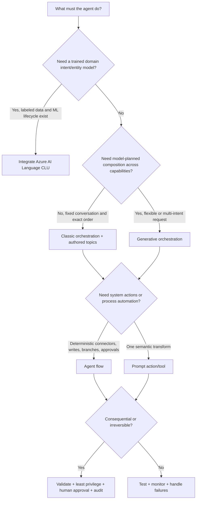

# Day 7: D2.1 Copilot Studio Design

**Date**: 2026-08-18
**Domain**: Design AI-powered business solutions (25-30%)
**Subtopics**: Topics and fallback; standard NLP vs conversational language understanding vs generative orchestration; agent flows; prompt actions
**Estimated study time**: 1 hour
**Research status**: Verified against current Microsoft Learn documentation on 2026-08-18

---

## TL;DR (60-second skim)

- In the AB-100 study guide, this session maps to skill 2.1: design topics including fallback, choose standard NLP vs CLU vs generative AI orchestration, and design agents, agent flows, and prompt actions.
- **Classic orchestration** selects one authored topic by matching user text to **trigger phrases**; it favors predictable, explicitly scripted conversation paths.
- **Generative orchestration** selects and sequences topics, tools, knowledge, and other agents from their names, descriptions, input/output contracts, and conversation context; new standard agents use it by default unless policy or a template says otherwise.
- **CLU** is a separately trained Azure AI Language intent/entity model integrated into Copilot Studio. Choose it when controlled domain intents and entity extraction justify training, deployment, and connector lifecycle overhead.
- The **Fallback** system topic handles unknown intent through `On Unknown Intent`; by default it asks for rephrasing no more than twice, then redirects to **Escalate**. It has no trigger phrases.
- **Agent flows** provide deterministic trigger-plus-action automation. Use them for repeatable integration, branching, approvals, scheduled/event work, and writes to systems of record.
- A **prompt action/tool** makes one bounded generative transformation such as classify, extract, summarize, draft, or format. It is probabilistic, so validate outputs before consequential writes.
- Treat descriptions and input/output schemas as orchestration contracts. Apply least privilege, DLP, authentication, human approval, monitoring, solutions, connection references, and environment-specific configuration.

---

## Learning Objectives and AB-100 Alignment

After this session, you should be able to satisfy these current study-guide skills under **2.1 Design AI and agents for business solutions**:

1. **Design topics for Copilot Studio, including fallback.**
2. **Determine when to use standard NLP, conversational language understanding, or generative AI orchestration in Copilot Studio.**
3. **Design agents and agent flows with Copilot Studio.**
4. **Design prompt actions in Copilot Studio.**

Architect-level expectation: identify the correct control boundary, not merely the authoring button. Explain why a design needs deterministic conversation, trained intent recognition, flexible planning, deterministic process automation, or a bounded model call.

---

## Key Concepts

### 1. Topics are reusable conversation units

A topic contains a **trigger** and a sequence of nodes. Nodes can send messages, ask questions, set variables, branch on conditions, redirect to another topic, call a tool or flow, and end or escalate the conversation.

Design a topic around one coherent business capability, for example `Check order status`, not a giant `Customer service` topic. Give it:

- A clear purpose and ownership boundary.
- Inputs with names, types, descriptions, required/optional status, and validation.
- Outputs that another topic or the generative orchestrator can reuse.
- Explicit permission, error, retry, cancellation, and handoff behavior.
- Test utterances covering normal, ambiguous, incomplete, hostile, and unauthorized requests.

**System topics** implement common lifecycle behavior such as greeting, fallback, escalation, reset, errors, and multiple-topic matching. Customize them deliberately; they are executable control paths, not decorative templates.

### 2. Classic/manual topic orchestration

Current Learn calls the deterministic trigger-phrase mode **classic orchestration**. Older material might say standard, traditional, manual, or topic-based orchestration. In classic mode, the default topic trigger is **User says a phrase**.

Flow:

1. The user sends an utterance.
2. Copilot Studio NLU compares it with enabled topics' trigger phrases.
3. A matching topic runs; if matches are close, the classic experience can invoke **Multiple Topics Matched**.
4. The authored nodes collect data, call explicit tools, and send authored responses.
5. If no topic matches, configured knowledge may answer or the Fallback system topic handles unknown intent.

Trigger-phrase guidance:

- Use 5-10 semantically varied examples as a starting point, then tune from test and production analytics.
- Express the same intent in different wording; do not create minor punctuation or capitalization variants.
- Keep phrases specific enough to separate neighboring topics.
- Avoid putting the same phrase or near-synonyms in competing topics.
- Use topic priority and conditions only when a real business rule requires them; do not use priority to conceal overlapping intent design.

Choose classic orchestration when the conversation must follow an authored sequence, regulated wording must be controlled, the intent set is small and stable, or tool order must not be model-planned.

### 3. Trigger types and selection behavior

| Requirement                        | Trigger/design                                                                                                                                   |
| ---------------------------------- | ------------------------------------------------------------------------------------------------------------------------------------------------ |
| Classic intent match               | **User says a phrase** plus representative trigger phrases                                                                                       |
| Generative selection               | **The agent chooses** plus a distinct name and description                                                                                       |
| Another topic calls this topic     | **It's redirected to**                                                                                                                           |
| Event/activity handling            | Message, custom client event, activity, conversation change, or invoke trigger                                                                   |
| Generative plan finished           | **A plan completes**                                                                                                                             |
| Inspect/replace generated response | **An AI-generated response is about to be sent**; inspect `Response.FormattedText`, set `ContinueResponse` to `false` when sending a replacement |

A trigger condition can restrict execution, for example to Teams or an authenticated role. A trigger decides **when a topic is eligible**; authorization still decides **what data/actions the caller may use**.

### 4. Fallback and escalation

The **Fallback** system topic uses `On Unknown Intent`. It has no trigger phrases because it catches input that no intent matched.

Default documented behavior:

- Ask the user to rephrase no more than twice.
- If still unresolved, redirect to the **Escalate** system topic.
- `UnrecognizedTriggerPhrase` contains the unmatched input and can be logged or passed to a flow/skill, subject to privacy controls.
- In Microsoft Teams there is no default system fallback topic, but one can be created.

Good fallback design should:

1. Acknowledge uncertainty without inventing an answer.
2. Offer bounded choices or examples based on known capabilities.
3. Preserve the original utterance and already collected context.
4. Search approved knowledge only if that is an intentional path.
5. Escalate with transcript/context and a clear reason after a small retry limit.
6. Log unmatched utterances after redaction for topic-gap analysis.

Do not turn fallback into an unrestricted generative answer over unapproved data. Do not create a catchall topic with broad trigger phrases; that steals traffic from valid topics and hides recognition defects.

### 5. Standard NLU versus NLU+ versus CLU

Copilot Studio's built-in NLU recognizes topic intent from natural-language examples and supports entities/slot filling. Current documentation also uses **NLU+** for enhanced intent recognition in supported standard-agent experiences. The exam wording may say **standard NLP/NLU**; interpret it as the built-in recognition path unless a separately trained Azure AI Language project is described.

**Conversational Language Understanding (CLU)** is an Azure AI Language capability. A trained and deployed CLU model exposes domain-specific intents and entities to Copilot Studio. Map CLU intents to topic triggers and use imported entities in questions and variables. Integration uses an external recognizer (`OnRecognize`); recognized values are available through `System.Recognizer.IntentOptions` and `System.Recognizer.ExtractedEntities`.

CLU adds lifecycle work:

- Define labeled utterances, intents, entities, and `None`/out-of-scope examples.
- Train, evaluate, version, deploy, and monitor the Azure AI Language model.
- Map the deployment/project to the agent and bind topics to CLU intents.
- Configure connectors, credentials, connection references, regions, quotas, and failover.
- Promote the agent and its configuration while recreating environment-specific connections.

Use CLU when a specialized domain needs an explicitly trained intent/entity taxonomy, recognition metrics and model version control matter, and labeled data/ML ownership exist. Do not choose CLU merely because built-in trigger phrases need ordinary tuning.

### 6. Generative orchestration

Newly created standard agents use generative orchestration by default. An environment administrator can disable it, and a prebuilt agent can retain its supplied orchestration setting.

The planner can choose one or more:

- **Topics**, based primarily on topic name and description.
- **Tools**, based on name, description, and input/output parameters.
- **Knowledge sources**, which it can search proactively.
- **Child or connected agents**, based on their descriptions.

It can chain selected capabilities sequentially, fill inputs from the utterance or recent context, ask generated questions for missing required inputs, and synthesize a final response. This supports multi-intent and less scripted conversations.

Descriptions are executable routing metadata. Use a unique noun-verb name and state what the capability does, when to use it, required inputs, output meaning, and important exclusions. Overlapping descriptions can cause multiple unwanted calls.

Example:

- Weak: `Orders - Helps with orders.`
- Better: `Get order delivery status - Returns read-only shipping status for one order ID owned by the signed-in customer. It does not cancel, refund, or modify an order.`

Known limitations verified on 2026-08-18:

- Generative knowledge search does not use customizations made to the **Conversational Boosting** system topic.
- Generative orchestration currently does not call **Multiple Topics Matched** for disambiguation.
- Recent conversation history is limited; old facts might need recollection or explicit state variables.
- Custom closed-list and regex entities are not supported directly as topic/tool input parameters; collect and validate them with a Question node, then pass the validated variable onward.
- Hyperlinks found inside knowledge content can appear as plain text.
- Similar descriptions can cause several topics/tools to run, so test the activity map and revise descriptions.

Choose generative orchestration for broad, composable capabilities and multi-intent requests where flexible planning provides value. Prefer classic topics or a flow for legal text, irreversible writes, exact order, strict latency, or highly predictable handling. A hybrid is often best: generative routing into tightly bounded topics and deterministic flows, with approvals around high-impact actions.

### 7. Agent flows

An **agent flow** is deterministic automation in Copilot Studio's standard harness. It contains one trigger and at least one action. It can start manually, on a schedule, from an event, or when an agent calls it.

Use agent flows for:

- Reading or writing systems through Microsoft, third-party, or custom connectors.
- Fixed branching, loops, validation, retries, idempotency, and transaction-safe sequencing.
- Human approval or information collection.
- Scheduled/event-driven background work.
- Calling prompts or agents as bounded steps inside a larger process.

To expose a flow as an agent tool, use **When an agent calls the flow** and define clear inputs and outputs. In classic orchestration, call it explicitly from a topic. In generative orchestration, a precise tool description lets the planner choose it.

Every executed action consumes Copilot Studio capacity. If prepaid environment capacity is exhausted, new flow runs are blocked until capacity is available; already running flows complete. Test runs in the designer or test chat do not consume that flow capacity. Monitor usage and consider pay-as-you-go where appropriate.

A converted Power Automate cloud flow uses Copilot Studio capacity and conversion is one-way because billing changes. Do not recommend conversion without assessing ownership, connectors, support, and licensing.

### 8. Prompt actions and prompt tools

A custom prompt sends instructions and supplied context to an Azure OpenAI Service or Microsoft Foundry model for one bounded AI task. It can be added:

- At **agent level** as a reusable tool selectable by generative orchestration.
- At **topic level** as an explicitly ordered node.
- In an **agent flow** as a `Run a prompt` action.

Typical inputs are text, images, records, or grounded content. Define meaningful input names, types, descriptions, examples, sensitivity, and maximum practical size. Define a stable output contract: text, classification label, extracted fields, JSON/structured output, or a draft for review.

Choose a prompt for semantic work such as summarization, classification, extraction, rewriting, drafting, or formatting. Choose a flow for deterministic business logic, connectors, persistence, approvals, retries, and side effects. Common composition: flow retrieves permitted data -> prompt transforms it -> flow validates output -> human approves if needed -> flow writes.

Prompt editor controls include model selection, temperature, retrieval settings, links, code interpreter/reasoning where available, text/image inputs, Dataverse knowledge, and output formatting. Test with representative, missing, adversarial, multilingual, and edge-case inputs. Give the prompt an explicit `not found`/`insufficient information` path.

Prompt capability is region-dependent and subject to usage limits/capacity throttling. Anonymous agents cannot use Dataverse tables as knowledge sources for prompts. A prompt's fluent output is not proof of correctness or authorization.

---

## Decision Frameworks



Fast rules:

- User wording should select one scripted path -> classic NLU topic.
- Specialized intent/entity taxonomy with labeled data -> CLU.
- Multi-intent request needing topics + tools + knowledge -> generative orchestration.
- Repeatable process with connectors and side effects -> agent flow.
- Summarize/classify/extract/draft one artifact -> prompt.
- Unknown intent -> fallback, then bounded clarification and escalation.

---

## Comparisons

| Dimension                | Classic orchestration                      | CLU integration                                          | Generative orchestration                                            |
| ------------------------ | ------------------------------------------ | -------------------------------------------------------- | ------------------------------------------------------------------- |
| Selection basis          | Trigger phrases                            | Trained intents/entities mapped to topics                | Descriptions, schemas, context, instructions                        |
| Main strength            | Predictable authored path                  | Domain-specific measurable recognition                   | Flexible planning and composition                                   |
| Can combine capabilities | Usually one topic; tools called explicitly | Topic path after recognized intent                       | Topics, tools, knowledge, other agents                              |
| Missing inputs           | Authored Question nodes                    | Authored questions using extracted entities              | Planner can generate questions                                      |
| Operations burden        | Topic analytics and phrase tuning          | Data labeling, training, deployment, connector lifecycle | Description quality, tracing, evaluation, model/capacity governance |
| Best fit                 | Stable regulated conversations             | Complex controlled taxonomy                              | Broad multi-intent assistance                                       |
| Primary risk             | Phrase overlap/coverage gaps               | Model drift and mapping/version failures                 | Wrong plan/tool, nondeterminism, excess permissions                 |

| Dimension               | Topic                                       | Agent flow                                 | Prompt action                                          |
| ----------------------- | ------------------------------------------- | ------------------------------------------ | ------------------------------------------------------ |
| Purpose                 | Conversation and routing unit               | Deterministic process automation           | Bounded generative transformation                      |
| Control style           | Authored nodes                              | Rule-based trigger/actions                 | Probabilistic model call                               |
| Inputs/outputs          | Conversation variables and typed parameters | Trigger contract and action outputs        | Prompt variables and formatted/structured result       |
| Side effects            | Through called tools                        | Natural fit, with connectors and approvals | Avoid direct consequential reliance without validation |
| Generative relationship | Planner can select by description           | Planner can select it as a tool            | Planner can select it as a tool                        |
| Classic relationship    | Trigger phrase starts it                    | Topic explicitly calls it                  | Topic explicitly calls it                              |

---

## Governance, Security, and ALM

- **Authentication is not grounding.** Authenticate users and enforce source authorization on every connector, knowledge source, flow, and tool.
- **Least privilege:** separate read and write capabilities; avoid broad maker-owned connections for end-user actions; constrain rows, operations, and environments.
- **DLP:** Power Platform data policies can block connectors, HTTP, channels, knowledge sources, or combinations even when authoring succeeds. Technical availability does not equal production approval.
- **Prompt safety:** minimize sensitive inputs, resist prompt injection, delimit untrusted content, validate structured output, and require review for financial, legal, HR, safety, customer communication, or irreversible actions.
- **Flow safety:** authenticate event sources, validate inputs, implement idempotency and retry limits, protect secrets, handle partial failure, and audit writes.
- **Solutions:** place agents and agent flows in Power Platform solutions for drafts/versioning, export/import, and customization. Use unmanaged solutions in development and managed deployment according to organizational ALM policy.
- **Connections:** credentials are environment-specific. Use connection references and environment variables; bind target-environment connections after import rather than transporting credentials.
- **Testing:** use test chat and the generative activity map to inspect chosen topics/tools and inputs. Test fallback, denial, timeout, throttling, duplicate events, bad model output, and handoff.
- **Monitoring:** review unknown utterances, topic/plan selection, flow failures, tool latency, capacity, prompt quality, approval outcomes, and unauthorized attempts.

---

## Common Exam Traps and Misconceptions

- **Trap:** Trigger phrases drive generative topic selection. **Correct:** classic uses phrases; generative uses **The agent chooses** with names/descriptions and schemas.
- **Trap:** Generative orchestration replaces authored topics. **Correct:** it can select and chain topics; tightly scoped topics remain valuable control boundaries.
- **Trap:** CLU is just a setting that improves trigger phrases. **Correct:** it is a trained/deployed Azure AI Language model with intents, entities, connectors, mappings, and lifecycle overhead.
- **Trap:** Fallback needs broad trigger phrases. **Correct:** it uses `On Unknown Intent` and has no trigger phrases.
- **Trap:** Fallback should silently guess. **Correct:** clarify, offer bounded options, preserve context, then escalate.
- **Trap:** A prompt action is a workflow engine. **Correct:** prompts perform semantic transformations; flows implement deterministic process, integration, and side effects.
- **Trap:** A flow called by a generative agent becomes nondeterministic. **Correct:** selection can be generative, but the selected flow's internal path remains rule-based.
- **Trap:** Temperature 0 guarantees factual or identical output. **Correct:** it reduces randomness; grounding, validation, and review are still required.
- **Trap:** If a connector/tool can be added, it is governed and deployable. **Correct:** DLP, authentication, consent, licensing, region, and target-environment policy can block use.
- **Trap:** Reset Conversation automatically clears planner history. **Correct:** by default it clears session globals, not generative conversation history; explicitly clear that history when required.
- **Trap:** Generative mode uses customized Conversational Boosting behavior. **Correct:** current Learn says generative knowledge search bypasses that system-topic customization.

---

## Scenario-Based Decision Rules

1. **Benefits help desk with 15 stable intents and approved wording:** classic topics, specific trigger phrases, explicit questions, and fallback/escalation.
2. **Telecom support with hundreds of labeled utterances and contract/product entities:** CLU can justify its model lifecycle when built-in NLU does not meet measured recognition needs.
3. **Employee asks, "Find my leave balance, explain policy, and draft a manager message":** generative orchestration can compose a data tool, knowledge, and prompt; keep the send action behind confirmation.
4. **Refund request must validate eligibility, seek approval above a threshold, and update ERP:** deterministic agent flow with least-privileged connectors; a prompt may summarize the case but must not decide/write alone.
5. **Unrecognized customer message:** fallback captures the utterance, asks a bounded clarifying question, then escalates with context after the retry limit.
6. **Convert an email into categorized structured fields:** prompt action with a strict schema and validation; use a flow to persist validated fields.

---

## Concise Knowledge Checks

Answer in your own words before reviewing the reference card:

1. Why can overlapping descriptions be more dangerous in generative orchestration than overlapping trigger phrases in classic mode?
2. What evidence would justify CLU instead of further tuning built-in NLU?
3. Where should refund thresholds and approval logic live, and where might a prompt still help?
4. What should fallback preserve when it escalates?
5. How do a flow's trigger/input/output contract and its description affect generative orchestration?
6. Which controls remain necessary even when a prompt returns valid JSON?

---

## Quick Reference Card

| Exam signal                                                     | Best design cue                                               |
| --------------------------------------------------------------- | ------------------------------------------------------------- |
| Trigger phrases, exact authored dialogue                        | Classic orchestration                                         |
| Trained intents/entities, labeled utterances, Azure AI Language | CLU                                                           |
| Multi-intent, planner, descriptions, several tools/topics       | Generative orchestration                                      |
| No recognized intent                                            | Fallback -> clarify -> Escalate                               |
| Schedule/event/connector/write/approval/retry                   | Agent flow                                                    |
| Summarize/classify/extract/draft/format                         | Prompt action                                                 |
| High-impact action                                              | Deterministic validation + least privilege + approval + audit |
| Promote across environments                                     | Solution + connection references + environment variables      |

**Portal navigation:**

- Agent -> **Topics** -> open authored or **System** topics.
- Topic -> Trigger node -> **Change trigger** / edit description or phrases.
- Agent -> **Settings** -> **Generative AI** -> orchestration setting.
- Agent -> **Tools** -> **New tool** -> Prompt or agent flow.
- **Workflows/Flows** -> new agent flow; use `When an agent calls the flow` to expose it as a tool.
- Test chat -> activity map to inspect generative plans and chosen capabilities.
- Power Platform admin center -> policies, environments, licensing/capacity, and solution administration.

---

## Microsoft Learn During the Exam

Microsoft Learn access is a lookup aid, not a substitute for recognizing the design pattern. Search narrow terms such as:

- `Copilot Studio classic generative orchestration comparison`
- `Copilot Studio fallback On Unknown Intent`
- `Copilot Studio CLU integration IntentOptions`
- `Copilot Studio agent flows When an agent calls the flow`
- `Copilot Studio prompt node`
- `Copilot Studio DLP solutions import export`

Use article headings and in-page search for exact trigger names, current limitations, region notes, and navigation. Product labels change faster than architecture principles; answer from the requirement and verify renamed UI terms in Learn.

### Current and legacy terminology

| Current term             | Older/alternate wording to recognize                                             |
| ------------------------ | -------------------------------------------------------------------------------- |
| Agent                    | Bot, chatbot, copilot                                                            |
| Classic orchestration    | Standard/manual/traditional/topic-based orchestration                            |
| Generative orchestration | Generative actions/dynamic chaining in older documentation                       |
| The agent chooses        | Generative topic selection by description                                        |
| User says a phrase       | Trigger-phrase topic selection                                                   |
| Agent flow               | Copilot Studio flow; related older Power Automate cloud-flow action pattern      |
| Prompt tool/action       | Custom prompt, AI Builder prompt, prompt node                                    |
| Azure AI Language CLU    | Conversational Language Understanding; older URLs may contain Cognitive Services |
| Microsoft Foundry        | Azure AI Foundry in older/current transitional pages                             |

---

## Hands-On Lab (Optional, 8 minutes)

Design a `Return assistance` capability:

1. Write one classic topic with five varied trigger phrases.
2. Define fallback wording, two clarifications, and escalation context.
3. Write a generative description that excludes refunds and cancellations.
4. Define a flow contract: order ID input; eligibility/status output; no write permission.
5. Define a prompt contract that summarizes return policy evidence and returns `supported`, `unsupported`, or `insufficient_information` with rationale.
6. Mark the exact step requiring human confirmation before any return is created.

---

## Quiz Alignment

`day-assignments.json` assigns **10 questions** to Day 7: `q071` through `q080`. The set covers:

| Question | Spoiler-free coverage                                                                  |
| -------- | -------------------------------------------------------------------------------------- |
| `q071`   | Unknown-intent handling, bounded clarification, and handoff                            |
| `q072`   | Trigger-phrase scope and the risk of broad catchall topics                             |
| `q073`   | Selecting orchestration for stable intents, controlled wording, and authored sequences |
| `q074`   | Composing tools, approved knowledge, and prompts through capability contracts          |
| `q075`   | Choosing a trained intent/entity recognizer with a measured, versioned lifecycle       |
| `q076`   | Handling custom entity validation when direct generative inputs are unsupported        |
| `q077`   | Separating deterministic business process control from bounded model assistance        |
| `q078`   | Exposing an agent-callable flow with typed inputs, outputs, and routing metadata       |
| `q079`   | Combining retrieval, structured extraction, validation, confirmation, and persistence  |
| `q080`   | Controls required for structured prompt output and low-temperature generation          |

There are **no cross-domain carryover questions** in today's assigned set.

Run from the `AB-100 Prep` folder:

```powershell
python quiz_runner.py questions.json --ids q071,q072,q073,q074,q075,q076,q077,q078,q079,q080 --shuffle --web --port 8765
```

This section identifies scope only; it intentionally omits answers and question explanations.

Day 7 completion was recorded after the assigned quiz finished at 10/10 (100%) in 2m 11s.

---

## Sources (verified during this session)

All sources below were opened and read from rendered Microsoft Learn pages on **2026-08-18**:

- [Study guide for Exam AB-100: Agentic AI Business Solutions Architect](https://learn.microsoft.com/en-us/credentials/certifications/resources/study-guides/ab-100)
- [Authoring fundamentals in Microsoft Copilot Studio](https://learn.microsoft.com/en-us/microsoft-copilot-studio/authoring-fundamentals)
- [Set topic triggers](https://learn.microsoft.com/en-us/microsoft-copilot-studio/authoring-triggers)
- [Configure the system fallback topic](https://learn.microsoft.com/en-us/microsoft-copilot-studio/authoring-system-fallback-topic)
- [Orchestrate agent behavior with generative AI](https://learn.microsoft.com/en-us/microsoft-copilot-studio/advanced-generative-actions)
- [Natural Language Understanding overview](https://learn.microsoft.com/en-us/microsoft-copilot-studio/nlu-gpt-overview)
- [Conversational language understanding integration overview](https://learn.microsoft.com/en-us/microsoft-copilot-studio/advanced-clu-integration)
- [Agent flows overview](https://learn.microsoft.com/en-us/microsoft-copilot-studio/flows-overview)
- [Use prompts to make your agent or agent flow perform specific tasks](https://learn.microsoft.com/en-us/microsoft-copilot-studio/nlu-prompt-node)
- [Data loss prevention policies for agents](https://learn.microsoft.com/en-us/microsoft-copilot-studio/admin-data-loss-prevention)
- [Export and import agents using solutions](https://learn.microsoft.com/en-us/microsoft-copilot-studio/authoring-solutions-import-export)
- [Configure user authentication](https://learn.microsoft.com/en-us/microsoft-copilot-studio/configuration-end-user-authentication)

---

## Notes (your own words - fill this in after studying)

- Classic vs generative selection:
- When CLU is justified:
- Flow vs prompt boundary:
- Fallback/escalation design:
- Governance controls I tend to forget:
