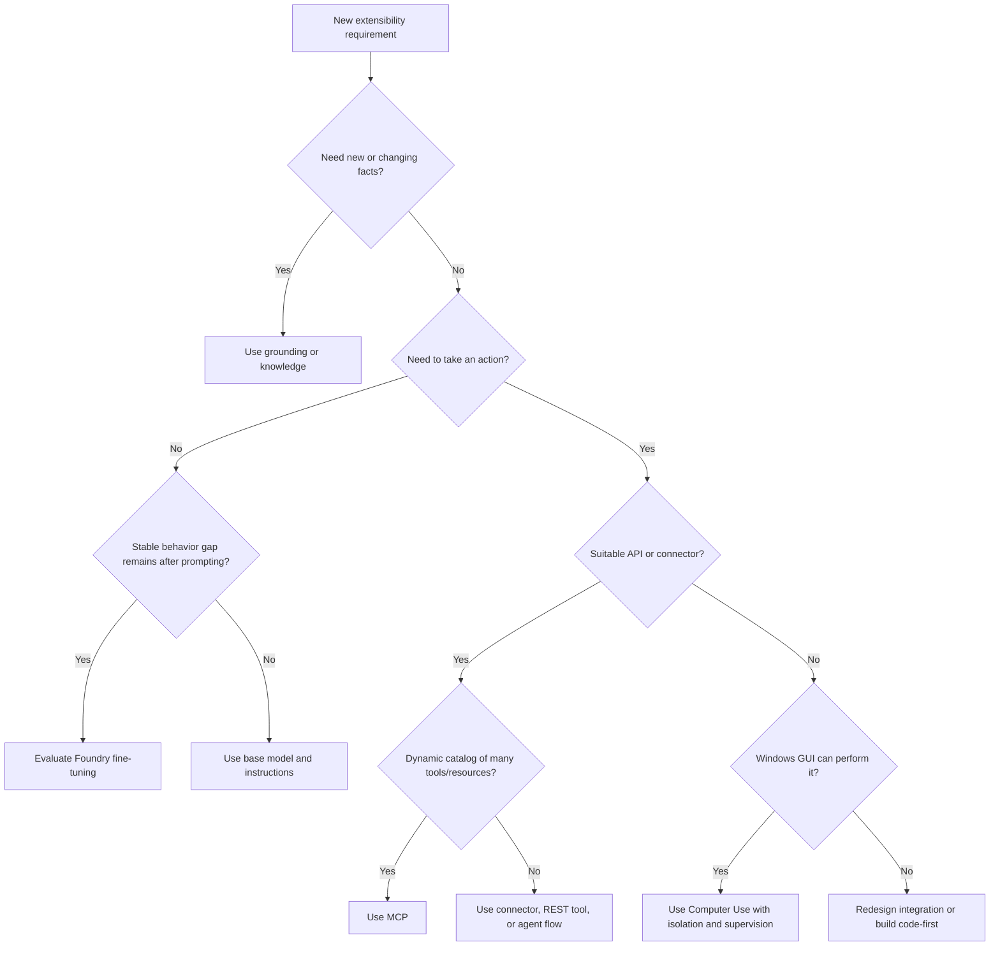

# Day 8: D2.2 Extensibility

**Date**: 2026-08-19
**Domain**: Design AI-powered business solutions (25–30%)
**Subtopics**: Custom models in Microsoft Foundry; Copilot Studio extensibility and MCP; Computer Use; reasoning and voice behavior; Microsoft 365, Teams, and SharePoint agents
**Estimated study time**: 1 hour

> **Quiz alignment:** Day 8 is assigned `q081`–`q090`, ten fresh exam-style questions grounded in the Microsoft Learn sources cited below. No earlier questions are reused.

---

## TL;DR (60-second skim)

- Choose **Microsoft Foundry custom models** when measured tests show prompting, grounding, and an existing model cannot meet specialized behavior or quality requirements.
- Choose **Copilot Studio tools/connectors/flows** for governed low-code actions; choose **MCP** when an MCP server should expose a changing catalog of tools or resources dynamically.
- Copilot Studio currently supports MCP **tools and resources**, not MCP prompts, and requires **generative orchestration** for MCP.
- Choose **Computer Use** only when a task must operate a Windows website or desktop GUI and no suitable API or connector exists; secure its machine, credentials, and human-supervision path.
- Use **deep reasoning** selectively for complex logical or multistep work; it is slower, consumes billed Copilot Credits, and is currently preview with regional/data-residency caveats.
- Use **real-time voice** when natural spoken interaction and latency matter; model choice trades native speech-to-speech latency against voice customization and regional flexibility.
- Publish a Copilot Studio agent before connecting Teams, Microsoft 365 Copilot, or SharePoint channels; authoring, publishing, sharing, and admin approval are separate steps.
- Never assume an agent bypasses permissions: channel availability and access to underlying Microsoft 365 or external data remain governed independently.

---

## Learning Objectives

After this session, you should be able to:

1. Decide when a custom or fine-tuned model in Microsoft Foundry is justified.
2. Select among Copilot Studio connectors, REST tools, flows, MCP, and Computer Use.
3. Explain security and lifecycle implications of dynamic MCP tools and GUI automation.
4. Select default, deep-reasoning, basic voice, or real-time voice behavior for a scenario.
5. Place an agent correctly in Microsoft 365 Copilot, Teams, or SharePoint.
6. Recognize exam traps involving preview status, permissions, publishing, and channel configuration.

---

## Key Concepts

### 1. The extensibility stack

Extensibility is not one feature. It is a sequence of design choices:

| Need                                                 | First-choice surface                                | Why                                                        |
| ---------------------------------------------------- | --------------------------------------------------- | ---------------------------------------------------------- |
| Improve answers with current enterprise facts        | Grounding/knowledge                                 | Changes knowledge without changing model weights           |
| Make a repeatable deterministic operation            | Connector, REST tool, or agent flow                 | Explicit inputs, outputs, governance, and testing          |
| Consume a dynamically changing tool/resource catalog | MCP server through Copilot Studio                   | Server advertises capabilities and updates them centrally  |
| Operate a UI with no usable API                      | Computer Use                                        | Uses vision, reasoning, and virtual mouse/keyboard         |
| Change domain-specific behavior beyond prompting/RAG | Fine-tune a supported Foundry model                 | Changes model behavior using curated examples              |
| Reach users where they work                          | Teams, Microsoft 365 Copilot, or SharePoint channel | Distribution and context, not a substitute for tool design |

The exam pattern is usually **least custom, most governable option that meets the requirement**.

### 2. Custom models in Microsoft Foundry

#### What “custom model” can mean

- Select and deploy a suitable pretrained model from the Foundry model catalog.
- Fine-tune a supported base model with task-specific examples.
- Import or register a custom model where supported, then deploy it behind a managed endpoint.
- Evaluate and version models, datasets, deployments, and consuming applications as separate artifacts.

Do not equate “custom model” with “train a foundation model from scratch.” Fine-tuning starts from a pretrained model and adapts behavior.

#### Decision order

1. Define a measurable baseline and acceptance criteria.
2. Try the right base model and system instructions.
3. Add grounding/RAG if the gap is missing or changing facts.
4. Add deterministic tools if the gap is taking actions or calculating exact results.
5. Fine-tune only if the remaining gap is stable behavior, style, format, or task performance and enough representative data exists.
6. Re-evaluate the tuned model against a held-out set, safety tests, latency, and cost.

#### Fine-tuning facts from current Learn documentation

- Training and validation data use **JSON Lines (JSONL)** in Chat Completions conversational format.
- Files must be UTF-8 with a byte-order mark and each file must be under **512 MB**.
- Supported models and regions change; verify the live supported-model table before committing architecture.
- Project region affects model availability, performance, cost, and data-residency choices.
- **Standard** training runs in the Foundry resource region and provides regional data-residency guarantees.
- **Global** training can use capacity outside the current region; data and weights are copied to the training region.
- Training a model and deploying it are separate lifecycle steps.
- Automatic deployment is currently supported only for OpenAI models and requires deployment-write permission.
- A deployed fine-tuned model can be called like another deployed model through the playground or API.

#### Evaluation and governance

Track base-model version, dataset version, training configuration, evaluation results, deployment name, approver, and rollback target. Use representative holdout data; never validate only on training examples. Include safety, bias, privacy, hallucination, latency, throughput, and cost criteria.

**Choose RAG, not fine-tuning**, when facts change frequently or answers must cite private documents. **Choose a tool**, not fine-tuning, when the task requires a transaction, authoritative calculation, or current system state.

### 3. Copilot Studio extensibility

Copilot Studio can extend an agent with:

- **Knowledge sources** for grounded answers.
- **Connectors** for governed access to Microsoft and third-party services.
- **Agent flows** for deterministic multistep workflow logic.
- **Prompts** for generative transformations such as summarize, classify, or draft.
- **REST API tools** when an OpenAPI-described endpoint is the integration boundary.
- **Other agents** for delegated, bounded capabilities.
- **MCP servers** for dynamically advertised tools and resources.
- **Computer Use** for GUI interaction where direct integration is unavailable.

Capability names, descriptions, inputs, outputs, authentication, and error behavior are part of the orchestration contract. Clear descriptions help generative orchestration select the right tool.

### 4. Model Context Protocol in Copilot Studio

MCP standardizes how an agent discovers and invokes capabilities exposed by a server.

An MCP server can advertise:

- **Resources**: file-like contextual data such as file contents or API responses.
- **Tools**: callable functions that perform actions.
- **Prompts**: reusable prompt templates in the protocol.

**Current Copilot Studio support:** MCP tools and resources. Do not answer “prompts” merely because MCP itself defines them.

#### How it behaves

- The MCP server provides each capability’s name, description, inputs, and outputs.
- Connected tools/resources become available to the agent.
- Server additions, updates, and removals are reflected dynamically in Copilot Studio.
- One server can manage multiple tools/resources.
- **Generative orchestration must be enabled** to use MCP.
- Copilot Studio connects through an MCP connector/onboarding experience; connector publication is optional when distribution across tenants is required.

#### MCP vs conventional integration

| Requirement                                           | Prefer                 | Reason                                         |
| ----------------------------------------------------- | ---------------------- | ---------------------------------------------- |
| Stable, small API with strict contract                | Connector or REST tool | Predictable schema and focused governance      |
| Deterministic business process with approvals         | Agent flow             | Explicit control and audit points              |
| Many related capabilities managed by another platform | MCP                    | Central server advertises the catalog          |
| Tool catalog changes frequently                       | MCP                    | Dynamic discovery reduces manual agent updates |
| Simple knowledge-only answer                          | Knowledge source       | MCP adds unnecessary operational surface       |

MCP is not automatically safer or more trusted. For external servers, the organization remains responsible for server trust, authentication, least privilege, data movement, tool descriptions, outputs, and change control. Dynamic updates are convenient but expand supply-chain and regression risk.

### 5. Computer Use

Computer Use is a Copilot Studio tool that operates a configured **Windows computer**. A Computer-Using Agent combines vision and reasoning to select buttons, choose menus, and enter text with a virtual mouse and keyboard.

Use it for legacy web/desktop applications, data entry, extraction, or processing when no suitable API/connector exists. It can adapt to some interface changes, but it is still less deterministic than a supported API.

#### Design checklist

- Prefer API, connector, or flow first.
- Isolate the runtime machine and install only required applications.
- Restrict network destinations and application execution.
- Use a least-privileged account dedicated to the task.
- Decide between **maker-provided credentials** and **end-user credentials**.
- Treat maker-provided credentials carefully: users can act through the author’s configured access.
- Store secrets in Power Platform protected storage or a configured Azure Key Vault.
- Add human supervision for potentially harmful instructions or consequential actions.
- Ensure the reviewer is authorized and can actually see/contextualize the run.
- Monitor transcripts, reasoning/action logs, and screenshots; test UI changes and failure recovery.

Some UI technologies and virtualized environments may not be supported reliably. The current documentation calls out potential limitations for Electron, Java, Unity, games, command-line interfaces, Citrix, and other virtualized environments.

### 6. Reasoning behavior

Default models are appropriate for ordinary retrieval, drafting, classification, and routine tool selection. Deep reasoning targets logical reasoning, problem solving, and step-by-step analysis.

Current Copilot Studio deep-reasoning behavior:

- It is **preview** and prerelease documentation is subject to change.
- It requires generative orchestration and deep reasoning to be enabled.
- The agent can decide which steps benefit, or instructions can use the keyword **`reason`** for a specific activity.
- It is not automatically used for every step.
- It is slower than default models and consumes billed Copilot Credits.
- Current availability is the United States and EU excluding the United Kingdom, using Azure OpenAI `o3`.
- Current preview does not make data-residency commitments; data may be transferred or processed outside the agent’s region.
- Activity tracing shows where a deep-reasoning node ran.

Use reasoning for complex plan comparison, constraint satisfaction, root-cause analysis, or multistep synthesis. Avoid it for greetings, simple lookup, deterministic calculations, or every step of a workflow.

### 7. Voice and real-time agents

Voice is a channel/interaction design choice, not merely text read aloud. Design for short turns, interruption, ambiguity repair, confirmation of critical values, escalation, and privacy in spoken environments.

Current real-time agent selection:

| Need                                                              | Better fit                                |
| ----------------------------------------------------------------- | ----------------------------------------- |
| Natural open-ended speech with lowest latency                     | GPT-Realtime                              |
| Fast speech with lower resource usage                             | GPT-Realtime-Mini (preview)               |
| Branded/custom voice, broader TTS catalog, deployment flexibility | GPT-5-Chat (preview) plus speech/TTS path |
| Deterministic IVR menus and tightly scripted flows                | Basic voice/IVR patterns                  |

GPT-Realtime uses native speech-to-speech interaction. The text-LLM path converts speech to text for reasoning and synthesizes speech back, increasing latency but enabling broader Neural TTS/custom voice options.

Selecting **Real-time** as the voice type is a one-time choice; the agent cannot be switched back to basic. Create another agent for the basic type. Digital messaging support for real-time agents is currently preview.

### 8. Microsoft 365, Teams, and SharePoint agent surfaces

#### Selection boundaries

| Surface               | Best when                                                                                   | Design notes                                                                                    |
| --------------------- | ------------------------------------------------------------------------------------------- | ----------------------------------------------------------------------------------------------- |
| Microsoft 365 Copilot | Users need an agent in the cross-app Copilot experience                                     | Optimize for work-context discovery and Microsoft 365 permissions                               |
| Teams                 | Users collaborate in chats/channels and need broad organizational distribution              | Supports personal install, links, app store, team channels, and admin-approved org distribution |
| SharePoint            | Agent should live beside a site’s content and audience                                      | Strong for site-scoped knowledge and in-context action                                          |
| Copilot Studio        | Agent needs low-code orchestration, external tools, flows, MCP, or multi-channel publishing | Author once, configure and test each channel separately                                         |
| Foundry/code-first    | Runtime, model, protocol, or UX needs exceed low-code boundaries                            | Higher engineering and operations responsibility                                                |

#### Publishing and governance facts

- Publish a Copilot Studio agent at least once before users can interact through Teams/Microsoft 365 or SharePoint.
- Connecting the Teams channel does not automatically make the agent available in Microsoft 365 Copilot; select that option explicitly.
- Sharing with named users, appearing in **Built with Power Platform**, and organization-wide **Built for your org** approval are different distribution states.
- Organization-wide Teams availability can require admin approval and Teams admin policies.
- Internal agents should use appropriate authentication so external/anonymous users cannot invoke them.
- SharePoint channel configuration requires **WRITE** access to the target site.
- A Copilot Studio agent used in SharePoint still follows Copilot Studio billing and consumes its capacity.
- Deploying to a SharePoint site and marking the agent **Approved** for prominent site visibility are separate steps.
- Test in both Copilot Studio and the actual target channel; channel behavior, authentication, cards, and permissions can differ.

Microsoft 365 grounding respects the signed-in user’s permissions. Publishing an agent does not grant access to SharePoint files, Teams content, connector data, or backend systems that the user or agent identity could not otherwise access.

---

## Decision Frameworks

For delivery: choose **SharePoint** for site-local context, **Teams** for collaborative chat/channel work, **Microsoft 365 Copilot** for cross-app work context, and a custom app/Foundry when the interaction or runtime must be fully controlled.

---

## Common Traps & Misconceptions

- **Trap:** Fine-tune to teach current company facts. **Correct:** use grounding/RAG; fine-tuning changes behavior and weights, not a maintainable live knowledge store.
- **Trap:** MCP supports prompts in Copilot Studio because MCP defines prompts. **Correct:** current Copilot Studio support is tools and resources.
- **Trap:** MCP works with classic/manual topic orchestration alone. **Correct:** it requires generative orchestration.
- **Trap:** Use Computer Use whenever a UI exists. **Correct:** prefer supported APIs/connectors; GUI automation is the fallback.
- **Trap:** Maker credentials preserve each caller’s permissions. **Correct:** callers can act through the maker’s configured access; use least privilege and deliberate identity design.
- **Trap:** Deep reasoning improves every response. **Correct:** reserve it for complex steps; it increases time and billed usage and is preview.
- **Trap:** Voice mode and reasoning mode solve the same need. **Correct:** voice optimizes spoken interaction; reasoning optimizes complex analysis.
- **Trap:** Publishing automatically distributes everywhere. **Correct:** publish, add/configure channel, share, and obtain approval where required.
- **Trap:** A SharePoint-hosted agent is billed only as SharePoint/M365 usage. **Correct:** Copilot Studio agents on SharePoint consume Copilot Studio capacity.
- **Trap:** An agent can read everything in its channel. **Correct:** authentication, user permissions, agent identity, and backend authorization still apply.

---

## Practical Scenarios

1. **Policy assistant with weekly updates:** Ground the agent on governed SharePoint policy libraries; do not fine-tune facts into a model.
2. **Specialized classifier still misses domain labels after prompt tests:** Curate representative labeled JSONL examples, fine-tune a supported Foundry model, and evaluate on held-out data.
3. **Vendor platform exposes 40 evolving tools through an MCP server:** Connect it through Copilot Studio MCP, enable generative orchestration, validate server trust, and regression-test capability changes.
4. **Legacy desktop claims app has no API:** Use Computer Use on an isolated machine with least-privileged credentials, human approval for submission, and monitored screenshots/logs.
5. **Employees ask site-specific questions while browsing an intranet:** Publish the Copilot Studio agent to that SharePoint site; ensure WRITE access for deployment and approve it only after in-channel testing.
6. **Callers need fluid interruption and minimal delay:** Prefer GPT-Realtime; choose the text/TTS route when branded voice and deployment flexibility outweigh latency.

---

## Quick Reference Card

| Signal in question                                | Likely answer                  |
| ------------------------------------------------- | ------------------------------ |
| Frequently changing private facts                 | Knowledge/RAG                  |
| Stable specialized behavior with quality evidence | Foundry fine-tuning            |
| Deterministic approval/workflow                   | Agent flow                     |
| Stable external API                               | Connector or REST tool         |
| Dynamic server-managed tool catalog               | MCP + generative orchestration |
| No API; Windows web/desktop GUI                   | Computer Use                   |
| Complex logical analysis                          | Selective deep reasoning       |
| Lowest-latency natural speech                     | GPT-Realtime                   |
| Site-local audience/content                       | SharePoint                     |
| Chats, channels, organization app distribution    | Teams                          |
| Cross-app Microsoft 365 work context              | Microsoft 365 Copilot          |

**Recall chain:** facts → grounding; actions → tools; dynamic tools → MCP; no API → Computer Use; stable behavior gap → fine-tune; complex thought → reasoning; spoken interaction → voice; location of work → channel.

---

## Cross-Domain Quiz Question Refreshers

All assigned Day 8 questions are within D2.2, so there are no cross-domain carryover concepts to refresh. Prior Day 6–7 questions are not reused.

---

## 60-Minute Study Sequence

1. **0–10 min:** Read TL;DR, extensibility stack, and the decision flowchart.
2. **10–20 min:** Study Foundry custom-model decisions and fine-tuning facts.
3. **20–32 min:** Study Copilot Studio tools, MCP, and the integration comparison.
4. **32–42 min:** Study Computer Use identity, machine security, and supervision.
5. **42–50 min:** Compare default/deep reasoning and real-time/basic voice.
6. **50–57 min:** Study Microsoft 365, Teams, and SharePoint publishing boundaries.
7. **57–60 min:** Cover the quick-reference table and explain the recall chain aloud.

---

## Hands-On Lab (Optional)

Create a one-page architecture decision for this requirement: “A procurement agent answers from SharePoint contracts, checks live vendor status, and submits updates into a legacy desktop app.” Map each need to grounding, connector/MCP, or Computer Use; state the identity used at each boundary and where human approval occurs. No Azure resources are required.

---

## Related Questions in questions.json

Day 8 uses `q081`–`q090`. The set covers RAG versus fine-tuning, authenticated tools, MCP, Computer Use, reasoning models, real-time voice, Teams distribution, and SharePoint permission boundaries.

No quiz should be launched for this study-only session. A later sourced Day 8 bank, if created, must be labeled as original AI-generated exam-style content where applicable, cite current Microsoft Learn URLs, and be added consistently to both `questions.json` and `day-assignments.json`.

---

## Sources (verified during this session)

- [Study guide for Exam AB-100](https://learn.microsoft.com/en-us/credentials/certifications/resources/study-guides/ab-100)
- [Microsoft Foundry models overview](https://learn.microsoft.com/en-us/azure/foundry/concepts/foundry-models-overview)
- [Customize a model with fine-tuning](https://learn.microsoft.com/en-us/azure/foundry/openai/how-to/fine-tuning)
- [Extend your agent with Model Context Protocol](https://learn.microsoft.com/en-us/microsoft-copilot-studio/agent-extend-action-mcp)
- [Add an MCP server to your agent](https://learn.microsoft.com/en-us/microsoft-copilot-studio/agents-experience/tools-add-mcp-server)
- [Automate web and desktop apps with Computer Use](https://learn.microsoft.com/en-us/microsoft-copilot-studio/computer-use)
- [Configure where Computer Use runs](https://learn.microsoft.com/en-us/microsoft-copilot-studio/configure-where-computer-use-runs)
- [Human supervision of Computer Use](https://learn.microsoft.com/en-us/microsoft-copilot-studio/human-supervision-computer-use)
- [Use deep reasoning models for complex tasks](https://learn.microsoft.com/en-us/microsoft-copilot-studio/authoring-reasoning-models)
- [Configure real-time agents](https://learn.microsoft.com/en-us/microsoft-copilot-studio/voice-realtime-configure)
- [Voice agent prompt best practices](https://learn.microsoft.com/en-us/microsoft-copilot-studio/guidance/voice-agents-prompt-best-practices)
- [Connect and configure an agent for Teams and Microsoft 365](https://learn.microsoft.com/en-us/microsoft-copilot-studio/publication-add-bot-to-microsoft-teams)
- [Publish agents for Microsoft 365 Copilot](https://learn.microsoft.com/en-us/microsoft-365/copilot/extensibility/publish)
- [Publish an agent to SharePoint](https://learn.microsoft.com/en-us/microsoft-copilot-studio/publication-add-bot-to-sharepoint)
- [Manage access to agents in SharePoint](https://learn.microsoft.com/en-us/sharepoint/manage-access-agents-in-sharepoint)

---

## Notes (your own words — fill this in after studying)

- Platform boundary:
- MCP vs connector:
- Computer Use guardrail:
- Reasoning/voice selection:
- Channel/publishing trap:
