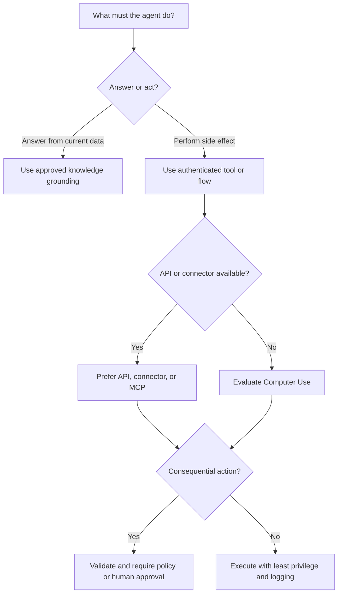

# Day 10: Domain 2 Quiz and Review

**Date**: 2026-08-21
**Domain**: Design AI-powered business solutions (25-30%)
**Subtopics**: agent types, generative orchestration, agent flows, prompt controls, MCP, Computer Use, Microsoft 365 permissions, finance and operations knowledge
**Estimated study time**: 1 hr
**Quiz**: Exactly 10 questions (`q070`, `q074`, `q076`, `q077`, `q080`, `q084`, `q086`, `q090`, `q099`, `q100`)

---

## TL;DR (60-second skim)

- Use an autonomous agent for event-initiated work, but place consequential changes behind deterministic validation or human approval.
- Generative orchestration selects and sequences topics, tools, agents, and knowledge; precise descriptions and typed contracts are essential.
- Use agent flows for branches, retries, approvals, connector calls, and writes. Use prompts for bounded semantic tasks.
- Prompt output remains probabilistic even at temperature 0 and even when it is valid JSON; validate schema, values, and business rules.
- MCP exposes evolving tools and resources dynamically and requires generative orchestration in Copilot Studio.
- Use Computer Use only when a suitable API or connector is unavailable; preserve user identity and supervise risky actions.
- Sharing an agent never overrides SharePoint permissions or sensitivity labels.
- Knowledge supports retrieval. Record approval or updates require authenticated actions with authorization and controls.

---

## Learning Objectives

After this review, you should be able to:

1. distinguish prompt-and-response, task, and autonomous agents;
2. choose classic orchestration, CLU, or generative orchestration from scenario clues;
3. separate probabilistic AI work from deterministic process control;
4. select MCP or Computer Use for the correct integration boundary;
5. preserve source permissions when publishing or sharing agents;
6. distinguish knowledge grounding from transaction authority;
7. identify source precedence in finance and operations generative help.

---

## Key Concepts

### 1. Agent type is determined by initiation and authority

| Agent type | Starts when | Typical behavior | Exam clue |
| --- | --- | --- | --- |
| Prompt and response | A user asks | Retrieves or generates an answer | "summarize," "explain," no side effect |
| Task agent | A user invokes a bounded goal | Runs a defined multistep operation with tools | "prepare," "create package," "complete this task" |
| Autonomous agent | An event or condition occurs | Acts without a new user prompt | "when a record is created," "monitor continuously" |

Tool count does not determine the type. A user-invoked task can call many tools and remain a task agent.

Autonomy also does not remove governance. A new high-priority case can trigger autonomous triage, while a contractual service-level change still requires deterministic authorization and manager approval.

A useful design sequence is:

1. define the trigger;
2. define allowed observations and actions;
3. identify irreversible, financial, legal, or customer-impacting steps;
4. place those steps behind validation, policy, or approval;
5. log the decision, action, identity, and result.

### 2. Orchestration choices

**Classic orchestration** matches user utterances to authored trigger phrases and follows predictable topic paths. Choose it for a small, stable intent set with approved wording and deterministic conversation order.

**Conversational Language Understanding (CLU)** fits a specialized intent/entity taxonomy backed by labeled utterances, model evaluation, deployment, and versioning.

**Generative orchestration** uses an LLM planner to select and sequence topics, tools, agents, and knowledge. It is appropriate for compound requests such as retrieving a balance, consulting policy, and drafting a message.

Generative orchestration depends on capability contracts:

- Give each topic or tool a distinct, concrete description.
- State when the capability should and should not be used.
- Define required and optional inputs with meaningful names and descriptions.
- Return typed outputs that downstream steps can validate.
- Avoid overlapping descriptions that make multiple capabilities appear equally suitable.

### 3. Input limitations and validation

Generative topic and tool inputs don't directly support every custom entity type. For an internal asset tag represented by a custom regex entity:

1. enter a topic;
2. use a Question node to collect the asset tag;
3. validate it with the custom entity;
4. pass the validated value to the downstream topic, tool, or flow.

Do not ask the planner to infer a value that must match a business identifier.

### 4. Agent flows own deterministic processes

Use an agent flow when a process needs:

- branching on explicit values;
- retries and timeout handling;
- connector or API calls;
- approvals and confirmations;
- authenticated writes;
- durable failure handling and auditability.

A flow exposed to an agent should use **When an agent calls the flow**, define clear inputs and outputs, and be added as a tool with a precise description.

Prompts can be composed inside the flow for bounded work such as summarization, classification, drafting, or extraction. The flow should validate the result before taking consequential action.

For a refund workflow, the model may summarize the evidence. The flow must own eligibility checks, amount thresholds, retries, approval, and the ERP update.

### 5. Prompt output is probabilistic

Temperature 0 reduces randomness; it does not guarantee factual, identical, complete, or policy-compliant output. Valid JSON proves syntax, not correctness.

Apply these controls:

- validate against the expected schema;
- restrict values to an allowlist where possible;
- reject missing or contradictory information;
- test representative, boundary, and adversarial inputs;
- provide an insufficient-information path;
- require confirmation or review before high-impact action;
- monitor errors and update tests when failures appear.

### 6. MCP in Copilot Studio

Model Context Protocol provides a standards-based way for a server to advertise tools and resources. Copilot Studio can connect the MCP server as a tool, and the available capabilities can update without manually rebuilding one hard-coded topic per operation.

Current Microsoft guidance requires generative orchestration for MCP. The planner uses server-provided names, descriptions, and schemas to choose an operation.

MCP does not eliminate security design. Confirm:

- server trust and ownership;
- authentication method;
- least-privilege authorization;
- data-loss-prevention policy alignment;
- validation and approval for side effects;
- monitoring and failure behavior.

### 7. Computer Use

Computer Use automates visible web or desktop interfaces with mouse and keyboard behavior. Choose it only when the target system lacks a suitable API, connector, or MCP integration.

API-first remains preferable because APIs generally provide stronger schemas, reliability, validation, observability, and transaction semantics.

For shared Computer Use agents:

- use end-user credentials when each user's target-app permissions must be preserved;
- do not embed a shared administrator credential in instructions;
- use human supervision for potentially harmful instructions;
- configure an appropriate response time limit;
- test UI changes, interruptions, duplicate submissions, and partial completion.

Computer Use also requires generative orchestration.

### 8. Publishing is not permission elevation

A declarative agent can use SharePoint as knowledge. Sharing the agent broadly controls discoverability and chat access, not access to every source item.

At retrieval time, SharePoint permissions and sensitivity-label boundaries continue to apply to the employee. The agent owner's access does not transfer to every user.

Keep these controls separate:

| Control | What it governs |
| --- | --- |
| Publish | Makes the current agent version available |
| Share | Grants access to use the agent |
| Admin approval | Enables organization-level distribution where required |
| Source permission | Controls which underlying content the current user can retrieve |

### 9. Knowledge versus transaction authority

A knowledge source can answer, "Which purchase orders are overdue?" It cannot independently approve or update those orders.

A transactional design additionally needs:

1. an authenticated action, connector, API, tool, or flow;
2. authorization as the correct user or workload identity;
3. input and business-rule validation;
4. confirmation or approval where impact warrants it;
5. audit logging and failure handling;
6. idempotency where retries could duplicate an operation.

Fine-tuning, adding more documents, or enabling general model knowledge cannot create transaction authority.

### 10. Finance and operations knowledge precedence

Finance and operations generative help provides contextual guidance and can be extended with custom knowledge. When custom knowledge and optional general-question sources are enabled, Microsoft documents this order:

1. use configured custom knowledge first;
2. after custom knowledge is exhausted, use enabled general sources such as model knowledge, Bing-identified web content, or other configured sources.

Do not confuse help and guidance with ERP transaction processing.

---

## Decision Frameworks



For orchestration selection:

- Stable intents and authored paths: classic orchestration.
- Trained domain taxonomy with labeled intents/entities: CLU.
- Compound requests requiring dynamic capability selection: generative orchestration.
- Deterministic business workflow: agent flow, even when the agent uses generative orchestration to choose it.

---

## Comparisons

| Need | Use | Do not substitute |
| --- | --- | --- |
| Current, cited facts | Retrieval grounding | Fine-tuning |
| Consistent learned behavior from reviewed examples | Fine-tuning | Larger retrieval index |
| External record creation or update | Authenticated tool/action | Knowledge source |
| Dynamic standards-based tools/resources | MCP + generative orchestration | Static prompt copies |
| UI automation without an API | Computer Use | Screenshot training |
| Thresholds, retries, approvals | Agent flow | Prompt-only rules |

---

## Important Details for Exam

- Event initiation is the strongest clue for an autonomous agent.
- Generative orchestration can select topics, tools, agents, and knowledge.
- Custom regex or closed-list entities should be collected in a Question node when direct generative input support is unavailable.
- `When an agent calls the flow` is the trigger for an agent-callable flow.
- Temperature 0 and structured output do not remove validation requirements.
- MCP and Computer Use require generative orchestration in the reviewed Copilot Studio scenarios.
- End-user credentials preserve role-specific target-system access for shared Computer Use.
- Agent sharing does not override SharePoint permissions or sensitivity labels.
- Knowledge retrieval never grants write or approval authority.
- Finance custom knowledge is consulted before enabled general sources.

---

## Common Traps & Misconceptions

- **Wrong:** More than one tool means autonomous. **Correct:** initiation and operating boundary determine the type.
- **Wrong:** A planner can own financial thresholds. **Correct:** deterministic flow logic owns thresholds and approvals.
- **Wrong:** Valid JSON is trustworthy output. **Correct:** validate schema, values, evidence, and business rules.
- **Wrong:** MCP works as static classic-orchestration topics. **Correct:** use MCP as a tool with generative orchestration.
- **Wrong:** Computer Use should replace a stable API. **Correct:** use it when no suitable integration exists.
- **Wrong:** Sharing an agent shares all source files. **Correct:** source permissions remain authoritative.
- **Wrong:** Grounding an agent in ERP data lets it update ERP data. **Correct:** add authenticated actions and controls.
- **Wrong:** General web/model knowledge outranks approved custom F&O knowledge. **Correct:** custom knowledge is used first.

---

## Real-World Scenarios

1. A Dataverse case creation event starts triage. The agent gathers evidence, but a manager approves any contractual service-level change. Use autonomous initiation plus a deterministic approval boundary.
2. An employee asks for a balance, policy explanation, and manager draft. Use generative orchestration over a balance tool, approved knowledge, and a drafting prompt.
3. A refund process branches on amount and writes to ERP. Put branches, retry, approval, and update in an agent flow; keep summarization bounded.
4. A legacy desktop app has no integration. Evaluate Computer Use with end-user credentials and supervision.
5. An ERP knowledge agent must approve purchase orders. Add an authenticated action with authorization and validation; knowledge alone is insufficient.

---

## Quick Reference Card

| Scenario clue | Answer pattern |
| --- | --- |
| Record-created trigger | Autonomous agent |
| Multi-intent dynamic request | Generative orchestration |
| Regex asset tag input | Question node validates custom entity |
| Retry + threshold + approval + write | Agent flow |
| Temperature 0 + JSON | Still validate and test |
| Dynamic tool server | MCP + generative orchestration |
| Legacy GUI, no API | Computer Use |
| Different user permissions | End-user credentials |
| Shared SharePoint agent | Existing user permissions still apply |
| ERP Q&A becomes ERP update | Add authenticated action and controls |
| F&O custom plus general knowledge | Custom first, general after exhaustion |

---

## Hands-On Lab (optional)

Sketch one architecture for an autonomous case-triage agent. Label the event trigger, retrieval source, generative step, deterministic validation, approval boundary, authenticated write, and audit record. Then identify which component owns each failure path.

---

## Cross-Domain Quiz Question Refreshers

No questions from Domains 1 or 3 are included today. The set intentionally reviews only already studied Domain 2 material.

| Adjacent Domain 2 concept | Key fact | Trap |
| --- | --- | --- |
| Agent classification | Initiation and scope define the type | Tool count does not define autonomy |
| Planner versus flow | Planner selects; flow enforces deterministic process | Do not encode hard policy only in prompts |
| Grounding versus action | Grounding retrieves; actions change systems | More knowledge does not grant authority |

---

## Related Questions in questions.json

- `q070`: Autonomous event-triggered triage and approval boundaries.
- `q074`: Generative orchestration across tools, knowledge, and prompts.
- `q076`: Custom regex entity collection for generative topics.
- `q077`: Agent flows for deterministic refund processing.
- `q080`: Validation and safety for probabilistic prompt output.
- `q084`: MCP integration and generative orchestration.
- `q086`: Computer Use identity and human supervision.
- `q090`: SharePoint permissions for broadly shared agents.
- `q099`: Knowledge retrieval versus authenticated ERP actions.
- `q100`: Finance and operations knowledge-source precedence.

Quiz command for exactly 10 questions, with no added carryover:

```powershell
python quiz_runner.py questions.json --day-lock 10 --carryover 0
```

---

## Sources (verified during this session)

- [Study guide for Exam AB-100](https://learn.microsoft.com/en-us/credentials/certifications/resources/study-guides/ab-100)
- [Orchestrate agent behavior with generative AI](https://learn.microsoft.com/en-us/microsoft-copilot-studio/advanced-generative-actions)
- [Extend your agent with Model Context Protocol](https://learn.microsoft.com/en-us/microsoft-copilot-studio/agent-extend-action-mcp)
- [Automate web and desktop apps with Computer Use](https://learn.microsoft.com/en-us/microsoft-copilot-studio/computer-use)
- [Add knowledge sources to a declarative agent](https://learn.microsoft.com/en-us/microsoft-365/copilot/extensibility/agent-builder-add-knowledge)
- [Chat with finance and operations data](https://learn.microsoft.com/en-us/dynamics365/fin-ops-core/dev-itpro/copilot/chat-with-fno-data)
- [Generative help and guidance with Copilot](https://learn.microsoft.com/en-us/dynamics365/fin-ops-core/fin-ops/copilot/copilot-generative-help)

---

## Notes (your own words - fill this in after studying)

- 
- 
- 
