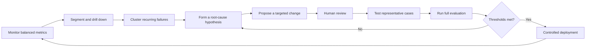
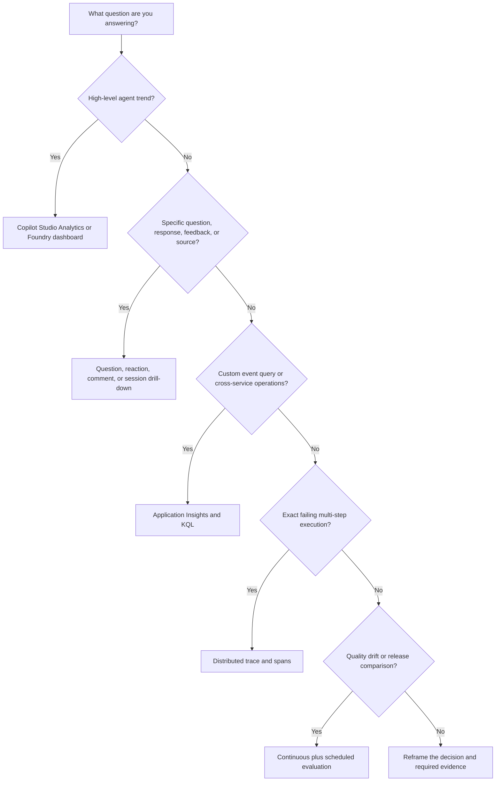
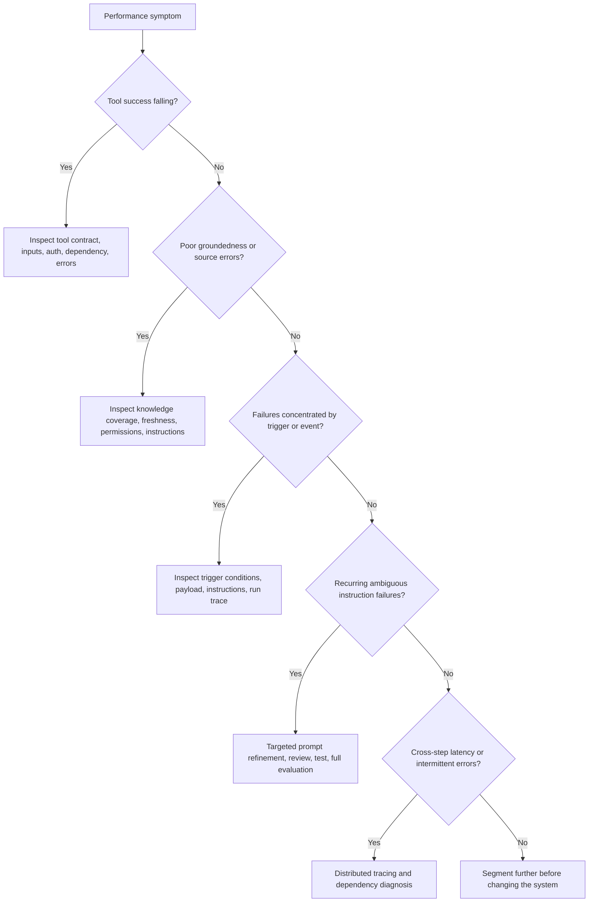

# Day 11: D3.1 Monitor and Tune

**Date**: 2026-08-22
**Domain**: Deploy AI-powered business solutions (40-45%)
**Subtopics**: monitoring tools and process; backlog and user-feedback analysis; AI-based tuning; agent performance metrics; telemetry interpretation
**Estimated study time**: 2 hrs
**Practice set**: Exactly 10 Domain 3 questions (`q101`-`q110`)

---

## TL;DR (60-second skim)

- Monitor a portfolio of signals: user experience, operational health, quality, adoption, cost or savings, and business outcomes. Never infer success from one vanity metric.
- Establish a baseline, target, owner, threshold, segment, and review cadence for each KPI before interpreting trends.
- Copilot Studio Analytics excludes test-panel activity; Application Insights includes it. Filter `customDimensions['designMode'] == "False"` for production-only Kusto analysis.
- Turn feedback into backlog items by drilling from reactions, comments, questions, sessions, outcomes, and knowledge sources to recurring root causes. Use the least-privilege **Bot Transcript Viewer** role.
- Answer rate says whether an answer was produced; sampled answer quality assesses completeness, relevance, and groundedness. High answer rate can coexist with poor quality.
- For autonomous agents, inspect run outcomes, duration, trigger details, and tool success. Conversational CSAT does not diagnose event-trigger failures.
- Use dashboards to detect trends and distributed traces to locate the failing agent decision, LLM call, tool invocation, or dependency.
- Treat Themes, cluster analysis, and Prompt Optimizer as decision support. Human review, targeted changes, testing, and evaluation on representative organizational data remain required.

---

## Learning Objectives

After this session, you should be able to:

1. recommend a monitoring operating model for conversational, autonomous, and multi-agent solutions;
2. choose metrics that jointly represent experience, quality, reliability, usage, business value, and cost;
3. interpret Copilot Studio built-in analytics and Application Insights telemetry without mixing test and production data;
4. convert detailed user feedback and recurring failure patterns into a prioritized tuning backlog;
5. distinguish answer rate, answer quality, run success, tool success, latency, and business outcome metrics;
6. choose aggregate monitoring, question or session drill-down, or distributed tracing for the correct diagnostic depth;
7. design continuous and scheduled production evaluation to detect quality drift;
8. apply AI-assisted clustering and prompt optimization without automating away human validation.

These objectives map directly to AB-100 D3.1:

- recommend the process and tools required for monitoring agents;
- analyze backlog and user feedback of AI and agent usage;
- apply AI-based tools to analyze or identify issues and perform tuning;
- monitor agent performance and metrics;
- interpret telemetry data for performance and model tuning.

---

## Key Concepts

### 1. Monitoring is an operating process, not a dashboard

A dashboard is a presentation surface. Monitoring is a repeatable management loop with defined decisions and ownership.

For every important metric, define:

| Element | Question to answer |
| --- | --- |
| Business objective | What outcome should the agent improve? |
| Metric definition | Exactly what is counted, sampled, or calculated? |
| Baseline | What happened before launch or before the latest change? |
| Target | What result is acceptable or desirable? |
| Threshold | What value triggers investigation or rollback? |
| Segment | Which channel, use case, geography, trigger, tool, or cohort? |
| Owner | Who investigates and who approves a production change? |
| Cadence | Real-time alert, daily triage, weekly tuning, or monthly value review? |
| Evidence | Which transcript, trace, evaluation row, or business record supports the signal? |

A practical cadence is real time for severe health or safety alerts, daily for failed runs and broken tools, weekly for feedback themes and quality cohorts, and monthly or quarterly for adoption, savings, business outcomes, and ROI.

The baseline must precede claims of improvement. For example, compare average handling time, escalation rate, or first-contact resolution before and after deployment while accounting for changes in volume and case mix.

### 2. Use a balanced metric portfolio

No single metric represents agent effectiveness. Organize metrics into six layers.

| Layer | Examples | What it tells you | What it cannot prove alone |
| --- | --- | --- | --- |
| Experience | reaction, comment, CSAT, sentiment, escalation | how users perceived an interaction | factual correctness or business value |
| Response quality | relevance, completeness, groundedness, answer rate | whether answers are available and useful | tool reliability or completed transactions |
| Operational health | availability, latency, error rate, run duration | whether the system operates reliably | response quality |
| Capability health | trigger use, tool calls, tool success, knowledge-source errors | whether dependencies work | user satisfaction or ROI |
| Adoption and use | active users, sessions, engaged sessions, repeat use | whether the solution is being used | whether usage produces value |
| Value and economics | resolution, conversion, time saved, cost saved, revenue, risk reduction | whether the business objective is achieved | the technical root cause of a failure |

Copilot Studio provides built-in views for overview, effectiveness, use, savings, conversational-agent analysis, and autonomous-agent analysis. It also allows up to three natural-language custom metrics that identify business-specific outcomes across sampled sessions. Custom metrics complement rather than replace standard telemetry and business-system KPIs.

### 3. Copilot Studio built-in Analytics versus Application Insights

Use built-in Analytics for maker-friendly KPI views and drill-down. Use Application Insights when you need raw event analysis, custom KQL, correlation, retention or operational integration, and external dashboards or alerts.

| Capability | Copilot Studio Analytics | Application Insights |
| --- | --- | --- |
| Primary purpose | agent performance and improvement views | detailed telemetry analysis and operations |
| Typical user | maker, product owner, analyst | architect, developer, SRE, operations analyst |
| Data shape | curated metrics and drill-down lists | events and custom dimensions queried with KQL |
| Test-panel activity | excluded | included |
| Production-only handling | already excludes test panel | explicitly filter `designMode` |
| Root-cause depth | question, response, session, source, trigger, tool | custom event-level queries and cross-service correlation |
| Best use | trend detection and prioritized investigation | custom diagnosis, alerting, correlation, and integration |

A mismatch after maker testing does not by itself indicate telemetry loss. The two surfaces intentionally include different activity.

#### Production-only KQL example

Microsoft Learn documents `designMode` as a custom dimension captured on all relevant events. `True` indicates a test-canvas conversation.

```kusto
customEvents
| extend isDesignMode = tostring(customDimensions['designMode'])
| where isDesignMode == "False"
| summarize Events = count() by name, bin(timestamp, 1h)
| order by timestamp desc
```

Do not substitute a channel filter for the explicit test-mode dimension. Channel identifies a delivery surface; `designMode` identifies whether the event came from maker testing.

### 5. Convert feedback into an actionable backlog

Aggregate feedback is a detector, not a complete diagnosis. Use a drill-down workflow:

1. Detect a negative trend or concentrated cohort in reactions, comments, CSAT, outcome, answer quality, or escalation.
2. Filter by time, channel, agent version, theme, outcome, quality reason, or business segment.
3. Open the contributing questions, responses, sessions, and comments.
4. Inspect the response quality, user reaction, conversation outcome, and cited knowledge sources.
5. Group examples by recurring root cause rather than by vague symptom.
6. Estimate frequency, impact, risk, and confidence.
7. Create a backlog item with evidence, proposed owner, expected metric movement, and acceptance test.
8. Tune one controlled element where possible.
9. Reevaluate and compare with the baseline and a control period or prior version.

A useful backlog item records the affected cohort, frequency, evidence, business impact, root-cause hypothesis, proposed change, owner, acceptance thresholds, and rollback rule.

#### Transcript access and least privilege

Detailed question and session lists can contain conversation content and business data. Microsoft Learn states that users need the **Bot Transcript Viewer** security role to view these lists and metrics; admins grant it during agent sharing.

Use this role for analysts who need transcript evidence. Do not grant environment administrator access merely to inspect feedback. Continue applying data-loss prevention, retention, privacy, and sensitive-data rules.

Current Learn details worth recognizing: session lists update daily, show up to 10,000 sessions per day, and retain the last 28 days in that view. Other analytics views can use different periods, so check each view's scope.

### 6. Themes: AI-assisted issue discovery in Copilot Studio

Themes is a preview capability that groups related user questions that triggered generative answers. It helps makers discover frequent intents, knowledge gaps, and weak-performing cohorts when manual classification would be too slow.

Current behavior documented by Microsoft Learn:

- it analyzes unclassified generative-answer questions from the past week;
- the initial analysis can suggest up to 10 themes;
- theme suggestions refresh weekly;
- new questions are classified into existing themes daily;
- questions that remain unmatched stay in an **Unclassified** theme;
- theme metrics include question volume, answer rate, and user reaction;
- makers can inspect individual questions and theme-level performance.

Themes supports prioritization; it does not create ground truth. Validate cluster coherence, minority and regulated cases, business-meaningful labels, sample volume, and whether a proposed fix helps representative evaluation cases.

Preview features are subject to change, can have restricted functionality, and are not intended to be an unreviewed production control.

### 7. Answer rate and answer quality answer different questions

Copilot Studio's generated answer analytics separate availability from quality.

| Metric | Meaning | Diagnostic next step |
| --- | --- | --- |
| Answered count or rate | the agent produced an answer | inspect whether answered items are useful and safe |
| Unanswered count or rate | the agent did not produce an answer | inspect scope, retrieval, fallback, and coverage gaps |
| Sampled answer quality | AI assessment of completeness, relevance, and groundedness | drill into the labeled cohort and reason |
| Good quality | sampled answer meets the quality standard | verify important business and safety cohorts still pass |
| Poor quality | sampled answer misses the standard, with a reason | inspect questions, responses, and cited sources |

Copilot Studio displays the number of sampled answers behind quality percentages. Keep sampling uncertainty in mind, especially for small cohorts.

When answer rate is high but groundedness is poor, drill into that quality segment; inspect the questions, responses, and cited sources; check source relevance, authority, freshness, permissions, and coverage plus source-use instructions; make the smallest evidence-backed change; and reevaluate the cohort.

Removing knowledge sources or allowing unrestricted general knowledge usually increases risk rather than fixing groundedness.

### 8. Autonomous-agent metrics are run-centric

An autonomous agent starts from an event or condition, so monitor the work it performs rather than relying on conversational survey measures.

Copilot Studio autonomous-agent analytics includes:

- run outcomes;
- successful and failed run counts;
- average duration for successful and failed sessions;
- duration changes over time;
- trigger use and changes over time;
- Trigger use details, including common events and events associated with the most failed runs;
- tool use and success.

Long session durations can delay downstream workflows. Microsoft Learn identifies more specific trigger-level or agent-level instructions as one possible speed improvement, but first locate the affected trigger and failure stage.

Investigation pattern: segment outcomes by trigger and event type, compare successful and failed duration, use Trigger use details to find the largest failure contribution, inspect payloads and dependencies, then tune the implicated trigger or instructions and test retries, duplicates, idempotency, and downstream effects.

Conversational CSAT can be absent or irrelevant for a background run. Do not use it as the primary diagnostic signal for event-triggered failures.

### 9. Tool frequency and tool success must be interpreted together

Copilot Studio Tool use analytics tracks how often tools start and the percentage of calls used successfully.

High frequency plus high success indicates a relevant, healthy capability. High frequency plus low or falling success points first to the tool contract, input schema and values, authentication and authorization, dependency availability, throttling, timeout and retry behavior, error recovery, and side-effect idempotency. Low calls require a separate look at user demand, tool description, and routing.

Do not start with model fine-tuning when execution telemetry points to an action contract or operational dependency.

### 10. Foundry observability: dashboards, evaluation, and tracing

Microsoft Foundry integrates observability with Azure Monitor Application Insights.

#### Monitoring dashboards

Use dashboards to detect broad trends in operational metrics, token consumption, latency, errors, quality, and safety.

Dashboards tell you **that** a trend exists. They usually do not identify the exact step that caused one bad multi-agent execution.

#### Distributed tracing

Foundry distributed tracing is based on OpenTelemetry standards and captures execution flow across:

- agent decisions;
- LLM calls;
- tool invocations;
- inter-service dependencies;
- multi-step reasoning or orchestration paths.

Use span-level traces when latency or errors must be localized to a specific step. Tracing integrated with Application Insights supports complex-agent debugging, bottleneck identification, and dependency diagnosis.

Stable token consumption does not rule out:

- a slow external API;
- a failing tool retry loop;
- a routing decision that selects a slow dependency;
- an authentication timeout;
- a child agent waiting on another service.

#### Operational health versus response quality

A solution can meet latency, availability, and error targets while its groundedness or relevance declines. Therefore, production observability needs both operational and semantic evaluation signals.

Microsoft Foundry documents:

- **continuous evaluation**: quality and safety evaluation of sampled production traffic;
- **scheduled evaluation**: quality and safety evaluation on test datasets to detect drift;
- **scheduled red teaming**: recurring adversarial testing for safety and security vulnerabilities;
- **Azure Monitor alerts**: notifications when outputs fail quality thresholds or produce harmful content.

Use both live and controlled evaluation:

- sampled live traffic reflects current users and emerging behavior;
- a versioned representative dataset enables controlled comparison across releases;
- alerts turn thresholds into an operational response;
- human review calibrates automated evaluators and investigates high-risk cases.

### 11. AI-assisted tuning does not close its own control loop

Quality can drift without a weight change because users, policies, knowledge, permissions, dependencies, prompts, orchestration, models, traffic mix, evaluators, or sampling can change. Combine stable regression cases, sampled production cases, edge and safety cases, segmented trends, version metadata, thresholds, and trace or transcript evidence.

AI can accelerate issue discovery and proposal generation:

- Copilot Studio Themes clusters unclassified generative-answer questions;
- evaluation cluster analysis groups recurring failure patterns;
- evaluators label or score response cohorts;
- Prompt Optimizer restructures and clarifies agent instructions.

The safe tuning loop is:



Cluster analysis shows recurrence and suggests improvement areas. It does not prove causality or verify that a fix works.

### 12. Prompt Optimizer boundaries

Microsoft Foundry Prompt Optimizer is currently preview. It:

- improves text-based system instructions;
- applies prompt-engineering practices to restructure and clarify instructions;
- provides paragraph-level reasoning for changes;
- supports iterative suggestions and reoptimization.

It does **not** optimize non-text configuration such as:

- tool definitions;
- knowledge sources.

Preserve the original version, start from an evidence-backed cluster, request a specific refinement, inspect the text and reasoning, reject policy or scope conflicts, test in the playground, run a full organizational-dataset evaluation, compare quality, safety, latency, cost, and business outcomes, then deploy in a controlled manner and monitor regression.

Reasoning generated by an LLM explains a suggestion; it is not a guarantee of correctness or improvement.

---

## Decision Frameworks

### Which monitoring surface should you use?



### What should be tuned first?



---

## Comparisons

### Copilot Studio conversational versus autonomous analysis

| Dimension | Conversational agent | Autonomous agent |
| --- | --- | --- |
| Initiation | user message | event or condition |
| Core unit | question, conversation, engaged session | triggered run or session |
| Main quality signals | answer rate, sampled quality, reactions, outcomes | run success, failure, duration, trigger and tool behavior |
| Primary drill-down | question, response, source, reaction, transcript | event, trigger, run outcome, duration, tool |
| Common bad proxy | volume alone | conversational CSAT alone |

### Dashboard versus trace versus evaluation

| Surface | Answers | Does not answer by itself |
| --- | --- | --- |
| Dashboard | Is latency, error, quality, use, or cost trending? | Which exact step failed? |
| Trace | Which agent, LLM, tool, or dependency caused this execution issue? | Is the response semantically good across representative traffic? |
| Evaluation | Does output meet quality and safety criteria across a dataset or sample? | Which infrastructure dependency caused latency? |

### Themes versus cluster analysis versus Prompt Optimizer

| Capability | Input | Output | Correct use | Guardrail |
| --- | --- | --- | --- | --- |
| Copilot Studio Themes | unclassified generative-answer questions | suggested themes and metrics | discover frequent intents and weak cohorts | preview; validate clusters and labels |
| Evaluation cluster analysis | evaluation failures | recurring patterns and improvement areas | prioritize evidence-backed hypotheses | recurrence is not proof of causality |
| Prompt Optimizer | text system instructions and suggestions | revised text plus paragraph reasoning | refine ambiguous or weak instructions | preview; text only; human review and full evaluation |

---

## Important Details for Exam

- Domain 3 is 40-45% of AB-100 and is the largest exam domain.
- Monitoring recommendations should include process, ownership, baselines, thresholds, segmentation, and cadence, not only tools.
- Copilot Studio custom metrics allow up to three business-specific natural-language metrics across sampled sessions.
- Copilot Studio high-level analytics can show events from the last 360 days; individual drill-down views can have narrower retention and update behavior.
- Copilot Studio Analytics excludes test-panel activity.
- Application Insights captures test conversations as well as non-test conversations.
- `designMode` is the explicit custom dimension for identifying test-canvas telemetry.
- Use `where isDesignMode == "False"` for production-only custom events.
- Bot Transcript Viewer is the least-privilege role for detailed transcript, question, and session analysis.
- Themes is preview and groups unclassified questions that triggered generative answers.
- Themes proposes up to 10 themes from the past week, refreshes suggestions weekly, and classifies new questions daily.
- Answer quality is AI-assessed on a sample and includes completeness, relevance, and groundedness.
- Poor-quality answers include a reason and can be drilled down to contributing questions.
- Tool use requires both frequency and success percentage for interpretation.
- Trigger use details can reveal which event types produced the most failed autonomous runs.
- Run duration should be compared for successful and failed autonomous sessions.
- Foundry tracing is OpenTelemetry-based and integrated with Azure Monitor Application Insights.
- Foundry traces capture LLM calls, tool invocations, agent decisions, and inter-service dependencies.
- Continuous evaluation samples production traffic for quality and safety.
- Scheduled evaluation uses test datasets to detect drift.
- Azure Monitor alerts can notify when outputs cross quality or harmful-content thresholds.
- Prompt Optimizer is preview, works on text instructions only, and does not optimize tool definitions or knowledge sources.
- Prompt Optimizer reasoning must be reviewed; test after optimization and run a full evaluation on your own dataset.

---

## Common Traps and Misconceptions

1. **“More conversations means success.”** Volume can grow while resolution, quality, satisfaction, or value falls.
2. **“One KPI is simpler and therefore better.”** A single metric hides tradeoffs and failure modes.
3. **“Analytics and Application Insights should have identical counts.”** Test-panel activity is excluded from built-in Analytics but included in Application Insights.
4. **“Filter on channel to remove testing.”** Use the explicit `designMode` dimension.
5. **“Stable average CSAT means there is no backlog issue.”** Segment and inspect reactions, comments, questions, outcomes, and sources.
6. **“Analysts need environment-admin rights.”** Grant Bot Transcript Viewer for the transcript-analysis need.
7. **“Themes produces authoritative classifications.”** It is preview, AI-generated decision support requiring validation.
8. **“Answer rate measures correctness.”** It measures whether an answer was produced.
9. **“High answer rate cancels poor groundedness.”** Coverage and quality are separate dimensions.
10. **“Autonomous failures should be diagnosed with conversational CSAT.”** Use run, duration, trigger, event, tool, and trace evidence.
11. **“Frequent tool calls prove the tool works.”** Pair call frequency with success percentage.
12. **“Tool failures mean the model weights are wrong.”** Inspect schema, inputs, authentication, dependencies, and error handling first.
13. **“A dashboard identifies root cause.”** Dashboards detect trends; distributed traces locate failing execution steps.
14. **“Availability proves response quality.”** Operational health can remain green while groundedness drifts.
15. **“One preproduction benchmark lasts forever.”** Production inputs, knowledge, dependencies, prompts, and models change.
16. **“AI-generated clusters prove the proposed fix.”** Clusters reveal patterns; evaluation verifies changes.
17. **“Prompt Optimizer can rewrite every agent component.”** It is limited to text-based instructions.
18. **“Optimizer reasoning guarantees improvement.”** Review, test, and evaluate on organizational data before deployment.

---

## Real-World Scenarios

1. **High adoption, weak value**: Sessions double while resolution is flat and escalation rises. Segment quality and business outcomes before changing the model.
2. **Test-session spike**: Application Insights rises after maker testing while Analytics stays stable. Filter `designMode == "False"` for production reporting.
3. **Answers exist but are not grounded**: Inspect cited sources, freshness, permissions, and instructions, then reevaluate the affected cohort.
4. **Event-specific failures**: Use Trigger use details and run evidence to inspect the event payload, instructions, and downstream tool.
5. **Stable tokens, rising latency**: Compare distributed trace spans across routing, agents, LLM calls, tools, and dependencies.

---

## Quick Reference Card

### Signal-to-action map

| Signal | Immediate next action |
| --- | --- |
| Volume rises | compare quality, resolution, value, and traffic mix |
| Negative reactions cluster | drill into responses, comments, outcomes, and sources |
| Answer rate high, groundedness low | inspect poor-quality cohort and grounding path |
| Knowledge source errors rise | inspect access, freshness, availability, and source configuration |
| Trigger failures rise | open Trigger use details and event-level evidence |
| Tool calls high, success falls | inspect contract, inputs, auth, dependencies, and errors |
| Latency rises across a multi-agent flow | inspect distributed trace spans |
| Uptime stable, quality suspected to drift | combine continuous and scheduled evaluation |
| Cluster analysis suggests prompt ambiguity | targeted prompt refinement, human review, test, full evaluation |

### Five-question metric check

Before acting on any chart, ask:

1. What exactly is measured?
2. What is the denominator and sample size?
3. Which cohort, version, and time window does it cover?
4. Is this a detector or root-cause evidence?
5. What adjacent quality, operational, and business signals could contradict it?

### Readiness checklist

- [ ] I can explain why one vanity metric is insufficient.
- [ ] I can define baseline, target, threshold, owner, segment, and cadence.
- [ ] I know which surface excludes test-panel activity.
- [ ] I can write or recognize the `designMode` KQL filter.
- [ ] I can turn comments and reactions into evidence-backed backlog items.
- [ ] I know when Bot Transcript Viewer is the least-privilege choice.
- [ ] I can explain Themes scope, preview status, and refresh cadence.
- [ ] I distinguish answer rate from sampled answer quality and groundedness.
- [ ] I can diagnose autonomous runs using outcomes, duration, triggers, and events.
- [ ] I interpret tool frequency together with tool success.
- [ ] I choose traces for multi-step root cause and dashboards for trends.
- [ ] I separate operational health from semantic quality.
- [ ] I combine sampled production evaluation with scheduled dataset evaluation.
- [ ] I treat cluster analysis and Prompt Optimizer as assisted, reviewable steps.
- [ ] I require targeted testing and full organizational-dataset evaluation before production.

---

## Hands-On Lab (Optional)

### Telemetry interpretation thought exercise

You have three observations after a release:

- built-in Analytics shows 4,000 production conversations;
- Application Insights shows 5,200 conversation-related events;
- sampled groundedness fell from 91% to 82%, mainly for one policy theme.

Query Application Insights with and without `designMode == "False"`, confirm whether maker testing explains the difference, drill into the poor-groundedness theme, record source and instruction evidence, define one hypothesis and acceptance threshold, make one targeted change, then evaluate groundedness, relevance, latency, and escalation while retaining a rollback version.

The goal is not to make the chart green. It is to show that a controlled change improves the affected business cohort without creating a regression elsewhere.

---

## Cross-Domain Quiz Question Refreshers

There are **no cross-domain carryover questions** in the assigned Day 11 set. All ten assigned items test AB-100 Domain 3.1 monitoring, telemetry interpretation, feedback analysis, issue identification, or tuning.

| Concept | Key fact | Trap |
| --- | --- | --- |
| Cross-domain carryover | None for Day 11 | Spending study time on unrelated earlier-domain material instead of D3.1 evidence patterns |

---

## Related Questions in questions.json

- `q101`: balanced monitoring process, baseline, cadence, and business-specific KPIs.
- `q102`: built-in Analytics versus Application Insights and production-only `designMode` filtering.
- `q103`: feedback and transcript drill-down, backlog formation, and least-privilege access.
- `q104`: Themes clustering, preview limitations, refresh cadence, and human validation.
- `q105`: answer rate versus sampled answer quality and groundedness-driven tuning.
- `q106`: autonomous run outcomes, duration, trigger-event diagnosis, and instruction tuning.
- `q107`: tool call frequency versus success and action-path root-cause analysis.
- `q108`: Foundry distributed tracing for agent, LLM, tool, and dependency spans.
- `q109`: operational health versus continuous and scheduled production-quality evaluation.
- `q110`: cluster analysis, Prompt Optimizer boundaries, human review, testing, and full evaluation.

Quiz command for exactly the assigned set:

```powershell
python quiz_runner.py questions.json --ids q101,q102,q103,q104,q105,q106,q107,q108,q109,q110
```

Do not mark Day 11 complete until the quiz has been taken and its results have been reviewed.

---

## Sources (verified during this session)

Live Microsoft Learn research was performed on 2026-08-22.

- [Study guide for Exam AB-100: Agentic AI Business Solutions Architect](https://learn.microsoft.com/en-us/credentials/certifications/resources/study-guides/ab-100)
- [Analytics overview - Microsoft Copilot Studio](https://learn.microsoft.com/en-us/microsoft-copilot-studio/analytics-overview)
- [Analyze conversational agents - Microsoft Copilot Studio](https://learn.microsoft.com/en-us/microsoft-copilot-studio/analytics-improve-agent-effectiveness)
- [Analyze autonomous agents - Microsoft Copilot Studio](https://learn.microsoft.com/en-us/microsoft-copilot-studio/analytics-improve-agent-health)
- [Explore user questions, session, and feedback data - Microsoft Copilot Studio](https://learn.microsoft.com/en-us/microsoft-copilot-studio/analytics-questions-sessions)
- [Analyze user questions by theme (preview) - Microsoft Copilot Studio](https://learn.microsoft.com/en-us/microsoft-copilot-studio/analytics-themes)
- [Agent-level telemetry with Application Insights - Microsoft Copilot Studio](https://learn.microsoft.com/en-us/microsoft-copilot-studio/advanced-bot-framework-composer-capture-telemetry)
- [Observability in Generative AI - Microsoft Foundry](https://learn.microsoft.com/en-us/azure/foundry/concepts/observability)
- [Optimize agent prompts with Prompt Optimizer (preview) - Microsoft Foundry](https://learn.microsoft.com/en-us/azure/foundry/observability/how-to/prompt-optimizer)

---

## Notes (your own words - fill this in after studying)

- Monitoring loop and metric pairs:
- Telemetry and backlog rules:
- Autonomous-agent and Foundry diagnostic rules:
- AI-assisted tuning guardrails:
