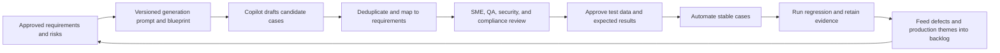
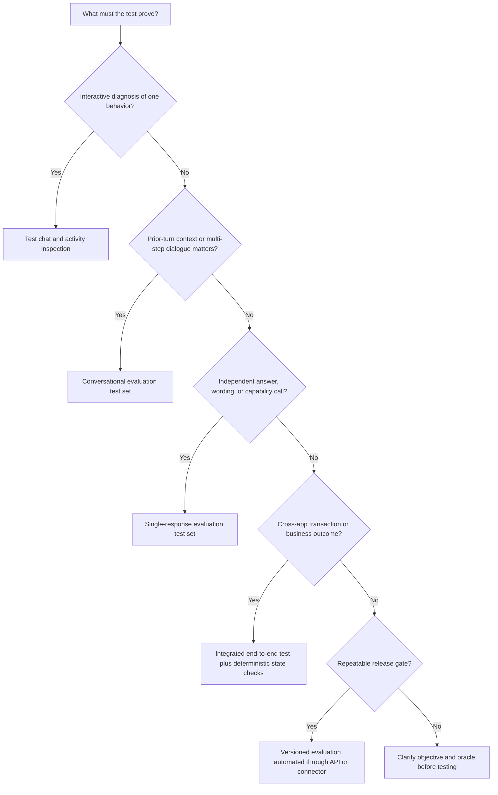
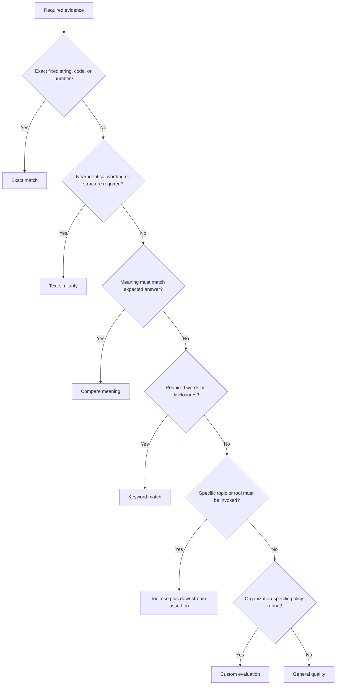
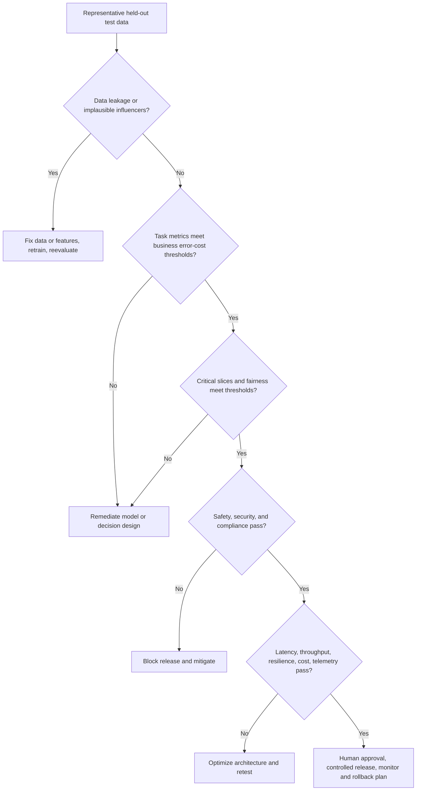
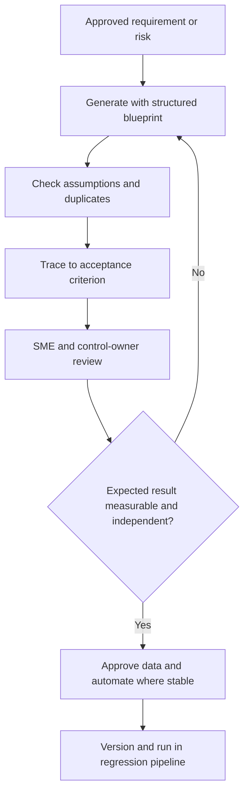

# Day 12: D3.2 Testing AI-Powered Business Solutions
**Date**: 2026-08-23
**Domain**: Deploy AI-powered business solutions (40-45%)
**Subtopics**: agent testing process and metrics; custom model validation; Copilot prompt validation; multi-app Dynamics 365 end-to-end testing; Copilot-assisted test-case strategy
**Estimated study time**: 2 hrs
**Practice set**: Exactly 10 new Domain 3 questions (`q111`-`q120`)
---
## TL;DR (60-second skim)
- Start with business outcomes, risks, representative users and data, measurable thresholds, owners, and release or rollback rules. Do not start by collecting arbitrary prompts.
- Use both Copilot Studio **test chat** for interactive debugging and **agent evaluation** for repeatable, scored regression evidence.
- Choose **single-response** evaluation for independent questions or specific tool and wording checks; choose **conversational** evaluation for context retention, clarification, and multi-step tasks.
- Match the evaluator to the requirement: general quality, compare meaning, tool use, keyword match, text similarity, exact match, or a custom rubric.
- Validate custom models on representative held-out data against task-specific quality, safety, subgroup, latency, throughput, resilience, cost, and business thresholds.
- A high aggregate score is not a release decision. Inspect false-positive and false-negative costs, leakage, overfitting, slices, and failure modes.
- Validate prompts as versioned components: goal, context, instructions, constraints, examples when useful, varied test inputs, measurable criteria, and regression comparison.
- Test multi-app Dynamics 365 solutions as complete business processes with realistic migrated data, identities, handoffs, timing, exceptions, compensating actions, and downstream outcomes.
- Copilot can draft and expand test cases, but requirements, risks, real-user evidence, traceability, SME review, and approved regression gates remain authoritative.
---
## Learning Objectives
After this session, you should be able to:
1. recommend a structured and repeatable process for testing conversational, autonomous, and tool-using agents;
2. select balanced metrics and turn them into explicit entry, exit, release, and rollback gates;
3. choose between Copilot Studio test chat, single-response evaluation, conversational evaluation, and automated evaluation;
4. select an evaluation method that matches the behavior being tested;
5. create business-specific validation criteria for custom predictive and generative models;
6. identify target leakage, overfitting, weak aggregate metrics, and unrepresentative test data;
7. validate Copilot prompts across varied inputs, users, formats, safety conditions, and repeated runs;
8. design end-to-end scenarios spanning multiple Dynamics 365 apps and integrations;
9. use Copilot to generate test cases without surrendering traceability, governance, or human judgment;
10. recognize the decision boundaries and distractors tested by `q111` through `q120`.
These objectives map directly to AB-100 D3.2:
- recommend the process and metrics to test agents;
- create validation criteria for custom AI models;
- validate effective Copilot prompt best practices;
- design end-to-end test scenarios for AI solutions using multiple Dynamics 365 apps;
- build a strategy for creating test cases by using Copilot.
---
## Key Concepts
### 1. Testing AI is evidence-based risk management
Traditional software usually has deterministic assertions: a given input should produce a specific output. Generative AI is probabilistic, so a useful response can vary in wording and sometimes in structure.
That does not make testing optional. It changes the evidence model.
A defensible test strategy combines:
- deterministic checks for permissions, tool calls, schemas, calculations, state transitions, and side effects;
- semantic evaluation for relevance, completeness, groundedness, and meaning;
- safety and compliance checks for prohibited content, data disclosure, policy violations, and unauthorized actions;
- operational checks for latency, throughput, availability, retries, timeouts, and recovery;
- human review for nuanced, high-impact, regulated, or ambiguous cases;
- business-outcome checks for task completion, resolution, cycle time, error reduction, or avoided risk.
The central question is not, "Did the model produce text?" It is, "Did the complete solution produce an acceptable business outcome within defined risk, quality, security, and operational boundaries?"
### 2. Establish the testing objective before selecting tools
Microsoft's AB-100 training guidance starts with the testing objective. Define:
- the intended business outcome;
- the decisions or actions the agent may perform;
- the users, roles, channels, and locales in scope;
- the highest-impact failure modes;
- the data and knowledge boundaries;
- measurable acceptance thresholds;
- who executes tests, reviews AI behavior, accepts residual risk, and approves release.
A complete test plan records:
| Element | Required content |
| --- | --- |
| Scope | features, prompts, topics, tools, workflows, channels, integrations, and exclusions |
| Test data | representative normal, boundary, failure, adversarial, multilingual, and permission-sensitive inputs |
| Roles | test owner, business SME, security or compliance reviewer, defect owner, release approver |
| Environment | version, model or deployment, prompts, knowledge snapshot, connector configuration, identities |
| Oracle | expected result, acceptable semantic range, invariant, or human rubric |
| Threshold | pass score, maximum failure rate, latency percentile, safety tolerance, business target |
| Evidence | transcript, activity map, trace, output, downstream record, audit event, and run metadata |
| Decision | pass, conditional pass, remediate, rollback, or block release |
Define the baseline and thresholds before observing results. Choosing thresholds after seeing a favored version encourages confirmation bias.
### 3. Layer the lifecycle and select balanced metrics
Use progressive testing: component or unit, functional, scenario, integration or process, end-to-end, safety and security, performance, regression, manual business UAT, and continuing production evaluation. AI evaluation complements these layers; it does not replace them.
Measure quality (accuracy, relevance, completeness, groundedness, consistency, abstention), task and business outcomes (completion, escalation, resolution, transaction correctness, cycle time, user satisfaction), operations (p95 or p99 latency, throughput, concurrency, errors, retries, tool success, resilience, cost), and governance (harmful output, disclosure, unauthorized action, guardrail behavior, auditability, and subgroup results). Retain counts, denominators, cohorts, and versions.
### 4. Turn metrics into release gates
A metric becomes a useful control only when paired with context and a decision.
Example gate:
| Dimension | Example acceptance rule |
| --- | --- |
| Task completion | at least the agreed rate on the critical-path suite |
| Groundedness | meets threshold overall and for regulated scenarios |
| High-severity safety | zero known critical violations in the release set |
| Authorization | zero successful cross-role or cross-record access attempts |
| Tool reliability | meets threshold under normal and peak conditions |
| Latency | p95 meets the workflow service objective |
| Business result | downstream records and approvals match expected state |
| Regression | no unacceptable drop from the approved baseline |
Exact numbers must come from the organization's risk tolerance and business requirements. The sample thresholds in a Learn module illustrate structure; they are not universal Microsoft release standards.
Define a rollback trigger before deployment, such as a critical safety failure, unauthorized transaction, or sustained breach of a quality or operational threshold.
### 5. Copilot Studio test chat versus agent evaluation
Use both because they answer different questions.
| Capability | Test chat | Agent evaluation |
| --- | --- | --- |
| Best for | interactive exploration and debugging | repeatable, scalable scoring |
| Maker feedback | immediate conversational behavior | aggregate and case-level results |
| Debug detail | topic path, variables, activity behavior | response, score, transcript, activity map, resources used |
| Regression evidence | weak if performed informally | strong when test sets and criteria are versioned |
| Automation | primarily interactive | UI, Power Platform REST APIs, or connectors and flows |
| Release use | diagnose and refine | compare versions and enforce gates |
Microsoft explicitly recommends using both for a full view of agent quality and behavior.
Agent evaluation measures correctness and performance. It does **not** replace responsible AI reviews or content safety filters. An agent can pass its quality tests and still produce an inappropriate or unsafe response outside the tested set.
### 6. Single-response versus conversational evaluation
#### Single-response test sets
Use when each test is an independent question.
Best for:
- factual or grounded question answering;
- verifying a specific topic or tool is selected;
- comparing one response to an expected meaning;
- testing required wording, keywords, codes, or fixed phrases;
- broad question coverage.
Current Microsoft Learn limits and behaviors:
- up to **100 test cases** in a single-response test set;
- cases can be created manually, imported from CSV or text, or generated with AI;
- imported questions can be up to **1,000 characters**, including spaces;
- test results remain available in Copilot Studio for **89 days**; export CSV for longer retention.
#### Conversational test sets
Use when later turns depend on earlier turns.
Best for:
- maintaining conversational context;
- asking appropriate clarifying questions;
- collecting missing information;
- resolving ambiguity;
- completing multi-step tasks;
- preserving constraints throughout a conversation.
Current Microsoft Learn states that a conversational test set can contain up to **20 test cases**.
Exam pattern: if the requirement says "retain context," "ask a follow-up," or "complete a multi-step conversation," choose conversational evaluation. If it asks about one independent answer, exact wording, or one expected capability call, choose single-response evaluation.
### 7. Choose the evaluation method by what must be proven
| Copilot Studio method | What it measures | Best use | Common trap |
| --- | --- | --- | --- |
| General quality | relevance, groundedness, completeness, and abstention | open-ended grounded answers without one exact wording | treating it as a safety certification |
| Compare meaning | semantic alignment with an expected answer | many phrasings can express the same correct intent | confusing meaning with exact text |
| Tool use | whether all or any expected tools or topics were used | routing and capability-selection checks | assuming a successful call proves the business result |
| Keyword match | presence of any or all required words or phrases | mandatory terms or disclosures | assuming keywords prove semantic correctness |
| Text similarity | closeness of wording and sentence structure | near-template language, such as controlled legal wording | using it when only meaning matters |
| Exact match | character-for-character equality | short codes, numbers, or fixed phrases | using it for long generative responses |
| Custom | organization-defined instructions and pass/fail labels | compliance, policy, domain, or style rubrics | vague labels without observable definitions |
General quality uses an LLM to assess relevance, groundedness, completeness, and abstention. A response must meet all key criteria to be considered high quality.
For custom methods, make evaluation instructions goal oriented and labels mutually understandable. A label such as `Compliant` needs a concise description of the attributes that qualify.
### 8. Build representative test sets
Coverage should be risk weighted, not merely large. Include common workflows, severe rare failures, valid and invalid inputs, ambiguity, multilingual and permission-sensitive cases, stale or conflicting knowledge, dependency failures, retries, duplicates, long conversations, correct abstentions, false refusals, and safely de-identified production cases.
Keep development cases for iteration, validation cases for model or prompt selection, a held-out test set for final comparison, and sampled production cases for drift. Repeatedly tuning against the held-out set destroys its independence.
### 9. Custom AI model validation criteria
Custom model validation should cover five dimensions.
#### Quality and task fitness
For predictive models, choose metrics based on the decision:
- classification: precision, recall, F1, confusion matrix, class-specific error rates, and calibration;
- numerical prediction: error measures and goodness of fit such as R-squared where supported;
- ranking or retrieval: retrieval quality and downstream answer quality;
- generative output: correctness, relevance, coherence, fluency, completeness, groundedness, and task-specific criteria.
The cost of errors determines the priority. In fraud or claims screening, a false negative can be much more expensive than a false positive. In an automated denial workflow, false positives can create unfair customer harm. State both error costs explicitly.
#### Safety, compliance, and fairness
Validate:
- harmful and prohibited content;
- sensitive-data exposure;
- role-based access and DLP behavior;
- prompt injection and indirect prompt injection;
- auditability and traceability;
- subgroup performance and disparate impact;
- human review for consequential decisions;
- grounding in authorized sources.
#### Operational fitness
Validate latency percentiles, throughput, concurrency, resilience, dependency failure, retries, scaling, telemetry, and cost per successful business outcome.
#### Business fitness
Confirm that model-assisted decisions improve the intended process without unacceptable side effects. Examples include reduced handling time with stable quality, improved prioritization without subgroup harm, or fewer manual touches without unauthorized automation.
#### Lifecycle fitness
Record model, data, prompt, evaluator, and configuration versions. Establish drift indicators, reevaluation cadence, owner, escalation path, and rollback rule.
### 10. AI Builder prediction-model validation lessons
Microsoft Learn states that AI Builder separates data into training and testing datasets, applies the trained model to the test dataset, and calculates performance from those predictions.
Important interpretation rules:
- The grade helps evaluation, but the organization decides readiness based on its needs.
- Accuracy must be interpreted relative to the historical class distribution and baseline.
- Near-perfect performance can indicate overfitting or a column directly correlated with the outcome.
- A field populated only after the outcome is known is target leakage and must not be a predictor.
- Review top influencers to see whether the model relies on plausible business signals.
- Use correctly labeled data with a realistic distribution.
- Remove irrelevant, misleading, outcome-correlated, or nearly empty columns.
- Retrain and reevaluate after data or feature changes.
Do not equate a platform grade of A with automatic production approval. A model can score well while failing a critical subgroup, safety, latency, or business threshold.
### 11. Foundry evaluators and evaluation levels
Microsoft Foundry provides built-in evaluators for quality, safety, reliability, RAG, text similarity, and agent behavior, plus custom evaluators for business-specific logic. Combine evaluators because no single score proves correctness, safety, value, and reliability. Use turn-level evaluation for one query-response interaction and conversation-level evaluation for full interactions or multi-step task outcomes. Calibrate model-based graders with reviewed examples.
### 12. Validate effective Copilot prompts
Treat a prompt as a versioned software component with an input contract and output contract.
Microsoft's recommended qualities are:
- clear and concise;
- specific;
- contextual;
- relevant.
A strong enterprise prompt normally includes:
1. **Goal**: the intended outcome or transformation.
2. **Context**: approved background, source material, role, and business situation.
3. **Instructions**: ordered actions and reasoning boundaries.
4. **Constraints**: format, length, tone, exclusions, allowed sources, and escalation behavior.
5. **Examples**: concise examples only when they reduce ambiguity.
6. **Output contract**: required fields, schema, citations, or measurable structure.
Use action verbs such as summarize, compare, classify, extract, evaluate, or rewrite. Split confusing multi-task prompts into modular instructions.
### 13. Prompt validation and batch testing
Define a good output first; verify grounding and permissions; state format, length, tone, audience, inclusions, exclusions, and refusal behavior; test normal, edge, long, malformed, adversarial, and permission-sensitive inputs; repeat selected inputs for variability; compare variants on the same frozen dataset and evaluator configuration; review failure categories; obtain cross-functional approval; and version every dependency and result.
Useful metrics include accuracy, consistency, relevance, format compliance, tone alignment, re-prompt rate, clarification rate, unsupported-claim rate, refusal quality, latency, and cost.
Copilot Studio batch testing for prompts is documented as a **production-ready preview** as of the current Learn page. Preview status still means the documentation and capability can change and may have constrained support.
The test hub supports a systematic cycle:
- upload or generate a diverse test dataset;
- define evaluation criteria and a passing score;
- execute the prompt over the dataset;
- inspect accuracy and case-level pass or fail reasons;
- compare run history to identify trends or regressions;
- review and adjust automatic evaluations to match organizational needs.
A single successful playground result is not adequate regression evidence. Use the same representative dataset for fair A/B comparisons, change one controlled variable where possible, and inspect regressions in important slices.
### 14. Design multi-app Dynamics 365 end-to-end scenarios
Start from the end-to-end business outcome, not an app inventory.
Examples:
- **order to cash**: Sales to Finance to Supply Chain Management, with Customer Service handling exceptions;
- **case to resolution**: Customer Service to Field Service, with scheduling, work completion, customer communication, and closure;
- **lead to revenue**: marketing or sales qualification through order, fulfillment, invoice, and reporting.
For each scenario specify:
- trigger event and initiating persona;
- preconditions and realistic data setup;
- exact app and system sequence;
- identities, roles, privileges, and segregation of duties;
- entity mappings and correlation identifiers;
- synchronization direction, timing, transformations, and duplicate handling;
- AI inputs, retrieved sources, recommendation or action, and confidence or escalation rule;
- human approvals for consequential steps;
- expected state after every handoff;
- final business outcome and reconciliation checks;
- exception, retry, timeout, partial-failure, and compensating paths;
- telemetry and evidence required to diagnose failure.
### 15. Dynamics testing progression and automation
Unit tests cover components; functional tests map configuration to requirements; process tests connect functions and personas; end-to-end tests validate the integrated operation; UAT obtains manual business sign-off; regression tests guard behavior after change; performance tests validate load; mock cutover rehearses deployment.
Dynamics guidance requires realistic migrated data and the latest solution in an integrated environment, with multiple end-to-end cycles. Role security and negative paths are part of process testing. Automate stable critical regressions first. Microsoft documents Playwright for browser-based Dynamics 365 Customer Service flows, but a complete strategy can also use API, integration, Power Platform, agent-evaluation, deterministic state, and manual UAT checks.
### 16. Use Copilot to create test cases responsibly
Copilot is useful for:
- translating requirements or code into structured candidate tests;
- suggesting boundaries and edge cases;
- producing test-data variations;
- identifying missing negative paths;
- converting a business process into a consistent template;
- proposing updates when requirements change.
Copilot is not the source of truth. It can invent requirements, misunderstand business rules, omit rare risks, duplicate tests, expose sensitive input, or write an expected result that merely repeats the implementation's defect.
A governed Copilot-assisted workflow is:

### 17. Use a consistent test-case blueprint
Each generated case needs a stable ID, requirement or risk link, purpose, preconditions, inputs, steps, measurable expected results, edge variations, dependencies, evidence, owner, and approval state. Give Copilot the requirements, rules, risk catalogue, allowed data, output schema, minimum negative coverage, and exclusions. Require it to list assumptions separately for review.
### 18. AI-generated Copilot Studio evaluation cases: a crucial limitation
Copilot Studio can generate test cases from the agent's knowledge sources or topics. Supported source types documented for this path include text, Word, Excel, PDF, and individual SharePoint files. SharePoint folders are not supported, and files can be up to 5 MB for question generation.
This method is strong for checking how the agent uses content it already has. It is **not good for finding information gaps**, because the generator is bounded by the same existing knowledge and topics.
Therefore supplement generated cases with:
- requirement-derived tests;
- risk- and threat-derived tests;
- missing-information and out-of-scope questions;
- negative, boundary, adversarial, and authorization tests;
- real-user questions or analytics themes after privacy review;
- independently authored expected results;
- human exploratory testing.
Generation can also fail when candidate questions conflict with content-moderation settings, sensitive or restricted source content, or instructions that cause flagged material. Do not weaken moderation reflexively; first inspect whether the source, instruction, or intended test is appropriate and govern any change.
---
## Decision Frameworks
### Which agent-testing surface should you choose?

### Which evaluator should you choose?

### Is a custom model ready?

### How should Copilot-generated tests enter the suite?

---
## Comparisons
### Deterministic assertion versus semantic evaluator versus human review
| Method | Best for | Weakness |
| --- | --- | --- |
| Deterministic assertion | exact records, permissions, calculations, schema, status, tool side effects | cannot judge nuanced natural-language usefulness alone |
| Semantic or model-based evaluator | relevance, groundedness, completeness, meaning, flexible wording | probabilistic and requires calibration |
| Human review | nuance, policy interpretation, high-impact or ambiguous cases | expensive, slower, and can vary between reviewers |
Use them together. A tool-use evaluator can show that the correct action was selected, while a deterministic assertion confirms that the correct authorized record changed, and a human reviewer validates a consequential exception.
### Accuracy versus precision versus recall
| Metric | Question answered | Typical business concern |
| --- | --- | --- |
| Accuracy | What fraction of all predictions was correct? | useful only when class distribution and error costs make it meaningful |
| Precision | Of predicted positives, how many were truly positive? | reduce costly false alarms or harmful positive actions |
| Recall | Of actual positives, how many were found? | reduce missed fraud, risk, defect, or urgent cases |
| F1 | How well are precision and recall balanced? | one summary when both error types matter |
For imbalanced data, aggregate accuracy can look excellent while the rare critical class is routinely missed.
### Component, process, end-to-end, and UAT
| Scope | Main question |
| --- | --- |
| Component | Does this prompt, tool, rule, or workflow work in isolation? |
| Process | Do connected functions and role handoffs support one business flow? |
| End-to-end | Does the whole integrated operation produce the intended outcome? |
| UAT | Do trained business users accept the solution for real work? |
Passing component tests does not imply that synchronization timing, identity propagation, mappings, or cross-app recovery work.
### Human-authored versus AI-generated test cases
| Dimension | Human-authored | AI-generated |
| --- | --- | --- |
| Strength | domain nuance, known risks, authoritative expected outcomes | speed, breadth, variations, template consistency |
| Risk | omissions, limited scale, author bias | hallucinated rules, duplicated cases, missing rare risks, circular validation |
| Best practice | preserve SME ownership | use as drafts under a governed review pipeline |
---
## Important Details for Exam
- Copilot Studio agent evaluation is a structured, repeatable complement to test chat; use both.
- Evaluations can be run in the UI and automated through Power Platform REST APIs or connectors and flows.
- Agent evaluation measures correctness and performance, not ethics or safety; retain Responsible AI review and content safety controls.
- A test case can be one question or an entire conversation.
- Single-response test sets support up to 100 cases.
- Conversational test sets support up to 20 cases.
- Copilot Studio evaluation results are available in-product for 89 days; export CSV for longer retention.
- General quality considers relevance, groundedness, completeness, and abstention.
- Compare meaning allows semantically equivalent wording and has a configurable pass threshold; the documented default pass score is 50.
- Tool use checks expected topic or tool selection, but downstream success still needs an assertion.
- Keyword match can require any or all configured terms.
- Text similarity compares wording and structure; exact match requires character-for-character equality.
- Custom evaluation uses instructions and labels with pass or fail assignments.
- Copilot Studio prompt batch testing is currently documented as a production-ready preview.
- Prompt batch testing supports datasets, criteria, passing scores, run history, and regression comparison.
- AI Builder evaluates prediction models using a separated test dataset.
- AI Builder grades are decision support; business needs determine readiness.
- Near-perfect model performance can signal overfitting or direct outcome correlation.
- End-to-end Dynamics 365 testing uses an integrated environment, realistic migrated data, latest solution versions, and multiple cycles.
- Dynamics UAT is a manual business-user acceptance activity and a prerequisite before go-live.
- Playwright can automate browser-based Dynamics 365 Customer Service end-to-end flows; it does not eliminate other test layers.
- AI generation from existing knowledge or topics is not suitable for discovering missing information.
- Test generation supports individual SharePoint files, not SharePoint folders; source files can be up to 5 MB.
---
## Common Traps and Misconceptions
1. **"Start testing and define success afterward."** Define outcomes, risks, metrics, thresholds, and owners first.
2. **"One fast response proves the agent is ready."** Test quality, task completion, safety, reliability, cost, and business outcomes across representative cases.
3. **"Test chat is the regression suite."** It is excellent for interactive debugging; use evaluation test sets for repeatable scoring.
4. **"Automated evaluation replaces test chat."** Use both because they expose different evidence.
5. **"Every generative answer needs exact match."** Use semantic methods when wording may legitimately vary.
6. **"Tool use proves task completion."** It proves invocation; assert downstream state and authorization separately.
7. **"General quality is a safety certification."** Agent evaluation does not replace Responsible AI or content safety review.
8. **"A high aggregate model accuracy is enough."** Inspect class imbalance, error costs, slices, leakage, and operational criteria.
9. **"Near-perfect accuracy must be excellent."** It can indicate target leakage or overfitting.
10. **"Prompt quality is proven by one good sample."** Use representative batch tests, repeated runs, and frozen comparison criteria.
11. **"More prompt detail always helps."** Unnecessary verbosity and conflicting multitask instructions add noise.
12. **"Passing each Dynamics app separately proves end-to-end readiness."** Handoffs, identity, synchronization, integrations, and final state can still fail.
13. **"One final E2E cycle is efficient."** Multiple cycles leave time to fix and retest.
14. **"Synthetic demo data is enough."** Use realistic migrated patterns and production-like permissions without exposing sensitive data improperly.
15. **"Copilot-generated tests are authoritative."** They are candidate cases requiring traceability, validation, and approval.
16. **"Generate from knowledge to find missing knowledge."** That generation path is strongest for what already exists and weak for discovering gaps.
17. **"A model can grade its own implementation without independent evidence."** Calibrate evaluators and preserve independent expected outcomes and human review.
18. **"Automate everything with an LLM grader."** Prefer deterministic assertions for exact state, permissions, calculations, and side effects.
---
## Real-World Scenarios
1. **Benefits agent**: combine grounded answer quality, abstention, role access, tool selection, enrollment state, unauthorized requests, p95 latency, and user completion.
2. **Claims model**: inspect recall, precision, confusion-matrix errors, subgroup slices, calibration, error costs, and outcome leakage despite high accuracy.
3. **Executive prompt**: encode length, risk bullets, tone, and exclusions; batch test varied reports and compare versions on one dataset.
4. **Order to cash**: test Sales, Finance, Supply Chain, and Customer Service identities, mappings, timing, AI evidence, approvals, failures, final records, and reconciliation.
5. **Generated regression**: review Copilot assumptions, trace cases to requirements, approve expected results, version the suite, and preserve run history.
---
## Quick Reference Card
### Five-layer release gate
| Layer | Must answer |
| --- | --- |
| Business | Did the intended outcome occur? |
| Quality | Was the output correct, relevant, complete, grounded, and appropriately abstaining? |
| Control | Were permissions, safety, compliance, and approvals enforced? |
| Operation | Were latency, throughput, resilience, dependencies, and cost acceptable? |
| Lifecycle | Are versions, evidence, monitoring, drift, owners, and rollback defined? |
### Scenario recipe
`Objective -> risk -> persona -> preconditions -> inputs -> steps -> AI behavior -> app handoffs -> expected state -> negative path -> metrics -> evidence -> owner`
### Evaluation-method memory aid
- Flexible answer quality: **General quality**
- Same idea, different words: **Compare meaning**
- Required capability: **Tool use**
- Required phrase: **Keyword match**
- Similar construction: **Text similarity**
- Fixed literal: **Exact match**
- Business policy: **Custom**
### Compact readiness checklist
- [ ] Prompt goal, context, sources, instructions, output contract, safety behavior, representative inputs, thresholds, versions, and reviewers are explicit.
- [ ] E2E tests cover the complete business outcome, integrated environment, realistic data, identities, mappings, timing, AI behavior, exceptions, deterministic state, load, multiple cycles, and UAT.
---
## Hands-On Lab (Optional)
### Design one release-ready case
Choose a cross-app process such as case to resolution.
1. Write one business outcome and its highest-impact failure.
2. Define two personas with different permissions.
3. List the Customer Service and Field Service handoff states.
4. Add one AI summary or recommendation and its grounding requirement.
5. Add a connector timeout and duplicate-event path.
6. Define one semantic evaluator and three deterministic assertions.
7. Set quality, safety, latency, and final-state thresholds.
8. Ask Copilot to generate three variations using the test-case blueprint.
9. Mark every generated assumption and review it against the requirement.
10. Select only approved cases for the regression suite.
The learning goal is to separate AI-assisted drafting from authoritative acceptance evidence.
---
## Quiz-Alignment Coverage
This table maps every newly assigned Day 12 question to lesson coverage without exposing answer choices or explanations.
| Question | Tested concept or decision boundary | Exam trap covered in this lesson |
| --- | --- | --- |
| `q111` | test objectives, scope, roles, representative data, balanced metrics, thresholds, retained evidence | running prompts before defining success; optimizing one metric |
| `q112` | test chat versus repeatable agent evaluation; API or connector automation for CI/CD | treating manual chat screenshots as regression evidence |
| `q113` | single-response versus conversational evaluation | ignoring context dependence and multi-step clarification |
| `q114` | compare meaning, tool use, exact match, general quality, and safety-review boundaries | using exact match for flexible prose; treating quality evaluation as safety certification |
| `q115` | held-out data, business error costs, subgroup, safety, latency, and reliability gates | approving on aggregate accuracy alone |
| `q116` | AI Builder test split, outcome-correlated fields, target leakage, and overfitting | assuming near-perfect performance guarantees generalization |
| `q117` | prompt structure, representative batch tests, evaluation criteria, and run comparison | judging one good output; removing useful constraints |
| `q118` | integrated multi-app E2E scope, realistic data, roles, handoffs, timing, exceptions, outcomes, multiple cycles | inferring end-to-end readiness from isolated app tests |
| `q119` | limits of AI generation from existing agent knowledge and topics | expecting the same source boundary to reveal missing information |
| `q120` | versioned test blueprint, requirement and risk traceability, SME review, measurable results, CI/CD regression | accepting generated tests without governance or history |
Coverage check: all concepts, products, capabilities, decision boundaries, and traps tested by `q111` through `q120` are explained above.
---
## Cross-Domain Quiz Question Refreshers
There are **no cross-domain questions in the assigned Day 12 set**. All ten questions test AB-100 Domain 3.2.
| Concept | Key fact | Trap |
| --- | --- | --- |
| Cross-domain carryover | None among `q111`-`q120` | Diluting today's study time with unrelated future-domain material |
The optional `--carryover 3` quiz mode adds three prior-session D3.1 questions for spaced repetition; those are not part of the newly assigned Day 12 set.
---
## Related Questions in questions.json
- `q111`: structured agent-testing process and balanced release metrics.
- `q112`: Copilot Studio test chat, agent evaluation, and CI/CD automation.
- `q113`: conversational versus single-response evaluation selection.
- `q114`: evaluation-method selection and safety-review boundaries.
- `q115`: business-specific custom-model validation criteria.
- `q116`: held-out AI Builder evaluation, leakage, and overfitting.
- `q117`: effective prompt structure and batch regression testing.
- `q118`: multi-app Dynamics 365 end-to-end scenario design.
- `q119`: coverage limits of AI-generated test cases from existing knowledge.
- `q120`: governed Copilot-assisted test generation and maintenance.
Quiz command for the complete Day 12 session with three prior-session spaced-repetition questions:
```powershell
python quiz_runner.py questions.json --day-lock 12 --carryover 3 --shuffle --open-images --web --port 8765
```
Quiz command for exactly the ten newly assigned Day 12 questions:
```powershell
python quiz_runner.py questions.json --ids q111,q112,q113,q114,q115,q116,q117,q118,q119,q120 --shuffle --open-images --web --port 8765
```
---
## Sources (verified during this session)
- [Manage testing AI-powered business solutions](https://learn.microsoft.com/en-us/training/modules/manage-testing-ai-powered-business-solutions/)
- [Recommend process metrics for testing AI agents](https://learn.microsoft.com/en-us/training/modules/manage-testing-ai-powered-business-solutions/2-recommend-process-metrics-test-agents)
- [Create validation criteria for custom AI models](https://learn.microsoft.com/en-us/training/modules/manage-testing-ai-powered-business-solutions/3-create-validation-criteria-custom-ai-models)
- [Validate effective Copilot prompt best practices](https://learn.microsoft.com/en-us/training/modules/manage-testing-ai-powered-business-solutions/4-validate-effective-copilot-prompt-best-practices)
- [Design end-to-end test scenarios for AI solutions using multiple Dynamics 365 apps](https://learn.microsoft.com/en-us/training/modules/manage-testing-ai-powered-business-solutions/5-design-test-scenarios-ai-solutions-multiple-dynamics-365-apps)
- [Build a strategy for creating test cases using Copilot](https://learn.microsoft.com/en-us/training/modules/manage-testing-ai-powered-business-solutions/6-build-strategy-creating-test-cases-using-copilot)
- [About agent evaluation in Copilot Studio](https://learn.microsoft.com/en-us/microsoft-copilot-studio/analytics-agent-evaluation-intro)
- [Choose Copilot Studio evaluation methods](https://learn.microsoft.com/en-us/microsoft-copilot-studio/analytics-agent-evaluation-overview)
- [Create a single-response test set](https://learn.microsoft.com/en-us/microsoft-copilot-studio/analytics-agent-evaluation-create)
- [Create a conversational test set](https://learn.microsoft.com/en-us/microsoft-copilot-studio/analytics-agent-evaluation-multi-turn)
- [Create and test a prompt](https://learn.microsoft.com/en-us/microsoft-copilot-studio/create-custom-prompt)
- [Batch testing for prompts](https://learn.microsoft.com/en-us/microsoft-copilot-studio/batch-testing-prompts)
- [Built-in evaluators in Microsoft Foundry](https://learn.microsoft.com/en-us/azure/foundry/concepts/built-in-evaluators)
- [AI Builder prediction model performance](https://learn.microsoft.com/en-us/ai-builder/prediction-performance)
- [Dynamics 365 testing types](https://learn.microsoft.com/en-us/dynamics365/guidance/implementation-guide/testing-strategy-test-types)
- [Set up test automation with Playwright](https://learn.microsoft.com/en-us/dynamics365/guidance/resources/test-automation-setup)
Verified against rendered Microsoft Learn pages on 2026-08-23. Product status and limits can change; recheck linked pages near the exam date.
---
## Notes (your own words - fill this in after studying)
- My release-gate definition:
- The evaluator choices I need to remember:
- The custom-model failure mode I am most likely to miss:
- My multi-app E2E scenario:
- How I will review Copilot-generated tests:
