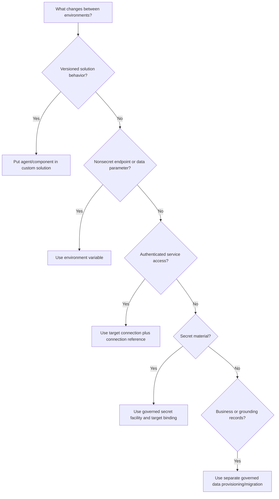

# Day 13: D3.3 ALM (Data + Copilot Studio)

**Date**: 2026-08-24
**Domain**: Deploy AI-powered business solutions (40-45%)
**Subtopics**: ALM for data used in AI models and agents; ALM for Copilot Studio agents, connectors, and actions
**Estimated study time**: 1 hr

---

## TL;DR (60-second skim)

- Use Power Platform solutions as the versioned carrier for Copilot Studio agents and their solution-aware components.
- Keep environment-specific endpoints and data-source parameters in environment variables, not hard-coded in agents, prompts, apps, or flows.
- Treat credentials as target-owned secrets or authenticated connections; never transport a maker's credential as configuration.
- A connection reference is portable metadata that points to a target-environment connection for a connector.
- Add newly created topics, flows, tools, environment variables, and required objects to the source unmanaged solution before every export.
- Respect dependency order: a custom connector must exist before importing the connection reference and agent solution that depend on it.
- Diagnose import failures from the import log, repair packaging in the source solution, and redeploy the governed artifact.
- Import success is not release completion: validate target values and connections, configure authentication, test, publish, and then share or enable channels.

---

## Learning Objectives

By the end of this session, you should be able to:

1. Design portable configuration for grounding and AI data sources across development, test, and production.
2. Distinguish environment variables, connections, connection references, connectors, and secrets.
3. Explain environment variable definition, default value, and current value behavior during managed solution servicing.
4. Package a Copilot Studio agent and all dependent topics, flows, connectors, actions, and variables in a custom solution.
5. Select the correct deployment order for interdependent agent components.
6. Use Power Platform pipelines to govern and prevalidate deployment.
7. Diagnose failed imports without creating unmanaged production drift.
8. Identify the post-import actions required before an agent is released to users.

---

## Key Concepts

### 1. ALM mental model: artifact, configuration, identity, and data

A deployable AI business solution has four different concerns. Do not collapse them into one package.

| Concern                   | Examples                                                                       | ALM treatment                                                                                                 |
| ------------------------- | ------------------------------------------------------------------------------ | ------------------------------------------------------------------------------------------------------------- |
| Versioned artifact        | Agent definition, instructions, topics, flows, connector definitions           | Develop in a source unmanaged solution; export and promote a governed solution artifact                       |
| Environment configuration | SharePoint site/list, endpoint URL, feature flag, model or knowledge reference | Use solution environment variables and supply the target value during deployment                              |
| Identity and secrets      | OAuth tokens, connector credentials, passwords, API secrets                    | Create or authorize in the target; bind through connections/secret facilities, not ordinary exported defaults |
| Business/grounding data   | Dataverse rows, SharePoint content, indexed documents                          | Provision, migrate, seed, or govern separately; verify schema, permissions, quality, and residency            |

A Power Platform solution transports customizations and configuration components. It does not generally transport Dataverse table rows. A production release therefore needs both solution deployment and a separately governed data/configuration plan.

### 2. Environment variables for AI data and grounding

Environment variables separate a parameter from every component that consumes it. The same agent prompt, canvas app, and flow can resolve one shared variable while development, test, and production provide different values.

Typical AI ALM uses:

- SharePoint site and list parameters for grounding or governed content access.
- Knowledge endpoint, model endpoint, index name, deployment name, or service URL.
- Nonsecret feature flags and environment labels.
- JSON configuration when a structured, nonsecret value is appropriate.

Benefits:

- No component edit is required during promotion.
- One variable can be reused by different solution component types.
- Target values can be entered during solution import or pipeline deployment.
- Configuration changes are centralized and less prone to drift.
- Definitions can be versioned with the solution while target values remain environment-specific.

SharePoint detail: a valid Microsoft Entra connection and separate site/list environment-variable parameters are distinct concerns. Corresponding list metadata must be compatible across environments; matching display names alone may not fix incompatible internal metadata.

Do not use a normal text environment variable as a credential store. Power Platform supports a Secret data type integrated with Azure Key Vault, but the core exam principle is broader: package and transport secrets separately from components and ordinary configuration.

### 3. Definition, default value, and current value

| Element       | Ownership/purpose                                        | Servicing behavior                                                           |
| ------------- | -------------------------------------------------------- | ---------------------------------------------------------------------------- |
| Definition    | Publisher-owned metadata: schema name, type, description | Travels as a solution component and can be serviced                          |
| Default value | Publisher fallback; optional                             | Used only when no current value exists; can be updated with the definition   |
| Current value | Environment/customer-specific value                      | Takes precedence over default and can remain separate from publisher updates |

This separation lets a publisher update a managed solution's variable definition or default without overwriting a customer's production current value. Before export, remove source current values that must not travel. During import or pipeline deployment, provide or confirm target values.

Resolution rule: current value first; otherwise default value; otherwise the deployment must supply a value or dependent components risk failure.

### 4. Connector, connection, and connection reference

These names are deliberately similar and are frequent exam distractors.

| Object               | What it is                                                           | Portable?                                                                     | Contains authentication?            |
| -------------------- | -------------------------------------------------------------------- | ----------------------------------------------------------------------------- | ----------------------------------- |
| Connector            | Proxy/wrapper and operation contract for an API                      | Standard connector exists in platform; custom connector can be solution-aware | No user credential                  |
| Connection           | Stored authentication credential/session for a connector             | Target-owned, not a development credential to ship                            | Yes                                 |
| Connection reference | Solution component pointing to a connection for a specific connector | Yes                                                                           | No; target binds it to a connection |

A solution-aware flow binds its trigger/actions to connection references rather than directly to a maker's development connection. During import, each reference is mapped to an appropriate target connection. The production connection must have the permissions required by the flow and agent action.

A connection reference does not contain the custom connector implementation. Therefore a target must receive the custom connector before a solution that imports a reference depending on it.

### 5. Copilot Studio agents as solution components

The standard promotion path is:

1. Author in a development environment using an unmanaged custom solution.
2. Add the agent to the solution.
3. Add its topics, flows/actions, tools, environment variables, connection references, and required objects.
4. Validate dependencies and target configuration.
5. Export a governed artifact, normally managed for downstream test/UAT/production.
6. Import or deploy it sequentially through environments.
7. Resolve target values, connections, authentication, permissions, and channel configuration.
8. Test, publish, then share or make the intended channel available.

Unmanaged solutions are the development source. Managed solutions are the normal downstream deployment artifact. Avoid editing managed components in production: unmanaged target customizations create layers and drift, complicate upgrades, and make the source artifact cease to describe production.

### 6. New components are not automatically guaranteed to travel

After an agent is initially added to a solution, later additions can exist in the source environment without being present in that solution's export. Examples include:

- Topics and entities.
- Agent flows and Power Automate flow actions.
- Tools, connectors, knowledge sources, child agents, and MCP servers.
- Environment variables and connection references.

Before each export, inspect the source unmanaged solution and use **Add required objects** where appropriate. For flows and environment variables, add their required objects too. Microsoft documents solution-aware authoring and preferred solutions as ways to keep new component edits in the intended solution context, but dependency review remains a release responsibility.

### 7. Power Platform pipelines

Pipelines provide governed, sequential solution deployment with centralized safeguards, history, approvals, and prevalidation.

Before deployment begins, pipelines can:

- Validate the solution against the target environment.
- Detect missing dependencies and guide remediation.
- Collect and validate connections and environment variables.
- Ensure each stage receives the same exported artifact.
- Preserve deployment records and support delegated deployment identities.

Pipelines deploy solutions plus target configuration such as connections, connection references, and environment variables. They do not make all underlying business data part of the solution package.

Current platform detail: pipeline target environments are managed environments; Microsoft announced automatic enablement beginning February 2026 for targets not already enabled. Cross-tenant deployment isn't supported by Power Platform pipelines; Microsoft recommends Azure DevOps or GitHub for that scenario.

---

## Decision Frameworks

### Choose the ALM mechanism



### Release readiness gate

Proceed only when all answers are **yes**:

- Is the agent in the intended unmanaged source solution?
- Are all new topics, flows, tools, variables, references, and required objects included?
- Are custom connectors available before their dependents?
- Are target environment-variable values known and approved?
- Are target connections created, authorized, least-privileged, and mapped?
- Did dependency validation/pipeline prevalidation pass?
- Are authentication, permissions, data access, and channel settings validated in target?
- Did functional/regression testing pass on the exact artifact?
- Was the imported agent published before sharing/channel release?

---

## Deployment Sequence

| Order | Release action                                                          | Evidence/gate                                                         |
| ----: | ----------------------------------------------------------------------- | --------------------------------------------------------------------- |
|     1 | Make changes in the development environment's unmanaged custom solution | Source control/change record identifies intended release              |
|     2 | Add the agent and every new dependent object                            | Solution inventory and dependency check are complete                  |
|     3 | Remove source-only current values and secrets from the artifact         | No development endpoint, credential, or production secret is embedded |
|     4 | Export/version the solution artifact                                    | One immutable artifact is used for downstream stages                  |
|     5 | Provision prerequisite/base solutions and custom connectors             | Target dependency order is satisfied                                  |
|     6 | Deploy/import the agent solution and its connection references          | Import/pipeline validation succeeds                                   |
|     7 | Supply target variable values and bind target connections               | Endpoints, data sources, and authenticated actions resolve correctly  |
|     8 | Configure user authentication and target-specific channel details       | Sign-in and permissions work with target identities                   |
|     9 | Run smoke, action, grounding, security, and regression tests            | Release criteria pass with production-like data boundaries            |
|    10 | Publish the imported agent, then share or enable channels               | Intended users can discover and use the released version              |

---

## Comparisons

### Configuration versus authentication

| Need                                                  | Use                                                      | Do not use                                             |
| ----------------------------------------------------- | -------------------------------------------------------- | ------------------------------------------------------ |
| Different SharePoint site/list per environment        | Data-source environment variables plus valid connection  | Hard-coded production URL in components                |
| Same nonsecret endpoint used by prompt, flow, and app | One shared environment variable                          | Duplicated literals                                    |
| Different authenticated account in production         | Connection reference mapped to target connection         | Maker's test connection/credential in export           |
| API secret                                            | Governed secret mechanism and target provisioning        | Ordinary exported default/current text value           |
| Custom API operation contract                         | Custom connector in solution, imported before dependents | Connection reference as if it contained connector code |

### Import success versus release success

| Import success proves                                                    | Import success does not prove                                         |
| ------------------------------------------------------------------------ | --------------------------------------------------------------------- |
| The package was accepted and dependencies known to import were satisfied | Correct target authentication, permissions, or least privilege        |
| Components were created/updated                                          | Correct environment-variable values and data bindings                 |
| Solution operation completed                                             | Agent is published, shared, or channel-enabled                        |
| Artifact reached the environment                                         | Grounding quality, action behavior, regression, or user access passed |

---

## Failure-Diagnosis Workflow

1. Stop release promotion; do not publish a partial or uncertain import.
2. Download the solution import log. Copilot Studio/Power Platform provides XML details for failed imports.
3. Identify the missing component or dependency chain: topic, flow, environment variable, connector, reference, base solution, or required object.
4. Confirm prerequisite order, especially custom connector before connection reference/agent solution.
5. Return to the source unmanaged solution; add the missing component and required objects there.
6. Re-export/version the corrected artifact and redeploy through the same governed stages.
7. Resolve target variables and connections, then rerun import, smoke, action, and regression checks.
8. Record root cause and improve the pipeline's inventory/prevalidation gate.

Never “repair” the release by making untracked unmanaged changes directly in production. That hides the packaging defect and guarantees the next deployment is based on a false source of truth.

---

## Important Details for Exam

- Solutions are the Power Platform ALM mechanism; unmanaged is for development/source and managed is the downstream deployment best practice.
- A Power Platform solution can be up to 95 MB according to the current solution-concepts page.
- Environment-variable supported types include text, decimal, JSON, two options, data source, and secret.
- Environment-variable values are limited to 2,000 characters.
- The connection selected while defining a data-source environment variable is not stored in that variable.
- SharePoint uses a valid Microsoft Entra connection plus separate site/list parameters.
- A current environment-variable value takes precedence over the default.
- Solution-aware flows bind to connection references; the reference points to a target-owned connection.
- The identity enabling a flow needs permission to use all its connections.
- Power Platform pipelines prevalidate missing dependencies, connections, and environment variables before deployment.
- The same pipeline artifact moves through stages sequentially; it isn't re-exported per stage.
- Copilot Studio requires at least the System Customizer role for the documented agent solution import/export feature.
- Custom connectors must be imported before the connection reference with the agent solution.
- Copilot Studio calls missing required components the most common agent-solution import failure and provides an XML import log.
- User authentication must be configured again for an imported agent when required.
- An imported agent must be published before it can be shared.
- Some properties such as environment ID and channel details don't transfer; validate target-specific release configuration.

---

## Common Traps & Misconceptions

- **“Hard-code production now so deployment is deterministic.”** Determinism comes from versioned artifacts plus governed target configuration, not embedded production values.
- **“An environment variable can safely carry credentials because it is configurable.”** Ordinary configuration and secrets have different handling and ownership.
- **“Default value is the production value.”** The target current value is separate, has precedence, and can survive publisher servicing.
- **“Connection reference equals connection.”** The reference is portable metadata; the connection holds authentication in the target.
- **“The reference contains a custom connector.”** It depends on the connector; it doesn't implement it.
- **“Adding an agent once captures all future components.”** Later topics, flows, tools, and dependencies may need to be added to the source solution before export.
- **“Fix the target until it works.”** Repair the source package and redeploy to preserve traceability and repeatability.
- **“Successful import means users have the release.”** Authentication, bindings, testing, publishing, sharing, and channel availability are separate gates.
- **“Solutions move all AI data.”** Solutions move components/configuration; data provisioning and data governance need their own plan.
- **“A pipeline makes dependency design unnecessary.”** It detects and governs problems; the architect still owns correct packaging and ordering.

---

## Real-World Scenarios

1. **Grounding promotion**: Development and production use different approved SharePoint sites. Keep the agent/flow unchanged, parameterize site/list references, bind a production-authorized connection, and test target permissions.
2. **Shared AI endpoint**: A prompt, flow, and app call one environment-specific endpoint. Use one shared nonsecret environment variable and provision credentials separately to prevent drift.
3. **Agent action**: An agent invokes a solution-aware flow through a connector. Package the flow and connection reference, then bind a least-privileged production connection during deployment.
4. **Connector dependency**: A custom connector action fails during first deployment to a clean environment. Install the custom connector prerequisite before importing the solution that contains its reference and consumer.
5. **Post-import outage**: Import reports success but users cannot access the agent. Validate target bindings and authentication, run release tests, publish, then share/enable the intended channel.

---

## Quick Reference Card

**Portable**: solution components, environment-variable definitions/defaults, connection references, custom connectors, solution-aware flows.

**Target-owned**: current configuration values, authenticated connections, credentials/secrets, user/data permissions, authentication setup, channel details.

**Dependency mnemonic**: **Define -> Include -> Validate -> Prerequisites -> Import -> Bind -> Test -> Publish -> Share**.

**Failure mnemonic**: **Log -> Locate -> Repair source -> Re-export -> Redeploy -> Retest**.

### Compact retention checklist

- [ ] I can distinguish connector, connection, and connection reference.
- [ ] I can explain definition/default/current environment-variable precedence.
- [ ] I know why SharePoint site/list parameters and authentication are separate.
- [ ] I can state where new topics/flows must be added before export.
- [ ] I know the custom connector import dependency order.
- [ ] I can explain what pipeline prevalidation checks.
- [ ] I know why production edits are not a valid import repair.
- [ ] I can list post-import gates through publish and share/channel availability.

---

## Hands-On Lab (optional)

Create a paper deployment manifest for an agent with one SharePoint grounding source and one flow action:

1. List portable components: agent, topic, flow, environment-variable definitions, connection references.
2. List target-owned items: SharePoint current values, authenticated connections, permissions, authentication/channel settings.
3. Draw dependency arrows from custom connector to connection reference to flow/action to agent.
4. Write five release gates: dependency validation, target binding, authentication, regression/security test, publish/share.
5. Inject a missing-flow failure and walk through the failure-diagnosis workflow above.

No Azure or Power Platform resources are required.

---

## Cross-Domain Quiz Question Refreshers

None. All assigned Day 13 questions (q121-q130) directly test D3.3 ALM for AI data or Copilot Studio agents, connectors, and actions.

---

## Coverage Mapping to q121-q130

This table identifies the skill each item exercises without disclosing answer choices.

| Question | Coverage in this reference                                                                                                 |
| -------- | -------------------------------------------------------------------------------------------------------------------------- |
| q121     | Environment-specific SharePoint grounding parameters; portable configuration versus embedded production values/credentials |
| q122     | Reusing one environment variable across component types; separating endpoints from secrets                                 |
| q123     | Definition/default/current value precedence and managed-solution servicing behavior                                        |
| q124     | Solution-aware flow actions, connection references, and target-authenticated connections                                   |
| q125     | Pipeline prevalidation of target, dependencies, connections, and variables                                                 |
| q126     | Standard custom-solution export/import lifecycle for Copilot Studio agents                                                 |
| q127     | Adding later topics, flows, environment variables, and required objects before export                                      |
| q128     | Custom connector prerequisite and dependent connection-reference/agent import order                                        |
| q129     | Import-log diagnosis, source-package repair, governed redeployment, and drift avoidance                                    |
| q130     | Target binding/authentication validation, publish, share, and channel release gates                                        |

---

## Related Questions in questions.json

- q121-q123: AI/grounding data configuration and environment-variable lifecycle.
- q124-q125: Connection references and governed pipeline prevalidation.
- q126-q130: Copilot Studio solution packaging, dependency order, diagnosis, and post-import release.

Quiz command:

```powershell
python quiz_runner.py questions.json --day-lock 13 --carryover 0 --shuffle --web --port 8765
```

---

## Sources (verified during this session)

- [Environment variables for Power Platform overview](https://learn.microsoft.com/en-us/power-apps/maker/data-platform/environmentvariables)
- [Use a connection reference in a solution with Microsoft Dataverse](https://learn.microsoft.com/en-us/power-apps/maker/data-platform/create-connection-reference)
- [Pipelines in Power Platform](https://learn.microsoft.com/en-us/power-platform/alm/pipelines)
- [Export and import agents using solutions](https://learn.microsoft.com/en-us/microsoft-copilot-studio/authoring-solutions-import-export)
- [Agents missing components in a solution](https://learn.microsoft.com/en-us/troubleshoot/power-platform/copilot-studio/lifecycle-management/agents-solution-mapping)
- [Solution concepts](https://learn.microsoft.com/en-us/power-platform/alm/solution-concepts-alm)

---

## Notes (your own words - fill this in after studying)

-
-
-
