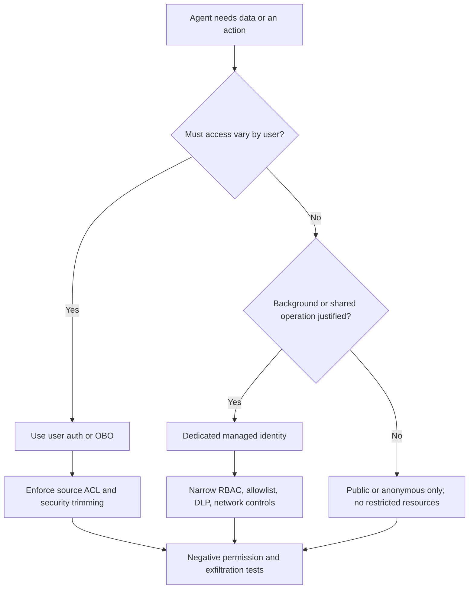

# Day 15: D3.4 Agent & Model Security

**Date**: 2026-08-26
**Domain**: Deploy AI-powered business solutions (40-45%)
**Subtopics**: Security for agents; model security; access controls on grounding data and model tuning
**Estimated study time**: 1 hr

---

## TL;DR (60-second skim)

- Secure every identity boundary separately: author, runtime agent, end user, and underlying data/service identity.
- Authentication proves identity; authorization decides permitted actions. Publishing or sharing an agent grants neither data nor tool access.
- Prefer Microsoft Entra ID and managed identities for production. API keys and client secrets are shared, coarse, harder to trace, and require rotation.
- Use end-user credentials for user-scoped data/actions. A maker-provided or service identity can amplify privilege unless tightly scoped and explicitly justified.
- Grounding must preserve source permissions through security trimming; never copy restricted content into an index that all users can query.
- Separate Foundry control-plane permissions (create/configure/deploy) from data-plane permissions (invoke, evaluate, fine-tune, trace).
- Restrict training/validation data and custom models independently; remove secrets/PII, preserve lineage, encrypt, retain only as approved, and separate training from deployment authority.
- DLP, private networking, Key Vault, guardrails, logging, negative permission tests, and incident response are additive defenses, not substitutes for least privilege.

---

## Learning Objectives

After this session, you should be able to:

1. Distinguish design-time author permissions, runtime agent identity, end-user entitlement, and source-system permissions.
2. Select delegated user access, managed identity, or a secret-based credential for a tool or grounding scenario.
3. Prevent privilege amplification and data exfiltration across agents, connectors, knowledge sources, and model endpoints.
4. Design Foundry project, model deployment, fine-tuning data, network, encryption, and content-safety controls.
5. Define monitoring, audit evidence, and security validation for agent/model release.

---

## Key Concepts

### 1. The four security principals

A secure design answers **who is acting, under whose authority, against which resource, and for which operation**.

| Principal                        | Typical capability                                                                    | Must not imply                                                      |
| -------------------------------- | ------------------------------------------------------------------------------------- | ------------------------------------------------------------------- |
| Design-time author/maker         | Edit instructions, tools, knowledge, connections, tests, and publishing configuration | Runtime access for every user; production admin; source-data access |
| Runtime agent/workload identity  | Call models, tools, storage, search, Key Vault, or APIs without a human secret        | Permission to everything the author can access                      |
| End-user identity/entitlement    | Open the agent/channel and, with delegated auth, call a tool as that user             | Permission to every source configured in the agent                  |
| Underlying data/service identity | Source ACL, Dataverse role, SharePoint permission, API scope, Azure RBAC/data action  | Agent sharing or successful authentication                          |

Effective access is the intersection of all required gates, not the broadest gate:

`allowed = channel entitlement AND agent authorization AND tool/model authorization AND source-record permission AND policy/network allowance`

A secure agent fails closed when identity or authorization context is absent. Never trust a user ID, role, tenant, record ID, or authorization claim supplied only in natural-language input.

### 2. Authentication, authorization, and least privilege

- **Authentication** verifies the principal, normally with Microsoft Entra ID/OAuth.
- **Authorization** evaluates scopes, app roles, Azure RBAC, connector permissions, source ACLs, and business rules.
- **Least privilege** grants only required actions, resources, environments, records, and duration.
- **Separation of duties** avoids giving one persona unrestricted authoring, deployment, role-assignment, training-data, and production-invocation authority.

Prefer group-based role assignment at the narrowest practical scope. Use privileged identity management or time-bound elevation for rare administrative tasks. Review inherited assignments because subscription/resource-group scope can silently overgrant every project or deployment below it.

### 3. Managed identity versus secrets

| Choice                                        | Best fit                                                 | Security consequence                                                                             |
| --------------------------------------------- | -------------------------------------------------------- | ------------------------------------------------------------------------------------------------ |
| User-delegated/OBO token                      | User-specific records or actions                         | Downstream service enforces the user's permissions; best defense against privilege amplification |
| Managed identity/workload identity            | Background agent or app-to-app Azure access              | No stored secret; assign narrowly scoped RBAC to that runtime identity                           |
| Service principal with certificate/federation | Non-Azure workload where managed identity is unavailable | Govern certificate/federated trust, scopes, lifetime, and rotation                               |
| API key/client secret                         | Prototype or unavoidable legacy integration              | Shared authority, coarse scope, weak user attribution; store in Key Vault and rotate             |

Managed identity removes credential storage; it does **not** create authorization. Assign its RBAC on every dependency. A project identity, hosted-agent identity, deployment caller, and end user can be different principals.

Use Key Vault for unavoidable secrets, certificates, and customer-managed-key material. Grant the runtime identity only required secret operations; do not expose secrets in prompts, traces, environment files, connection strings, or model training examples.

### 4. Tool/action authorization at runtime

Use **user authentication** when a tool retrieves data only the current user may see or performs work on the user's behalf. Copilot Studio prompts the user to establish the required connection; downstream access then reflects that user's permissions.

Use **agent author (maker-provided) authentication** only when shared access is intentional and low risk, such as public weather or a narrowly scoped service account. It creates a common authorization ceiling that may exceed the caller's own rights.

For sensitive writes:

1. Validate structured parameters and object ownership server-side.
2. Reauthorize at execution time, not only when the conversation starts.
3. Show the target, impact, and critical parameters before confirmation.
4. Require approval for high-impact, irreversible, financial, or privileged changes.
5. Use idempotency, transaction limits, and allowlists; never let the model invent an endpoint or scope.

An autonomous trigger cannot rely on a live user's delegated token. Give it a dedicated workload identity with a narrowly bounded task, or redesign the flow. Current Copilot Studio credential restriction can force end-user credentials; scheduled/background tool calls then fail without an active user.

### 5. Copilot Studio connections and DLP

Conversation authentication, agent sharing, connector authentication, and source permission are separate controls.

- `No authentication` lets anyone with the link interact and is unsuitable for restricted data.
- `Authenticate with Microsoft` fits Teams and Microsoft 365 scenarios; manual authentication supports other OAuth scenarios when configured.
- End-user credentials are the secure default for connectors and flows that touch user-scoped data.
- Administrators can restrict maker-provided credentials at environment or environment-group scope.
- Power Platform data policies classify connectors into Business, Non-business, or Blocked groups and control whether data can cross connector boundaries.
- DLP must also govern high-risk capabilities such as HTTP/custom connectors, knowledge sources, channels, and event triggers where available.

DLP answers **which data paths may coexist**. It does not perform record-level authorization, sanitize model output, or replace source ACLs.

### 6. Grounding permissions and security trimming

Grounding improves relevance; it must not broaden access. Security trimming filters retrieved chunks/documents according to the current user's source permissions before those items enter the prompt.

For SharePoint and other user-scoped enterprise sources:

- Authenticate the user and preserve their identity through retrieval.
- Keep source ACLs, group membership, sensitivity labels, and record ownership authoritative.
- Test users with different entitlements, including a user with no source access.
- Recheck permissions at query time or synchronize ACL changes quickly enough for the risk.
- Treat citations, snippets, metadata, filenames, embeddings, caches, and logs as possible disclosures.

For a custom Azure AI Search/RAG index, ingest authorization metadata and apply a server-enforced filter derived from trusted identity claims. Do not ask the model to omit unauthorized results after retrieval; by then restricted content is already in the prompt.

Avoid creating a broadly readable replica of a tightly restricted source. The index/storage/search identity needs ingestion access, while the runtime caller needs only filtered query access. Separate those identities.

### 7. Prevent privilege amplification and exfiltration

Privilege amplification occurs when a low-privilege user causes an agent or shared connection to exercise higher privileges. Typical causes are maker credentials, overbroad managed identity roles, trusting model-selected resource IDs, or retrieving before authorization.

Controls:

- Use delegated/OBO access for user-specific operations.
- Give service identities narrow resource, action, tenant, and environment scope.
- Authorize tool calls outside the model with deterministic policy code.
- Allowlist tools, endpoints, methods, and output destinations.
- Separate read tools from write/admin tools and require confirmation/approval.
- Apply DLP and egress restrictions so sensitive data cannot flow to consumer, social, email, arbitrary HTTP, or unapproved MCP endpoints.
- Redact secrets and sensitive fields before prompts, outputs, traces, and telemetry.
- Treat tool output, retrieved documents, web pages, and MCP responses as untrusted content, not instructions.

### 8. Foundry project/resource and model deployment access

Foundry separates:

| Plane         | Examples                                                                                            | Authorization surface    |
| ------------- | --------------------------------------------------------------------------------------------------- | ------------------------ |
| Control plane | Create projects/resources, configure networking/encryption/connections, assign roles, deploy models | Azure RBAC `actions`     |
| Data plane    | Invoke models/agents, run evaluations, trace/monitor, start fine-tuning                             | Azure RBAC `dataActions` |

Use Microsoft Entra ID in production for conditional access, managed identity, granular RBAC, and per-principal auditability. API keys are resource-scoped static secrets and cannot express the end-user identity.

Scope Foundry roles to the project/resource needed. Separate people who manage infrastructure and role assignments from developers/data scientists and runtime callers. Grant the deployed workload only inference and dependency access; model deployment or fine-tuning authority is unnecessary for an inference-only application.

A model deployment name/endpoint is not an authorization boundary by itself. Require Entra/RBAC (or tightly governed keys when unavoidable), restrict network reachability, and enforce quota/rate limits to reduce abuse and denial-of-wallet risk.

### 9. Fine-tuning data and custom-model isolation

Fine-tuning data can contain durable secrets, personal data, copyrighted material, unsafe behavior, or privileged answers. Model behavior can memorize or reproduce patterns, so protect the entire lifecycle:

1. Use an approved, purpose-limited training and validation dataset.
2. Verify provenance, consent/license, classification, minimization, quality, and label integrity.
3. Remove credentials, tokens, unique identifiers, unnecessary PII, hidden instructions, and poisoned examples.
4. Store datasets in a restricted location; separate dataset curators, training operators, deployers, and production callers.
5. Version and hash data/model artifacts; record approvals and lineage without logging raw sensitive samples unnecessarily.
6. Evaluate privacy leakage, memorization, harmful outputs, prompt attacks, data poisoning, and task quality before deployment.
7. Delete uploaded files, obsolete models, and deployments according to approved retention and legal holds.

Microsoft states that prompts, completions, embeddings, and training data for Models sold by Azure aren't available to other customers or model providers and aren't used to train foundation models without permission. Fine-tuned models are exclusive to the customer, encrypted at rest when not deployed, and customer-deletable. These service guarantees do not replace the customer's own access, purpose, retention, residency, and validation controls.

Current fine-tuning documentation separates training from deployment permissions. Apply that separation even when a custom role is needed: a person allowed to prepare/train a candidate should not automatically be able to expose it as a production endpoint.

### 10. Network, encryption, and content safety

- Use private endpoints to restrict inbound access to Foundry resources.
- Disable public network access where the workload supports private connectivity.
- Use managed virtual network/private outbound connections to restrict access to approved storage, search, Key Vault, and other dependencies.
- Combine network controls with private DNS, firewall rules, and RBAC; a private endpoint does not authorize a principal.
- Azure service data is encrypted at rest by default; use customer-managed keys where policy requires and the selected feature supports them.
- Apply Foundry guardrails/content filters to model inputs and outputs, including prompt-attack protections where applicable.

Content filters reduce harmful content risk. They do not enforce business authorization, stop all data leakage, validate facts, or make a privileged tool safe.

### 11. Monitoring, audit, and security validation

Capture security-relevant events with the principal, agent/model/version, tool/deployment, target resource, decision, outcome, timestamp, correlation/trace ID, and environment. Avoid raw secrets and minimize sensitive prompt content.

Monitor:

- Authentication failures, forbidden calls, unusual role/connection changes, and key/secret access.
- Tool invocations, high-impact writes, approval results, unexpected destinations, and repeated denied attempts.
- Model/deployment creation, fine-tuning jobs, dataset changes, unusual inference volume, token/cost spikes, and content-filter events.
- Grounding retrieval denials, ACL sync failures, anomalous cross-tenant/source access, and DLP violations.

Route platform logs and diagnostic settings to an approved Log Analytics/SIEM destination with retention and alerting. Correlate Entra sign-in logs, Azure Activity Log/control-plane changes, resource/data-plane logs, Power Platform audit data, connector/flow runs, and application traces.

Before release, run positive and **negative** tests: unauthorized user, stale group membership, missing token, wrong tenant, revoked connection, inaccessible document, forbidden record, disabled public path, blocked connector, prompt-injected tool output, and attempted exfiltration. Copilot Studio's automatic prepublish scan warns when secure defaults such as Microsoft authentication or end-user credentials are weakened; resolve or formally review warnings, but do not treat the scan as complete penetration testing.

---

## Decision Framework

### Compact exam decision table

| Requirement clue                               | Best design                                                                           | Reject this trap                                    |
| ---------------------------------------------- | ------------------------------------------------------------------------------------- | --------------------------------------------------- |
| "Only records the signed-in employee may see"  | End-user/OBO token plus source authorization                                          | Maker connection with broad read access             |
| "Nightly autonomous reconciliation"            | Dedicated managed identity with narrow read/write scope                               | User token requiring interactive sign-in            |
| "No secrets in production code"                | Entra ID + managed identity; Key Vault for unavoidable secrets                        | Hard-coded API key                                  |
| "Ground SharePoint but preserve permissions"   | Authenticated user retrieval and security trimming                                    | Copy all files to an unfiltered shared index        |
| "Developers invoke but cannot deploy"          | Separate Foundry data-plane and deployment/control-plane roles                        | Contributor at subscription scope                   |
| "Protect training data and model"              | Restricted curated dataset, separate train/deploy/invoke duties, lineage and deletion | Assume platform privacy removes customer governance |
| "Block sensitive data reaching arbitrary APIs" | DLP connector grouping plus egress allowlist/private networking                       | Content filter alone                                |
| "Private endpoint enabled"                     | Keep RBAC and identity checks; validate DNS/outbound paths                            | Treat network location as authorization             |

---

## Important Details for Exam

- In Copilot Studio, authentication mode, sharing, tool credentials, and source permissions are four distinct decisions.
- Secure defaults currently include `Authenticate with Microsoft` and end-user credentials; the automatic security scan warns when makers weaken them.
- Admin credential controls can apply to an environment or environment group; group policy overrides per-environment choice.
- Forcing end-user credentials affects connectors, built-in actions, and embedded Power Automate flows and can break unattended/autonomous runs.
- Foundry recommends Entra ID for production; API keys are suitable mainly for rapid prototypes or isolated tests.
- Foundry control plane uses RBAC `actions`; runtime/data plane uses `dataActions`.
- Stored Foundry model data is encrypted at rest by default; customer-managed keys depend on feature support, especially for previews.
- Guardrails/content filters evaluate inputs and outputs but do not replace identity, authorization, DLP, or groundedness testing.

---

## Common Traps & Misconceptions

- **"The user can open the agent, so they can use its data."** Agent/channel entitlement does not grant source access.
- **"The user signed in, so tools run as that user."** Tool connection mode separately determines user versus maker authority.
- **"Managed identity is automatically least privilege."** It is secretless, but overbroad RBAC still creates an overprivileged agent.
- **"Security trimming can happen after generation."** Authorization must filter before restricted content enters the prompt.
- **"A system prompt can prevent exfiltration."** Deterministic authorization, DLP, output controls, and egress restrictions are required.
- **"Contributor lets the app invoke the model."** Control-plane and data-plane permissions are separate.
- **"Private Link solves authorization."** It limits network reachability; RBAC still decides what the principal can do.
- **"Content filters protect confidential data."** They target safety categories, not enterprise record permissions or all sensitive data.
- **"Fine-tuning completed, so the model is callable."** A separately authorized deployment is required.
- **"Microsoft doesn't train on my data, so the dataset needs no governance."** Customer access, consent, minimization, lineage, retention, and leakage testing remain mandatory.
- **"A successful authorized-user test proves security."** Negative persona and exfiltration tests are essential.

---

## Real-World Scenarios

1. **HR policy agent**: Use Entra-authenticated users, SharePoint security trimming, end-user tool credentials, and tests for employees outside restricted HR sites. Do not index every HR document into a common unrestricted store.
2. **Autonomous invoice agent**: Use a dedicated managed identity limited to approved tables/actions, transaction ceilings, deterministic validation, approval for exceptions, and full tool audit. A maker's personal connection is not a production identity.
3. **Fine-tuned support model**: Restrict and sanitize training files, separate trainer from deployer, evaluate memorization and unsafe responses, deploy behind Entra/RBAC and private networking, then monitor volume and filter events.
4. **Cross-system Copilot Studio agent**: Put business connectors in the same approved DLP group, block arbitrary HTTP/consumer destinations, use user credentials for record access, and reauthorize every write.

---

## Quick Reference Card

**Identity chain**: author -> runtime identity -> user entitlement -> source permission.

**Production default**: Entra ID -> managed identity/OBO -> narrow RBAC/scopes -> no embedded secret.

**Grounding**: authenticate -> retrieve with ACL filter -> add authorized chunks to prompt -> cite -> audit.

**Model**: curated data -> restricted training -> independent validation -> authorized deployment -> guarded invocation -> monitoring/deletion.

**Defense in depth**: identity + authorization + DLP + network + encryption/Key Vault + guardrails + audit + negative tests.

---

## Cross-Domain Quiz Question Refreshers

None. Day 15 has no assigned question IDs yet, and q141-q150 do not exist. This session was generated first as required; question creation and assignment must happen only afterward in a separate step.

---

## Related Questions in questions.json

No Day 15 questions exist yet. Do not run a Day 15 locked quiz until new questions are created, reviewed against this reference, and assigned.

---

## Sources (verified during this session)

- [AB-100 study guide](https://learn.microsoft.com/en-us/credentials/certifications/resources/study-guides/ab-100)
- [Configure user authentication - Copilot Studio](https://learn.microsoft.com/en-us/microsoft-copilot-studio/configuration-end-user-authentication)
- [Configure user authentication for tools - Copilot Studio](https://learn.microsoft.com/en-us/microsoft-copilot-studio/configure-enduser-authentication)
- [Control maker-provided credentials for authentication](https://learn.microsoft.com/en-us/microsoft-copilot-studio/configure-no-maker-authentication)
- [Configure data policies for agents](https://learn.microsoft.com/en-us/microsoft-copilot-studio/admin-data-loss-prevention)
- [Add SharePoint as a knowledge source](https://learn.microsoft.com/en-us/microsoft-copilot-studio/knowledge-add-sharepoint)
- [Automatic security scan in Copilot Studio](https://learn.microsoft.com/en-us/microsoft-copilot-studio/security-scan)
- [Role-based access control for Microsoft Foundry](https://learn.microsoft.com/en-us/azure/foundry/concepts/rbac-foundry)
- [Authentication and authorization in Microsoft Foundry](https://learn.microsoft.com/en-us/azure/foundry/concepts/authentication-authorization-foundry)
- [Configure network isolation for Microsoft Foundry](https://learn.microsoft.com/en-us/azure/foundry/how-to/configure-private-link)
- [Data, privacy, and security for Models sold by Azure](https://learn.microsoft.com/en-us/azure/foundry/responsible-ai/openai/data-privacy)
- [Customize a model with fine-tuning](https://learn.microsoft.com/en-us/azure/foundry/openai/how-to/fine-tuning)
- [Guardrails/content filters overview](https://learn.microsoft.com/en-us/azure/foundry/openai/concepts/content-filter)

---

## Notes (your own words - fill this in after studying)

-
-
-
