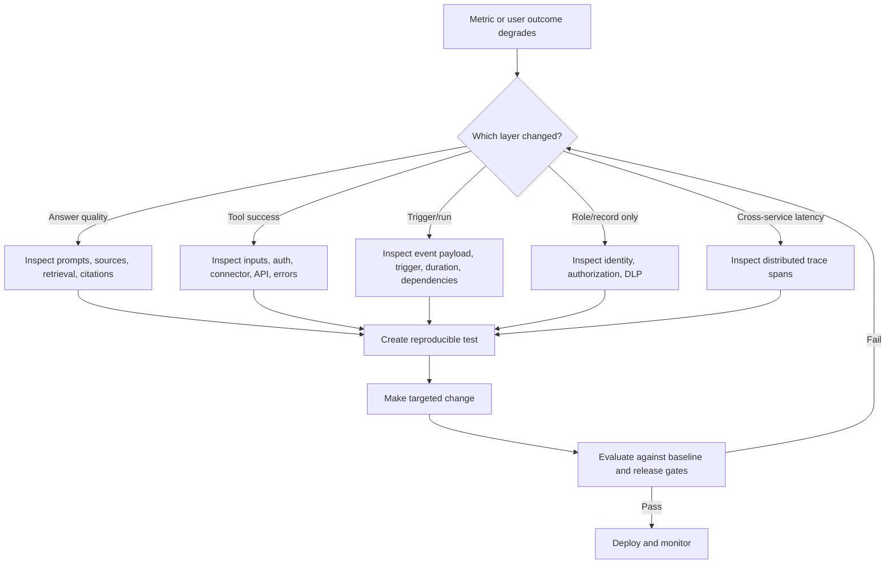

# Day 18: Domain 3 Full Quiz + Review

**Date**: 2026-08-29
**Domain**: Deploy AI-powered business solutions (40-45%)
**Subtopics**: Monitoring and tuning; structured testing; ALM for data, Copilot Studio, Foundry, custom models, and Dynamics 365; security, governance, Responsible AI, compliance, and audit
**Estimated study time**: 2 hrs
**Status**: Completed
**Quiz result**: 10/10 (100%) in 13.7 seconds; 0 skipped; 0 ungraded

---

## TL;DR (60-second skim)

- Monitor a balanced scorecard against an agreed baseline: user experience, answer and tool quality, operational health, business outcomes, adoption, and savings. Volume or token use alone cannot prove value.
- Diagnose at the failing layer. Strong answers plus falling action success points first to tool inputs, authentication, connector behavior, downstream dependencies, and error handling, not automatically to model weights.
- Define test objectives, representative scenarios and data, owners, and measurable quality, safety, latency, reliability, usability, and task-success thresholds before running tests.
- For a multi-app Dynamics 365 process, test the whole business flow in an integrated environment with realistic migrated data, role-based handoffs, synchronization, exceptions, downstream records, and multiple cycles.
- Treat deployment as a chain of separate gates: artifact import, target configuration, identity and authorization, evaluation, publishing or endpoint validation, sharing, monitoring, and rollback readiness.
- Environment-variable definitions/defaults are serviced separately from target current values. A supplied current value wins and is not overwritten by a publisher's managed-solution update.
- Copilot Studio import does not finish the release. Reconfigure authentication as needed, validate connections/variables/channels, test, publish, and only then share.
- Hosted Foundry agent deployment exposes a dedicated endpoint and identity. Programmatic validation does not wait for Teams or Microsoft 365 channel publishing.
- Layer security: conversation identity, tool identity, source authorization, DLP, deterministic tool checks, least privilege, Prompt Shields, harm filters, monitoring, and incident response solve different risks.
- Cross-geo solution deployment permission does not prove compliant configuration, seed-data movement, or runtime data flows. Assess each layer and service separately.

---

## Learning Objectives

After this session, you should be able to:

1. Build a monitoring process aligned to AB-100 D3.1 rather than choosing a single generic metric.
2. Use telemetry to separate conversation-quality, model, tool, trigger, identity, and dependency failures.
3. Define a repeatable, risk-based test strategy and defensible release thresholds for agents and models.
4. Design integrated Dynamics 365 end-to-end tests that prove business outcomes across apps and roles.
5. Explain portable Power Platform configuration and the definition/default/current-value servicing model.
6. Distinguish Copilot Studio solution import, target validation, publishing, sharing, and authorization.
7. Distinguish a Foundry hosted-agent deployment endpoint from channel publishing.
8. Design identity, authorization, DLP, grounding, prompt-attack, and content-safety controls as layers.
9. Separate cross-geo artifact deployment from configuration, data migration, and runtime processing compliance.
10. Select evidence for governance, Responsible AI review, audit, approval, monitoring, and rollback.

---

## Key Concepts

### 1. Domain 3 as one release feedback loop

Domain 3 is easiest to reason about as a continuous loop rather than four unrelated lists:

1. **Define** outcomes, risk tolerances, ownership, and measurable release criteria.
2. **Test** representative business flows, failures, permissions, safety, and performance.
3. **Package** versioned artifacts and declare dependencies and target configuration.
4. **Deploy** through governed environments with approvals and traceability.
5. **Validate** target identities, bindings, endpoints, channels, and downstream systems.
6. **Release** only after quality, security, compliance, and operational gates pass.
7. **Monitor** experience, business, tool, cost, reliability, and safety signals.
8. **Diagnose** the failing layer with traces, transcripts, run details, and audit evidence.
9. **Tune or rollback**, then rerun the same evaluation and release gates.

The architect's job is to preserve the links between business intent, test evidence, deployed version, runtime behavior, and accountable decision-makers.

### 2. Monitoring process and KPI selection

A monitoring process starts before production:

- Define the business outcome and the behavior that contributes to it.
- Record a pre-agent or previous-version baseline.
- Choose owners, review cadence, alert thresholds, and escalation paths.
- Combine built-in telemetry with business-specific outcome measures.
- Segment by scenario, channel, role, locale, tool, knowledge source, and release version.
- Drill from a changed aggregate into sessions, traces, dependencies, and source evidence.
- Convert confirmed patterns into a prioritized backlog.
- Rerun evaluation after tuning and compare against the baseline.

#### Balanced scorecard

| Dimension | Example measures | What it can reveal | What it cannot prove alone |
| --- | --- | --- | --- |
| User experience | reactions, comments, CSAT, sentiment, escalation, abandonment | perceived usefulness and friction | actual business value or root cause |
| Answer quality | groundedness, relevance, completeness, answer rate | quality of generated responses | successful downstream action |
| Task/business outcome | resolution, order completion, case deflection, cycle time, revenue or cost effect | whether the solution meets its purpose | which internal step failed |
| Operational health | latency, errors, failed runs, trigger failures, dependency health | reliability and bottlenecks | answer correctness or fairness |
| Tool health | call count, success percentage, duration, error type | action-path demand and reliability | whether the model's prose is good |
| Adoption | active users, sessions, repeat use, channel use | reach and usage patterns | effectiveness or realized value |
| Cost/value | token and compute cost, savings, cost per successful outcome | economic efficiency | quality, safety, or authorization |
| Safety/governance | blocked attacks, policy violations, approval exceptions, incidents | control effectiveness and residual risk | business success by itself |

Current Copilot Studio details worth recognizing:

- The Monitor experience separates custom metrics, effectiveness, use, and savings views.
- Custom metrics express business-specific outcomes in natural language; current documentation allows up to three.
- Analytics can show events from the last 360 days.
- Detailed transcript/session drill-down requires the least-privilege **Bot Transcript Viewer** capability.
- Conversation outcomes and answer rate should be interpreted with reactions, quality, source use, and business outcomes.

#### Baseline rules

A baseline must identify the metric definition, population, period, source, and version. For example, compare successful refunds per eligible request and median completion time before and after release, not merely total conversations. Record seasonality, traffic mix, staffing changes, and channel changes where they affect interpretation.

**Exam signal**: When a sponsor asks for one generic dashboard or one volume metric, the tested concept is usually outcome alignment plus a balanced baseline, not a particular chart.

### 3. Root-cause tuning: model versus tool versus system

Do not tune the model until evidence points to the model.

| Observed pattern | First investigation | Likely tuning surface |
| --- | --- | --- |
| Answers are irrelevant or poorly grounded | failed questions, citations, knowledge-source use, instructions | knowledge, retrieval, instructions, prompt |
| Tool is called often but success percentage falls | inputs, schema, auth, connection, downstream API, throttling, errors | tool contract and integration |
| Tool is never selected when needed | tool name/description, input requirements, orchestration traces | capability description or orchestration |
| One event type produces failed autonomous runs | trigger details, event payload, trigger instructions, permissions | trigger and event path |
| End-to-end latency rises with stable token use | distributed trace spans and dependency timings | slow agent/tool/service dependency |
| Failures begin after a release | version correlation, deployment history, target bindings | configuration, dependency, or artifact regression |
| Only one role or record fails | identity claims, downstream authorization, DLP, row permissions | access control, not model quality |

Current autonomous-agent analytics expose four useful areas:

- **Run outcomes**: success/failure and session-duration trends.
- **Trigger use**: which events initiate runs and which produce the most failed runs.
- **Tool use**: how often tools start and what percentage complete successfully.
- **Knowledge source use**: source demand and usefulness patterns.

A tool's high call frequency means it is relevant or selected often. It does not mean it works. A declining success percentage should lead to tool input validation, connection/authentication checks, downstream availability, throttling, timeout, and error-handling analysis before model retraining.

For Foundry solutions, use distributed traces to follow agent decisions, model calls, tool calls, and dependencies as spans. Dashboards locate a trend; traces locate the failing execution step; evaluations determine whether a candidate fix improves quality.

### 4. Structured testing begins before prompts are run

A defensible test plan defines:

- **Objective**: intended business outcome and risks to prevent.
- **Scope**: capabilities, workflows, tools, channels, apps, integrations, and personas.
- **Data**: representative, boundary, negative, adversarial, multilingual, and permission-varied cases.
- **Roles**: test executor, business validator, security/compliance reviewer, defect owner, approver.
- **Expected behavior**: acceptable response/action, refusal, escalation, approval, or failure mode.
- **Metrics**: task success, accuracy, relevance, groundedness, safety, latency, reliability, usability, and business outcome.
- **Thresholds**: explicit pass/fail values and high-impact error tolerances.
- **Evidence**: dataset version, run/version IDs, configuration, results, defects, approval, and timestamp.
- **Regression policy**: what reruns after a prompt, tool, model, data, connector, app, or policy change.

Do not run a large prompt set and decide afterward what success means. That encourages cherry-picking and makes release decisions irreproducible.

Testing progresses from component and conversation checks through role-based process and end-to-end validation. Add security/negative, performance/reliability, UAT, and repeatable regression evidence; none replaces the others.

### 5. Multi-app Dynamics 365 end-to-end testing

An order-to-cash or prospect-to-cash process can cross Dynamics 365 Sales, Finance, Supply Chain Management, Customer Service, and external systems. The test must prove the business process, not merely that each app opens.

Include:

- an integrated test environment with the latest solution versions and updates;
- realistic migrated data, including legacy patterns absent from demo data;
- production-like role-based security and personas;
- record identity and state transitions across apps;
- synchronous and asynchronous handoffs, integration queues, retries, and timing;
- AI recommendations and actions, including confidence, approvals, and refusals;
- happy, alternate, negative, exception, recovery, and cancellation paths;
- downstream invoices, inventory, shipments, cases, reports, and audit evidence;
- measurable end-state business outcomes and postconditions;
- multiple cycles, defect correction, and regression rather than one late happy-path run.

**Key distinction**:

- A functional test proves one configured feature.
- A process test proves functions work together across roles.
- An end-to-end test proves the whole in-scope solution and external integrations simulate real operation.
- UAT proves business stakeholders accept the solution; it does not replace prior technical and security tests.

### 6. Environment variables: portable configuration and servicing

Environment variables remove environment-specific values from app, flow, and agent definitions. Typical uses include endpoint URLs, site/list references, IDs, feature flags, and nonsecret configuration.

They consist of separate Dataverse records:

- **Definition**: name, type, description, and optional default value; included in a solution.
- **Current value**: the value for a particular target environment; one value can exist per definition.

Resolution rule:

1. Use a defined **current value**.
2. Otherwise use the **default value**.
3. Otherwise prompt for/provide a value during deployment where supported.

The separation enables servicing. A publisher can update the managed definition and default while preserving the customer's target current value. The target value is an unmanaged environment-specific record and is not overwritten merely because a new default ships.

Practical ALM guidance:

- Include the definition in the solution.
- Normally remove the development current value before export.
- Supply the target current value during import or pipeline deployment.
- Reuse one variable when multiple components intentionally need the same value.
- Use connection references for connector authentication and target connections.
- Keep credentials and secrets out of ordinary defaults; use supported secret management such as Azure Key Vault where appropriate.
- Validate that values resolve to the intended target resources before release.

### 9. Copilot Studio solution lifecycle

A reliable sequence is:

1. Author in a development environment using an unmanaged custom solution.
2. Add the agent plus topics, flows, connection references, environment variables, custom connectors, and required dependent objects.
3. Import custom connectors before the agent solution and its connection references where that dependency exists.
4. Export a versioned managed artifact for downstream environments.
5. Prevalidate dependencies, connections, and variables through governed pipelines.
6. Import into the target and inspect logs if import fails.
7. Reconfigure user authentication for the imported agent as needed.
8. Bind target connections and environment-variable values; validate knowledge, tools, endpoints, and channel details.
9. Run target-environment smoke, security, and business-flow tests.
10. Publish the imported agent.
11. Share or distribute it to intended users/channels, then verify user access and underlying data permissions.
12. Monitor the released version and retain rollback evidence.

Important current details:

- Some agent components or properties might not transfer automatically; check dependencies and target-specific channel details.
- If import fails, download the XML log; missing required components are a common cause.
- New topics or flows added after initial solution packaging must also be added to the unmanaged solution.
- Import success does not publish the agent.
- Publishing does not grant underlying source permissions.
- Sharing does not repair authentication, connection, environment-variable, or DLP problems.

### 10. Foundry hosted-agent deployment versus channel publishing

Hosted agents let teams bring custom containerized agent code and a supported framework. During deployment, Foundry Agent Service:

- pulls the image from Azure Container Registry;
- assigns a dedicated Microsoft Entra agent identity;
- exposes a dedicated agent endpoint;
- manages compute, scaling, session state, observability, and lifecycle around the container.

The deployment endpoint is the programmatic runtime boundary. Validate it in the target project immediately after deployment, subject to deployment readiness and authorization. Channel publishing to Teams or Microsoft 365 is a later distribution concern, not the step that creates the endpoint.

Protocol cues: use **Responses** for OpenAI-compatible conversation, **Invocations** for webhooks/batch/arbitrary JSON, **Invocations (WebSocket)** for real-time two-way streaming, and Responses plus platform-bridged **Activity** for Teams or Microsoft 365.

Validate the deployed version's intended protocol, endpoint, identity/RBAC, model/tool dependencies, environment configuration, telemetry, safety controls, and rollback plan before broad distribution.

### 11. Identity and authorization boundaries

Keep these identities separate:

| Boundary | Question it answers |
| --- | --- |
| Maker/author identity | Who can design, configure, package, and publish? |
| Conversation identity | Who is chatting with the agent? |
| Tool connection identity | Whose credential calls the connector or API? |
| Runtime agent/workload identity | What Azure resources can the deployed agent access? |
| Source/record authorization | Which rows, files, fields, or chunks may this caller access? |
| Approver identity | Who may authorize a consequential action? |

For Copilot Studio tools:

- Use **user authentication** when access must follow the current user's downstream permissions or actions are performed on the user's behalf.
- Use **agent author authentication** only where shared access is intended and low-risk, then constrain its permissions appropriately.
- Users create/authorize their own connection for a user-authenticated tool; the downstream service still enforces its permissions.
- Conversation authentication does not automatically select the correct tool credential or grant source access.

For sensitive actions, deterministic server-side code must reauthorize the caller, target resource, operation, and relevant business policy at execution time. The model's selected account ID or natural-language claim is untrusted input.

### 12. DLP and connector governance

Power Platform data policies govern connector and data-path combinations. They reduce exfiltration risk but do not implement record-level authorization.

Use DLP to classify compatible business/nonbusiness connector boundaries, block disallowed connectors or capabilities, constrain knowledge/tools/triggers/channels, require authentication where policy demands it, and block HTTP or allow only approved endpoints.

For regulated case data with a possible arbitrary HTTP output path, combine:

- end-user tool credentials so downstream case permissions follow the caller;
- DLP grouping/blocking or endpoint filtering so regulated connector output cannot flow to an unapproved HTTP destination;
- server-side operation/record authorization;
- least-privilege scopes and auditable approvals.

Remember: DLP controls connector coexistence/data movement. It does not prove that a user owns a record. User credentials preserve user context. They do not by themselves prevent data from flowing through an allowed but inappropriate connector combination.

### 13. Content safety, Prompt Shields, and tool security

Azure AI Content Safety harm categories cover:

- Hate and Fairness (`Hate`)
- Sexual (`Sexual`)
- Violence (`Violence`)
- Self-Harm (`SelfHarm`)

Text classification currently supports a full severity scale from 0 through 7 and can return a trimmed 0, 2, 4, 6 scale. Image classification returns the trimmed scale. Thresholds reduce specified content risk; they are not a universal application firewall.

Prompt Shields address input attacks:

- **User Prompt attacks**: direct attempts by a user to override restrictions or obtain unauthorized behavior.
- **Document attacks**: malicious instructions embedded in third-party content such as documents or emails.

Defense in depth requires:

1. analyze user prompts and retrieved/uploaded documents where supported;
2. treat retrieved content as untrusted data, separate from governing instructions;
3. security-trim retrieval before restricted content enters the prompt;
4. minimize tool permissions and operations;
5. validate structured tool inputs and authorization outside the model;
6. require confirmation or human approval for high-impact actions;
7. apply harm filters appropriate to the use case;
8. monitor attacks, denials, anomalous tool use, and incidents;
9. maintain response, containment, rollback, and evidence procedures;
10. retest representative and adversarial cases after changes.

**Exam trap**: A harm filter can block or classify harmful output without proving that the caller is authorized, that grounding data was security-trimmed, or that a refund/account-close operation is permitted.

### 14. Responsible AI and governance

Use Microsoft's six Responsible AI principles as design-review prompts: **fairness** for subgroup harms; **reliability and safety** for limits and recovery; **privacy and security** for data and authorization; **inclusiveness** for intended users and accessibility; **transparency** for AI disclosure, limitations, sources, and escalation; and **accountability** for owners, oversight, audit, and incident response.

An agent inventory should record owner, purpose, environment, model, knowledge, tools, connections, channels, identities, risk level, data classification, release version, approvals, monitoring, review date, and retirement plan.

Human-in-the-loop is strongest when enforced by deterministic policy. A prompt asking the model to seek approval is weaker than a tool or workflow that cannot execute until an authorized approval record exists.

### 15. Cross-geo deployment versus runtime compliance

Power Platform pipelines can deploy across geographic locations only when **Cross-Geo Solution Deployments** is enabled in the pipelines host. If disabled, the host and associated environments must share a geography. Separate hosts can enforce geographic separation.

Pipelines deploy:

- solution artifacts/customizations;
- target configuration such as connections, connection references, and environment variables;
- deployment records and stored solution versions.

Solutions do not contain ordinary Dataverse table data. That fact does not prove that the full release has no data movement.

Review four layers separately:

| Layer | Examples | Compliance question |
| --- | --- | --- |
| Artifact | agent definition, app, flow, model reference, connector metadata | Is cross-geo promotion approved and traceable? |
| Configuration | endpoint URLs, connection references, environment-variable values | Where do configured services process/store data? |
| Seed/reference data | imported rows, documents, prompts, evaluation data, index content | How is each dataset transferred and governed? |
| Runtime flows | prompts, outputs, retrieval chunks, API calls, telemetry | Where does live business data travel and under which terms? |

Consent or capability for artifact movement is not a universal residency approval. Build a feature-level data-flow inventory and validate each Power Platform, Microsoft 365, Bing, Foundry, connector, and custom-service commitment.

### 14. Audit and evidence refresher

Monitoring describes runtime behavior; an audit trail establishes attributable change. Link source, solution/model/data versions, evaluation, configuration, approver, deployment target and identity, validation, incident, and rollback records. Dataverse field-change auditing requires environment, table, and relevant column auditing. Application Insights is observability, not the authoritative change ledger.

---

## Decision Frameworks

### Monitoring and tuning decision flow

### Release-readiness decision flow

`versioned candidate -> representative tests -> security/compliance gates -> governed deployment -> target bindings/identity -> target validation -> publish/share or endpoint/channel -> monitor and retain rollback evidence`

### Which security control?

- Need to know who is chatting: configure conversation authentication.
- Need downstream access to follow that user: use user authentication for the tool.
- Need the hosted workload to access Azure: use its managed/agent identity with least-privilege RBAC.
- Need row/file/chunk restrictions: enforce source authorization/security trimming before prompting.
- Need to prevent connector-to-HTTP exfiltration: apply DLP groups, blocking, and endpoint filtering.
- Need to detect direct or document prompt attacks: use Prompt Shields plus application controls.
- Need to moderate harmful content: configure harm-category filters and thresholds.
- Need to prevent a high-impact unauthorized action: deterministic server-side authorization and approval.

---

## Comparisons

### Similar concepts the exam mixes up

| Concept A | Concept B | Critical distinction |
| --- | --- | --- |
| Conversation volume | Business outcome | use does not prove successful value |
| Answer quality | Tool success | good prose does not prove a connector action completed |
| Dashboard | Trace | trend/aggregate versus one execution path |
| Test chat | Repeatable evaluation | interactive debugging versus retained regression evidence |
| Functional test | End-to-end test | one feature versus whole integrated business operation |
| Default environment-variable value | Current value | fallback metadata versus target-specific overriding value |
| Solution import | Agent publishing | artifact arrival versus activating a release |
| Publishing | Sharing | making a version available versus granting/distributing access |
| Hosted-agent deployment | Channel publishing | creates endpoint/identity versus adds distribution channel |
| Conversation identity | Tool identity | signed-in user versus credential used downstream |
| Source authorization | DLP | record/chunk access versus connector/data-path governance |
| Harm filters | Prompt Shields | objectionable content/severity versus input attacks |
| Prompt Shields | Tool authorization | attack detection versus deterministic permission enforcement |
| Cross-geo solution setting | Runtime-data compliance | enables artifact promotion versus proves live-data movement terms |
| Monitoring telemetry | Audit trail | operational behavior versus attributable control/change evidence |

---

## Important Details for Exam

- Domain 3 is currently 40-45% of AB-100, the largest weighted domain.
- Copilot Studio custom metrics currently allow up to three business-specific natural-language metrics.
- Copilot Studio monitoring documentation states analytics events can be viewed for the last 360 days.
- Tool use analytics distinguish invocation frequency from successful-use percentage.
- Structured testing defines success criteria before execution and retains repeatable evidence.
- Dynamics 365 end-to-end testing uses an integrated environment, latest solution, migrated data, external integrations, and multiple cycles.
- A current environment-variable value takes precedence over the default.
- Definition/default servicing is separate from a customer's current target value.
- One current value can exist per environment-variable definition.
- Environment-variable definitions belong in solutions; target values are normally supplied during deployment.
- Import custom connectors before the connection reference and agent solution when the action depends on that custom connector.
- Imported Copilot Studio agents require authentication configuration again where applicable.
- An imported Copilot Studio agent must be published before it can be shared.
- Foundry hosted-agent deployment assigns a dedicated Entra identity and exposes a dedicated endpoint.
- Responses is the default cue for an OpenAI-compatible conversational hosted agent; Invocations handles arbitrary/custom payloads.
- User-authenticated tools are the cue when access must follow an individual's downstream permissions.
- DLP can block HTTP or use endpoint filtering; DLP is not record authorization.
- The four harm categories are Hate and Fairness, Sexual, Violence, and Self-Harm.
- Prompt Shields distinguish user-prompt attacks from document attacks.
- Cross-geo Power Platform deployment requires the host setting to be enabled; otherwise host and associated environments must share a geography.
- Power Platform solutions do not contain ordinary Dataverse table data, but target configuration and separate migrations/runtime flows still require compliance review.

---

## Common Traps & Misconceptions

1. **"More conversations means success."** Volume can increase while resolution, safety, satisfaction, or value falls. Compare balanced outcomes to a baseline.
2. **"A tool failure means the model is bad."** Falling tool success with strong policy answers points first to inputs, auth, connector/API behavior, dependencies, and error handling.
3. **"We can define success after mass testing."** Post-hoc criteria invite cherry-picking. Define scenarios, thresholds, and owners before execution.
4. **"Every Dynamics 365 app passed, so the process passed."** Cross-app handoffs, synchronization, role security, migrated data, exceptions, and end states remain unproven.
5. **"A managed update overwrites the customer's environment-variable value."** A target current value is separate and overrides the serviced default.
6. **"Successful import means the Copilot Studio agent is live."** Authentication, target bindings, validation, publishing, and sharing still remain.
7. **"Foundry needs Teams publishing before API tests."** Deployment creates the hosted endpoint; channel publishing is a distribution step.
8. **"Authentication automatically enforces every source permission."** Conversation identity, tool credential, and source record authorization are different gates.
9. **"DLP secures record ownership."** DLP governs connector/data paths; the source/tool must authorize records.
10. **"Harm filters stop prompt injection and unauthorized actions."** Use Prompt Shields and deterministic authorization/tool controls in addition to moderation.
11. **"One consent applies to every connected Microsoft service."** Feature hosting, processing, storage, and contractual commitments can differ.
12. **"Cross-geo deployment proves no business data crosses regions."** Artifact, configuration, seed/reference data, and runtime flows require separate analysis.
13. **"Telemetry is the audit ledger."** Observability supports diagnosis; authoritative audit evidence links version, change, identity, approval, and deployment.

---

## Real-World Scenarios

- **Refund completion drops**: check tool success, inputs, connection/authentication, API errors, throttling, and downstream availability before changing the model.
- **Imported agent unavailable**: bind target values/connections, configure authentication, validate, publish, share, and verify source permissions.
- **Hosted agent awaiting Teams**: validate identity, protocol, dependencies, safety, and telemetry through the deployed endpoint; add the channel later.
- **Regulated cases plus HTTP**: combine user-authenticated access, server-side record authorization, and DLP/endpoint filtering.
- **Germany-to-Canada promotion**: enable the approved cross-geo host setting, then separately review artifact, configuration, seed data, and runtime flows.

---

## Quick Reference Card

### Symptom-to-first-check map

| Symptom | First check |
| --- | --- |
| High usage, low resolution | outcomes, answer quality, escalation, business KPI |
| Good answers, failed actions | tool success, schema, auth, connector/API errors |
| One event fails | trigger-use details and payload |
| One user sees too much | tool identity and source authorization |
| Data may leave via HTTP | DLP grouping/blocking and endpoint filtering |
| Unsafe/harmful output | harm filters plus use-case review |
| Injected document changes behavior | Prompt Shields for documents plus untrusted-content/tool controls |
| Imported agent unavailable | authentication, bindings, publish, share/channel |
| Hosted API test blocked on channel | use deployed dedicated endpoint |
| Cross-geo release approved | still review configuration, data migration, runtime flows |

`resolved environment variable = current value if present, otherwise default value`
`solution import != authentication != target validation != publish != share != source authorization`
`deployment endpoint != channel publishing`
`authentication != authorization != DLP != content moderation`

---

## Hands-On Lab (optional)

### Ten-minute release-gate worksheet

For one agent, write its outcome/baseline, balanced metrics, model/tool/authorization/attack tests, artifact and target configuration, identity/DLP checks, activation step, telemetry, audit owner, and rollback trigger. Assign a measurable gate and owner to each item.

---

## Cross-Domain Quiz Question Refreshers

All ten provisional Day 18 review questions are Domain 3 questions. No Domain 1 or Domain 2 carryover applies today.

| Concept | Key Fact | Trap |
| --- | --- | --- |
| None | Day 18's provisional set is entirely D3.1-D3.4 review | Do not add future-topic or cross-domain carryover to this locked review set |

---

## Related Questions in questions.json

- **q101**: monitoring process, baseline, and balanced experience/business KPIs.
- **q107**: tool-use success evidence and integration-first root-cause tuning.
- **q111**: structured test planning and predefined balanced release criteria.
- **q118**: integrated multi-app Dynamics 365 end-to-end process testing.
- **q123**: environment-variable definition, default, current value, and managed servicing.
- **q130**: Copilot Studio post-import authentication, target validation, publishing, and sharing.
- **q134**: hosted Foundry deployment endpoint versus channel publishing.
- **q145**: end-user connector credentials, downstream authorization, and DLP exfiltration controls.
- **q155**: harm-filter scope versus Prompt Shields and application security controls.
- **q165**: cross-geo solution promotion versus configuration, data, and runtime compliance.

Day 18 used these ten assigned questions and was completed with a score of 10/10 (100%) in 13.7 seconds. No questions were skipped or ungraded, and no weak subtopics were identified from this review set.

---

## Sources (verified during this session)

- [Study guide for Exam AB-100: Agentic AI Business Solutions Architect](https://learn.microsoft.com/en-us/credentials/certifications/resources/study-guides/ab-100)
- [Monitor conversational agents](https://learn.microsoft.com/en-us/microsoft-copilot-studio/analytics-improve-agent-effectiveness)
- [Monitor autonomous agents](https://learn.microsoft.com/en-us/microsoft-copilot-studio/analytics-improve-agent-health)
- [Recommend process metrics for testing AI agents](https://learn.microsoft.com/en-us/training/modules/manage-testing-ai-powered-business-solutions/2-recommend-process-metrics-test-agents)
- [Types of tests that implementation projects use](https://learn.microsoft.com/en-us/dynamics365/guidance/implementation-guide/testing-strategy-test-types)
- [Use environment variables in Power Platform solutions](https://learn.microsoft.com/en-us/power-apps/maker/data-platform/environmentvariables)
- [Export and import agents using solutions](https://learn.microsoft.com/en-us/microsoft-copilot-studio/authoring-solutions-import-export)
- [Hosted agents in Foundry Agent Service](https://learn.microsoft.com/en-us/azure/foundry/agents/concepts/hosted-agents)
- [Configure data policies for agents](https://learn.microsoft.com/en-us/microsoft-copilot-studio/admin-data-loss-prevention)
- [Configure user authentication for tools](https://learn.microsoft.com/en-us/microsoft-copilot-studio/configure-enduser-authentication)
- [Harm categories in Azure AI Content Safety](https://learn.microsoft.com/en-us/azure/ai-services/content-safety/concepts/harm-categories)
- [Prompt Shields in Azure AI Content Safety](https://learn.microsoft.com/en-us/azure/ai-services/content-safety/concepts/jailbreak-detection)
- [Overview of pipelines in Power Platform](https://learn.microsoft.com/en-us/power-platform/alm/pipelines)

---

## Notes (your own words - fill this in after studying)

- Monitoring metric I tend to overvalue:
- Signal that distinguishes a tool failure from a model failure:
- My Copilot Studio post-import release sequence:
- Identity versus authorization versus DLP in my own words:
- Why content filters are not prompt-injection or tool-authorization controls:
- Four layers to review after cross-geo solution deployment approval:
- Questions to revisit after the quiz:
