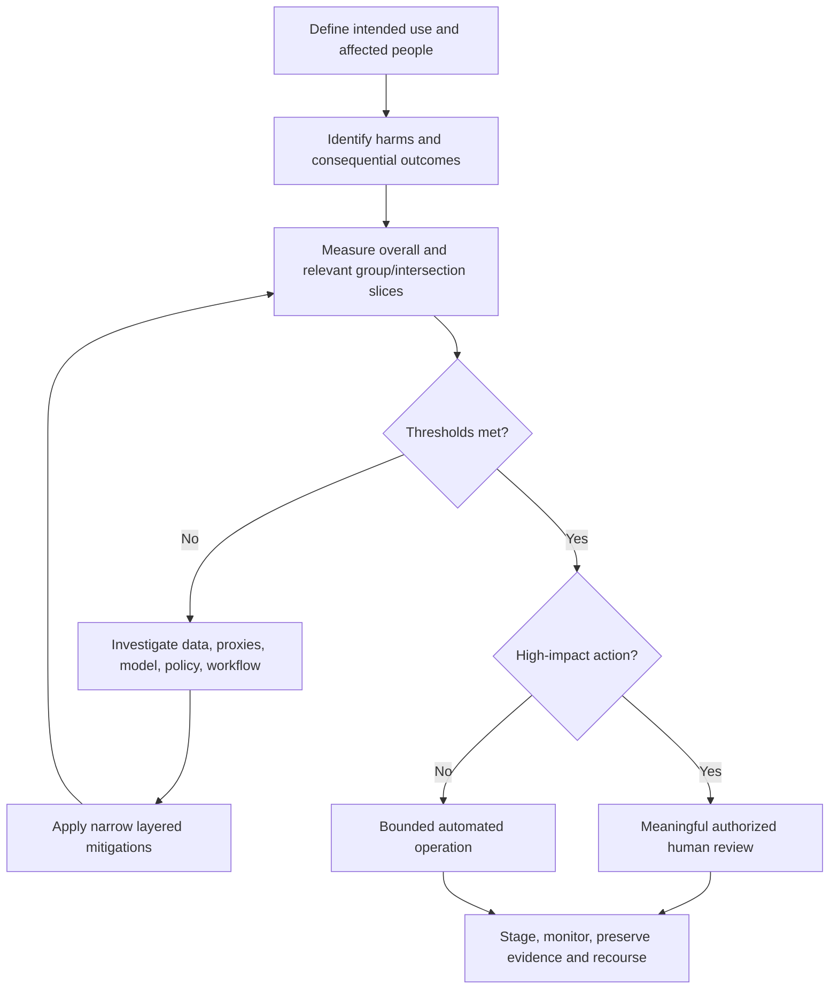
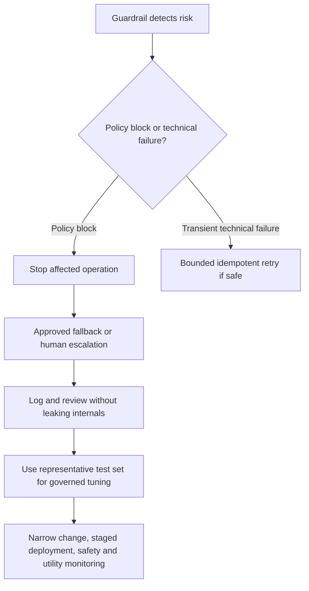

# Day 19: Responsible AI & Governance Deep Dive

**Date**: 2026-08-30
**Domain**: Deploy AI-powered business solutions (40-45%)
**Subtopics**: Responsible AI decision patterns (fairness, transparency, accountability, human-in-the-loop); guardrails; least privilege; managed identities
**Estimated study time**: 2 hrs

---

## TL;DR (60-second skim)

- Responsible AI is a lifecycle: identify harms, measure them with representative evidence, mitigate them in layers, and operate with monitoring, ownership, escalation, and rollback.
- Fairness is evaluated through outcomes across relevant demographic and intersectional slices. Removing a protected attribute or meeting aggregate accuracy does not prove fairness.
- Transparency should help affected people act: disclose AI use, intended purpose, material limitations, grounding or citations, and correction or escalation routes. It does not require exposing secrets or private model reasoning.
- The organization deploying the complete business solution remains accountable even when a third party supplies the model. Assign named owners, decision authority, monitoring, and evidence retention.
- Human review is meaningful only when reviewers have relevant evidence, adequate time and competence, and real authority to reject, override, or escalate.
- Tune guardrails by measured risk: test benign and harmful cases, change the narrowest relevant control, deploy in stages, and monitor both safety and utility. Treat policy blocks as governed outcomes, not errors to evade.
- Managed identity removes stored credentials; it does not grant authorization. Use system-assigned identity for a single host-bound lifecycle and user-assigned identity when identity and role assignments must survive or be shared by equivalent hosts.
- Least privilege means the minimum data-plane actions at the narrowest practical scope. Separate identities when workloads have different duties or risk because every host using one identity receives its combined permissions.

---

## Learning Objectives

After this session, you should be able to:

1. Apply Microsoft's fairness, transparency, and accountability principles to release and operating decisions.
2. Design meaningful human oversight for consequential agent recommendations and actions.
3. Tune Microsoft Foundry guardrails without creating broad safety regressions.
4. Define safe orchestration behavior when a guardrail blocks a request, tool call, tool response, or output.
5. Choose between system-assigned and user-assigned managed identities based on lifecycle, sharing, deployment, and audit requirements.
6. Distinguish credential-free authentication from least-privilege authorization.
7. Select the minimum Azure role and narrowest practical scope for a workload.
8. Prevent privilege aggregation and preserve separation of duties when reusing identities.

---

## Key Concepts

### 1. Responsible AI is a decision system, not a slogan

Microsoft's six Responsible AI principles are:

| Principle | Practical architecture question |
| --- | --- |
| Fairness | Do similarly situated people receive comparable quality and outcomes across relevant groups? |
| Reliability and safety | Does the system behave consistently, resist manipulation, and fail safely in expected and unexpected conditions? |
| Privacy and security | Is data purpose-limited, minimized, protected, and accessed with least privilege? |
| Inclusiveness | Does the solution work for diverse users, including people with disabilities and underserved groups? |
| Transparency | Can users understand that AI is involved, what it is for, what supports an outcome, and where it can fail? |
| Accountability | Is a named organization and owner responsible for decisions, oversight, remediation, and evidence? |

A useful operational loop is:

`identify -> measure -> mitigate -> operate -> learn -> repeat`

- **Identify** plausible harms, affected people, misuse paths, and high-impact decisions.
- **Measure** frequency and severity with clear metrics and representative test sets.
- **Mitigate** using model, safety-system, application, and user-experience controls.
- **Operate** with deployment gates, monitoring, feedback, incident response, and rollback.

The loop is risk-based. A policy-search assistant and an autonomous benefits-denial agent should not have identical thresholds, evidence, or approval requirements.

### 2. Fairness: measure outcomes, not intentions

Fairness asks whether similarly situated people and groups are treated comparably. It cannot be established by saying that the team intended to be neutral.

#### Why protected-attribute removal is insufficient

Removing age, gender, disability, ethnicity, or another protected attribute from a prompt or feature set can be useful for data minimization, but it does not prove fairness. Other inputs can act as proxies:

- Postal code can correlate with ethnicity or socioeconomic status.
- Employment gaps can correlate with caregiving or disability.
- Device, channel, language, or writing style can correlate with demographic groups.
- Process rules, source-data gaps, and human follow-up can introduce disparities after model inference.

Fairness is a property of the whole sociotechnical system: data, model, prompts, tools, policies, workflow, reviewers, and outcomes.

#### Disaggregated measurement

Measure performance for relevant groups and intersections, not just for the full population.

For a binary decision, useful metrics include:

- True-positive and false-positive rates.
- True-negative and false-negative rates.
- Precision and recall.
- Approval, denial, escalation, refusal, and abandonment rates.
- Time to resolution and correction success.
- Quality, groundedness, or tool success by group.

An aggregate metric can hide harm. If a majority group dominates the dataset, strong overall accuracy can coexist with a materially higher false-negative rate for a smaller group.

Intersectional analysis tests combinations such as age plus disability status or language plus region. A system can look acceptable on each single dimension while failing for an intersection.

#### Fairness release pattern

1. Define the affected population and consequential outcomes.
2. Identify legally and contextually relevant slices with privacy and ethics review.
3. Establish representative test data and minimum sample-quality rules.
4. Compare outcome and error rates across groups and intersections.
5. Investigate data quality, proxy features, model behavior, policy rules, and process effects.
6. Mitigate the disparity and remeasure all important metrics.
7. Require documented fairness thresholds or approved exceptions before release.
8. Monitor production slices for drift and new disparity.

Do not delete evaluation attributes merely to make disparities invisible. Sensitive attributes can require stricter governance, but controlled use for fairness assessment may be necessary.

### 3. Transparency: make the system actionable

Transparency should improve a person's ability to understand, verify, challenge, and safely use an AI-assisted result.

A useful transparency surface answers:

- **What**: Is AI being used, and which part of the experience is AI-assisted?
- **Why**: What is the intended purpose and what decisions should it not make?
- **Basis**: Which source documents, facts, or citations support this result?
- **Limits**: What material inaccuracies, uncertainty, freshness limits, or missing coverage should the user know?
- **Control**: How can the user correct information, reject a recommendation, request human help, or appeal an outcome?
- **Ownership**: Who owns the service and where can an issue be reported?

Microsoft recommends disclosing AI's role, highlighting potential inaccuracies, citing sources, helping users review and edit output, and documenting capabilities and limitations.

#### Transparency is not secret disclosure

Do not equate transparency with publishing:

- Credentials, tokens, connection strings, or private endpoints.
- Complete system prompts that expose security controls or proprietary instructions.
- Raw traces containing personal or confidential information.
- Hidden model reasoning or private chain-of-thought.

Prefer grounded evidence, concise rationale, confidence or limitation statements where appropriate, and recourse. Preserve detailed traces for authorized operations, audit, or incident teams rather than showing them indiscriminately to every user.

### 4. Accountability remains with the deploying organization

A supplier can be accountable for contractual commitments, model documentation, platform controls, or defects within its boundary. The organization that integrates and deploys the model still owns the business solution's intended use, data, workflow, downstream action, human oversight, and impact.

Third-party procurement does not transfer responsibility for:

- Selecting a suitable use case and prohibited uses.
- Performing impact and risk assessments.
- Configuring prompts, grounding, tools, identities, and guardrails.
- Defining who may accept, override, or appeal an outcome.
- Evaluating the end-to-end system in the organization's context.
- Monitoring production outcomes and responding to incidents.
- Retaining approvals, versions, exceptions, and release evidence.

For every high-impact agent, record the business and technical owners; intended and prohibited uses; impact assessment; recommendation, approval, execution, override, and escalation authority; release evidence; runtime versions and correlation IDs; and incident/rollback ownership. The accountable owner cannot be the model, the agent, or an unempowered end user.

### 5. Human-in-the-loop must be meaningful

A human confirmation button is not automatically human oversight. A reviewer who lacks evidence, time, training, or authority is likely to rubber-stamp the recommendation.

Meaningful review requires:

- **Trigger**: Clear risk conditions route the case before execution.
- **Evidence**: Relevant source facts, citations, model recommendation, policy criteria, missing information, and known limitations.
- **Time**: Enough time to inspect the evidence and seek more information.
- **Competence**: Training and domain expertise appropriate to the decision.
- **Authority**: Ability to reject, modify, override, pause, request clarification, or escalate.
- **Independence**: UI and incentives that do not force agreement with the model.
- **Accountability**: Reviewer identity and reason are recorded.
- **Quality monitoring**: Track overrides, escalations, timeouts, disagreement, and error patterns.

A robust pattern is:

`AI recommendation -> evidence package -> deterministic policy checks -> authorized review -> execute or escalate -> audit outcome`

To reduce automation bias, do not preselect approval or turn timeouts into approval. Show source evidence, require reasons for high-impact decisions, sample cases independently, and monitor reviewer-model disagreement and suspiciously fast approval patterns.

Use a human checkpoint for rights-affecting, safety-critical, regulated, irreversible, high-value, or privilege-changing actions. Low-impact, reversible actions can be automated when permissions, limits, validation, monitoring, and recovery are strong.

### 6. Foundry guardrails: controls at intervention points

Microsoft Foundry defines a **guardrail** as a named collection of controls. A control specifies:

1. The risk to detect.
2. The intervention point to inspect.
3. The action to take when the risk is detected.

Current intervention points are:

| Intervention point | What is inspected | Current scope note |
| --- | --- | --- |
| User input | Prompt sent to a model or agent | Models and agents |
| Tool call | Proposed action and arguments sent by an agent | Agents; preview |
| Tool response | Content returned by a tool | Agents; preview |
| Output | Final completion returned to the user | Models and agents |

Risks include the four content categories, user prompt attacks, indirect attacks, protected material, personally identifiable information, and task adherence. Applicability differs by model, agent, risk, and release status; confirm current documentation during implementation.

For the four content categories, Foundry uses threshold labels `Low`, `Medium`, and `High`, plus `Off` only for approved customers. Read the semantics carefully: the threshold describes which severity and above is flagged, so a `Low` threshold flags more content and is more restrictive in practice even though the page's current table wording can be easy to misread. Always validate behavior with test cases rather than relying on label intuition.

Agent guardrails are currently documented as preview. For Foundry Agent Service agents, the agent's assigned guardrail determines risk detection and overrides the underlying model's guardrail. Do not assume an underlying model configuration remains the effective agent policy.

### 7. Risk-based guardrail tuning

Guardrails trade off safety coverage and useful completion. False positives are not a reason to disable protection globally.

Use this tuning workflow:

1. Reproduce the blocked benign cases and record the exact intervention point and control.
2. Build a representative set containing benign, borderline, harmful, adversarial, and business-critical cases.
3. Measure false-positive rate, false-negative rate, severity, user impact, and downstream action risk.
4. Determine whether the issue belongs to the guardrail, prompt, retrieval data, tool contract, or application UX.
5. Make the smallest justified change to the specific control and intervention point.
6. Retest all safety and utility thresholds, not only the previously blocked examples.
7. Document owner, rationale, evidence, approval, affected deployment, and rollback condition.
8. Stage the rollout through development, test, canary, and production as risk warrants.
9. Monitor block rate, user feedback, successful attacks, unsafe completions, and task completion by version.

A broad relaxation can improve completion while silently increasing harmful output or tool-action risk. Guardrails are one layer; least privilege, deterministic policy checks, grounding controls, safe UX, and human approval remain necessary.

### 8. Policy blocks require safe fallback

A policy block is a governed safety result, not a transient timeout. Rephrasing or mutating the same high-risk request until one version passes attempts to bypass the configured control.

A safe block handler stops the affected operation, preserves policy/version/correlation evidence, returns an approved nonjudgmental fallback, and offers a safe alternative or authorized escalation where appropriate. It must not echo disallowed material, reveal evasion thresholds, or mutate the request to find a passing variant. Recurring false positives go through governed tuning.

Retries are appropriate for transient technical failures such as a throttled dependency when bounded and idempotent. They are not appropriate for evading a safety-policy decision.

### 9. Managed identity: credential-free authentication

A managed identity is a Microsoft Entra workload identity assigned to supported Azure compute or hosting resources. Azure manages the credential, so application code does not store a password, access key, or client secret.

Typical flow:

`hosted workload -> Azure.Identity/MSAL obtains token -> target service validates token -> RBAC/data policy authorizes operation`

Managed identity solves credential management and authentication. It does not automatically:

- Grant access to Storage, Key Vault, Foundry, Search, SQL, or another dependency.
- Choose the correct role or scope.
- Preserve end-user permissions.
- Prevent an overprivileged tool call.
- Make all resources using the identity equally trustworthy.

### 10. System-assigned versus user-assigned identity

| Property | System-assigned | User-assigned |
| --- | --- | --- |
| Creation | Enabled on one Azure resource | Created as a standalone Azure resource |
| Lifecycle | Created and deleted with the host | Independent; delete explicitly |
| Sharing | Used only by its host resource | Can attach to multiple supported resources |
| Role assignment timing | Usually after the host identity exists | Can be preauthorized before host deployment |
| Best fit | One host, unique permissions, host-bound cleanup and attribution | Equivalent replicated hosts, blue-green replacement, stable preauthorization |
| Main governance risk | Repeated identity/role setup during replacement | Permission aggregation across every attached host |

#### Choose system-assigned when

- One resource alone should use the identity.
- The identity and permissions should end with that resource's lifecycle.
- Per-resource attribution matters.
- The host needs a unique permission set.

#### Choose user-assigned when

- Equivalent deployment slots or replicated hosts need the same permissions.
- Hosts are replaced frequently but identity and role assignments must remain stable.
- Permissions must be preconfigured before compute deployment.
- Identity administration must be separated from host provisioning.

Do not infer that shareable means universally shareable. Reuse is appropriate only for hosts performing the same trusted function with the same required permissions.

### 11. Least privilege is role plus scope plus conditions

Azure RBAC answers three questions:

`who -> can perform which actions -> on what scope`

For least privilege:

- Select the built-in job-function or data role with only required actions or `DataActions`.
- Assign it at the narrowest practical resource scope.
- Add conditions where supported to constrain role-assignment or data access further.
- Avoid broad administrator roles and wildcard custom-role permissions.
- Review inherited assignments from parent scopes.
- Remove stale assignments and use time-bound elevation for exceptional administration.

Azure's main scope hierarchy is:

`management group -> subscription -> resource group -> resource`

Permissions assigned at a parent flow to descendants. For Blob Storage, a container is addressable as a resource scope, so access to one container does not justify subscription-wide access.

#### Storage example

A workload that only reads blobs normally needs the data-plane role **Storage Blob Data Reader**, not **Storage Blob Data Contributor**. Scope it to the required container when that is the narrowest practical boundary.

Management-plane `Reader` is not the same as blob data read access. The Azure portal may require management-plane Reader in addition to a blob data role for a human browsing through the portal, but application data access should be designed around the necessary data-plane role.

### 12. Identity reuse and privilege aggregation

Every host that can obtain a token for a user-assigned managed identity can exercise all permissions granted to that identity. If an identity has read access to reporting data and delete access to secrets, every attached workload receives that combined authority.

This creates:

- **Privilege aggregation**: Low-risk code gains high-impact permissions it does not need.
- **Larger blast radius**: Compromise of any attached host exposes all identity permissions.
- **Weak attribution**: Logs identify the shared principal, making per-workload responsibility harder to establish.
- **Separation-of-duties failure**: Reporting, remediation, deployment, and administration collapse into one authority.
- **Change coupling**: Adding permission for one workload silently expands every other workload using the identity.

Use separate workload identities when duties, trust boundaries, owners, environments, data sensitivity, or impact differ. Give each identity the smallest role and scope needed by its workload.

A sound reuse test asks whether all attached resources perform the same function, require the same permissions and targets, have equivalent owners/risk/boundaries, and can accept shared-principal attribution. If compromise of any host should not expose every permission, separate the identities.

---

## Decision Frameworks

### Responsible AI release decision



### Human oversight test

Ask five questions:

1. Does the reviewer see enough evidence and limitations to disagree intelligently?
2. Does the reviewer have enough time and relevant expertise?
3. Can the reviewer reject, change, stop, or escalate the result?
4. Is the review captured before a consequential action executes?
5. Are reviewer quality and automation bias monitored?

If any answer is no, the design is human-present, not meaningfully human-in-the-loop.

### Guardrail response decision



### Managed identity selection

- Identity must be unique to one host and disappear with it: **system-assigned**.
- Identity must survive host replacement or be preauthorized: **user-assigned**.
- Multiple equivalent replicas need identical permissions: **user-assigned may be appropriate**.
- Workloads have materially different duties or risk: **separate identities**, regardless of convenience.
- Target does not support Entra authentication: use the best supported credential mechanism, store unavoidable secrets in Key Vault, and rotate them.

### Least-privilege selection

1. List the exact runtime operations: read, write, delete, invoke, deploy, or assign roles.
2. Separate management-plane actions from data-plane `DataActions`.
3. Choose the narrowest built-in role that contains those operations.
4. Choose the smallest scope containing all required resources.
5. Check inherited roles and all identities attached to the host.
6. Add conditions, approval, or just-in-time elevation for exceptional operations.
7. Validate with positive and negative permission tests.

---

## Comparisons

| Decision area | Strong design | Trap |
| --- | --- | --- |
| Fairness | Group/intersection outcome and error metrics, representative data, proxy/process investigation, thresholds, and monitoring | Aggregate accuracy, attribute removal, intent, or complaints alone |
| Transparency | AI notice, purpose, material limitations, sources, correction, appeal, and escalation | Product name, raw private traces, secrets, or hidden instructions |
| Human review | Evidence, adequate time/expertise, reject/override/escalate authority, safe timeout, and quality monitoring | Approve-only UI, hidden evidence, or timeout-as-approval |

### Identity and authorization concepts

| Concept | What it answers | What it does not answer |
| --- | --- | --- |
| Managed identity | How the workload authenticates without stored credentials | What the workload may do |
| Azure role | Which management or data operations are permitted | Where the permission applies |
| Scope | Which resources inherit the role assignment | Whether the role itself is minimal |
| Guardrail | Which configured risks are detected and how the application responds | Whether the caller is authorized |
| Human approval | Whether an authorized person accepts a consequential action | Whether the runtime identity has technical permission |

---

## Important Details for Exam

- Microsoft uses the Responsible AI operating pattern **Identify, Measure, Mitigate, Operate**.
- The six principles are fairness, reliability and safety, privacy and security, inclusiveness, transparency, and accountability.
- Fairness assessment needs relevant group and intersection slices; overall performance can conceal subgroup harm.
- The people and organization designing and deploying the complete AI system remain accountable for its operation.
- Human control must be meaningful and intelligible, especially for decisions affecting people's lives.
- Current Foundry guardrail intervention points are user input, tool call, tool response, and output; tool-call and tool-response controls for agents are preview.
- Current Foundry docs say agent guardrails are preview and the agent-assigned guardrail overrides the underlying model guardrail for agent risk detection.
- A system-assigned identity belongs to one host and is deleted with it.
- A user-assigned identity has an independent lifecycle and can be attached to multiple hosts.
- User-assigned identity reuse reduces role-assignment overhead only when workloads legitimately require the same authority.
- Managed identities authenticate; explicit RBAC or service authorization is still required.
- Least privilege requires both minimal actions and minimal scope.
- Azure RBAC scopes inherit downward from management group to subscription to resource group to resource.
- Blob data access uses data roles such as Storage Blob Data Reader; general management-plane Reader is not sufficient for blob data access.
- Role changes can take time to propagate. Do not respond by permanently broadening permissions.
- Deleting a managed identity does not automatically remove every orphaned Azure role assignment; include assignment cleanup in lifecycle governance.

---

## Common Traps & Misconceptions

- **Trap:** Removing protected attributes proves fairness. **Reality:** proxies and process effects remain; measure disaggregated outcomes.
- **Trap:** High aggregate accuracy proves fair treatment. **Reality:** inspect consequential error rates by relevant groups and intersections.
- **Trap:** Transparency means exposing system prompts or private reasoning. **Reality:** provide purpose, limitations, sources, useful rationale, and recourse without disclosing secrets.
- **Trap:** The model provider owns all accountability. **Reality:** the deploying organization owns end-to-end use, controls, monitoring, and business outcomes.
- **Trap:** Any approval click is human-in-the-loop. **Reality:** reviewers need evidence, time, competence, authority, and escalation.
- **Trap:** False positives justify disabling guardrails globally. **Reality:** tune the narrowest control with representative benign and harmful tests, staged rollout, and monitoring.
- **Trap:** A blocked request can be paraphrased until accepted. **Reality:** stop evasive retries and use an approved fallback or escalation.
- **Trap:** User-assigned identity is always better because it is reusable. **Reality:** system-assigned fits a unique host-bound lifecycle; reuse is governed by identical duties and risk.
- **Trap:** Managed identity automatically grants access or makes broad access safe. **Reality:** it removes stored credentials; RBAC and source authorization still determine permissions.
- **Trap:** Contributor at subscription scope is convenient insurance. **Reality:** select the minimum data role at the narrowest practical scope.
- **Trap:** Sharing one powerful identity reduces administration without security cost. **Reality:** every attached host receives the identity's combined privileges.

---

## Real-World Scenarios

| Scenario | Correct architecture pattern |
| --- | --- |
| Benefits eligibility | Measure error rates by demographic/intersectional slices, investigate proxies, set thresholds, provide recourse, and retain qualified human authority. |
| Third-party supplier-risk model | Assign an internal owner, validate the whole workflow, require appropriate approval, monitor outcomes, and retain evidence. |
| Benign support content blocked | Identify the exact control, compare benign and harmful sets, make a narrow change, stage it, and monitor safety plus utility. |
| Equivalent blue-green hosts | Use a persistent identity only for hosts with the same function and permissions; review every role assignment. |
| Reporting versus secret remediation | Separate identities and permission sets because duties, impact, and audit needs differ. |

---

## Quick Reference Card

### Responsible AI decision pattern

`affected people -> harms -> representative measurement -> narrow mitigation -> meaningful oversight -> staged release -> monitor -> recourse -> evidence`

- **Fairness**: compare group/intersection outcomes; investigate proxies/process; set thresholds; monitor drift; provide recourse.
- **Transparency**: disclose AI use/purpose/limits; show grounding; support correction/escalation; protect secrets and private traces.
- **Guardrails**: identify risk/intervention/action; test benign and harmful cases; change narrowly; stage, monitor, document, and never evade a block.
- **Identity**: host-bound means system-assigned; stable equivalent replicas can use user-assigned; different duties require separate identities; always use minimum role and scope.

---

## Hands-On Lab (optional)

**Bonus, 10 minutes, no Azure subscription required:** Review this fictional design.

- `report-agent-blue` and `report-agent-green` are equivalent deployment slots.
- `remediation-agent` can delete Key Vault secrets after approval.
- All three currently use one user-assigned managed identity.
- That identity has Storage Blob Data Contributor and Key Vault Administrator at subscription scope.
- A guardrail-block handler retries with paraphrases three times.

Create a corrected one-page design covering identity choices, minimum roles/scopes, the secret-deletion approval boundary, a safe policy-block fallback, and release/runtime evidence.

Success criterion: no workload can exercise authority unrelated to its exact duty, a policy block cannot be bypassed automatically, and a reviewer can stop or escalate the consequential action.

---

## Related Questions in questions.json

Assigned IDs: `q171` through `q180`.

| ID | Concept tested | Distractor pattern to recognize |
| --- | --- | --- |
| q171 | Fairness measurement across demographic and intersectional slices | Protected-attribute removal or aggregate accuracy presented as proof |
| q172 | Actionable transparency, grounding, limitations, and recourse | Secret or private-reasoning disclosure presented as transparency |
| q173 | Internal accountability for a third-party model in a business workflow | Responsibility transferred entirely to the provider |
| q174 | Evidence, time, authority, and escalation for meaningful human review | Approve-only or timeout-driven rubber stamping |
| q175 | Risk-based guardrail tuning with representative evaluation and staged rollout | Global safeguard disablement after false positives |
| q176 | Safe fallback and governed policy-block handling | Rephrasing until the configured control is bypassed |
| q177 | Host-bound system-assigned identity lifecycle | Reusable identity selected when identity should end with one host |
| q178 | Stable user-assigned identity for equivalent replaceable hosts | Host-bound identities or stored shared secrets |
| q179 | Minimum role and narrowest practical Azure scope | Managed identity treated as justification for broad write authority |
| q180 | Identity reuse, privilege aggregation, and separation of duties | One high-privilege identity shared across workloads with different risks |

Quiz command (exactly the ten Day 19 assignments, with no carryover):

```powershell
python quiz_runner.py questions.json --day-lock 19 --carryover 0 --shuffle --open-images --web --port 8765
```

---

## Cross-Domain Quiz Question Refreshers

All ten assigned questions are within **D3.4 Responsible AI, security, governance, risk management, and compliance**. There are no outside-domain carryover questions when the quiz is run with `--carryover 0`.

| Concept | Key fact | Trap |
| --- | --- | --- |
| Cross-domain coverage | None for Day 19; q171-q180 all reinforce D3.4 | Adding default carryover would make the quiz exceed the required ten questions |

---

## Sources (verified during this session)

- [Overview of responsible AI practices for Azure OpenAI models](https://learn.microsoft.com/en-us/azure/foundry/responsible-ai/openai/overview)
- [Identify guiding principles for Responsible AI](https://learn.microsoft.com/en-us/training/modules/embrace-responsible-ai-principles-practices/3-identify-guiding-principles-responsible-ai)
- [Transparency note for Azure OpenAI](https://learn.microsoft.com/en-us/azure/foundry/responsible-ai/openai/transparency-note)
- [Guardrails and controls overview in Microsoft Foundry](https://learn.microsoft.com/en-us/azure/foundry/guardrails/guardrails-overview)
- [Harm categories in Azure AI Content Safety](https://learn.microsoft.com/en-us/azure/ai-services/content-safety/concepts/harm-categories)
- [Managed identities for Azure resources](https://learn.microsoft.com/en-us/entra/identity/managed-identities-azure-resources/overview)
- [Managed identity best practice recommendations](https://learn.microsoft.com/en-us/entra/identity/managed-identities-azure-resources/managed-identity-best-practice-recommendations)
- [Best practices for Azure RBAC](https://learn.microsoft.com/en-us/azure/role-based-access-control/best-practices)
- [Understand scope for Azure RBAC](https://learn.microsoft.com/en-us/azure/role-based-access-control/scope-overview)
- [Assign an Azure role for access to blob data](https://learn.microsoft.com/en-us/azure/storage/blobs/assign-azure-role-data-access)

---

## Notes (your own words - fill this in after studying)

- 
- 
- 
