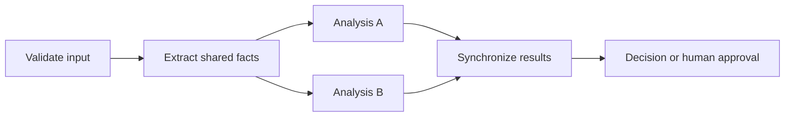

# Day 20: Domain 1 Review

**Date**: 2026-08-31
**Domain**: Plan AI-powered business solutions (25-30%)
**Subtopics**: Data readiness; multi-agent boundaries and orchestration; identity and connector governance; ROI/TCO; build-buy-extend; platform and model selection; AI Center of Excellence
**Estimated study time**: 1 hr
**Research verified**: 2026-08-31 against current Microsoft Learn pages

---

## TL;DR (60-second skim)

- Treat grounding-data readiness as a release gate: complete, standardize, deduplicate, classify, permission, and validate data before a controlled pilot.
- Split agents when trust, authorization, duties, or audit requirements differ materially; more agents are not automatically better.
- Model dependencies first: prerequisites run sequentially, independent analyses can run in parallel, and dependent decisions wait at a synchronization point.
- For supported Azure workloads, prefer managed identity over stored credentials, then grant only required data-plane roles at the narrowest practical scope.
- A maker's ability to create a connector does not bypass Power Platform data policies; creation and governed use are separate gates.
- Defensible ROI uses measured baselines, adoption-adjusted realized benefits, full lifecycle TCO, and sensitivity scenarios.
- Follow adopt, then extend, then custom-build; select Copilot Studio for maker-managed low-code business agents and Foundry for material developer/runtime control.
- Use the smallest evaluated model that meets quality and operational constraints, and use a federated or advisory CoE to scale standards without owning every delivery.

---

## Learning Objectives

After this session, you should be able to assess grounding-data readiness; place agent boundaries at meaningful trust and authority boundaries; derive sequential, concurrent, and synchronized stages from dependencies; and separate authentication, authorization, connector creation, and DLP decisions.

You should also be able to construct an auditable ROI/TCO case; choose among prebuilt capability, extension, Copilot Studio, Foundry, SLMs, and customization; and define a scalable AI CoE with central guardrails and domain accountability.

---

## Key Concepts

### 1. Data readiness comes before the pilot

The AB-100 study guide explicitly measures review of grounding data for accuracy, relevance, timeliness, cleanliness, and availability, plus organizing business data for use by AI systems.

Use this release sequence: define the decision and required fields; profile completeness, validity, consistency, duplication, freshness, relevance, and ownership; remediate and normalize; classify and label; verify permissions and security trimming; test retrieval and denial behavior; then pilot with success and rollback criteria.

**Critical weak-area rule:** a smaller production audience reduces blast radius, but it does not repair missing fields, duplicates, absent labels, excessive permissions, or bad retrieval. A pilot validates a ready design; it is not a substitute for readiness.

Purview sensitivity labels for SharePoint and OneDrive can protect Office files and preserve label/encryption behavior in supported experiences. Labels and permissions solve related but distinct problems: classification/protection does not grant access, and access does not prove correct classification.

### 2. Agent boundaries follow trust and authorization

Use multiple agents only when decomposition creates a real control or engineering benefit. Strong signals are public versus privileged work; read versus consequential write/approval; different identities, data scopes, owners, or regulatory duties; separation of duties; independent audit needs; or specialist contexts that one agent cannot manage reliably.

For each agent, define an explicit contract: purpose, accepted inputs, allowed tools, identity, data scope, output schema, failure behavior, human checkpoint, owner, and audit events.

**Critical weak-area rule:** never give a public-information agent a broad ERP approval identity merely because both tasks occur in one business process. Separate trust zones deserve separate workload identities, permissions, controls, and audit paths.

Do not split merely because multiple data sources exist, because multi-agent sounds advanced, or because it is assumed to lower cost. Every extra agent adds orchestration, evaluation, latency, observability, and failure-mode complexity.

### 3. Orchestration is a dependency graph

Start with data dependencies, not agent count. Use sequential flow when one step requires another's output, concurrency for independent branches with available input, a synchronization barrier when downstream work needs all results, a handoff when control moves to a specialist, and a human checkpoint for consequential action.

A common pattern is `extract -> parallel analyses -> join -> decision`. Extraction must finish first. Independent analyses can then fan out. The final decision must wait for all required results.

**Critical weak-area rule:** do not run dependent work too early, but do not serialize independent work without reason. Parallelism can reduce latency; it cannot violate dependencies.



### 4. Managed identity authenticates; RBAC authorizes

Managed identities let supported Azure resources obtain Microsoft Entra tokens without the application storing or rotating credentials.

- A **system-assigned** identity belongs to one Azure resource and is deleted with it.
- A **user-assigned** identity is an independent Azure resource and can be attached to multiple supported resources.
- Either identity still requires explicit authorization to each target service.

For an Azure-hosted workload, enable the appropriate managed identity, identify the exact data-plane operations, grant the narrowest suitable built-in role at the narrowest practical scope, avoid broad control-plane roles, test allowed and denied operations, and monitor access.

**Critical weak-area rule:** managed identity removes stored-secret handling; it does not bypass RBAC. Encryption of a client secret reduces one exposure path but retains secret issuance, storage, rotation, leakage, and expiry risks.

### 5. Connector creation and DLP are separate gates

A custom connector definition describes how Power Platform reaches an API. Creation requires the relevant environment privileges and technical configuration. Governed use is evaluated separately.

Power Platform data policies classify connectors into groups such as Business, Non-Business, or Blocked. Data cannot be freely combined across incompatible groups. Custom connectors can be classified through policy rules, including host URL patterns, and can be blocked or restricted like other connectors.

Think in four gates:

| Gate                  | Question                                                                |
| --------------------- | ----------------------------------------------------------------------- |
| Authoring             | Can the maker define or import the connector?                           |
| Connection            | Can a valid connection authenticate to the API?                         |
| DLP                   | May this connector be used and combined with the other connectors here? |
| Runtime authorization | May this identity perform this operation on this data?                  |

**Critical weak-area rule:** successful creation is not a policy exemption. Recreating or renaming a connector does not provide a legitimate DLP bypass.

### 6. ROI means realized value over lifecycle cost

Begin with a measured current-state baseline: volume, cycle time, labor effort, error/rework rate, escalation rate, quality, risk events, and customer or employee outcomes.

$$\text{Realized benefit} = \text{Eligible volume} \times \text{Adoption} \times \text{Success rate} \times \text{Value per success}$$

$$\text{ROI} = \frac{\text{Realized benefits} - \text{TCO}}{\text{TCO}} \times 100\%$$

TCO includes discovery, data remediation, licenses, model consumption, integration, testing, evaluation, security, monitoring, support, change management, exception handling, governance, retraining or prompt maintenance, and retirement.

Present conservative, expected, and optimistic scenarios. Vary adoption, success rate, volume, model cost, exception rate, and time saved. State assumptions and owners so the business case can be remeasured after rollout.

### 7. Build-buy-extend is a ladder

Use this order: **adopt/buy** when supported product capability satisfies the commodity need and controls; **extend** for validated gaps in knowledge, instructions, connectors, actions, or workflows; **custom-build** only when differentiation, runtime behavior, integration, deployment, or control requirements cannot be met adequately by the first two options.

Code ownership is not business value by itself. A custom build adds engineering, evaluation, operations, security, and lifecycle obligations. Reassess requirements before escalating to the next rung.

### 8. Copilot Studio versus Microsoft Foundry

| Requirement signal                                                                        | Better starting point |
| ----------------------------------------------------------------------------------------- | --------------------- |
| Graphical low-code authoring and maker ownership                                          | Copilot Studio        |
| Approved organizational knowledge and Power Platform connectors/workflows                 | Copilot Studio        |
| Publishing to common business channels with managed agent lifecycle                       | Copilot Studio        |
| Code-first application, SDK integration, custom runtime, or bespoke orchestration         | Microsoft Foundry     |
| Broad model catalog, custom evaluation/observability, and developer-controlled deployment | Microsoft Foundry     |

Copilot Studio is Microsoft's graphical low-code studio for agents and workflows connected to organizational data and systems. Foundry is the developer platform when custom code, models, agents, evaluation, tracing, deployment, or runtime control is material.

Select from stated requirements. Do not choose Foundry merely because it offers more control when the business specifically requires maker-managed low-code maintenance.

### 9. Model selection: smallest adequate evaluated model

Evaluate representative and edge-case data for task quality and error cost, latency and throughput, context and modality, deployment target and region, hardware or edge constraints, operating cost, safety, observability, and support.

If a catalog SLM meets the acceptance criteria, use it and monitor it. Larger does not always mean better for a narrow task. Fine-tuning or other customization is justified only by a demonstrated gap that prompts, grounding, tools, or a suitable catalog model cannot adequately close.

### 10. AI CoE: standards centrally, delivery with domains

Microsoft's Cloud Adoption Framework describes a multidisciplinary AI CoE that sets strategy and standards, supports governance/security, enables teams, prioritizes use cases, manages reusable assets, and measures value.

A practical federated model assigns:

- **CoE/platform function:** standards, reference architectures, guardrails, intake, reusable components, education, architecture review, portfolio visibility, and shared metrics.
- **Domain product teams:** accountable product ownership, data stewardship, implementation, adoption, operations, risk acceptance, and realized business outcomes.

Early programs may centralize scarce expertise. As adoption matures, evolve toward an advisory/federated model and embed delivery and governance in platform/domain operations. A CoE that permanently implements every agent becomes an approval and knowledge bottleneck.

---

## Decision Frameworks

Apply these gates in order: measurable value; ready and governed data; adopt/extend/build choice; maker-led versus developer-led platform; trust and authority boundaries; dependency-driven flow; acting identity and authorization; DLP/approval/compliance controls; and adoption-adjusted value versus lifecycle TCO.

### Fast exam heuristics

- **Incomplete/duplicate/unlabeled data:** remediate and validate before pilot.
- **Public read plus privileged write/approval:** split trust boundaries and identities.
- **Shared input, independent analyses:** parallelize after prerequisites; join before dependent action.
- **Azure host plus stored workload secret:** prefer managed identity plus scoped RBAC.
- **Connector exists but use fails after policy:** inspect DLP classification/group compatibility.
- **Huge claimed savings:** demand baseline, adoption factor, lifecycle TCO, and sensitivity analysis.
- **Commodity feature already licensed:** adopt first; extend only validated gaps.
- **Makers, SharePoint, standard connectors:** start with Copilot Studio.
- **Edge, latency, cost, adequate SLM quality:** choose the evaluated SLM before customization.
- **CoE asked to own every build:** retain central standards but federate accountable delivery.

---

## Common Traps & Misconceptions

| Trap                                               | Correct reasoning                                                                 |
| -------------------------------------------------- | --------------------------------------------------------------------------------- |
| A limited pilot fixes poor data                    | It only limits exposure; readiness controls still precede it.                     |
| Every data source needs a separate agent/model     | Split only for material boundaries, specialization, or control needs.             |
| Everything parallel is fastest                     | Dependent stages cannot start before required inputs exist.                       |
| Everything sequential is safest                    | Independent branches can run concurrently and synchronize later.                  |
| Managed identity grants access automatically       | It authenticates; RBAC or service authorization grants access.                    |
| An encrypted secret is equivalent to no secret     | It still creates credential lifecycle and exposure risk.                          |
| A connector that can be created can always be used | DLP classification, grouping, and blocking are separate policy gates.             |
| Hours saved multiplied by salary proves ROI        | Adoption, success, exceptions, and full TCO determine realized value.             |
| Custom code/model is inherently strategic          | Prefer adequate supported capability unless a real gap or differentiator exists.  |
| Largest model is safest                            | Select by evaluated quality plus latency, cost, deployment, and risk constraints. |
| Central CoE must implement everything              | Centralize capability and guardrails; federate mature delivery accountability.    |

---

## Cross-Domain Quiz Question Refreshers

All ten Day 20 assigned questions are Domain 1. There are **no outside-domain carryover questions today**. These Domain 3 controls still support sound Domain 1 architecture decisions:

| Supporting concept        | Key fact                                                                 | Domain 1 architecture relevance                          |
| ------------------------- | ------------------------------------------------------------------------ | -------------------------------------------------------- |
| Least privilege           | Grant only required actions at the narrowest practical scope             | Determines agent and identity boundaries during planning |
| Separation of duties      | Avoid privilege aggregation across low-risk and consequential work       | Justifies multi-agent separation at trust boundaries     |
| DLP                       | Connector classification and permitted combinations are policy decisions | Constrains platform and integration strategy             |
| Information protection    | Labels, permissions, and retrieval validation are distinct controls      | Makes grounding data ready for safe use                  |
| Human oversight and audit | Consequential actions need accountable intervention and evidence         | Shapes orchestration checkpoints and ownership           |

---

## Quiz Alignment

This table maps coverage without revealing answer letters or reproducing question wording.

| Question ID | Concept covered                                                      | Distractor trap neutralized                                              |
| ----------- | -------------------------------------------------------------------- | ------------------------------------------------------------------------ |
| q181        | Data readiness, labels, permissions, validation, then pilot          | Treating a small rollout as a substitute for source remediation          |
| q182        | Agent separation at public versus privileged trust boundaries        | Using one broad identity for operational simplicity                      |
| q183        | Sequential prerequisite, parallel fan-out, synchronization, decision | Making every stage parallel or every stage sequential                    |
| q184        | Managed identity plus narrowly scoped data-plane RBAC                | Storing workload credentials or assuming identity replaces authorization |
| q185        | Connector authoring versus DLP-governed use                          | Treating successful creation as a permanent policy exemption             |
| q186        | Baselines, realized adoption, lifecycle TCO, sensitivity analysis    | Presenting theoretical labor savings as complete ROI                     |
| q187        | Adopt, extend, custom-build decision ladder                          | Building custom capability before validating a prebuilt fit              |
| q188        | Copilot Studio versus Foundry platform signals                       | Choosing custom runtime without a material custom requirement            |
| q189        | Smallest model meeting evaluated quality and constraints             | Selecting by model size or customizing without a demonstrated gap        |
| q190        | Federated/advisory CoE with accountable domain delivery              | Turning the central CoE into the permanent implementation owner          |

---

## Pre-Quiz Checklist

- [ ] I can state why data remediation and protection precede a pilot.
- [ ] I can identify a material trust/authorization boundary that warrants separate agents.
- [ ] I can draw prerequisite, fan-out, synchronization, and decision stages.
- [ ] I can explain authentication versus authorization in one sentence.
- [ ] I can distinguish connector creation, connection authentication, DLP, and runtime permission.
- [ ] I can calculate ROI from realized benefits and full TCO, not theoretical savings.
- [ ] I can apply adopt -> extend -> custom-build without technology bias.
- [ ] I can choose Copilot Studio versus Foundry from ownership and runtime requirements.
- [ ] I can defend an SLM choice using measured quality, latency, deployment, and cost.
- [ ] I can divide CoE responsibilities from domain-team delivery accountability.

---

## Related Questions in questions.json

Exactly ten assigned questions: `q181` through `q190`. They cover all ten concepts in the Quiz Alignment table. No answer keys are included here.

Run from the workspace root with zero carryover to preserve the exact ten-question Day 20 assignment:

```powershell
python ".\AB-100 Prep\quiz_runner.py" ".\AB-100 Prep\questions.json" --day-lock 20 --carryover 0 --shuffle --open-images --web --port 8765 --output ".\AB-100 Prep\session-results.json"
```

Do not mark Day 20 complete until the quiz result is reviewed.

---

## Sources (verified during this session)

- [Study guide for Exam AB-100](https://learn.microsoft.com/en-us/credentials/certifications/resources/study-guides/ab-100)
- [AI Agent Orchestration Patterns](https://learn.microsoft.com/en-us/azure/architecture/ai-ml/guide/ai-agent-design-patterns)
- [Managed identities for Azure resources](https://learn.microsoft.com/en-us/entra/identity/managed-identities-azure-resources/overview)
- [Best practices for Azure RBAC](https://learn.microsoft.com/en-us/azure/role-based-access-control/best-practices)
- [Custom connector parity in Power Platform data policies](https://learn.microsoft.com/en-us/power-platform/admin/dlp-custom-connector-parity)
- [Cloud Adoption Framework AI strategy](https://learn.microsoft.com/en-us/azure/cloud-adoption-framework/ai/strategy)
- [Establish an AI Center of Excellence](https://learn.microsoft.com/en-us/azure/cloud-adoption-framework/ai/center-of-excellence)
- [Microsoft Copilot Studio overview](https://learn.microsoft.com/en-us/microsoft-copilot-studio/fundamentals-what-is-copilot-studio)
- [What is Microsoft Foundry?](https://learn.microsoft.com/en-us/azure/foundry/what-is-foundry)
- [Microsoft Foundry Models overview](https://learn.microsoft.com/en-us/azure/foundry-classic/concepts/foundry-models-overview)
- [Enable sensitivity labels for files in SharePoint and OneDrive](https://learn.microsoft.com/en-us/purview/sensitivity-labels-sharepoint-onedrive-files)

---

## Notes (your own words - fill this in after studying)

Summarize the five weak-area rules in your own words, then record one decision rule to revisit after the quiz:
