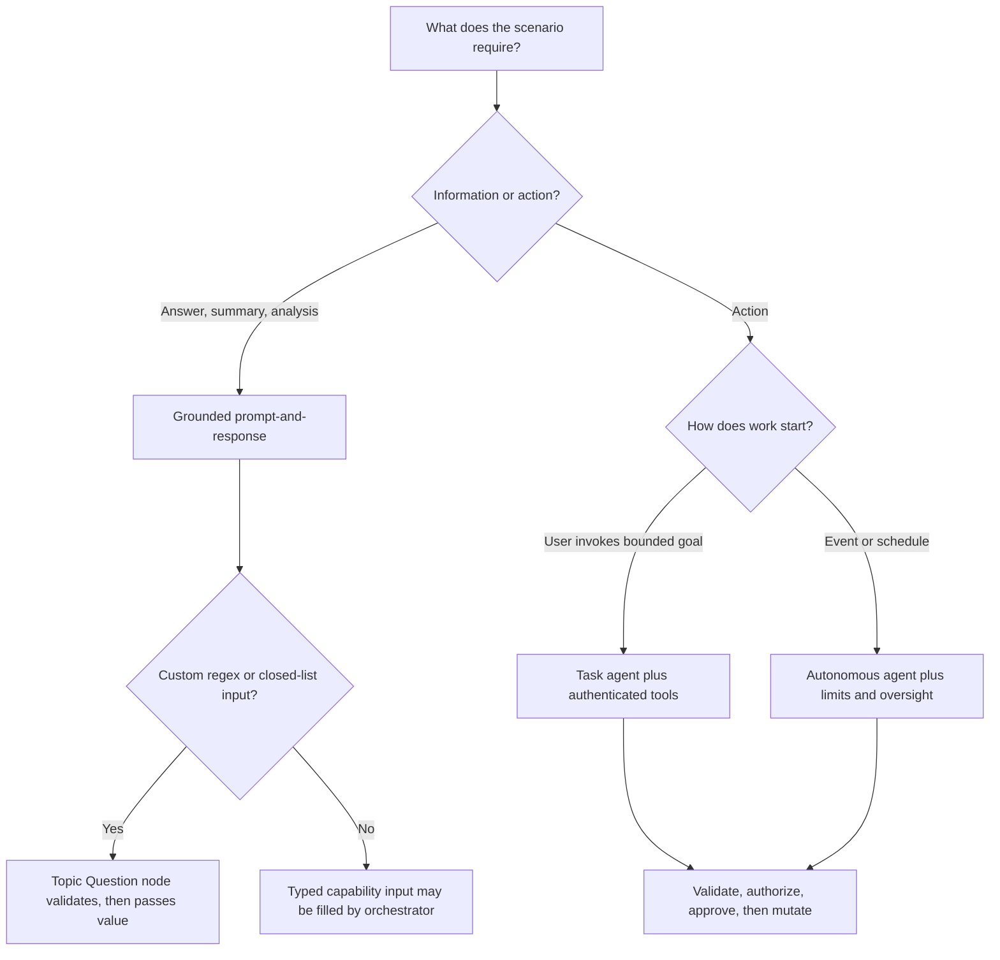

# Day 21: Domain 2 Review

**Date**: 2026-08-31 (completed early; planned date 2026-09-01)
**Domain**: Design AI-powered business solutions (25–30%)
**Subtopics**: Dynamics 365 business terms; agent types; classic and generative orchestration; prompt validation; MCP; Computer Use; SharePoint grounding; finance and operations knowledge and actions
**Estimated study time**: 1 hour

---

## TL;DR (60-second skim)

- Ground organization-specific language in authoritative records, fields, relationships, and representative examples; instructions alone do not define reliable business semantics.
- Classify agents by behavior: informational prompt-to-response, user-invoked bounded task, or event-driven autonomous operation.
- In classic orchestration, unmatched input belongs to the `Fallback` system topic (`On Unknown Intent`), with bounded clarification before `Escalate`.
- Generative topic and tool inputs do not directly support custom closed-list or regex entities; collect them through a topic `Question` node and pass the validated value onward.
- Structured prompt output and temperature 0 do not make model output infallible; validate schema and allowed values, test broadly, and control consequential actions.
- MCP exposes changing tools and resources dynamically in Copilot Studio and requires generative orchestration.
- Sharing an agent never enlarges the user's source permissions or transactional authority.
- Finance and operations generative help consults configured custom knowledge before optional general sources; official public documentation remains a grounding source.

---

## Learning Objectives

After this session, you should be able to:

- Translate business vocabulary into explicit, testable Dynamics 365 grounding definitions.
- Distinguish prompt-and-response, task, and autonomous agent patterns from scenario cues.
- Design classic fallback behavior without broad catchall topics stealing valid intents.
- Apply the custom-entity workaround for generatively orchestrated topic and tool inputs.
- Separate probabilistic semantic work from deterministic validation, authorization, approval, and writes.
- Select MCP and Computer Use appropriately and configure their orchestration, identity, and supervision boundaries.
- Explain why sharing/discoverability, grounding access, and action authority are separate gates.
- Apply finance and operations knowledge-source precedence correctly.

---

## Key Concepts

### 1. Dynamics 365 business terms are grounded definitions

A **business term** is organization-specific language connected to business data. Treat it as a semantic contract, not a slogan in agent instructions. Define the employee-facing term, authoritative table, determining fields, required relationships, missing/conflicting-data behavior, and representative positive, negative, and boundary records.

Customer Service custom record summaries can select record types and fields and describe both in natural language. Related-record designs also identify the parent-reference relationship, ordering field, and display field. Runtime summaries remain subject to Dataverse access controls. Narrow, authoritative grounding is more dependable than vague prose or broad access; more access does not repair ambiguous semantics.

### 2. Classify the agent by trigger, scope, and side effects

Classify by trigger, scope, and side effects, not merely by LLM or tool use:

| Dimension | Prompt and response | Task agent | Autonomous agent |
| --- | --- | --- | --- |
| Start | User asks a question | User invokes a bounded goal | Event, schedule, or condition can start it |
| Work | Retrieve, reason, summarize, draft | Execute a defined multistep workflow | Monitor and act without a new user prompt |
| Side effects | Usually none | May use tools and update systems | May use tools and update systems |
| Control focus | Grounded answer quality | Completion, validation, approval | Trigger safety, authority, limits, oversight |

An informational CRM request that retrieves permitted records and returns analysis without mutation is prompt-and-response. Multiple steps or tools can form a task agent when the user invokes a bounded operation. Autonomy is primarily about event- or schedule-started work proceeding without immediate user initiation.

### 3. Classic fallback is not a catchall business topic

In classic orchestration, `Fallback` triggers through `On Unknown Intent` when no topic matches. It has no trigger phrases. The documented default asks the user to rephrase no more than twice, then redirects to `Escalate`. `Multiple Topics Matched` instead handles ambiguity among eligible topics. Broad “help/problem/question” topics can steal traffic and hide recognition gaps.

**Bounded pattern:** acknowledge uncertainty → ask a focused clarification → allow limited retry → escalate or offer a safe alternative.

### 4. Generative orchestration selects capabilities by contracts

Generative orchestration can select and sequence topics, tools, agents, and knowledge sources. Selection depends heavily on capability names and descriptions, plus input/output names and descriptions.

Good capability contracts specify:

- What the capability does and does not do.
- When it should be selected.
- Required and optional inputs, including format expectations.
- Typed outputs and meaningful failure states.
- Side effects and approval requirements.

This supports multi-intent requests without creating a hard-coded topic for every phrasing. It does not remove the need for deterministic business controls.

#### Critical limitation: custom entities as inputs

Copilot Studio documentation states that topic and tool input parameters do **not yet directly support custom entities**, specifically closed lists and regex entities.

Use this pattern instead:

1. Route into a topic.
2. Add a `Question` node.
3. Configure the Question node to identify the custom closed-list or regex entity.
4. Reprompt or branch when the value is invalid or absent.
5. Store the validated result in a variable.
6. Pass that value to the topic, tool, flow, or action that needs it.

Do not weaken validation, turn the value into a trigger phrase, or assume the planner will infer a required identifier. For IDs such as asset tags, deterministic validation is part of the input contract.

### 5. Prompt outputs require runtime controls

A prompt suits semantic summarization, extraction, classification, and drafting; it is not a deterministic policy engine. Temperature 0 does not prove factuality or business correctness. JSON proves parseability, not evidence, allowed values, or safety.

Define and parse an explicit schema; validate required fields, types, ranges, and enums; provide an “insufficient information” path; test representative, boundary, malformed, and adversarial inputs; and gate consequential writes with deterministic authorization and approval. Agent flows or authenticated tools should own retries, branching, approvals, persistence, and failures, with prompts used as bounded semantic steps.

### 6. MCP is a dynamic capability boundary

MCP connects Copilot Studio to a standards-based server. **Resources** are file-like contextual data, **tools** are callable functions, and **prompts** are protocol templates; Copilot Studio currently supports MCP tools and resources. The server publishes names, descriptions, inputs, and outputs, and Copilot Studio dynamically reflects additions, updates, and removals.

Generative orchestration is required so the agent can select advertised capabilities from intent. External MCP still requires assessment of server trust, authentication, authorization, data exposure, side effects, and failures.

### 7. Computer Use identity and supervision

Use Computer Use for visible mouse/keyboard interaction when no suitable API or connector exists. Maker-provided credentials are the default and can suit autonomous scenarios, but shared users may act with the author's access. End-user credentials preserve each interacting person's role boundary and require each user to have machine access.

Human supervision contacts an authorized, context-aware reviewer for potentially harmful instructions. The response time limit bounds the pause; expiry stops the run.

### 8. Sharing does not override source security

Sharing and discoverability govern who can find or chat with an agent, not which source records they can retrieve. SharePoint and OneDrive retain existing permissions and sensitivity labels; users do not inherit the owner's access, and organization-wide sharing grants no restricted-file rights. Keep agent access, authentication, source authorization, and action authorization as separate gates.

### 9. Knowledge retrieval is not transactional authority

A knowledge source supports retrieval and Q&A; it grants neither connectivity nor permission to approve, create, or update records. Transactions need an API/connector tool, authenticated runtime identity, scoped authorization, input and business-rule validation, consequential-action approval, and appropriate idempotency, error handling, and audit evidence. More indexed records, general model knowledge, or fine-tuning changes neither connectivity nor authority.

### 10. Finance and operations generative-help precedence

Finance and operations in-app help is grounded in official public documentation. Administrators can add custom files or SharePoint sources and optionally enable general-question content. Consult configured custom knowledge first; after it is exhausted, optional model knowledge, Bing-identified web content, and other enabled sources can contribute. General-question enablement neither puts web content first nor disables public-documentation grounding.

---

## Decision Frameworks



## Comparisons

| Need | Knowledge | Prompt | Tool/action | Agent flow |
| --- | --- | --- | --- | --- |
| Retrieve grounded facts | Primary fit | Can consume facts | Not required unless source is API-only | Can coordinate retrieval |
| Summarize/classify/draft | Supplies evidence | Primary semantic fit | Not usually | Coordinates prompt use |
| Update or approve a record | Does not grant authority | Must not own authority | Performs authenticated operation | Owns deterministic sequence and controls |
| Retry/branch/approval | No | Probabilistic, poor fit | Exposes operation/error | Primary deterministic fit |

| Scenario cue | Prefer | Avoid the trap |
| --- | --- | --- |
| Stable authored intents and wording | Classic orchestration | Broad catchall triggers |
| Dynamic selection across changing capabilities | Generative orchestration | One topic per possible request |
| Standards-based tools/resources | MCP | Static copies in prompts |
| GUI with no API | Computer Use | Treating screenshots as an integration |
| Strict custom regex/closed list | Question node in a topic | Direct custom entity parameter |

---

## Important Details for Exam

- Domain 2 is currently 25–30% of AB-100.
- Fallback uses `On Unknown Intent`; the default path allows no more than two rephrase prompts before escalation.
- Fallback has no trigger phrases.
- Closed-list and regex custom entities are not directly supported as generative topic/tool input parameters.
- Capability descriptions and parameter descriptions strongly influence generative selection.
- MCP changes on the server are reflected dynamically in Copilot Studio.
- Copilot Studio requires generative orchestration to use MCP.
- End-user Computer Use credentials preserve the initiating user's identity boundary.
- Computer Use supervision has a response time limit; expiry stops the run.
- Agent Builder currently documents up to 100 SharePoint files, one SharePoint list, and 50 OneDrive files per agent; limits can change, so verify Learn if tested explicitly.
- SharePoint/OneDrive content retains existing permissions and sensitivity labels.
- Finance and operations data can be added as structured knowledge for Q&A, but actions must be added separately for transactions.

---

## Common Traps & Misconceptions

- **Vague instruction trap:** repeating a business term in instructions does not map it to authoritative data.
- **Broad-access trap:** granting more tables is not a substitute for semantic precision or least privilege.
- **Agent-type trap:** multiple tool calls do not automatically make an agent autonomous.
- **Fallback trap:** `Multiple Topics Matched` handles ambiguity, not unmatched input.
- **Catchall trap:** generic triggers can suppress valid business topics and hide recognition gaps.
- **Entity trap:** generative orchestration's ability to ask for inputs does not imply direct support for custom regex or closed-list parameter types.
- **Structured-output trap:** syntactically valid JSON can still contain unsupported or dangerous values.
- **Temperature trap:** zero temperature reduces randomness; it does not create a correctness guarantee.
- **MCP trap:** fine-tuning on tool names does not connect to or execute server capabilities.
- **Identity trap:** sharing a Computer Use agent with maker credentials can expose the maker's effective access.
- **Permission trap:** agent sharing does not override SharePoint permissions or labels.
- **Authority trap:** retrieval/Q&A does not grant write or approval rights.
- **Precedence trap:** optional general content is considered after configured custom knowledge is exhausted, not before.

---

## Quick Reference Card

| Question to ask | Design response |
| --- | --- |
| What authoritative data defines this term? | Map tables, fields, relationships, and test records |
| Is the result informational or mutating? | Knowledge/prompt for information; authenticated tools for mutation |
| User-triggered, event-triggered, or scheduled? | Prompt-response/task versus autonomous |
| No classic topic matched? | Fallback → bounded rephrase → Escalate |
| Custom regex or closed-list input? | Topic Question node → validate → pass onward |
| Dynamic standards-based capabilities? | MCP plus generative orchestration |
| Shared GUI automation with different roles? | End-user credentials plus supervision |
| Agent is shared widely? | Recheck source permissions; sharing adds no data rights |
| Prompt emits valid JSON? | Still validate schema, values, evidence, and action boundary |
| Finance help has custom and general sources? | Custom first; optional general after exhaustion |

---

## Question-Alignment Checklist

| ID | Coverage in this reference | Distractor pattern to recognize |
| --- | --- | --- |
| q061 | Business terms and authoritative record mapping | Vague instructions or excessive access |
| q068 | Agent classification by trigger and side effects | Equating any multistep reasoning with task/autonomy |
| q071 | Classic fallback, bounded retry, escalation | Catchall triggers or wrong system topic |
| q076 | Custom regex/closed-list input limitation | Assuming every entity type is a direct parameter |
| q080 | Prompt schema/value validation and oversight | Treating temperature or JSON as correctness proof |
| q084 | MCP dynamic tools/resources and orchestration | Static prompts, classic routing, or fine-tuning |
| q086 | Computer Use identity and supervision | Shared elevated identity or unbounded execution |
| q090 | SharePoint permissions and labels | Confusing sharing with source authorization |
| q099 | Knowledge versus transactional actions | Assuming retrieval grants write/approval authority |
| q100 | Finance help source precedence | Putting general/web content before custom knowledge |

All 10 assigned Day 21 IDs are covered. No correct option letters are reproduced here.

## Cross-Domain Quiz Question Refreshers

None. All assigned Day 21 questions map to Domain 2 sections 2.1, 2.2, or 2.3. Security, authorization, validation, and supervision appear as required design boundaries within those Domain 2 scenarios, not as separate Domain 3 carryover questions.

---

## Related Questions in questions.json

- `q061`, `q068`, `q071`, `q076`, `q080`, `q084`, `q086`, `q090`, `q099`, `q100`
- Scope: exactly 10 Day 21 review questions; carryover must remain disabled for this run.

Quiz command:

```powershell
Set-Location 'D:\Projects\microsoft-exam-prep\AB-100 Prep'
python quiz_runner.py questions.json --day-lock 21 --carryover 0 --shuffle --web --port 8765
```

The day lock reads these IDs from `day-assignments.json`; `--carryover 0` prevents any additional questions.

---

## Sources (verified during this session)

- [Study guide for Exam AB-100](https://learn.microsoft.com/en-us/credentials/certifications/resources/study-guides/ab-100)
- [Configure custom record summaries for service representatives](https://learn.microsoft.com/en-us/dynamics365/customer-service/administer/copilot-enable-custom-record-summaries)
- [Configure the system fallback topic](https://learn.microsoft.com/en-us/microsoft-copilot-studio/authoring-system-fallback-topic)
- [Orchestrate agent behavior with generative AI](https://learn.microsoft.com/en-us/microsoft-copilot-studio/advanced-generative-actions)
- [Use prompts to make your agent or agent flow perform specific tasks](https://learn.microsoft.com/en-us/microsoft-copilot-studio/nlu-prompt-node)
- [Extend your agent with Model Context Protocol](https://learn.microsoft.com/en-us/microsoft-copilot-studio/agent-extend-action-mcp)
- [Automate web and desktop apps with Computer Use](https://learn.microsoft.com/en-us/microsoft-copilot-studio/computer-use)
- [Add knowledge sources to your declarative agent in Microsoft 365 Copilot](https://learn.microsoft.com/en-us/microsoft-365/copilot/extensibility/agent-builder-add-knowledge)
- [Chat with finance and operations data](https://learn.microsoft.com/en-us/dynamics365/fin-ops-core/dev-itpro/copilot/chat-with-fno-data)
- [Generative help and guidance with Copilot](https://learn.microsoft.com/en-us/dynamics365/fin-ops-core/fin-ops/copilot/copilot-generative-help)

Sources were rendered and checked live on 2026-08-31. Preview capabilities and explicit limits can change; use the linked current documentation when an exam item asks for a version-sensitive value.

---

## Notes (your own words — fill this in after studying)
- Result: 9/10 (90%) in 52.1 seconds; no skipped or ungraded questions.
- Review q090: Sharing or organization-wide discoverability controls who can find and chat with an agent. It does not override each user's SharePoint permissions or sensitivity labels.
