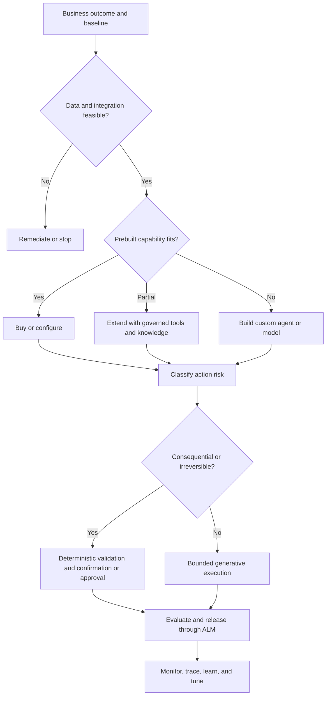

# Day 25: Case Study Practice + Mixed Quiz

**Date**: 2026-09-03
**Domain**: Mixed — Plan (25–30%), Design (25–30%), Deploy (40–45%)
**Subtopics**: CHG-style case-study analysis, weighted mixed-domain decisions, data readiness, platform and orchestration choices, grounding permissions, monitoring, evaluation, ALM, and workload security
**Estimated study time**: 2 hrs
**Question set**: q201–q210 (3 D1, 3 D2, 4 D3)

> All scenarios and q201–q210 are original AI-generated practice material grounded in the Microsoft Learn sources listed below. They are not copied from Microsoft exams or assessments.

---

## Session Order and Timebox

| Time | Activity | Outcome |
| --- | --- | --- |
| 0–15 min | Read TL;DR, objectives, and the case-study method | Establish a repeatable decision process |
| 15–55 min | Work the three CHG-style cases without the debrief | Practice extracting requirements and sequencing decisions |
| 55–80 min | Read Key Concepts, comparisons, and traps | Consolidate the tested boundaries |
| 80–100 min | Run the Day 25 mixed quiz | Answer q201–q210 without notes |
| 100–115 min | Review quiz explanations and the case debrief | Replace incorrect rules with precise ones |
| 115–120 min | Fill in Notes | Capture one-line recall rules for weak distinctions |

**No-spoiler boundary:** Complete the case prompts and q201–q210 before reading **Post-Practice Case Debrief**. The pre-quiz sections identify concepts and traps but do not reveal quiz answers.

---

## TL;DR (60-second skim)

- Start case studies by separating business outcomes, constraints, current state, and required future state; do not select a product from the first recognizable keyword.
- Validate grounding data for accuracy, relevance, timeliness, cleanliness, and availability, including the user’s runtime permission to retrieve it.
- Match the platform and orchestration pattern to maker/developer needs, integration depth, autonomy, risk, and deterministic control requirements.
- Generative orchestration can select and chain topics, tools, agents, and knowledge, but important actions still need deterministic validation, confirmation, or approval boundaries.
- SharePoint grounding is permission-trimmed for the signed-in user; registering a site does not grant users access to its content.
- Use Computer Use when an app lacks a suitable API; prefer a governed connector or tool when a stable API exists.
- Treat monitoring, evaluation, release gates, versioning, rollback, least privilege, and audit evidence as one production lifecycle.
- Allocate exam attention by weight: roughly 3 Plan decisions, 3 Design decisions, and 4 Deploy decisions in every ten-question mental sample.

---

## Learning Objectives

After this session, you should be able to:

1. Parse a long case study into facts, requirements, constraints, risks, and decision points.
2. Sequence architecture work from business outcome and data readiness through design, release, and operations.
3. Distinguish Copilot Studio generative orchestration, deterministic topics/flows, API-backed tools, SharePoint knowledge, and Computer Use.
4. Select monitoring and evaluation evidence that matches the failure being investigated.
5. Design solution-aware ALM and least-privilege workload access without embedding credentials.
6. Apply the AB-100 domain weights when timeboxing a mixed review.

---

## Case-Study Method

### The five-pass read

**Pass 1 — Organization and outcome**

Write down the organization, users, process, baseline pain, and measurable target. Ignore products on the first pass.

**Pass 2 — Hard constraints**

Mark regulatory obligations, geography, identity, data boundaries, deadlines, budget, latency, accessibility, and channel requirements. A hard constraint eliminates options; it is not merely a preference.

**Pass 3 — Current-state assets and gaps**

Separate reusable assets from liabilities. Existing Microsoft 365, Dynamics 365, Power Platform, Azure, APIs, and knowledge sources can reduce delivery effort, but existing licensing does not prove data quality, authorization, or fitness.

**Pass 4 — Requirement words**

Highlight words such as *first*, *before*, *current*, *only*, *least privilege*, *on behalf of*, *unattended*, *reversible*, *measurable*, *approved*, and *auditable*. They usually identify sequence or boundary.

**Pass 5 — Decision and evidence**

For each question, write:

- Lifecycle stage: Plan, Design, or Deploy.
- Object: use case, data, model, agent, topic, tool, identity, test, version, or metric.
- Boundary: business, trust, user permission, environment, release, or operational cohort.
- Evidence: what would prove the recommendation works.

### Requirement ledger

| Category | What to capture | Example signal |
| --- | --- | --- |
| Outcome | Baseline, target, owner, time horizon | Reduce average handling time by 20% |
| Data | Source, quality, freshness, availability, classification | Policy pages are current but claims data is siloed |
| User | Persona, channel, accessibility, delegated permissions | Adjusters use Teams and retain record-level access |
| Action | Read-only, reversible, consequential, autonomous | Draft a response versus approve a payment |
| Integration | Stable API, connector, UI-only system, event source | Legacy portal has no supported API |
| Operations | Metrics, traces, transcripts, feedback, alerts | Mobile handoff latency increased after release |
| Governance | Owner, approval, DLP, audit, residency, risk tier | HIPAA data and external model restrictions |
| ALM | Environments, solution components, configuration, rollback | Dev/test/prod with ring deployment |

---

## AI-Generated CHG-Style Case Study 1: Claims Intake Portfolio

### Background

Contoso HealthServices Group (CHG) operates in 12 US states with about 8,500 employees. It uses Microsoft 365 E5, Dynamics 365 Customer Service, Field Service, Power Automate, and a basic Azure data lake. Claims and member data remain split across three legacy systems. Patient information is regulated, and CHG has no mature AI Center of Excellence or governed prompt library.

The CTO wants four agents live within 90 days:

1. A staff policy assistant grounded in SharePoint.
2. A claims-intake assistant that summarizes submissions and requests missing information.
3. An autonomous agent that approves low-value claims.
4. A field-service assistant that updates a legacy scheduling portal.

### Additional facts

- The policy library has duplicate pages, conflicting effective dates, and inconsistent owners.
- The claims systems use different member identifiers and update at different times.
- Adjusters must see only records they are already permitted to access.
- The scheduling portal has no supported API.
- Compliance requires evidence for every automated claim decision.
- Leadership has not defined baseline handling time, target savings, or risk tolerance.

### Practice prompts

1. What should the architect do before selecting the implementation platform for all four use cases?
2. Which data-readiness dimensions are most visibly deficient?
3. Which use case is the clearest candidate for Computer Use, and what operational controls would still be required?
4. Which proposed use case needs the strongest deterministic and human-control boundary?
5. What should be captured in the portfolio record to support ROI and prioritization?

---

## AI-Generated CHG-Style Case Study 2: Employee Policy and Benefits Agent

### Background

CHG wants a Copilot Studio agent in Teams to answer policy questions, explain benefit eligibility, and submit benefit-change requests. Policy content is stored in SharePoint. Eligibility is calculated by a secured HR API. A maker enabled generative orchestration and exposed topics for common requests.

### Additional facts

- SharePoint permissions vary by role, state, and union membership.
- Some policies have encrypted sensitivity labels.
- The HR API requires the current employee identity and returns only that employee’s eligibility.
- A benefit-change topic expects a custom closed-list entity for plan type and a regex entity for employee case code.
- Submitting a benefit change is consequential and must be confirmed.
- A designer proposes copying eligibility tables into the system prompt to improve speed.

### Practice prompts

1. What permission behavior should users expect from SharePoint grounding?
2. Why is the system prompt the wrong place for eligibility data?
3. How should the custom closed-list and regex values be collected given the current generative orchestration limitation?
4. Which controls should surround the benefit-change action?
5. What should tool and topic descriptions communicate to improve orchestration selection?

---

## AI-Generated CHG-Style Case Study 3: Release Regression

### Background

CHG packages its service agent in a Power Platform solution and promotes it through test and production environments. A recent release changed instructions, a connector-backed tool, and two topics. Overall resolution remains stable, but mobile users report slow handoffs and incorrect tool selection.

### Additional facts

- The team validated only a small set of final answer texts.
- Test-panel conversations were assumed to appear in production Monitor analytics.
- An analyst has Analytics Viewer access but cannot open transcripts.
- Developers plan to patch the production agent directly.
- An Azure-hosted helper service stores a client secret for access to a storage account.
- The prior validated solution version and configuration are still available.

### Practice prompts

1. What evidence should the team inspect before changing global instructions?
2. Why might the analyst see metrics but not transcript content?
3. Which evaluation methods would test tool choice, meaning, and conversational quality?
4. What release and rollback approach should replace direct production editing?
5. How should the helper service authenticate to storage, and how should authorization be scoped?

---

## Key Concepts

### 1. Plan from measurable outcomes

An AI use case is not “deploy an agent.” It is a measurable process improvement for a defined population under explicit constraints. Capture the baseline, target, owner, expected benefit, adoption measure, costs, dependencies, and risk.

Use a portfolio funnel:

1. Define business outcome and baseline.
2. Validate data and integration feasibility.
3. Classify autonomy and consequence.
4. Estimate benefit and total cost of ownership.
5. Choose build, buy, or extend.
6. Run a proof of value for material uncertainty.
7. Promote only when evidence meets the gate.

TCO includes licensing and consumption, implementation, integration, data preparation, security, testing, monitoring, support, training, change management, and ongoing model/prompt/knowledge maintenance.

### 2. Grounding data readiness

The AB-100 study guide explicitly calls out five dimensions:

| Dimension | Question | Typical remediation |
| --- | --- | --- |
| Accuracy | Is the content factually correct? | Reconcile against authoritative systems |
| Relevance | Does it support the target task and audience? | Curate scope and remove unrelated material |
| Timeliness | Is it current at decision time? | Define refresh frequency and stale-data behavior |
| Cleanliness | Is it consistent, deduplicated, and well structured? | Normalize identifiers, metadata, and ownership |
| Availability | Can the intended runtime identity retrieve it reliably? | Resolve permissions, connectivity, indexing, and residency |

Availability includes authorization. A document can exist, index successfully, and still be unavailable to a particular user at run time.

### 3. Platform and integration pattern

| Requirement | Strong candidate | Boundary to remember |
| --- | --- | --- |
| Low-code conversational business agent with Power Platform integration | Copilot Studio | Govern tools, topics, knowledge, environments, and maker access |
| Deep code control, custom orchestration/models, Azure-native lifecycle | Microsoft Foundry | Requires developer, evaluation, deployment, identity, and observability discipline |
| Extend employee work in Microsoft 365 | Microsoft 365 Copilot agent | Respect Microsoft 365 context and user permissions |
| Stable external API | Connector or agent tool | Define contract, identity, authorization, retries, and telemetry |
| UI-only Windows/web application | Computer Use | Use generative orchestration; test UI variation and protect consequential actions |

Computer Use interacts with a Windows GUI through a virtual mouse and keyboard. It is useful when no direct API exists. If a stable API exists, a connector or typed tool is usually more deterministic, observable, and maintainable.

### 4. Generative orchestration and deterministic control

Generative orchestration can select and sequence topics, tools, connected agents, and knowledge from their names, descriptions, and inputs. It can ask for missing inputs and combine multiple components in a plan.

Do not give the planner unrestricted authority over irreversible or high-impact actions. Use three control layers:

- **Generative:** low-risk search, summarization, drafting, and reversible assistance.
- **Hybrid:** AI planning with confirmation, limits, or offline approval checkpoints.
- **Deterministic:** fixed validation and execution path for regulated, irreversible, or mission-critical actions.

Current documented limitation: topics and tools do not support custom entities, including closed lists and regex entities, as input parameters under generative orchestration. Collect the value with a **Question** node inside a topic, then validate and pass it onward.

### 5. SharePoint grounding permissions

The full SharePoint knowledge option surfaces only content the signed-in user can access. The user needs at least Read permission. Calls for published agents use the configured end-user authentication and are made on behalf of the chatting user.

Remember these boundaries:

- Registering a SharePoint URL does not grant access.
- Search covers the registered URL and its subpaths, not parents, siblings, or unrelated sites.
- Permission trimming respects sensitivity labels.
- Encrypted, DKE-protected, or password-protected files cannot be extracted for grounding and can return no response even when shown as ready.
- Runtime authorization and content protection remain separate from indexing status.

### 6. Monitoring before tuning

Use Copilot Studio Monitor to move from aggregate outcomes to the affected cohort, component, and session. Segment by time, channel, version, outcome, topic/tool, latency, escalation, or user group where available.

Current operational facts:

- Monitor data is available for up to 360 days.
- Session details and transcript information are available for the last 28 days.
- Analytics timestamps are UTC.
- Test-panel activity is not included in Monitor analytics.
- Analytics Viewer grants limited Monitor access.
- Transcript access also requires the Bot Transcript Viewer security role.

A stable aggregate can hide a severe channel-specific regression. Diagnose the narrow path before changing shared instructions.

### 7. Evaluation matched to risk

Choose methods based on the behavior to prove:

| Method | What it checks | Typical use |
| --- | --- | --- |
| General quality | Relevance, groundedness, completeness, abstention | Flexible answer quality |
| Compare meaning | Semantic match to expected answer | Correct idea with variable wording |
| Tool use | Expected resources were invoked | Orchestration and action selection |
| Keyword match | Required words or phrases | Required disclosure or terminology |
| Exact match | Identical output | Deterministic short outputs only |
| Custom | Domain-specific criteria and labels | Policy, workflow, or specialized risk |
| Conversation test | Context and quality across turns | Clarification, correction, state, and multistep work |

Foundry observability extends the lifecycle with quality, RAG, safety, and agent evaluators; traces of model and tool activity; production metrics; continuous or scheduled evaluation; alerts; and red teaming. Pre-production evaluation should use representative data and explicit acceptance gates.

### 8. Solution-aware ALM

Copilot Studio agents are created within Power Platform solutions. Custom solutions can carry agents across environments and support pipelines and deployment rings.

A production release should include:

1. Versioned solution artifact and configuration.
2. Environment-specific connections and values supplied during deployment.
3. Representative functional, conversational, security, and integration tests.
4. Approval and quality gates.
5. Controlled rollout and monitoring.
6. Retained prior validated artifact and documented rollback.

Do not patch production directly when the change can be built, evaluated, and promoted through the governed path.

### 9. Managed identity and least privilege

Managed identities replace secrets for Azure-hosted service-to-service authentication when the target supports Microsoft Entra authentication. The credential is managed by Azure and is not exposed to the application.

- A system-assigned identity shares the lifecycle of one Azure resource.
- A user-assigned identity has an independent lifecycle and can be assigned to multiple resources.
- Authentication obtains an identity token; authorization still requires a narrowly scoped role assignment on the target resource.
- Prefer the least privilege and narrowest scope that supports the workload.
- Review role assignments and identity activity through the relevant Azure and Entra logs.

---

## Decision Frameworks

### End-to-end architecture flow



### Integration decision

```text
Is there a supported, stable API or connector?
├─ Yes: use a governed connector/tool with typed inputs and scoped authorization.
└─ No: must the task operate an existing Windows/web UI?
   ├─ Yes: consider Computer Use; test UI variance and constrain side effects.
   └─ No: redesign the process or build an integration before adding autonomy.
```

### Control decision

```text
Read-only and low risk?               -> bounded generative behavior
Reversible but business-significant?  -> confirmation, limits, and monitoring
Regulated, financial, or irreversible?-> deterministic checks plus human approval
```

---

## Comparisons

### Monitor vs evaluation vs tracing

| Capability | Primary purpose | Use when |
| --- | --- | --- |
| Monitor | Production trends, cohorts, outcomes, latency, feedback | Detecting and scoping real-world problems |
| Evaluation | Quality/safety/task criteria against test or sampled data | Comparing candidates and enforcing gates |
| Tracing | Execution path across model, agent, tool, and dependency calls | Debugging why a specific plan failed |

### Build vs buy vs extend

| Pattern | Choose when | Cost/risk often overlooked |
| --- | --- | --- |
| Buy/configure | Prebuilt capability fits process and controls | Licensing, adoption, configuration, vendor roadmap |
| Extend | Core product fits but needs knowledge, tools, or UX changes | Integration, permissions, regression testing, support |
| Build | Differentiating need or deep control cannot be met otherwise | Engineering, evaluation, hosting, security, operations |

---

## Important Details for Exam

- Domain weights: D1 25–30%, D2 25–30%, D3 40–45%.
- Generative orchestration selects topics by purpose description; classic orchestration matches trigger phrases.
- Generative orchestration can automatically ask for missing topic/tool inputs.
- Custom closed-list and regex entities are not currently supported as topic/tool input parameters in generative orchestration; collect them with a Question node in a topic.
- SharePoint grounding is permission-trimmed for the signed-in user and requires at least Read permission.
- Encrypted sensitivity-label, DKE, and password-protected files cannot be extracted for SharePoint grounding.
- Computer Use is a Copilot Studio tool for Windows web/desktop GUI automation and requires generative orchestration.
- Monitor retains aggregate data for up to 360 days; session and transcript details are available for 28 days; timestamps are UTC.
- Copilot Studio test-panel activity does not appear in Monitor analytics.
- Transcript access requires Bot Transcript Viewer in addition to analytics access.
- Compare meaning accepts semantically equivalent wording; exact match is for identical output.
- Tool use evaluation checks whether expected capabilities/resources were used.
- Copilot Studio agents live in Power Platform solutions and can move through environment and ring-deployment strategies.
- Managed identity removes application-managed secrets but does not remove the need for target-resource RBAC.

---

## Common Traps & Misconceptions

- **Platform-first trap:** recognizing “agent” and immediately choosing Copilot Studio or Foundry before validating business outcome and feasibility.
- **Data-present trap:** assuming stored or indexed data is accurate, current, clean, relevant, and runtime-accessible.
- **Permission inheritance trap:** assuming adding SharePoint knowledge grants users access or that agent-owner permissions are used for every answer.
- **Prompt-as-database trap:** placing changing eligibility, price, inventory, or permission-sensitive facts in instructions.
- **Orchestration-as-control trap:** relying on natural-language instructions to enforce an irreversible business rule.
- **Entity-input trap:** wiring a custom closed list or regex entity directly as a generative topic/tool input despite the documented limitation.
- **Computer Use default trap:** choosing GUI automation when a stable typed API exists.
- **Aggregate-metric trap:** treating an unchanged global KPI as proof every channel, version, and component is healthy.
- **Test-panel trap:** looking for author test-panel traffic in Monitor production analytics.
- **Analytics-role trap:** assuming Analytics Viewer automatically includes transcript access.
- **Fluency trap:** accepting a polished final response without testing tool selection, context, authorization, and outcome.
- **Direct-production trap:** patching a live agent rather than promoting an evaluated solution artifact with rollback.
- **Managed-identity trap:** believing secretless authentication automatically grants data access.

---

## Cross-Domain Quiz Question Refreshers

This table maps the new mixed-domain assignment without disclosing answers.

| ID | Domain | Concept | Service / feature | Trap to watch |
| --- | --- | --- | --- | --- |
| q201 | D1 | Grounding-data readiness | AB-100 data review dimensions | Treating existence as fitness and availability |
| q202 | D1 | Portfolio value and TCO | Cloud Adoption Framework AI strategy | Selecting technology before measurable value and feasibility |
| q203 | D1 | Build/buy/extend platform strategy | Microsoft 365 Copilot, Copilot Studio, Microsoft Foundry | Forcing one platform across unlike use cases |
| q204 | D2 | Custom entity input limitation | Copilot Studio generative orchestration | Assuming closed-list/regex inputs work like classic topic collection |
| q205 | D2 | Permission-trimmed grounding | Copilot Studio SharePoint knowledge | Confusing source registration with user authorization |
| q206 | D2 | API tool vs GUI automation | Copilot Studio tools and Computer Use | Choosing UI automation when a stable API is available |
| q207 | D3 | Analytics and transcript access | Copilot Studio Monitor | Confusing view-only analytics access with transcript permission |
| q208 | D3 | Evaluation method selection | Copilot Studio agent evaluation | Using exact text scoring for semantic or tool-behavior requirements |
| q209 | D3 | Environment promotion and rollback | Copilot Studio solutions / Power Platform ALM | Direct production edits and environment-specific hard-coding |
| q210 | D3 | Secretless workload identity | Microsoft Entra managed identities and Azure RBAC | Confusing authentication with authorization or granting broad scope |

---

## Quick Reference Card

```text
PLAN
Outcome -> baseline -> data readiness -> feasibility -> value/TCO -> build/buy/extend

DESIGN
Experience -> orchestration -> knowledge/tool -> identity -> deterministic boundary

DEPLOY
Representative tests -> gate -> solution/version -> rollout -> monitor -> rollback/tune
```

| Signal in question | First mental response |
| --- | --- |
| Conflicting or stale source content | Data remediation before broad rollout |
| Current secured transaction data | Runtime tool with explicit authorization |
| SharePoint knowledge | Signed-in user permission trimming |
| UI-only legacy application | Consider Computer Use |
| Stable API available | Prefer connector/tool contract |
| Regex or closed-list input in generative mode | Recall the custom-entity limitation |
| Mobile-only regression | Segment the mobile cohort before global tuning |
| Metrics visible, transcript blocked | Separate analytics and transcript roles |
| Variable valid wording | Meaning/quality evaluation, not exact match |
| Azure workload stores secret | Managed identity plus least-privilege RBAC |
| Urgent production patch | Evaluated solution promotion and rollback |

---

## Run the Day 25 Mixed Quiz

After reading through **Quick Reference Card**, run the quiz through the repository’s VS Code extension:

1. Open Copilot Chat and run `@certprep /today`.
2. Confirm it shows **Day 25 — Case Study Practice + Mixed Quiz**.
3. Select **Start the quiz** or **Straight to the quiz**.
4. Complete q201–q210 without notes.
5. Review the built-in explanations only after submitting each answer.
6. Return here for the case debrief and write replacement rules for any misses.

Do not manually edit progress, results, or plan checkboxes. The normal extension workflow should record completion after the user actually takes the quiz.

---

# Post-Practice Case Debrief — Read After Quiz

## Case 1 debrief

The sequence begins with measurable outcomes, feasibility, data readiness, value/TCO, and risk rather than a common platform mandate. Conflicting dates, duplicate pages, inconsistent identifiers, and asynchronous updates indicate accuracy, timeliness, and cleanliness problems. Access and integration constraints also affect availability.

The scheduling portal is the clearest Computer Use candidate because no supported API exists. It still needs a controlled machine, bounded instructions, test coverage for UI changes, secure credentials/identity, telemetry, failure handling, and confirmation or approval for consequential changes.

Autonomous claim approval is the highest-risk proposal. Regulated decisions need explicit eligibility rules, deterministic validation, decision evidence, limits, human review/escalation, auditability, fairness/safety evaluation, and rollback. A 90-day deadline does not remove these controls.

## Case 2 debrief

SharePoint responses use the signed-in user’s permission boundary. At least Read access is needed, and protected encrypted content can remain unavailable for grounding even when indexed or shown as ready.

Eligibility is current, user-specific, and authorization-sensitive, so retrieve it through the secured HR API under the caller’s permitted scope. Static prompt copies become stale and can expose facts outside their authorization context.

Because custom closed-list and regex entities are not supported as generative topic/tool input parameters, collect those values with Question nodes in an authored topic, validate them, and pass the validated values to the action. Benefit changes require explicit confirmation and deterministic server-side validation; higher-risk cases may require approval.

## Case 3 debrief

Segment by release/version, mobile channel, handoff outcome, topic/tool path, and latency. Inspect recent sessions, transcripts, and traces where access permits. Test-panel traffic is excluded from Monitor, so it cannot validate the production cohort.

Analytics Viewer gives limited Monitor access; transcript content requires Bot Transcript Viewer. Grant only the access necessary for the analyst’s role.

Use Tool use to verify capability selection, Compare meaning or General quality for variable valid wording, and conversation tests for context and multistep behavior. Promote the tested solution through environments with gates, preserve environment-specific configuration, monitor the ring, and retain the previous validated artifact for rollback.

Replace the helper service’s stored secret with a managed identity when the host and storage support Entra authentication. Then assign only the required storage data role at the narrowest practical scope. Managed identity solves credential management; RBAC supplies authorization.

---

## Related Questions in questions.json

- q201 — D1 grounding-data quality and runtime availability.
- q202 — D1 measurable portfolio value, feasibility, and TCO sequencing.
- q203 — D1 platform and build/buy/extend strategy across different delivery needs.
- q204 — D2 generative orchestration custom-entity input boundary.
- q205 — D2 SharePoint knowledge permission trimming and protected-content behavior.
- q206 — D2 connector/tool versus Computer Use selection.
- q207 — D3 Monitor access, transcript roles, and retention boundaries.
- q208 — D3 evaluation methods matched to semantic, tool, and conversational behavior.
- q209 — D3 solution-aware promotion, environment configuration, and rollback.
- q210 — D3 managed identity with least-privilege target authorization.

---

## Sources (verified live during this session)

- [AB-100 study guide](https://learn.microsoft.com/en-us/credentials/certifications/resources/study-guides/ab-100)
- [Cloud Adoption Framework: Define an AI strategy](https://learn.microsoft.com/en-us/azure/cloud-adoption-framework/ai/strategy)
- [Design AI agents for business solutions](https://learn.microsoft.com/en-us/training/modules/design-ai-agents-business-solutions/)
- [Apply generative orchestration capabilities](https://learn.microsoft.com/en-us/microsoft-copilot-studio/guidance/generative-orchestration)
- [Generative orchestration custom entity input limitation](https://learn.microsoft.com/en-us/microsoft-copilot-studio/advanced-generative-actions#custom-entity-support-for-topic-and-tool-input-parameters)
- [Add SharePoint as a knowledge source](https://learn.microsoft.com/en-us/microsoft-copilot-studio/knowledge-add-sharepoint)
- [Automate web and desktop apps with Computer Use](https://learn.microsoft.com/en-us/microsoft-copilot-studio/computer-use)
- [Copilot Studio Monitor access roles](https://learn.microsoft.com/en-us/microsoft-copilot-studio/analytics-overview#grant-limited-view-only-access-to-analytics)
- [Choose evaluation methods](https://learn.microsoft.com/en-us/microsoft-copilot-studio/analytics-agent-evaluation-overview)
- [Create and manage solutions in Copilot Studio](https://learn.microsoft.com/en-us/microsoft-copilot-studio/authoring-solutions-overview)
- [Copilot Studio security and governance](https://learn.microsoft.com/en-us/microsoft-copilot-studio/security-and-governance)
- [Observability in generative AI](https://learn.microsoft.com/en-us/azure/ai-foundry/concepts/evaluation-approach-gen-ai)
- [Managed identities for Azure resources](https://learn.microsoft.com/en-us/entra/identity/managed-identities-azure-resources/overview)
- [Azure RBAC best practices](https://learn.microsoft.com/en-us/azure/role-based-access-control/best-practices)

---

## Notes (your own words — fill this in after studying)

- My fastest case-study parsing rule:
- Distinction I still hesitate on:
- q201–q210 misses or low-confidence answers:
- One-sentence replacement rule for each miss:
- Day 26 remediation priority:
