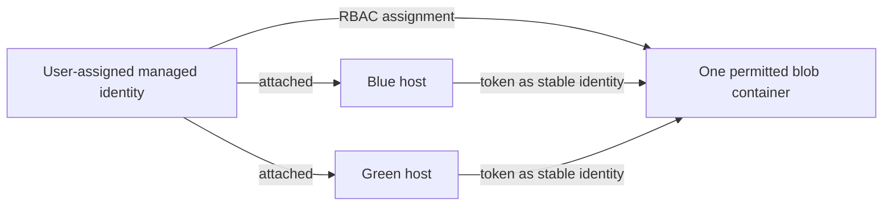
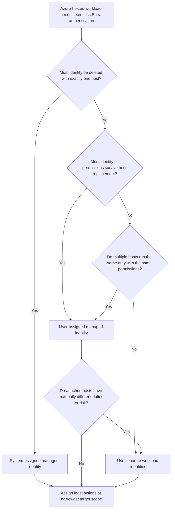

# Day 26: Weak-Area Remediation
**Date**: 2026-09-04
**Domain**: Deploy AI-powered business solutions (40-45%)
**Primary skill**: D3.4 - Design responsible AI, security, governance, risk management, and compliance
**Weak area**: User-assigned managed identity for replaceable hosts
**Subtopics**: Managed identity lifecycle, workload identity boundaries, least-privilege Azure RBAC, Copilot Studio delegated tool credentials, consequential-tool authorization, and Foundry hosted-agent runtime identity
**Estimated study time**: 2 hrs
**Question set**: q132, q141-q144, q177-q180, q210 (exactly 10 questions)

> This is a targeted remediation session. The rules and scenarios prepare you for the assigned questions without revealing option letters or reproducing a quiz answer key.

---

## Session Briefing

**Session 26 of 31 | Prior questions answered: 266 | Correct: 259 | Accuracy: 97.4%**

Day 25 scored 9/10. The identified gap was not whether managed identity is preferable to a stored key; it was the more precise selection rule between **system-assigned** and **user-assigned** identities when hosts are replaceable.

Suggested timebox: 10 minutes on the TL;DR; 35 on managed identity and RBAC; 25 on Copilot Studio identity gates; 20 on consequential tools; 15 on Foundry identity; 10 on traps; and 5 to launch the quiz.

---

## TL;DR (60-second skim)

- Choose managed identity type by **lifecycle and permission boundary**, not by a blanket preference.
- Use a system-assigned identity when one host needs its own identity and that identity should be deleted with the host.
- Use a user-assigned identity when identical workloads run on multiple or replaceable hosts and need one stable, preauthorized identity across replacement.
- Share a user-assigned identity only among workloads that should possess the same permissions; unlike duties create privilege aggregation.
- Managed identity solves credential management and authentication. It grants no downstream permission by itself.
- Apply both least actions and least scope: for read-only access to one blob container, use a read-only data role at container scope when practical.
- Agent access, conversation authentication, tool credentials, and source-record authorization are separate gates.
- Treat model-selected tool arguments as untrusted. Consequential actions require deterministic server-side validation, reauthorization, and confirmation or approval.
- A deployed Foundry hosted agent uses its dedicated agent identity at runtime; the project managed identity is for project infrastructure operations.

---

## Learning Objectives

After this session, you should be able to:

1. Select managed identity type from lifecycle, topology, and permission requirements.
2. Apply least actions and scope without aggregating privilege across unlike workloads.
3. Separate agent access, user authentication, tool credentials, and source authorization.
4. Protect consequential tools with deterministic validation and reauthorization.
5. Identify the runtime principal of a deployed Foundry hosted agent.

---

## Key Concepts

### 1. Start with five separate objects

Identity questions become easier when you name every object before choosing a control.

| Object | Question to ask | Example |
| --- | --- | --- |
| Workload | What code or agent performs the operation? | Invoice-reading helper |
| Host | Where does it run, and can that host be replaced? | VM, app instance, container host |
| Principal | Which nonhuman identity requests the token? | Managed identity or Foundry agent identity |
| Target | Which protected dependency receives the request? | Blob container or Dataverse environment |
| Authorization | Which actions at which scope may the principal perform? | Read blobs in one container |

A managed identity is a Microsoft Entra workload identity. Azure manages its credentials, and code can obtain tokens without storing a password, key, certificate, or client secret.

That does **not** merge these steps:

1. Azure creates or attaches the identity.
2. The host obtains a token for that identity.
3. The target validates the token.
4. The target evaluates role assignments or its own permission model.
5. The requested operation is allowed or denied.

The token answers **who is calling**. The role assignment answers **what that caller may do here**.

### 2. System-assigned managed identity

A system-assigned managed identity is enabled directly on one supported Azure resource.

Properties:

- Its service principal is created for that resource.
- Only that Azure resource can use the identity to request tokens.
- Its lifecycle is tied to the host resource.
- Deleting the host causes Azure to delete the service principal.
- It cannot be shared across Azure resources.
- Role assignments must still be created separately.

Choose it when:

- There is one host.
- The workload needs a unique identity.
- Permissions should disappear with the host identity.
- Resource-level attribution matters.
- There is no requirement to preserve the principal across host replacement.

Example: one long-lived Azure app hosts one reconciliation worker. Its identity should exist only while that app exists and should not be usable by another resource.

Important nuance: deleting the identity does not necessarily clean up every Azure role-assignment record. Microsoft recommends removing stale assignments as part of maintenance.

### 3. User-assigned managed identity

A user-assigned managed identity is created as a standalone Azure resource, then attached to one or more supported hosts.

Properties:

- Its service principal is managed independently from the hosts.
- Its lifecycle is independent and it must be explicitly deleted.
- The same identity can be attached to multiple Azure resources.
- Role assignments can be configured before hosts are deployed.
- Replacing a host does not replace the identity or its target permissions.
- Every host using it can act with the permissions granted to it.

Choose it when:

- Identical workload replicas need the same target permissions.
- Blue-green hosts must overlap during deployment.
- Compute resources are recycled or replaced frequently.
- Permissions must remain stable while hosts change.
- Preauthorization is required before host provisioning.
- Fewer equivalent identities and assignments reduce administrative overhead.

Example: an agent helper runs on several interchangeable instances. Instances are added, drained, and deleted, but every approved instance needs the same read access. Attach the same preauthorized user-assigned identity to those approved hosts.

The decisive word is **replaceable**, not merely **multiple**. A stable identity is useful because its lifecycle is outside the replaceable compute lifecycle.

### 4. Shareability is a capability, not a recommendation to share broadly

A user-assigned identity can be attached to multiple resources. That does not mean every workload should reuse it.

All permissions granted to the identity become available to every attached host and to code capable of using that identity on the host.

Good reuse boundary:

- Replicas perform the same task.
- They access the same target resources.
- They require the same actions.
- They have comparable risk and ownership.
- Shared audit attribution is acceptable.

Bad reuse boundary:

- One workload is read-only and another can delete or modify.
- Workloads belong to different teams or trust zones.
- One handles public data and another handles regulated data.
- Their target resources or required roles differ materially.
- Auditors must attribute actions to a specific workload or resource.

Sharing across unlike workloads creates **privilege aggregation**. The identity accumulates the union of permissions, and every attached host can potentially exercise that union.

Correction pattern:

1. Group only equivalent replicas behind one user-assigned identity.
2. Give materially different duties separate identities.
3. Assign each identity only its required roles and scopes.
4. Restrict who can attach the identity to additional hosts.
5. Monitor identity assignment, sign-in, and target data-access activity.

### 5. Authentication is not authorization

Managed identity removes application-managed credentials and provides a principal for Microsoft Entra authentication.

It does not automatically grant:

- Azure resource access.
- Data-plane access.
- Management-plane access.
- Dataverse table or row permissions.
- Microsoft Graph application permissions.
- Permission to act for a human user.

Use this sentence on the exam:

> Create or attach the workload identity, then authorize that principal independently on every downstream dependency.

For unattended workloads, no human user supplies delegated authority. The workload's own role assignments, app permissions, or target-specific policies define its authority.

### 6. Least privilege has two dimensions

A complete least-privilege answer minimizes both **actions** and **scope**. Ask whether the workload needs read, create, update, delete, resource management, or access management. A read-only blob agent normally needs a blob data-reading role, not write, delete, or Owner permissions.

Azure RBAC scope inherits downward:

```text
Management group
└─ Subscription
   └─ Resource group
      └─ Resource, such as a storage account
         └─ Child resource, such as a blob container where supported
```

If one container is the required boundary, prefer an appropriate data role at that container when operationally practical. Do not use subscription scope merely because it is easier.

A useful formula:

$$
\text{Effective authority} = \text{role actions} \times \text{assignment scope}
$$

A read-only role at subscription scope may still expose too much data. A contributor role at container scope may still permit unnecessary mutation. Minimize both factors.

### 7. Management plane and data plane are different

- **Management plane** roles configure the Storage resource through Azure Resource Manager.
- **Data plane** roles read or change blobs inside containers.

A workload that reads invoices needs an appropriate **blob data** role. It receives no automatic blob access merely because the account exists or it can view management settings.

### 8. Replaceable-host deployment pattern

For blue-green or frequently recycled hosts:



Sequence: create and authorize the user-assigned identity, attach it to equivalent blue and green hosts, validate the new host, shift traffic, then delete the old host without deleting the identity. Review attachments and assignments periodically. A system-assigned identity cannot preserve this principal: each replacement host gets a distinct identity and therefore needs new assignments.

### 10. Copilot Studio has separate identity and authorization gates

An authenticated agent can still correctly deny access to a record. Walk through each gate independently; sharing the experience must not copy the maker's source permissions.

| Gate | What it controls | What it does not prove |
| --- | --- | --- |
| Agent sharing/channel access | Who can open or invoke the agent | Access to connected data |
| Conversation authentication | Who the chatting user is | Which credential a tool uses |
| Tool connection mode | Author/maker credential or end-user credential | Final record authorization by itself |
| Target authorization | Roles, privileges, table/row ACLs, API policy | Permission to use unrelated tools |
| Action-time business rule | Whether this caller may perform this operation on this target now | General conversational fluency |

### 11. Agent author credentials versus user authentication for tools

Current Copilot Studio terminology distinguishes:

- **Agent author authentication**: the tool uses credentials supplied for the agent. This fits implicit-access or low-risk shared scenarios, such as public or common operational data.
- **User authentication**: the user signs in for the tool connection. Use this when data must be restricted to the user or when the tool performs work on that user's behalf.

Conversation sign-in and tool authentication are related but separate configuration surfaces. Requiring users to authenticate to the agent does not automatically force every connector to use their delegated credentials.

For employee-specific records: authenticate the user, configure end-user tool credentials where supported, let the downstream service enforce user permissions, and validate operation-specific rules. Do not turn the maker's broad connection into shared runtime authority or store administrator keys in prompts.

### 12. Unattended workloads need nonhuman authority

A nightly or background agent has no present user from whom to obtain a delegated token. Use a dedicated workload identity when supported: no interactive maker token, personal refresh token, or shared key; authorize each target independently with narrow scope and separable duties.

For an unattended process that reads from Storage and creates records in Dataverse, treat the targets independently. Storage uses Azure RBAC data roles; Dataverse uses its own application user, security role, table privilege, and business-unit/row access model as applicable. Managed identity does not make those authorization models disappear.

### 13. Model output is untrusted input to tools

A model can select a tool and generate its arguments. Retrieved documents, conversation history, tool responses, and model output can all contain or reflect malicious instructions.

Therefore:

- Do not treat an account ID selected by the model as authorized.
- Do not let natural-language instructions enforce ownership.
- Do not treat content filters as business authorization.
- Do not expand a shared service identity to avoid authorization failures.

Microsoft Agent Framework guidance says to treat LLM-provided function arguments like untrusted web API input.

At execution time, deterministic server-side code should:

1. Parse typed parameters.
2. Validate types, ranges, formats, and allowlists.
3. Resolve the authenticated caller or approved workload identity.
4. Re-fetch trusted target state when needed.
5. Verify caller-to-target authorization and business invariants.
6. Enforce operation limits and idempotency.
7. Require confirmation or human approval for high-impact actions.
8. Execute using a narrowly scoped identity.
9. Record an audit event without leaking sensitive payloads.

This is **reauthorization at the point of use**. It prevents a prompt-injected document from turning model planning into privilege amplification.

### 14. Content safety and authorization solve different problems

Prompt instructions guide behavior; content filters classify safety; prompt-injection detection flags suspicious instructions; input validation rejects malformed arguments; server-side authorization decides whether the principal may act on the target; confirmation records intent. Use them in layers, but never substitute one for another.

### 15. Foundry hosted-agent runtime identity

A deployed Microsoft Foundry hosted agent receives:

- A dedicated Microsoft Entra ID agent identity.
- A dedicated endpoint.
- Platform-managed runtime hosting around the containerized agent.

The hosted agent's container uses the **agent identity** at runtime for model calls, tools, and downstream Azure services.

The **Foundry project managed identity** is project-wide and supports platform infrastructure operations, such as access needed by the platform to pull from a container registry. It is not the hosted agent container's runtime identity.

For a protected external dependency:

1. Identify the deployed agent's dedicated runtime principal.
2. Assign the required downstream role to that principal.
3. Use the target environment's identity, not a development identity.
4. Validate the deployment in the target environment.

This is also an ALM issue. A production deployment creates production identity dependencies that infrastructure or release automation must provision. Development access on a project identity does not prove production runtime authorization.

In attended mode, an on-behalf-of flow carries user-delegated authority. In unattended mode, the agent acts under its own RBAC, app permissions, or target policies. The downstream service evaluates authorization in both modes.

---

## Decision Frameworks

### Managed identity selection flow



### Authorization decision flow

Identify the actual tool principal, verify its required action and scope, then validate parameters, ownership, and business rules. Deny missing authority instead of broadening it. Add confirmation or approval and audit for consequential actions.

### Signal words and first response

| Signal in the question | First rule to test |
| --- | --- |
| Deleted with one resource | System-assigned lifecycle |
| Recycled, replaceable, blue-green | User-assigned independent lifecycle |
| Same identity across approved replicas | User-assigned, if permissions truly match |
| Read-only versus destructive workloads | Separate identities |
| Managed identity but authorization failure | Check downstream role and scope |
| One blob container | Data role at container scope where practical |
| User's own records / on their behalf | End-user tool authentication |
| Shared or authenticated agent | Do not infer source-data authorization |
| Model chose account/resource ID | Reauthorize in deterministic server-side code |
| Hosted Foundry agent in production | Grant the deployed agent identity, not project identity |

---

## Comparisons

### System-assigned vs user-assigned managed identity

| Dimension | System-assigned | User-assigned |
| --- | --- | --- |
| Created | With/on the Azure host | As a standalone Azure resource |
| Lifecycle | Tied to host | Independent of hosts |
| Deleted | Automatically with host identity | Explicitly by administrator/automation |
| Shareable | No | Yes, across supported resources |
| Preauthorization | Harder because principal appears with host | Can be configured before host deployment |
| Replacement | New host gets a new principal | Same identity can attach to replacement |
| Best fit | One host, unique permissions, same deletion lifecycle | Replicas, blue-green, ephemeral hosts, stable permissions |
| Main trap | Assuming it preserves identity through replacement | Sharing across unlike duties and aggregating privilege |

### Human-delegated vs workload access

| Dimension | Delegated end user | Workload identity |
| --- | --- | --- |
| Actor | Signed-in human through an app/agent | Nonhuman workload |
| Typical scenario | Read my compensation; update my case | Nightly invoice processing |
| Permission source | User consent/authorization plus app constraints | RBAC, app roles, application permissions, target policy |
| Runtime availability | Requires supported interactive authentication flow | Suitable for background execution |
| Key risk | Accidentally using maker credentials | Assigning broad roles or sharing identity too widely |

### Identity, role, and scope

| Layer | Example selection | Failure if omitted |
| --- | --- | --- |
| Identity | User-assigned identity on replaceable hosts | No stable principal/token source |
| Role/actions | Blob read data role | Identity authenticates but cannot read, or receives excess mutation rights |
| Scope | One container | Identity can access more containers/accounts than required |

---

## Important Details for Exam

- Domain 3 carries 40-45%; D3.4 explicitly covers agent security, prompt manipulation, access control, governance, and auditability.
- System-assigned means one host, same lifecycle, no sharing. User-assigned means standalone, explicitly deleted, and attachable to multiple hosts.
- Frequently recycled resources with stable permissions are a documented user-assigned identity use case.
- Identity creation and target role assignment are separate; every attached host can use the identity's permissions.
- Least privilege limits actions and scope. Blob data roles can be assigned as narrowly as a container.
- Role changes can take time to propagate; do not react to an immediate denial by granting broad access.
- Copilot Studio user authentication fits user-restricted data or work done on the user's behalf; author authentication fits implicit or lower-risk shared access.
- Conversation authentication changes require republishing. Tool credential mode remains a separate decision.
- LLM tool arguments are untrusted; consequential tools need validation and approval controls.
- A Foundry hosted agent's dedicated deployed identity, not the project identity, needs external target permissions.

---

## Common Traps & Misconceptions

| Trap | Correct rule |
| --- | --- |
| Managed identity equals permission | It authenticates; downstream authorization is separate |
| User-assigned is always better or always shareable | Use it for stable cross-host lifecycle; share only equivalent authority |
| System-assigned survives replacement | A replacement resource receives a different principal |
| Trusted identity makes broad RBAC safe | Minimize actions and scope regardless of principal type |
| Agent sharing/sign-in grants data or chooses connector identity | Sharing, sign-in, tool credential, and source permission are separate |
| Prompts/content filters authorize or model IDs are trustworthy | Re-fetch, validate, and authorize in trusted server code |
| Project identity runs the hosted agent | The dedicated deployed agent identity is the runtime principal |
| Development access carries into production | Provision each target environment's identity dependencies |

---

## Real-World Scenarios

| Scenario | Decision pattern |
| --- | --- |
| One temporary host; principal must disappear with it | Align identity and host lifecycle; use a unique principal |
| Equivalent blue-green hosts; permissions must persist | Decouple identity from compute and attach one stable identity to approved replicas |
| Reporter reads; remediator deletes | Separate identities because duties and authority differ |
| Employee views or corrects only their record | Use end-user tool credentials and source-system authorization |
| Retrieved text makes the planner choose another account | Treat the ID as untrusted; reauthorize and require confirmation/approval |
| Hosted agent fails against production Storage | Grant the actual deployed runtime principal, not an adjacent project identity |

---

## Quick Reference Card

```text
IDENTITY TYPE
One host + delete identity with host                 -> system-assigned
Replaceable/blue-green hosts + stable permissions   -> user-assigned
Unlike duties or permission sets                    -> separate identities

AUTHORIZATION
Identity/token -> role actions -> assignment scope -> target business rules

COPILOT STUDIO
Agent sharing != conversation authentication
Conversation authentication != tool credential mode
Tool credential mode != source-record authorization

CONSEQUENTIAL TOOL
Untrusted model argument -> typed validation -> caller/target reauthorization
-> limits -> confirmation/approval -> execute -> audit

FOUNDRY HOSTED AGENT
Project managed identity -> platform infrastructure
Dedicated deployed agent identity -> container runtime and downstream calls
```

Five-second exam check:

1. What must outlive what?
2. Which principal actually makes the call?
3. What exact actions are required?
4. What is the narrowest target scope?
5. Is the tool acting as the user or as a workload?
6. Could prompt-influenced data choose a consequential target?

---

## Cross-Domain Quiz Question Refreshers

q132 is the cross-domain carryover from D3.3. It tests an ALM dependency created by the runtime identity model.

| Question | Domain | Concept | Key fact | Trap |
| --- | --- | --- | --- | --- |
| q132 | D3.3 | Foundry hosted-agent production identity dependency | Deployment creates a dedicated per-agent runtime identity; external target permissions must be assigned to that deployed identity | Granting only the project managed identity or reusing developer credentials |

The other nine questions remain within D3.4 but span identity boundaries, delegated access, least privilege, prompt-injection-resistant authorization, and managed-identity lifecycle.

---

## Hands-On Lab (Optional, 8 minutes)

No subscription is required. For these five cases, identify **identity type**, **principal**, **role/actions**, and **scope**: one app whose identity dies with it; three replaceable identical readers; a reporter plus destructive remediator; employee self-service for one user's record; and a nightly Storage-to-Dataverse workload. Self-check lifecycle, privilege aggregation, unnecessary actions, target scope, and user authorization.

---

## Related Questions in questions.json

- **q132** - Distinguishes a hosted agent's dedicated production runtime identity from the Foundry project managed identity.
- **q141** - Tests separate gates for agent sharing, runtime/tool identity, and source-record permission.
- **q142** - Distinguishes delegated end-user tool credentials from maker-provided credentials.
- **q143** - Tests unattended workload identity plus independent least-privilege permissions on each dependency.
- **q144** - Tests deterministic execution-time reauthorization for a consequential tool under prompt injection.
- **q177** - Selects identity type when one principal must share one host's lifecycle.
- **q178** - Selects identity type for blue-green, replaceable, equivalent hosts needing stable permissions.
- **q179** - Minimizes both role actions and assignment scope for a read-only workload.
- **q180** - Identifies privilege aggregation when unlike workloads share one user-assigned identity.
- **q210** - Combines stable identity across recycled compute with one-container least-privilege access.

---

## Run the Exact Local Day 26 Quiz

This repository does **not** contain `quiz_runner.py`. Use the installed VS Code Cert Prep extension, which reads `progress.json` and `day-assignments.json`.

Exact local command in Copilot Chat:

```text
@certprep /today
```

Then:

1. Confirm the extension shows **Day 26 - Weak-Area Remediation**.
2. Select **Straight to the quiz** or open the session and select **Start the quiz**.
3. Confirm the quiz contains exactly 10 questions.
4. The extension will load exactly: q132, q141, q142, q143, q144, q177, q178, q179, q180, q210.
5. Complete the quiz in the extension so its normal result, XP, streak, and progress workflow runs.

Do not use `--carryover`: Day 26's assignment already contains the intended remediation and cross-domain question. Do not manually update progress before completing the quiz.

---

## Sources (Verified Live During This Session)

- [Study guide for Exam AB-100: Agentic AI Business Solutions Architect](https://learn.microsoft.com/en-us/credentials/certifications/resources/study-guides/ab-100)
- [What are managed identities for Azure resources?](https://learn.microsoft.com/en-us/entra/identity/managed-identities-azure-resources/overview)
- [Best practice recommendations for managed identities](https://learn.microsoft.com/en-us/entra/identity/managed-identities-azure-resources/managed-identity-best-practice-recommendations)
- [Best practices for Azure RBAC](https://learn.microsoft.com/en-us/azure/role-based-access-control/best-practices)
- [Assign an Azure role for access to blob data](https://learn.microsoft.com/en-us/azure/storage/blobs/assign-azure-role-data-access)
- [Configure user authentication in Copilot Studio](https://learn.microsoft.com/en-us/microsoft-copilot-studio/configuration-end-user-authentication)
- [Configure user authentication for tools](https://learn.microsoft.com/en-us/microsoft-copilot-studio/configure-enduser-authentication)
- [Agent Safety in Microsoft Agent Framework](https://learn.microsoft.com/en-us/agent-framework/concepts/agents/safety)
- [Hosted agents in Foundry Agent Service](https://learn.microsoft.com/en-us/azure/foundry/agents/concepts/hosted-agents)
- [Agent identity concepts in Microsoft Foundry](https://learn.microsoft.com/en-us/azure/foundry/agents/concepts/agent-identity)

Sources were rendered and checked on 2026-09-04. Microsoft Learn is authoritative where terminology or behavior changes.

---

## Notes (your own words - fill this in after studying)

**My one-sentence identity lifecycle rule:**

**The difference between authentication and authorization:**

**Why unlike workloads should not share one user-assigned identity:**

**My execution-time authorization checklist for consequential tools:**

**Questions or terms to revisit after the quiz:**


---

