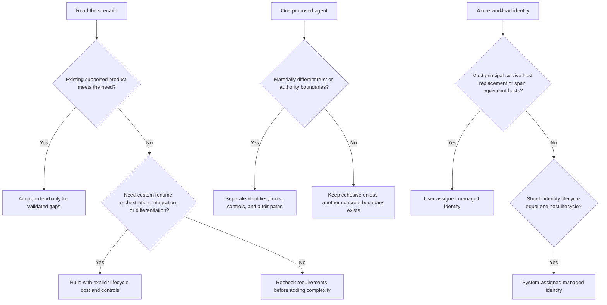

# Day 27: Full Mock Simulation

**Date**: 2026-09-05
**Domain**: Mixed — Plan AI-powered business solutions (25–30%), Design AI-powered business solutions (25–30%), Deploy AI-powered business solutions (40–45%)
**Subtopics**: Multi-agent trust boundaries, build-buy-extend, SLM selection, Copilot Studio generative inputs and MCP, Microsoft 365 Agent Builder permissions, telemetry filtering, environment variables, connector identity and DLP, managed identity lifecycle
**Estimated study time**: 1 hr
**Question set**: q182, q187, q189, q076, q084, q090, q102, q123, q145, q178 (exactly 10 questions)

> This is a timed mixed-domain simulation. It explains the decision rules and traps without reproducing answer letters or a quiz answer key.

---

## Session Briefing

**Session 27 of 31 | Prior questions answered: 266 | Correct: 259 | Accuracy: 97.4%**

Today's mock uses exactly 10 assigned questions: three from Domain 1, three from Domain 2, and four from Domain 3. The recurring weak area is managed-identity lifecycle selection for replaceable blue-green hosts.

Suggested timebox: 25 minutes to read and recall; 12 minutes for the timed quiz; 15 minutes for evidence-based review; 8 minutes to write short remediation notes.

---

## TL;DR (60-second skim)

- Split agents when trust, authorization, risk, or audit boundaries differ materially; do not give public retrieval and privileged approval one broad identity merely for convenience.
- Prefer an existing licensed capability for a commodity need; extend only for validated gaps and custom-build only for material unmet control or differentiation requirements.
- Choose the smallest evaluated model that meets quality, latency, deployment, and cost criteria; customization needs a demonstrated gap.
- Generative orchestration cannot directly use every custom entity type as a topic or tool input; collect and validate constrained values in the conversational flow, then pass them onward.
- Copilot Studio MCP integrations dynamically expose tools and resources and require generative orchestration for capability selection.
- Agent sharing and organization-wide discoverability do not expand a user's SharePoint permissions or bypass sensitivity labels.
- Copilot Studio built-in Analytics and Application Insights have different test-data behavior; use the explicit `designMode` telemetry dimension for production-only queries.
- Environment-variable definitions/defaults are solution metadata; target current values remain separate during managed-solution servicing.
- End-user connector credentials enforce downstream user authorization; Power Platform data policies constrain connector combinations and exfiltration paths. Both controls are needed when both risks exist.
- Use a user-assigned managed identity when equivalent hosts share authority and the identity plus RBAC assignments must survive host replacement.

---

## Learning Objectives

After this session, you should be able to:

1. Identify architecture boundaries from trust, authority, lifecycle, and risk rather than operational convenience.
2. Select prebuilt, extended, custom, small-model, and multi-agent approaches from explicit requirements.
3. Distinguish agent orchestration, knowledge permissions, tool credentials, and data-loss-prevention controls.
4. Interpret production telemetry and portable Power Platform configuration correctly.
5. Select a managed identity from host topology and identity-lifecycle requirements.

---

## Key Concepts

### 1. Multi-agent boundaries follow authority boundaries

A multi-agent design is justified when decomposition creates an enforceable boundary, not simply because several tasks exist. Separate components when they have materially different:

- Trust zones or exposure to untrusted content.
- Identities, privileges, or downstream systems.
- Human-approval and business-control requirements.
- Data classification, residency, or audit requirements.
- Ownership, release cadence, or failure containment needs.

A public catalog retriever processes untrusted external content and normally needs little authority. A purchase-approval component performs a consequential ERP action and needs authenticated, narrowly scoped authority plus deterministic policy checks. Combining them under one broad identity creates privilege aggregation: compromise or prompt injection in the low-trust path can reach high-impact capabilities.

A sound split still requires orchestration. The lower-trust component can return structured, provenance-bearing data to a privileged component. The privileged component then validates the request, reauthorizes at execution time, applies thresholds, and invokes approval where required. Multiple agents do not remove human oversight or downstream authorization.

Decision rule:

> Split when the boundary lets you enforce different identities, permissions, controls, or audit paths. Keep one agent when duties share the same trust and authorization boundary and decomposition adds no concrete control or operational benefit.

### 2. Build, buy, or extend

Use a requirements-first sequence:

1. **Adopt/buy** when a supported licensed Microsoft product already meets a common business requirement, integration needs, and governance constraints.
2. **Extend** when the product covers the core experience but has a specific gap that supported connectors, knowledge, actions, or declarative customization can close.
3. **Build custom** when differentiated workflows, bespoke orchestration, unsupported channels, custom runtime control, specialized models, or nonstandard integration requirements cannot be met safely by adoption or extension.

Compare total lifecycle cost, not only implementation effort: licensing, integration, data preparation, security review, evaluation, observability, support, upgrades, model consumption, and governance all matter.

Exam signal: a commodity seller-assistance feature, acceptable product controls, an existing license, and no differentiating workflow point toward the lowest-complexity supported option. Code ownership alone is not business value.

### 3. Small language model and customization selection

Model selection is a constrained evaluation problem. Define acceptance criteria before selecting model size:

| Dimension | Evidence to collect |
| --- | --- |
| Task quality | Representative held-out accuracy, error types, business cost of errors |
| Latency | End-to-end response time on target hardware and workload |
| Cost | Inference, hosting, operations, evaluation, and update costs |
| Deployment | Edge/cloud support, hardware fit, region, throughput, availability |
| Governance | Data handling, safety evaluation, monitoring, and approved catalog status |

If a catalog small language model meets all acceptance criteria without training, begin with that model and monitor it. Larger models can add latency and cost without improving the required outcome. Fine-tuning adds labeled-data quality, training, validation, deployment, lineage, regression, and maintenance obligations; use it to fix a measured gap, not as a default ceremony.

Customization ladder:

```text
Evaluate baseline model
  → improve prompt and structured output
  → add grounding/tools if the gap is knowledge or action access
  → fine-tune only for a persistent, measurable behavior gap
  → reconsider model family/size when constraints still fail
```

### 4. Copilot Studio generative orchestration and constrained inputs

Generative orchestration uses names, descriptions, inputs, outputs, and context to select topics and tools dynamically. Descriptions therefore act as capability contracts: say when to invoke the capability, what it does, and what each parameter means.

However, custom closed-list and regex entities are not directly supported as generative topic/tool input parameter types. When a value must satisfy such a constraint:

1. Route into a topic with a clear purpose.
2. Use a **Question node** configured with the custom entity.
3. Let the node collect and validate the value.
4. Store the typed/validated result in a variable.
5. Pass that result to the downstream topic, flow, or tool.

Do not weaken validation and ask the planner to infer arbitrary values. Probabilistic orchestration selects capabilities; deterministic validation protects contracts and side effects.

### 5. Model Context Protocol in Copilot Studio

Model Context Protocol (MCP) is a standard way for an MCP server to expose capabilities such as tools, resources, and prompts to clients. In Copilot Studio, an MCP server is added as an agent tool.

Important behavior:

- Copilot Studio uses **generative orchestration** with MCP.
- The agent reasons over capability metadata to select an appropriate operation.
- As the server adds or updates capabilities, connected agents can reflect those changes without a separately authored static topic for every operation.
- Clear server-side names, descriptions, schemas, authentication, and error contracts remain essential.
- Dynamic discovery does not bypass DLP, connector governance, authentication, authorization, validation, or approval requirements.

Static prompts, hard-coded topic-per-utterance designs, and model fine-tuning on tool names do not provide MCP's dynamic capability contract.

### 6. Agent sharing is not source authorization

Microsoft 365 Agent Builder and declarative agents can be shared or made discoverable, but those actions govern access to the **agent experience**, not blanket access to every knowledge item.

For SharePoint and OneDrive knowledge:

- Responses are constrained by the current user's existing source permissions.
- Sensitivity labels and information-protection boundaries continue to apply.
- The owner's access does not become every user's runtime access.
- Accepting a sharing link does not grant permission to restricted source files.
- Organization-wide discoverability does not convert restricted content into organization-wide content.

Keep four gates separate:

| Gate | Governs |
| --- | --- |
| Publish/channel | Where the agent can run |
| Share/discoverability | Who can find or invoke the agent |
| User authentication | Which human identity is present |
| Source authorization | Which files, records, or rows that identity may access |

### 7. Copilot Studio Analytics versus Application Insights

Built-in Copilot Studio Analytics provides curated product views for outcomes, use, effectiveness, and related trends. Application Insights provides lower-level event telemetry for custom Kusto analysis, correlation, operational diagnosis, and integration with Azure Monitor.

They do not include test activity identically. Copilot Studio sends telemetry for conversations in the test canvas to Application Insights. For a production-only query, use the explicit custom dimension recorded on events:

```kusto
customEvents
| extend isDesignMode = customDimensions['designMode']
| where isDesignMode == "False"
```

Do not infer production solely from channel names, traffic spikes, or dashboard differences. First reconcile scope, filters, date ranges, ingestion delay, and test-mode inclusion.

### 8. Power Platform environment-variable servicing

An environment variable separates portable solution references from environment-specific configuration.

| Element | Purpose | Typical owner |
| --- | --- | --- |
| Definition | Schema, name, type, description, and metadata | Solution publisher |
| Default value | Publisher fallback packaged with the definition | Solution publisher |
| Current value | Target-specific override in an environment | Customer/environment owner |

At runtime, a current value takes precedence when present; otherwise the default can be used. A managed-solution update can service the definition and publisher default without treating the customer's current value as publisher-owned configuration to overwrite.

Release guidance:

- Reference the variable from apps, flows, and other supported solution components rather than hard-coding endpoints.
- Supply or validate target current values during deployment.
- Transport credentials and secrets using appropriate secret-management patterns, not ordinary exported defaults.
- Do not delete target current values merely to force a publisher update.

### 9. Connector credentials and data policies solve different problems

For a Copilot Studio tool, authentication mode determines which connection identity calls the downstream service:

- **User authentication** asks the user to provide a connection and allows the downstream service to enforce that user's permissions.
- **Agent author authentication** uses the connection configured by the maker/author and can expose shared authority unless the scenario is designed for it.

Power Platform data policies classify connectors into groups and can block connectors or prevent business data from being combined with disallowed paths. They reduce exfiltration risk, including risky combinations involving HTTP or custom connectors.

Neither replaces the other:

- User credentials do not stop an allowed workflow from sending retrieved data through an unsafe connector.
- DLP does not decide whether a user may read a specific business record.
- Conversation sign-in does not automatically select user credentials for every tool.
- Content filters do not enforce record authorization or connector grouping.

For regulated records plus an external HTTP path, preserve user-specific downstream authorization **and** apply a data policy that blocks or isolates the risky connector path.

### 10. Managed identity lifecycle for replaceable hosts

Managed identities remove application-managed credentials; Azure handles the identity's credentials and token acquisition. Authorization remains separate: each target still requires the correct role at the correct scope.

| Property | System-assigned | User-assigned |
| --- | --- | --- |
| Created on | One Azure host resource | Standalone Azure resource |
| Lifecycle | Tied to that host | Independent of hosts |
| Sharing | Not shared across hosts | Can attach to multiple supported hosts |
| Host replacement | New host gets a new principal | Existing principal can attach to replacement host |
| Best fit | One host; identity should disappear with it | Equivalent replicas, blue-green slots, preauthorization, replaceable compute |

For blue-green deployment, create and authorize one user-assigned identity, attach it only to approved equivalent hosts, validate the green host, shift traffic, and retire the blue host. The identity and its downstream RBAC assignments remain stable because their lifecycle is independent of either host.

Do not share a user-assigned identity across workloads with materially different duties. Every attached host can exercise that identity's permissions, so broad reuse creates privilege aggregation and weakens attribution.

---

## Decision Frameworks



Five-pass exam method:

1. Name the actor, host, target, operation, and risk.
2. Separate experience access, authentication, authorization, and data-movement governance.
3. Find lifecycle words: *replace*, *shared*, *survive*, *slot*, *current value*, *update*.
4. Prefer the least-complex design that meets measured requirements.
5. Reject answers that claim one control automatically replaces a different control layer.

---

## Comparisons

| Confusable choices | Use the first when | Use the second when |
| --- | --- | --- |
| One agent vs multiple agents | Same trust, authority, and controls | Different identities, privileges, risk, or audit boundaries |
| Adopt vs extend vs build | Existing product meets requirement | Extend for a concrete gap; build for material unmet control/differentiation |
| Small vs large model | Smaller model meets measured criteria | Larger model provides necessary measured quality/capability |
| Prompt/orchestrator vs Question node | Semantic selection or flexible language | Required regex/closed-list collection and validation |
| Static tools vs MCP | Fixed manually integrated contract | Standards-based dynamic capability discovery |
| Agent sharing vs source permission | Access to agent experience | Access to underlying files/records |
| Built-in Analytics vs App Insights | Curated business/product trends | Event-level Kusto analysis and custom operations telemetry |
| Environment default vs current value | Publisher fallback | Target-owned environment override |
| User connector credential vs DLP | Enforce caller's downstream rights | Control allowed connector/data combinations |
| System- vs user-assigned identity | Identity follows one host | Identity survives or spans equivalent hosts |

---

## Important Details for Exam

- Current AB-100 study-guide weighting: Domain 1 is 25–30%, Domain 2 is 25–30%, and Domain 3 is 40–45%.
- Multi-agent design is not automatically cheaper, safer, or more accurate; name the boundary it enforces.
- Fine-tuning is not required when the evaluated baseline already meets acceptance criteria.
- Generative orchestration capability descriptions and typed contracts influence tool/topic selection.
- Custom closed-list and regex entities require collection through a conversational Question node rather than direct generative inputs.
- MCP-connected tools and resources can evolve dynamically; governance and authorization still apply.
- SharePoint permission checks and sensitivity labels remain authoritative despite broad agent sharing.
- Application Insights records test-canvas telemetry; `designMode == "False"` excludes those events in the documented Kusto pattern.
- Environment current values override defaults and remain target-specific during managed-solution updates.
- DLP controls connector combinations; it does not grant row-level access.
- Managed identity handles credential management and authentication, not target authorization.
- A user-assigned identity can be preauthorized and attached to blue and green hosts without recreating RBAC assignments after host replacement.

---

## Common Traps & Misconceptions

- **“One identity is simpler.”** Simplicity does not justify merging public-content exposure with privileged ERP authority.
- **“Custom means strategic.”** A custom build for a commodity requirement often adds cost and operational risk without differentiation.
- **“Bigger or fine-tuned is automatically better.”** The acceptance criteria, not model prestige, decide.
- **“The planner validates every entity.”** Custom constrained values still need an explicit collection/validation path.
- **“MCP is just copied tool text.”** MCP is a live capability contract; hard-coded prompts lose dynamic discovery.
- **“Shared with everyone means all knowledge is shared.”** Agent access and source access are separate gates.
- **“Different dashboards prove data loss.”** First reconcile whether test-canvas activity is included.
- **“Managed updates own current values.”** Publisher defaults and customer current values have different ownership.
- **“Authenticated user means safe data movement.”** Record authorization and connector DLP are complementary.
- **“All managed identities survive replacement.”** A system-assigned principal follows its host; a user-assigned principal has an independent lifecycle.

---

## Cross-Domain Quiz Question Refreshers

| ID | Domain | Concept / service | Exam trap |
| --- | --- | --- | --- |
| q182 | D1 | Multi-agent separation across public retrieval and privileged ERP approval | One broad identity chosen only for operational simplicity |
| q187 | D1 | Build-buy-extend for commodity seller assistance | Unnecessary custom runtime when a licensed product already meets the need |
| q189 | D1 | Catalog SLM selection against quality, edge latency, and cost | Largest model or unjustified fine-tuning despite a passing baseline |
| q076 | D2 | Copilot Studio generative orchestration and custom entity inputs | Treating custom regex/closed-list entities as directly supported inputs |
| q084 | D2 | Copilot Studio MCP integration | Static prompts, hard-coded topics, or fine-tuning instead of dynamic capabilities |
| q090 | D2 | Microsoft 365 Agent Builder with SharePoint knowledge | Assuming broad agent sharing overrides permissions or sensitivity labels |
| q102 | D3 | Copilot Studio Analytics and Application Insights | Mistaking test telemetry for production or filtering only by channel |
| q123 | D3 | Power Platform environment-variable servicing | Assuming managed-solution updates overwrite customer current values |
| q145 | D3 | End-user connector credentials and Power Platform DLP | Treating authorization and exfiltration controls as interchangeable |
| q178 | D3 | User-assigned managed identity for replaceable hosts | Choosing host-bound identities when principal and RBAC must survive replacement |

---

## Timed 10-Question Mock Strategy

Target **12 minutes total**:

- **Minute 0–1**: Start cleanly; close the reference file and treat the set as exam conditions.
- **Minutes 1–9**: First pass, about 45–50 seconds per question. Identify domain, control layer, and decisive requirement before reading options twice.
- **Minutes 9–11**: Revisit flagged questions. Compare only the two strongest options against the exact lifecycle, authorization, or measured-requirement phrase.
- **Minute 11–12**: Check for absolute claims such as “always,” “automatically,” “all permissions,” or “replaces.” Submit without changing an answer solely from anxiety.

Flag rather than stall when a question exceeds 60 seconds. For each scenario, write a five-word mental label such as “source permissions survive agent sharing” or “identity must outlive host.”

---

## Post-Quiz Review Method

For every miss or low-confidence correct answer:

1. Record the question ID and your selected control layer.
2. Quote the decisive requirement in five to ten words.
3. State why your choice failed that requirement without mentioning option letters.
4. Write one reusable rule in your own words.
5. Create one contrast pair, such as “agent access vs source access.”
6. Re-answer after a ten-minute gap, then review again on Day 28.

Classify errors as **knowledge**, **boundary confusion**, **lifecycle wording**, **overengineering**, or **rushing**. If q178 is missed or guessed, redraw the host/identity lifecycle table and explain why replacing compute must not replace the principal.

---

## Quick Reference Card

```text
Different authority/trust       → separate agents and identities
Commodity need already covered → adopt; extend for a proven gap
Small model meets all criteria  → use and monitor before customization
Regex/closed-list input         → Question node validates, then pass onward
Dynamic MCP capabilities        → MCP tool + generative orchestration
Agent shared broadly            → source ACLs and labels still apply
Production-only telemetry       → filter App Insights by designMode False
Managed solution update         → service definition/default; preserve current value
Per-user records + HTTP risk     → user credentials + DLP connector policy
Replaceable blue-green hosts    → stable user-assigned managed identity
```

---

## Hands-On Lab (optional)

Bonus, five-minute paper exercise: draw three boxes labeled **Host**, **Identity**, and **Target**. Draw blue and green hosts attaching to one independently created identity, then one RBAC edge from that identity to the target. Delete the blue host on paper. If deleting it also deletes the identity or RBAC edge, the lifecycle model is wrong.

---

## Related Questions in questions.json

- q182 — Multi-agent separation at a trust and authorization boundary.
- q187 — Build-buy-extend selection for a prebuilt commodity capability.
- q189 — SLM selection when the evaluated baseline meets requirements.
- q076 — Custom entity collection in generative orchestration.
- q084 — MCP dynamic capability integration in Copilot Studio.
- q090 — SharePoint permissions and labels after broad agent sharing.
- q102 — Production-only Application Insights telemetry filtering.
- q123 — Environment-variable definition/default/current-value servicing.
- q145 — End-user connector identity combined with DLP.
- q178 — Persistent user-assigned identity for blue-green hosts.

## Run the Exact Day 27 Quiz

This repository uses the installed VS Code Cert Prep extension rather than a Python quiz runner. Enter this command in Copilot Chat:

```text
@certprep /today
```

Confirm the extension shows **Day 27 - Full Mock Simulation**, then select **Straight to the quiz** or open the session and select **Start the quiz**. The extension reads Day 27 from `day-assignments.json`, which contains exactly the 10 question IDs listed above. Complete the quiz in the extension so its normal results, XP, streak, and progress workflow runs.

---

## Sources (verified during this session)

- [Study guide for Exam AB-100: Agentic AI Business Solutions Architect](https://learn.microsoft.com/en-us/credentials/certifications/resources/study-guides/ab-100)
- [AI Agent Orchestration Patterns](https://learn.microsoft.com/en-us/azure/architecture/ai-ml/guide/ai-agent-design-patterns)
- [Orchestrate agent behavior with generative AI](https://learn.microsoft.com/en-us/microsoft-copilot-studio/advanced-generative-actions)
- [Extend your agent with Model Context Protocol](https://learn.microsoft.com/en-us/microsoft-copilot-studio/agent-extend-action-mcp)
- [Add knowledge sources to your declarative agent in Microsoft 365 Copilot](https://learn.microsoft.com/en-us/microsoft-365/copilot/extensibility/agent-builder-add-knowledge)
- [Agent-level telemetry with Application Insights](https://learn.microsoft.com/en-us/microsoft-copilot-studio/advanced-bot-framework-composer-capture-telemetry)
- [Use environment variables in Power Platform solutions](https://learn.microsoft.com/en-us/power-apps/maker/data-platform/environmentvariables)
- [Configure data policies for agents](https://learn.microsoft.com/en-us/microsoft-copilot-studio/admin-data-loss-prevention)
- [Configure user authentication for tools](https://learn.microsoft.com/en-us/microsoft-copilot-studio/configure-enduser-authentication)
- [Managed identities for Azure resources](https://learn.microsoft.com/en-us/entra/identity/managed-identities-azure-resources/overview)

---

## Notes (your own words — fill this in after studying)

- 
- 
- 
