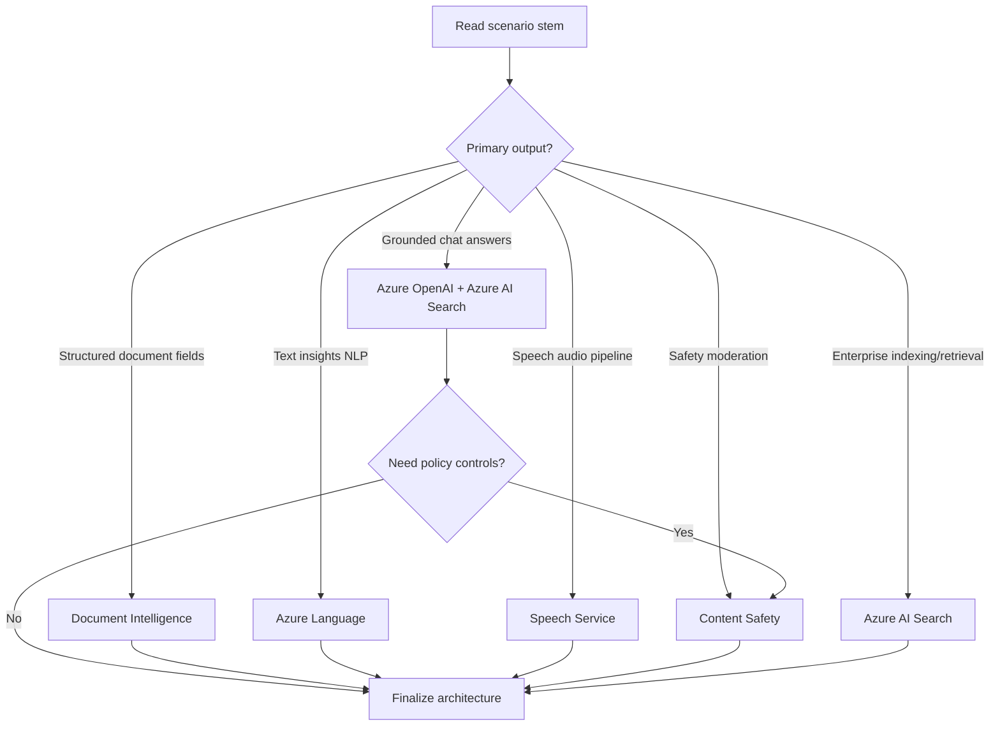

# Day 32: Mock Simulation + Final Revision

**Date**: 2026-06-06
**Domain**: Final cross-domain review (Domains 1-6, full AI-102 blueprint)
**Subtopics**: Final formula sheet, service-selection heuristics, 35-question timed mock, post-mock error analysis
**Estimated study time**: 1 hr

---

## TL;DR (60-second skim)

- Day 32 uses the full question pool (313 questions), not fixed day IDs; `dayAssignments["32"]` is intentionally empty.
- Your biggest score risk now is not core concepts; it is trap execution: hotspot option mapping, operation order, and role/SKU confusion.
- For Azure OpenAI, keep this boundary sharp: User role = inference; Contributor role = manage/fine-tune/deploy.
- For Translator and Speech, questions often hide limits/throughput assumptions; translate limits are character-based, not request-count-based.
- For Document Intelligence and AI Search, endpoint/model pairing and enrichment pipeline order are frequent distractors.
- In the mock, optimize for certainty first, then revisit ambiguous hotspots; avoid spending >90 seconds on one item in first pass.

---

## Learning Objectives

After this session, you should be able to:

- Pick the correct Azure AI service quickly from scenario language (service-selection heuristics).
- Eliminate common distractors in role/permission, model type, and deployment path questions.
- Apply quota and throughput formulas under time pressure (TPM/RPM, character limits, F0/S0 behavior).
- Distinguish similar APIs and methods (for example NER vs key phrases; recognizer class choices in Speech).
- Run a timed 35-question mock and perform targeted error triage for final-day confidence.

---

## Key Concepts

### 1) Day 32 quiz scope behavior in this repo

- `day-assignments.json` defines `dayAssignments["32"]` as an empty array by design.
- Interpretation here: Days 29-32 are review/mock mode, so the runner uses full question pool behavior.
- Current pool size in `questions.json`: 313 questions across all 6 domains.
- Domain count split:
  - Domain 1: 66
  - Domain 2: 59
  - Domain 3: 25
  - Domain 4: 40
  - Domain 5: 57
  - Domain 6: 66

### 2) Final service-selection heuristics (fast elimination)

- If requirement says grounded enterprise chat + private data retrieval: start with Azure OpenAI + Azure AI Search.
- If requirement says OCR/forms/structured extraction from documents: start with Document Intelligence.
- If requirement says profanity/harm/jailbreak/prompt protection policy: start with Content Safety.
- If requirement says language extraction/classification/PII/entity/sentiment: start with Azure Language.
- If requirement says speech transcription/synthesis/translation/voice: start with Speech.
- If requirement says indexing + enrichment + searchable corpus: start with Azure AI Search skillset/indexer pipeline.
- If requirement is near-real-time multimodal RAG with known source docs: think retrieval architecture first, model second.

### 3) Timing and triage strategy for 35-question mock

- First pass goal: answer all high-confidence questions quickly.
- Mark and defer: long hotspots, drag-drop sequences, and role-boundary items that need careful reread.
- Second pass: resolve deferred items using elimination and architecture consistency checks.
- Never leave blanks if penalty is not increased by guessing.

### 4) Formula sheet that matters

- Throughput relation in many planning items: RPM is derived from TPM allocation model assumptions.
- Character-based billing and limits (Translator): focus on effective character volume with target-language multiplication.
- Sliding-window throttling: bursty consumption can fail even when hourly quota seems sufficient.
- Quota scope patterns:
  - Azure OpenAI quota is scoped by subscription, region, and model/deployment type.
  - Speech F0 vs S0: free tier limits are not adjustable; S0 quotas may be adjustable.

### 5) Weak-pattern reminders from prior progress

- Hotspot traps: option lists may look semantically close; map each statement independently before choosing.
- Translation/Speech edge cases: source vs target language configuration and recognizer class mismatches.
- Deployment sequencing gotchas: container and model workflows are often tested by strict order.
- RBAC role boundaries: User vs Contributor confusion still appears in final review logs.
- API/class specificity traps: generic class choice vs feature-specific class choice.

---

## Decision Frameworks



Mock-time decision checklist:

- Identify noun phrase in requirement: "transcribe", "classify", "index", "ground", "extract fields", "moderate".
- Match to primary service first.
- Add secondary services only if requirement explicitly needs them.
- Validate with security/identity/region/latency constraints.
- Confirm quota/limit assumptions are compatible with volume and burst profile.

---

## Comparisons (X vs Y tables)

| Comparison                                      | Correct Choice Trigger                                    | Common Wrong Choice                              | Trap Pattern                                    |
| ----------------------------------------------- | --------------------------------------------------------- | ------------------------------------------------ | ----------------------------------------------- |
| Azure OpenAI User vs Contributor RBAC           | Inference only vs manage/fine-tune/deploy                 | Choosing User for fine-tuning operations         | Least-privilege misunderstood as full lifecycle |
| NER vs Key Phrase Extraction                    | Entities with categories/types vs salient phrases         | Swapping methods based on wording                | Similar NLP wording in stem                     |
| Translator text vs document translation         | Inline text payload vs blob/container-based document jobs | Using text API assumptions for document workflow | Same service, different operation model         |
| SpeechRecognizer vs TranslationRecognizer       | Plain STT vs speech-to-speech/text translation            | Using SpeechRecognizer for translation pipeline  | Class names look interchangeable under pressure |
| Document Intelligence prebuilt vs custom        | Known doc type high fit vs organization-specific variance | Overusing custom model for standard documents    | "Custom" feels safer but costs time             |
| AI Search query key vs admin key                | Query-only access vs management/index operations          | Rotating wrong key type                          | Security question with subtle permission scope  |
| Content Safety vs legacy moderation assumptions | Harm-category and severity policy controls                | Picking unrelated vision/language endpoint       | Policy requirement hidden in scenario           |

---

## Important Details for Exam

- AI-102 certification page currently indicates retirement on 2026-06-30; treat current labels/features as authoritative from latest Learn docs.
- AI-102 exam shows six assessed skill areas; full-pool mock should touch all six.
- Translator text request limit includes all target languages in character calculation.
- Translator examples in limits doc show `50,000` character cap per translate request and `1,000` max elements for Translate operation.
- Azure AI Search doc emphasizes classic search and agentic retrieval modes under one managed service.
- Azure AI Search pricing model currently includes dedicated and a serverless preview model (preview caveats matter).
- Document Intelligence model overview indicates v4.0 GA with prior versions still referenced; version assumptions can be tested.
- Speech quota guidance: F0 has fixed limits; S0 has adjustable quotas (with caveats/time to reflect changes).
- Azure OpenAI quotas in Foundry docs are scoped by subscription + region + model/deployment type and use TPM/RPM concepts.

---

## Common Traps & Misconceptions

- Trap: "Similar hotspot options mean any close answer is fine."
  - Correct: Evaluate each statement independently.
- Trap: "User role in Azure OpenAI covers fine-tuning because it can invoke models."
  - Correct: User is inference-centric; Contributor is needed for management/fine-tune/deploy.
- Trap: "Character quotas are request-count quotas."
  - Correct: Translator quotas are character-driven.
- Trap: "Deployment order is flexible once all steps are listed."
  - Correct: Sequence questions often have exactly one valid procedural order.
- Trap: "If one service can technically do part of it, it is the best answer."
  - Correct: Pick the service that directly minimizes custom code and fits native capabilities.

---

## Quick Reference Card

### 20-second elimination cues

- "Grounded answers from private docs" -> OpenAI + AI Search
- "Extract fields from documents/forms" -> Document Intelligence
- "Harmful text/image moderation" -> Content Safety
- "Named entities/PII/sentiment" -> Azure Language
- "Speech in/out, translation, voice" -> Speech Service

### Last-hour formula/limit reminders

- Translator effective size = source characters x number of target languages.
- Burst behavior can violate quotas before hourly totals are exhausted.
- Quota scope for OpenAI is region and subscription sensitive.

### Hotspot discipline

- Read statement 1, map answer, lock.
- Read statement 2, map answer, lock.
- Read statement 3, map answer, lock, then choose composite option.

---

## Hands-On Lab (optional)

Goal: 15-minute post-mock error triage drill.

1. Run 35-question mock under timed conditions.
2. Immediately classify each wrong answer into one bucket:

- Service mismatch
- API/class confusion
- RBAC/identity confusion
- Quota/limit math miss
- Sequence/order miss
- Hotspot mapping error

3. Pick top two buckets and write one "if I see X, choose Y" rule per bucket.
4. Re-attempt 8-10 questions from those buckets only.

---

## Related Questions in questions.json

Day 32 assignment behavior:

- `dayAssignments["32"]` is empty by design for review/mock day.
- Quiz runner therefore pulls from the full question pool for this day.

Coverage target for today:

- Full pool: 313 questions across all six domains.
- Mock subset today: 35 questions under time pressure.

High-risk refresher IDs from prior weak patterns:

- `ICzikIAERFRO4FU8OhEA` (OpenAI on-your-data config specificity)
- `PFarcFliASzPdwk45Nn1` (grounding data source choice)
- `gwsIQSZPu8cibMgPdECI` (OpenAI RBAC boundary)
- `V53zHQhO3vu97NWJ9D7T` (document/image constraints edge case)
- `aEglPFeC8t9sKQMqo0gH` (knowledge store projection semantics)
- `19SuosyKaYI0KCnbj4Qe` (entity vs trigger mapping in workflow logic)

Quiz command (mock, 35 questions, day-locked review mode):

```powershell
python quiz_runner.py questions.json --day-lock 32 --shuffle --limit 35 --open-images --web --port 8765
```

Alternative explicit full-pool mode:

```powershell
python quiz_runner.py questions.json --all --shuffle --limit 35 --open-images --web --port 8765
```

---

## Cross-Domain Quiz Question Refreshers

| Concept                                 | Key Fact                                                                         | Trap                                                            |
| --------------------------------------- | -------------------------------------------------------------------------------- | --------------------------------------------------------------- |
| LUIS/Language container deployment flow | Export/package placement and runtime start order matter                          | Choosing "run container first" style options                    |
| Azure OpenAI RBAC                       | User role is inference-centric; Contributor role for management/fine-tune/deploy | Picking least-privilege role when admin operations are required |
| NER vs Key Phrases                      | NER returns typed entities; key phrase extraction returns salient terms          | Method-name confusion in SDK snippets                           |
| Translator request sizing               | Character limits apply across all targets in a request                           | Ignoring multiplication by target language count                |
| Speech translation setup                | Use translation-capable recognizer path with explicit source and targets         | Using generic SpeechRecognizer for translation scenario         |
| AI Search keys                          | Query keys for query-only clients; admin keys for service/index management       | Rotating or distributing wrong key type                         |
| Document Intelligence model choice      | Prebuilt for common docs; custom for organization-specific layouts               | Defaulting to custom model too early                            |
| Knowledge store projections             | Projection type controls output structure and destination semantics              | Assuming object projection stores binaries                      |
| Hotspot questions                       | Each statement should be solved independently                                    | Pattern-guessing all-Yes/all-No composites                      |
| Deployment sequencing                   | Provision/configure -> package/export -> run/deploy -> test                      | Treating steps as unordered checklist                           |

---

## Sources (verified during this session)

- [Microsoft Certified: Azure AI Engineer Associate](https://learn.microsoft.com/en-us/credentials/certifications/azure-ai-engineer/?practice-assessment-type=certification)
- [Introduction to Azure AI Search](https://learn.microsoft.com/en-us/azure/search/search-what-is-azure-search)
- [Document processing models (Document Intelligence)](https://learn.microsoft.com/en-us/azure/ai-services/document-intelligence/model-overview?view=doc-intel-4.0.0)
- [Translator service limits](https://learn.microsoft.com/en-us/azure/ai-services/translator/service-limits)
- [Speech quotas and limits](https://learn.microsoft.com/en-us/azure/ai-services/speech-service/speech-services-quotas-and-limits)
- [What is Azure Language](https://learn.microsoft.com/en-us/azure/ai-services/language-service/overview)
- [What is Azure AI Content Safety](https://learn.microsoft.com/en-us/azure/ai-services/content-safety/overview)
- [Azure OpenAI quotas and limits in Foundry Models](https://learn.microsoft.com/en-us/azure/foundry/openai/quotas-limits)

---

## Notes (your own words — fill this in after studying)

- Weakest trap family today:
- One rule I will follow for hotspot questions:
- One RBAC boundary I will not confuse again:
- One quota/limit formula I can recall from memory:
- Last-minute confidence score (1-10):
