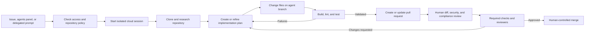
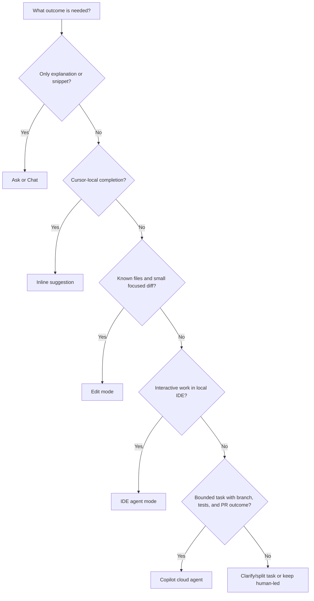

# Day 6: Copilot Cloud Agent and Governance

**Date**: 2026-07-14
**Domain**: Use GitHub Copilot Features (25-30%)
**Subtopics**: Copilot cloud agent; Agent vs Edit vs inline; delegated-task design; execution environment; organization policies; audit logs; REST API seat management; usage metrics; content exclusions
**Estimated study time**: 2 hrs

---

## TL;DR (60-second skim)

- GitHub now documents the PR-oriented coding feature as **Copilot cloud agent**; older material and the question bank may call it **Copilot coding agent**.
- Use cloud agent for a clear, bounded, multi-step task that can be completed on a branch, validated with builds/tests, and reviewed in a pull request.
- Use **Edit mode** for a small change in known files, **inline suggestions** for cursor-local completions, and Chat/Ask for explanations or snippets.
- Cloud agent runs asynchronously in its own ephemeral, GitHub Actions-powered environment, not in your local IDE session.
- Prepare the repository with instructions, tests, and `.github/workflows/copilot-setup-steps.yml`; use dedicated **Agents** secrets/variables for private resources.
- All paid Copilot plans can use cloud agent, subject to repository eligibility and administrator policy; Copilot Free is excluded.
- Agent output is never self-approving: humans still own diff review, testing, security, compliance, branch protections, and merge decisions.
- Usage metrics describe adoption and feature activity, not raw source-code dumps; audit logs track policy/license and agent activity, not local prompt transcripts.

---

## Learning Objectives

After this session, you should be able to:

1. Select inline suggestions, Ask/Chat, Edit mode, IDE agent mode, or Copilot cloud agent for a scenario.
2. Explain the cloud-agent lifecycle from issue or prompt through branch, validation, and pull request.
3. Identify suitable delegated tasks and tasks that must remain human-led.
4. Write a high-quality task prompt with scope, context, constraints, acceptance criteria, and validation.
5. Configure a repository so the agent can install dependencies and run builds, tests, and linters reliably.
6. Explain current plan, repository, and administrator-policy access caveats.
7. Preserve human review and security accountability for agent-authored changes.
8. Distinguish usage metrics, activity reports, audit logs, and REST API seat management.
9. Explain the real limitations of content exclusions across Copilot surfaces.

---

## Key Concepts

### 1. Terminology: cloud agent, coding agent, and IDE agent mode

GitHub's current documentation uses **Copilot cloud agent** for the asynchronous agent that works on GitHub in the background. Older docs and many exam questions use **Copilot coding agent**. Treat those two names as the same PR-oriented capability when the scenario says it:

- receives a task from GitHub.com, an issue, or an agents panel;
- researches a repository and creates a plan;
- changes multiple files on a branch;
- runs builds, tests, linters, or other tools;
- opens or updates a pull request for human review.

Do not automatically equate this with **agent mode in an IDE**. IDE agent mode is an interactive, local pairing experience. Cloud agent is asynchronous and works in a remote environment. Both can reason, edit multiple files, and run tools, but the execution location and handoff model differ.

### 2. Copilot capability selection

| Capability          | Best use                                                                             | Scope/control                                                       | Executes tools?                                              | Typical result                         |
| ------------------- | ------------------------------------------------------------------------------------ | ------------------------------------------------------------------- | ------------------------------------------------------------ | -------------------------------------- |
| Inline suggestions  | Complete a line, expression, small function, or repetitive pattern while typing      | Cursor-local; developer accepts/rejects                             | No workflow orchestration                                    | Code inserted into editor buffer       |
| Ask/Chat            | Explain code/errors, explore an API, compare designs, draft a snippet                | Conversational; developer applies output                            | May expose tools by surface, but primarily advisory          | Answer, explanation, or suggested code |
| Edit mode           | Make a precise change in a known set of files and review a focused diff              | User selects scope/files                                            | Not intended for autonomous discovery or broad command loops | Proposed per-file diffs                |
| IDE agent mode      | Work interactively on a broader local task involving discovery, edits, and commands  | Agent chooses steps while developer supervises session              | Yes, subject to approvals/settings                           | Changes in local workspace             |
| Copilot cloud agent | Delegate a bounded backlog item for asynchronous issue-to-branch-to-tests-to-PR work | Agent researches and works independently within repository controls | Yes, in remote environment                                   | Branch and reviewable pull request     |

#### Fast exam rule

- **One cursor or tiny edit**: inline.
- **Question or explanation**: Ask/Chat.
- **Known two-file diff, no discovery/tools needed**: Edit mode.
- **Interactive local multi-step work**: IDE agent mode.
- **Issue + multi-file edits + tests + PR**: cloud/coding agent.

### 3. Cloud-agent lifecycle



The essential properties are:

- **Asynchronous**: the developer can continue other work.
- **Branch-based**: the agent does not work directly on the default branch.
- **PR-centric**: its work is a proposed contribution, not an automatic release.
- **Iterative**: it can respond to steering or review feedback and update its work.
- **Governed**: rulesets, branch protections, required checks, and review requirements still apply.

Current docs also describe a research/plan flow where the agent can research first, show a plan, accept steering, and create a PR when requested or when ready. Therefore, do not memorize an overly rigid claim that every interaction immediately opens a PR. The durable exam signal is independent cloud work on a branch with a reviewable PR outcome.

### 4. Execution environment

Cloud agent works in its own **ephemeral development environment powered by GitHub Actions**. It does not inherit a developer's local shell, installed SDKs, credentials, dotfiles, or uncommitted files.

There it can clone/search the repository, edit its branch, run builds/tests/linters, commit updates, and create or update a PR. Ubuntu Linux is the default; allowed configurations can use larger, self-hosted, or Windows runners. The task token is restricted, internet access is firewalled, rulesets still apply, and the agent cannot push to the default branch or merge its own PR.

### 5. Repository preparation

A repository that is easy for a new contributor is easier for cloud agent. Put structure, conventions, prohibited edits, and exact build/test/lint commands in a supported instruction file:

- `.github/copilot-instructions.md`
- `.github/instructions/**/*-instructions.md`
- `AGENTS.md`

Instructions improve consistency, but they do not replace a well-scoped issue or task prompt.

#### Setup workflow

Create `.github/workflows/copilot-setup-steps.yml` on the default branch. It must contain one job named `copilot-setup-steps`; its steps run before agent work begins.

```yaml
name: Copilot Setup Steps
on:
  workflow_dispatch:
jobs:
  copilot-setup-steps:
    runs-on: ubuntu-latest
    steps:
      - uses: actions/setup-node@v4
        with:
          node-version: 22
      - run: npm ci
```

Use it for required runtimes, dependencies, build/test/lint tools, caches, Git LFS, and runner selection. Keep it minimal and deterministic.

### 6. Private packages, secrets, and variables

A common failure is that private packages cannot authenticate. Local credentials are not inherited. Configure dedicated repository- or organization-level **Agents secrets and variables** for private registries, approved services, setup scripts, and MCP servers.

- Use **Agents** secrets, not an assumption that Actions, Codespaces, or Dependabot secrets are inherited.
- Grant least privilege, preferably read-only package access.
- Reference secret names in workflow expressions; never commit values.
- Do not provide production credentials, and keep logs token-safe.

### 7. Task suitability

Cloud agent is strongest on incremental, code-centric, testable work whose outcome can be reviewed as one coherent PR.

| Good candidates                                 | Keep human-led                                      |
| ----------------------------------------------- | --------------------------------------------------- |
| Reproducible bugs with expected behavior        | Active production incidents                         |
| Modest features from defined issues             | PII, leaked credentials, auth/security response     |
| Bounded API/UI/test updates                     | Direct production operations or credential rotation |
| Tests, docs, accessibility, localized tech debt | Architecture with unresolved business tradeoffs     |
| Merge conflicts with clear intended behavior    | Vague repo-wide rewrites or stakeholder strategy    |

The boundary is not “agent can never touch security-related code.” The safer principle is that **sensitive, ambiguous, production-critical decisions remain human-owned**. An agent may assist with a narrowly scoped, non-production subtask under expert review, but it should not lead incident response or decide risk tradeoffs.

### 8. Human accountability for generated pull requests

An agent-created PR is not trusted merely because tests passed. Humans must verify the issue and acceptance criteria, read the diff, ensure tests were not weakened, check security/privacy/accessibility/licensing/compliance, and decide whether to merge. Preserve branch rulesets, required status checks, CODEOWNERS, CodeQL/secret scanning, dependency review, and rollback paths.

**Agent proposes; repository controls validate; humans approve.**

### 9. High-quality delegated-task prompt anatomy

Treat an issue assigned to cloud agent as an executable specification.

| Prompt element      | What to include                                | Why it matters                          |
| ------------------- | ---------------------------------------------- | --------------------------------------- |
| Goal                | Concrete outcome or bug behavior               | Gives the agent a stable target         |
| Context             | Relevant component, issue symptoms, interfaces | Reduces discovery and wrong assumptions |
| Scope               | Files, packages, or layers allowed/expected    | Prevents broad incidental edits         |
| Constraints         | Compatibility, security, style, performance    | Protects invariants                     |
| Acceptance criteria | Observable behaviors and edge cases            | Makes completion testable               |
| Validation          | Exact tests, builds, linters, scans            | Defines evidence of correctness         |
| Deliverable         | PR, summary, docs, migration note              | Defines the handoff                     |
| Non-goals           | Explicitly excluded work                       | Limits scope creep                      |

#### Strong pattern

```text
Implement the order-cancellation endpoint. Update the API spec, route,
handler, and integration tests. Reuse existing auth/error helpers; keep
other contracts unchanged; do not change schema or log customer data.
Verify pending-order success and existing error formats. Run tests/lint,
then open a PR listing changed files, validation, and remaining risks.
```

### 10. Access and plan caveats

As verified on 2026-07-14, official docs state that cloud agent is available on **all paid Copilot plans**. The question bank's legacy answer lists Pro, Pro+, Business, and Enterprise; current plan tables may include additional tiers. The durable distinction is that **Copilot Free includes IDE agent mode but does not include Copilot cloud agent**.

Availability is still conditional:

- The repository must be hosted on GitHub.
- Repositories owned by managed user accounts are excluded by current docs.
- The feature must not be disabled for the repository.
- Business/Enterprise administrators must enable access under applicable policies.
- The user must have appropriate repository permission and Copilot entitlement.

Do not confuse **plan eligibility** with **effective access**. “Included in a paid plan” does not override an enterprise policy, organization policy, repository eligibility rule, or missing permission.

### 11. Scheduled topic: organization policy management

Although today's quiz centers on cloud agent, the planned subdomain remains exam-relevant.

#### Business vs Enterprise governance

- **Copilot Business** is the baseline organization-managed tier: central seat assignment, organization policies, usage visibility, and governance controls.
- **Copilot Enterprise** inherits organization capabilities and adds enterprise-scale administration and advanced enterprise experiences.
- Both Business and Enterprise can participate in enterprise policy management where the GitHub account structure supports it.
- Audit visibility is not an Enterprise-only concept; do not choose Enterprise solely because a stem says “audit log.”

#### Policy locations and hierarchy

- Enterprise owners use the enterprise **AI controls** area for Copilot, Agents, and MCP policies.
- Organization owners use organization **Settings → Copilot → Policies/Models**.
- Enterprise settings can enable, disable, delegate, or select organizations depending on the policy.
- An organization cannot override an explicit enterprise restriction.
- For cloud agent, enterprise owners can choose selected organizations rather than only a universal on/off state.
- Users are generally governed by the organization or enterprise through which they receive their managed Copilot license.

Policies can control feature and model availability, including surfaces such as CLI, agents, models, and related AI controls. Read the exact policy description because scope and conflict behavior can differ by policy.

### 12. Audit logs

Copilot audit logs answer **who changed or performed what, and when**. They are not the same as usage metrics.

Official current behavior:

- Available for Copilot Business and Copilot Enterprise administration.
- Copilot plan changes can include settings/policy changes and license assignment/removal.
- Agent activity on GitHub can be recorded.
- Search Copilot plan events with `action:copilot`.
- A documented seat-assignment example is `action:copilot.cfb_seat_assignment_created`.
- Search agent activity with `actor:Copilot`.
- Agentic events can include `actor_is_agent`, `agent_session_id`, and the initiating `user`.
- Enterprise audit history is retained for 180 days; stream it to a SIEM when longer retention or correlation is required.
- Audit logs do **not** contain local client-session prompt transcripts. A custom solution is needed for local prompt/session logging.

Use audit logs for governance and incident investigation. Use metrics/activity reports for adoption and seat-utilization analysis.

### 13. REST API subscription and seat management

The Copilot user-management REST APIs are the source of truth for managed license and seat assignment data. Organization and enterprise administrators can use API endpoints to:

- retrieve Copilot billing/seat settings for an organization or enterprise;
- list seat assignments;
- inspect an individual user's assignment/activity details;
- add seats for selected users or teams;
- remove seats from selected users or teams.

Common organization endpoint patterns include:

```text
GET    /orgs/{org}/copilot/billing
GET    /orgs/{org}/copilot/billing/seats
GET    /orgs/{org}/members/{username}/copilot
POST   /orgs/{org}/copilot/billing/selected_users
DELETE /orgs/{org}/copilot/billing/selected_users
POST   /orgs/{org}/copilot/billing/selected_teams
DELETE /orgs/{org}/copilot/billing/selected_teams
```

Exam distinctions:

- **User-management API/activity report**: assignment, seat, and user activity facts.
- **Usage metrics API/dashboard**: adoption, engagement, code generation, and PR lifecycle trends.
- **Audit log/API**: administrative and agent actions over time.
- Do not assume usage metrics reports are the seat-management source of truth.
- `last_activity_at` can lag by up to 24 hours and currently has a 90-day retention window before becoming `null`/`nil` after inactivity.

Always confirm endpoint version, required role, token permissions, and API version in current REST documentation before automation.

### 14. Usage metrics and telemetry

Usage metrics provide structured visibility into adoption and feature activity. They can include engagement, IDE activity, code generation, agent-generated code, and pull-request lifecycle trends depending on the metric and surface.

Current access paths include:

- usage metrics APIs at enterprise, organization, and user levels;
- a dashboard showing 28-day trends;
- a code generation dashboard;
- NDJSON export for BI or longer-term storage;
- activity reports for assignment and recent-activity decisions.

Key boundaries:

- Metrics are based on telemetry signals, not a raw dump of repository files.
- Telemetry/metrics are distinct from model training.
- Client-side IDE telemetry enriches the data; server-side signals can identify activity that client telemetry misses.
- Coverage varies by metric and surface, so never assume every GitHub.com, Mobile, IDE, CLI, or agent event appears identically in every report.
- Seat/license assignment is managed through user-management data, not inferred from code-generation metrics.

A good exam answer says metrics measure **how Copilot is used**, not that they retain full source files for replay.

### 15. Content exclusions: surface caveats

Content exclusion is an input-context governance mechanism. It can prevent selected repositories or paths from informing supported Copilot suggestions and Chat responses.

However, the statement “content exclusions apply uniformly everywhere” is too broad in current product documentation.

Important current limitations include:

- GitHub's cloud-agent guardrail documentation explicitly says **content exclusions do not apply to Copilot cloud agent**.
- Policy support varies by surface and feature; use the current **Supported surfaces for GitHub Copilot policies** reference.
- Content exclusion is not `.gitignore`: `.gitignore` controls Git tracking, while exclusion controls eligible Copilot context on supported surfaces.
- Content exclusion is not code referencing: exclusion controls input context, while public-code matching/reference policies govern outputs resembling public code.

#### Quiz-bank caveat for q219

The assigned question frames exclusions as a central input boundary “regardless of surface” across IDE, GitHub.com, CLI, and Mobile. That reflects the bank's intended contrast against “only VS Code/GitHub.com/JetBrains.” For the real product and the current exam, use the more precise rule:

> Content exclusions are centrally configured context controls, but enforcement is feature- and surface-dependent; they do not currently apply to Copilot cloud agent, and uniform coverage across every client must not be assumed.

This is a likely documentation-drift trap. Prefer current official product documentation when a real implementation decision conflicts with older practice material.

---

## Decision Frameworks

### Which Copilot capability?



### Should the task be delegated?

1. Is it a code-centric task with an observable outcome?
2. Can it be bounded to a coherent issue and reviewable PR?
3. Are acceptance criteria and validation commands available?
4. Can failures be contained on a branch and rolled back?
5. Does it avoid live production operations, incident command, PII/auth decisions, and unresolved architecture tradeoffs?

If answers 1-4 are yes and 5 is yes, delegation is a strong fit. Otherwise split the task, improve the repository context, or keep it human-led.

---

## Important Details for Exam

- Current name: **Copilot cloud agent**; question bank name: **coding agent**.
- Access: all paid plans, not Copilot Free.
- Effective access also depends on administrator enablement, repository eligibility, and permissions.
- Environment: ephemeral and powered by GitHub Actions.
- Setup file: `.github/workflows/copilot-setup-steps.yml`.
- Required setup job name: `copilot-setup-steps`.
- Setup file must exist on the default branch to affect sessions.
- Private resources: use dedicated Agents secrets/variables with least privilege.
- Cloud agent does not inherit local developer setup automatically.
- Cloud agent works on a branch; it cannot merge its own PR or push to the default branch.
- Rulesets, required checks, and CODEOWNERS remain authoritative.
- Good task: clear, bounded, testable, non-critical, PR-shaped.
- Bad task: vague, production-critical, security-incident-led, or strategy-heavy.
- Enterprise audit log history: 180 days.
- `last_activity_at`: may take up to 24 hours to update; 90-day retention after last activity.
- Metrics dashboard: 28-day trends.
- Audit logs do not capture local prompt/session transcripts.
- Content exclusions do not apply to cloud agent under current official guidance.

---

## Common Traps & Misconceptions

1. **Trap: Agent mode is best for every code change.**
   Reality: a tiny known-file diff belongs in Edit mode or inline suggestions.

2. **Trap: Coding agent runs on the developer's machine.**
   Reality: cloud agent runs in an isolated Actions-powered environment.

3. **Trap: Passing tests makes an agent PR safe to auto-merge.**
   Reality: tests are evidence, not approval; review, security, compliance, and branch rules remain.

4. **Trap: The agent can infer private package credentials from local setup.**
   Reality: configure setup steps and dedicated Agents secrets explicitly.

5. **Trap: Enterprise is the only plan with cloud agent.**
   Reality: all paid plans are eligible; Free is not.

6. **Trap: Any multi-file task should be delegated.**
   Reality: suitability depends on bounded scope, testability, risk, and human reviewability.

7. **Trap: Audit logs are full prompt transcripts.**
   Reality: they log plan/license/policy and agent actions; local prompts are not included.

8. **Trap: Usage telemetry means raw source code is copied into reports.**
   Reality: metrics are structured activity and adoption signals, not raw repository dumps.

9. **Trap: Content exclusion applies identically to every Copilot capability.**
   Reality: surface support varies, and cloud agent is explicitly excluded.

10. **Trap: Business lacks audit visibility.**
    Reality: Copilot Business supports organization governance and audit-relevant events; Enterprise adds enterprise-scale capabilities.

11. **Trap: Usage metrics are the seat-management source of truth.**
    Reality: use the Copilot user-management API/activity report for seats and assignments.

12. **Trap: “Create a plan” means every agent run instantly creates a PR.**
    Reality: current cloud agent can research and plan first; the durable distinction is asynchronous branch-based work that can culminate in a PR.

---

## Hands-On Mini-Lab

Time box: 10 minutes. No GitHub or Azure resource is required.

### Task A: capability selection

For each item, write only the best capability and one sentence of reasoning:

1. Rename a local variable while typing.
2. Explain a stack trace.
3. Change error handling in two known files and inspect the diff.
4. Implement a multi-file issue, run tests, and open a PR.
5. Interactively refactor locally while approving terminal actions.

Expected capability set: inline, Ask/Chat, Edit mode, cloud agent, IDE agent mode. Focus on why scope and execution model determine the choice.

### Task B: improve a delegated issue

Rewrite this issue without implementing it:

```text
Improve the orders service and fix its tests.
```

Your version must include:

- a concrete goal;
- exact service/package scope;
- compatibility and security constraints;
- at least three acceptance criteria;
- exact validation commands;
- explicit non-goals;
- PR summary expectations.

---

## Quick Reference Card

### Selection mnemonic

| Signal in question                | Best match         |
| --------------------------------- | ------------------ |
| Cursor, line, boilerplate         | Inline             |
| Explain, compare, draft snippet   | Ask/Chat           |
| Known files, small diff, no tools | Edit mode          |
| Local multi-step + commands       | IDE agent mode     |
| Issue + cross-file + tests + PR   | Cloud/coding agent |

### Revision checklist

- [ ] I can explain cloud agent's Actions-backed execution model.
- [ ] I know all paid plans are eligible, but policy and repository caveats still apply.
- [ ] I can distinguish Edit mode from cloud agent using scope and tools.
- [ ] I know the setup workflow path and job name.
- [ ] I know how Agents secrets support private packages.
- [ ] I can identify production/security tasks that remain human-led.
- [ ] I treat agent PRs exactly like human-authored PRs for review.
- [ ] I can separate metrics, activity/seat data, and audit logs.
- [ ] I remember the current content-exclusion exception for cloud agent.

---

## Cross-Domain Quiz Question Refreshers

The planned Day 6 topic is organization policy, audit, and REST administration. The assignment heavily carries over agent and Edit-mode material from the preceding feature sessions. Every assigned ID appears below.

| Question ID(s) | Concept                           | Distinction / trap                                                                                                            | Where covered                              |
| -------------- | --------------------------------- | ----------------------------------------------------------------------------------------------------------------------------- | ------------------------------------------ |
| q190, q212     | Delegated-task prompt quality     | Concrete goal, scope, constraints, acceptance criteria, tests; reject “fix everything” prompts                                | High-quality delegated-task prompt anatomy |
| q192           | Agent vs simple edit/inline       | Mini-project across API/model/tests/CI fits agent; trivial local work does not                                                | Capability selection; Decision Frameworks  |
| q193           | Human responsibility for agent PR | Agent cannot self-approve; diff, tests, security, compliance, and standards still require review                              | Human accountability                       |
| q194           | Appropriate agent task            | Bounded repository update + tests + PR beats architecture-from-scratch or live incident work                                  | Task suitability                           |
| q195           | Execution environment             | Ephemeral GitHub Actions environment, not local machine or fixed manual VM                                                    | Execution environment                      |
| q196, q206     | Plan/access eligibility           | All paid plans are eligible; Free is not; policy/repository/permission caveats remain                                         | Access and plan caveats                    |
| q197           | Repository preparation            | Setup workflow installs dependencies in the agent environment; local installs do not help                                     | Repository preparation                     |
| q198, q208     | Non-delegation boundary           | Active production incident involving PII/auth/tokens remains human-led                                                        | Task suitability; Common Traps             |
| q199           | Focused logging change            | Two known files + focused diff + no tools/discovery means Edit mode                                                           | Capability selection; Decision Frameworks  |
| q200           | GitHub.com assignment lifecycle   | Cloud session → branch → validation → draft/reviewable PR; no direct main or auto-merge                                       | Cloud-agent lifecycle                      |
| q202           | Environment customization         | Repository workflow `.github/workflows/copilot-setup-steps.yml`, not local dotfiles                                           | Repository preparation                     |
| q203           | Appropriate delegation scenario   | Well-defined issue with acceptance criteria and PR workflow; not production/admin operations                                  | Task suitability                           |
| q204           | Agent sweet spot                  | Incremental API/UI/tests backlog item is agent-suitable; strategy/incidents/training are human work                           | Task suitability                           |
| q205           | Builds and tests                  | Agent executes them on Actions-backed runners in its ephemeral environment                                                    | Execution environment                      |
| q207           | Private packages and dependencies | Preinstall tools/dependencies and provide least-privilege Agents secrets; never commit vendor folders/tokens                  | Private packages, secrets, and variables   |
| q209           | Focused error-handling diff       | Known two-file, no-tool task means Edit mode, not IDE/cloud agent                                                             | Capability selection; Decision Frameworks  |
| q210           | Issue-to-tests-to-PR workflow     | Full end-to-end delegated lifecycle is cloud/coding agent                                                                     | Cloud-agent lifecycle                      |
| q211           | Cloud agent vs IDE-only Chat      | Cross-service edits + tests + PR require delegated agent; explanation/snippet belongs in Chat                                 | Capability selection; Decision Frameworks  |
| q218           | Usage telemetry/metrics           | Activity and feature-use signals, not raw source dumps; telemetry is not training                                             | Usage metrics and telemetry                |
| q219           | Content exclusion surface caveat  | Bank expects a central input-boundary concept, but current docs say support varies and exclusions do not apply to cloud agent | Content exclusions: surface caveats        |

Quiz command from inside `GH-300 Prep`:

```powershell
python quiz_runner.py questions.json --day-lock 6
```

Web mode:

```powershell
python quiz_runner.py questions.json --day-lock 6 --web --port 8765
```

---

## Sources (verified during this session)

- [About GitHub Copilot cloud agent](https://docs.github.com/en/copilot/concepts/agents/cloud-agent/about-cloud-agent)
- [Best practices for using GitHub Copilot to work on tasks](https://docs.github.com/en/copilot/tutorials/cloud-agent/get-the-best-results)
- [Get started with Copilot agents on GitHub](https://docs.github.com/en/copilot/how-tos/copilot-on-github/use-copilot-agents/overview)
- [Configure the development environment](https://docs.github.com/en/copilot/how-tos/copilot-on-github/customize-copilot/customize-cloud-agent/customize-the-agent-environment)
- [Configure secrets and variables for Copilot cloud agent](https://docs.github.com/en/copilot/how-tos/copilot-on-github/customize-copilot/customize-cloud-agent/configure-secrets-and-variables)
- [Giving Copilot cloud agent access to organization resources](https://docs.github.com/en/copilot/tutorials/cloud-agent/give-access-to-resources)
- [Building guardrails for GitHub Copilot cloud agent](https://docs.github.com/en/copilot/tutorials/cloud-agent/build-guardrails)
- [GitHub Copilot policies for enterprises and organizations](https://docs.github.com/en/copilot/concepts/policies)
- [Managing enterprise Copilot policies](https://docs.github.com/en/copilot/how-tos/administer-copilot/manage-for-enterprise/manage-enterprise-policies)
- [Managing organization Copilot policies](https://docs.github.com/en/copilot/how-tos/administer-copilot/manage-for-organization/manage-policies)
- [Reviewing audit logs for GitHub Copilot](https://docs.github.com/en/copilot/how-tos/administer-copilot/manage-for-enterprise/review-audit-logs)
- [Audit log events for agents](https://docs.github.com/en/copilot/reference/agentic-audit-log-events)
- [GitHub Copilot usage metrics](https://docs.github.com/en/copilot/concepts/copilot-usage-metrics/copilot-metrics)
- [Metrics data properties for GitHub Copilot](https://docs.github.com/en/copilot/reference/metrics-data)
- [Reviewing user activity data for GitHub Copilot](https://docs.github.com/en/copilot/how-tos/administer-copilot/manage-for-organization/review-activity/review-user-activity-data)
- [REST API endpoints for Copilot user management](https://docs.github.com/en/rest/copilot/copilot-user-management)
- [Supported surfaces for GitHub Copilot policies](https://docs.github.com/en/copilot/reference/copilot-feature-matrix)

---

## Notes (your own words — fill this in after studying)

-
-
-
