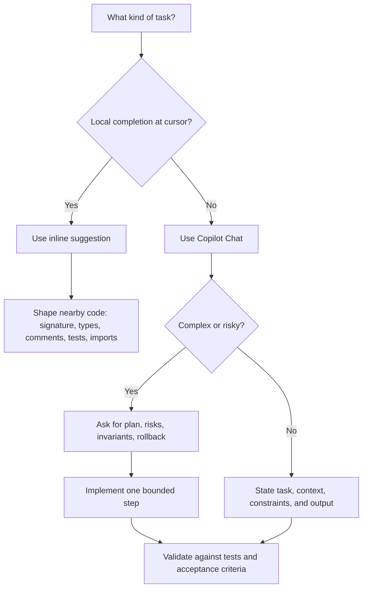

# Day 10: Domain 4 - Prompt Engineering Part 2

**Date**: 2026-07-18
**Domain**: Domain 4 - Apply Prompt Engineering and Context Crafting (10-15%)
**Subtopics**: Specific and contextual prompts; iterative refinement; dividing complex tasks; chat history in multi-turn conversations; Copilot Chat versus inline prompting
**Estimated study time**: 1.5 hrs
**Assigned questions**: 10 (`q119`, `q122`, `q123`, `q124`, `q125`, `q126`, `q127`, `q129`, `q131`, `q187`)

---

## TL;DR (60-second skim)

- Treat a strong prompt as a **small, testable specification**: goal, context, scope, constraints, output contract, and acceptance checks.
- GitHub's core strategies are: **start general then get specific, give examples, break complex tasks down, avoid ambiguity, indicate relevant code, experiment and iterate, and keep history relevant**.
- Non-functional requirements are not implied. State performance, security, privacy, compatibility, failure behavior, and resource limits explicitly.
- For machine-consumable output, require the **serialization format, exact schema, and no extra prose**.
- For migrations or large tasks, ask for an **ordered plan with risks, rollback, and compatibility constraints before asking for code**.
- Copilot Chat uses the current conversation as context. Continue a thread for the same task; start a new thread or remove stale turns when the goal changes.
- **Chat** suits questions, explanations, planning, broad generation, and iterative refinement. **Inline suggestions** suit local completions shaped by nearby code, comments, file type, cursor position, and open files.
- Copilot can support secure coding, but it does not guarantee secure output. Explicitly request validation, safe failures, TLS, bounded retries, redaction, and safe secret handling, then review and test.

---

## Learning Objectives

After this session, you should be able to:

1. Apply GitHub's official prompt-engineering strategies to coding tasks.
2. Turn vague requests into constrained, verifiable prompt contracts.
3. Decompose complex work into planning, implementation, and validation turns.
4. Use chat history deliberately without letting stale context contaminate a new task.
5. Choose Copilot Chat or inline suggestions based on task shape and context needs.
6. Specify functional and non-functional requirements for tests, performance, security, privacy, and compatibility.
7. Define machine-readable output contracts for CI and automation.
8. Recognize the strongest prompt in each of today's ten assigned scenarios.

---

## Key Concepts

### 1. The prompt contract

A useful Day 10 mental model is:

> **Task + relevant context + scope + constraints + output contract + validation**

| Element | Question it answers | Example |
| --- | --- | --- |
| Task | What should Copilot do? | Generate tests for `Parse()` |
| Context | What facts must it know? | Go, standard `testing` package |
| Scope | Where may it act? | Only `parseHeader` |
| Constraints | What must or must not happen? | Preserve public behavior; O(1) extra space |
| Output contract | What exact shape is required? | JSON array with named fields; no prose |
| Validation | How will success be checked? | Edge cases, benchmark stub, existing tests pass |

A longer prompt is not automatically better. The goal is **high signal density**: every clause should remove a meaningful ambiguity or define a testable requirement.

### 2. Official best-practice sequence

GitHub documents these prompt strategies:

1. **Start general, then get specific.** State the overall goal, then list precise requirements.
2. **Give examples.** Inputs, outputs, implementations, and tests can demonstrate the desired pattern.
3. **Break complex tasks into simpler tasks.** Ask for small steps and complete them one at a time.
4. **Avoid ambiguity.** Name the symbol, file, library, response, or code block instead of saying "this."
5. **Indicate relevant code.** Open or select relevant code and explicitly attach/reference files where available.
6. **Experiment and iterate.** Keep useful output and request focused changes, or restart when the direction is wrong.
7. **Keep history relevant.** Use a new thread for a new task and remove irrelevant or unsuccessful turns.
8. **Follow good coding practices.** Clear names, modular code, consistent patterns, comments, and tests improve available context.

These strategies reinforce one another. A complex migration prompt, for example, should start with the broad migration goal, specify compatibility requirements, split planning from implementation, and continue in the same thread only while the migration remains the active goal.

### 3. Specific and contextual prompts

Specificity defines **what success means**. Context supplies **facts Copilot cannot safely infer**.

Weak:

```text
Write tests.
```

Strong:

```text
Generate table-driven tests in Go for Parse using the standard testing package.
Cover empty input, malformed input, minimum and maximum valid lengths, and one
valid case. Use fields name, input, want, and wantErr. Do not modify Parse.
```

The strong version fixes:

- language and ecosystem;
- target symbol;
- testing idiom;
- required cases and table fields;
- edit boundary.

**Exam pattern:** prefer the option that removes consequential choices from Copilot. A prompt that merely says "detailed," "fast," "secure," or "configurable" is still underspecified.

### 4. Functional versus non-functional requirements

Functional requirements describe behavior: parse a file, expose flags, return test failures.

Non-functional requirements describe qualities and operational boundaries: performance, memory, security, privacy, compatibility, reliability, observability, and integration format. Copilot should not be expected to infer them.

For performance, name the runtime, workload size, time/space target, mechanism (such as streaming or backpressure), and measurement method.

```text
Implement a streaming JSON parser in Node.js for inputs larger than 10 MB.
Keep extra memory O(1) relative to input size, use Node streams with backpressure,
and include a benchmark stub that reports throughput and peak memory.
```

"Make it fast" provides no measurable target and does not prevent an all-in-memory design.

### 5. Divide complex tasks: plan, implement, validate

For large work, split the conversation into explicit phases:

1. **Understand** current behavior and assumptions.
2. **Plan** ordered steps, risks, rollback, and invariants.
3. **Implement** one bounded step.
4. **Validate and review** against acceptance criteria and unintended changes.

Migration template:

```text
Create a five-step plan to migrate this Flask service to FastAPI. Do not write
code yet. For each step list prerequisites, risks, validation, and rollback.
Preserve existing route paths, request/response schemas, status codes, and client
compatibility. End with unresolved questions.
```

Then ask: **"Implement only step 1; preserve the plan constraints and show the tests proving behavior is unchanged."** Planning surfaces hidden assumptions and makes later turns narrower.

### 6. Iterative refinement

Iteration is not "send the same prompt again and hope." Each turn should reduce a known uncertainty.

Inspect the response against the contract, identify one mismatch, correct it explicitly while preserving good constraints, and ask for evidence such as tests, a benchmark, schema validation, or a focused diff.

```text
Keep the implementation, but replace unbounded retries with at most three attempts
using exponential backoff and jitter. Retry only 429 and transient 5xx responses.
```

Start a new thread when the goal changes, the conversation contains many abandoned approaches, or stale assumptions repeatedly leak into responses.

### 7. Chat history in multi-turn conversations

Copilot Chat uses chat history as additional context. Within one coherent thread, follow-ups can refer to the previous response and preserve decisions such as language, architecture, constraints, or a selected plan.

Good same-thread sequence:

1. "Explain the current authentication flow."
2. "Identify its trust boundaries and failure modes."
3. "Propose a migration plan that preserves the public API."
4. "Implement only the first step."

The later turns depend on earlier analysis, so continuity is valuable. History also consumes a finite context window containing prompts, responses, attached/retrieved code, and sometimes tool results. As it fills, older detail may be summarized, omitted, or compete with current evidence.

Use these controls:

- Keep one thread focused on one outcome.
- Start a new thread for an unrelated task.
- Delete irrelevant requests where supported; restate critical invariants.
- Attach authoritative files, selections, errors, or diffs instead of trusting distant history.
- Monitor or compact the context window where available.
- Treat history as helpful context, not as a durable source of truth.

**Exam trap:** "Copilot uses chat history" does not mean every past conversation is automatically available, every old fact remains in the model's active window, or stale history is harmless.

### 8. Copilot Chat versus inline suggestions

| Dimension | Copilot Chat | Inline suggestions |
| --- | --- | --- |
| Interaction | Conversational, explicit prompts and follow-ups | Autocomplete-style suggestions while editing |
| Best for | Questions, explanations, plans, broad code generation, debugging, iterative refinement | Local snippets, names, repetitive code, functions, tests, code from comments |
| Primary prompt | Natural-language request in Chat | Nearby code plus comments/docstrings and cursor location |
| Context control | Attach/reference files, select code, mention workspace/project, preserve relevant thread | Open relevant files, close irrelevant files, write clear nearby code/comments |
| Multi-turn history | Yes; current thread informs follow-ups | Not a conversational thread in the same sense |
| Output control | Easy to request format, length, audience, schema, or plan | Shape output through signatures, types, examples, tests, and nearby patterns |
| Typical failure | Stale history, broad scope, excessive prose | Wrong local pattern, noisy open-file context, ambiguous comment |

Choose **Chat** when the task needs discussion, comparison, explanation, cross-file reasoning, a plan, or repeated refinement.

Choose **inline** when you are already at the exact edit location and want a local completion. Improve inline results by writing the function signature, types, imports, docstring/comment, example calls, or test cases first.

The same principles apply to both surfaces: state the contract in Chat prose and attachments; encode it near the inline cursor through code, types, comments, tests, and imports.

### 9. Constrain the output for downstream tools

Human-readable and machine-readable outputs are different contracts.

For CI, require:

- exact serialization format and top-level type;
- exact field names/types and null/omission rules;
- no commentary, Markdown fences, or trailing text.

```text
Return only a valid JSON array. Each item must contain exactly:
name (string), file (string), line (integer), and message (string).
Do not include Markdown fences, comments, explanations, or additional fields.
Return [] when there are no failures.
```

A tiny example can anchor a subtle schema; clarify whether it is illustrative or literal output.

### 10. Scope refactors with invariants

A safe refactor prompt identifies:

- the exact allowed symbol/files;
- preserved contracts plus intended and forbidden changes;
- tests or checks that must remain green.

```text
Modify only parseHeader. Preserve its signature, return contract, and all current
valid-input behavior. Add bounds checks and detailed typed errors for invalid
headers. Do not rename callers or edit related helpers. Existing tests must pass;
add focused invalid-boundary tests.
```

**Exam pattern:** a named function plus explicit invariants is safer than "clean up this file," even if the broad prompt sounds helpful.

### 11. Prompting for secure and privacy-aware code

Security requirements must be explicit and independently reviewed.

event names for aggregation.
| Area | Explicit prompt requirements |
| --- | --- |
| HTTP | HTTPS; normal TLS validation; connect/request timeouts; bounded retries for 429/transient 5xx; exponential backoff and jitter; honor `Retry-After` |
| Logging | Single-line structured JSON; stable fields and correlation ID; no PII, credentials, tokens, cookies, or raw bodies; redact at the logging boundary |
| Input | Type, length, range, format, and allowlist checks at trust boundaries; negative tests |
| Errors | Controlled failure without leaking internals or secrets |
| Secrets | Approved environment-backed secret provider; never hard-code or log values |

Copilot can suggest these patterns, but generated code can still be incorrect, incomplete, or vulnerable. Review, test, scan, and apply normal secure-development controls.

### 12. Worked prompt templates for today's assigned questions

| ID | Worked prompt |
| --- | --- |
| `q119` | "Generate table-driven Go tests for `Parse` with named empty, malformed, valid, and boundary cases; use `name`, `input`, `want`, and `wantErr`." |
| `q122` | "Explain this file for a new backend hire in five bullets: purpose, key data flow, external dependencies, and risks." |
| `q123` | "Implement in Node.js for 10 MB+ inputs with streaming/backpressure, O(1) extra space, and a benchmark stub." |
| `q124` | "Return only a JSON array with exactly `name`, `file`, `line`, and `message`; no prose or fences." |
| `q125` | "Create a five-step Flask-to-FastAPI plan; no code; include risks, rollback, validation, and route compatibility." |
| `q126` | "Modify only `parseHeader`; preserve public behavior; add bounds checks and detailed errors; do not edit helpers." |
| `q127` | "Use HTTPS/TLS validation, timeouts, bounded backoff for 429/transient 5xx, and redact secrets/PII from logs." |
| `q129` | "Create a Python `argparse` CLI with typed flags, validation, exit codes 0/2, help text, and examples." |
| `q131` | "Emit single-line structured JSON with `level`, `event`, `requestId`, and sanitized stack; no PII; redact tokens." |
| `q187` | "Add input validation, safe errors, approved security libraries, safe secret retrieval, and negative tests." |

---

## Decision Frameworks



**Best-prompt elimination checklist:**

1. Does it name the target language/runtime/library and exact symbol or artifact?
2. Does it define important functional and non-functional constraints?
3. Does it constrain edit scope and preserve required contracts?
4. Does it define output shape and validation evidence?
5. For security/privacy, does it prohibit unsafe behavior explicitly?

The option satisfying the most **relevant, testable** criteria is usually strongest. Irrelevant verbosity does not earn credit.

---

## Comparisons

| Weak wording | Stronger contract | Why |
| --- | --- | --- |
| "Write tests" | Language + target + test style + cases + fields | Produces an idiomatic, reviewable suite |
| "Explain this" | Audience + named artifact + sections + length | Removes referent and depth ambiguity |
| "Make it fast" | Runtime + workload + complexity + mechanism + benchmark | Makes performance measurable |
| "Return JSON" | Top-level type + exact fields/types + no prose | Makes output automation-ready |
| "Migrate the service" | Ordered plan + risks + rollback + compatibility | Separates discovery from implementation |
| "Clean up the parser" | Named function + invariants + intended edits | Limits blast radius |
| "Use HTTPS" | TLS validation + timeouts + bounded retry/backoff + redaction | Covers transport, resilience, and leakage |
| "Build a CLI" | Language/library + flags/types + validation + exit codes + examples | Defines user-facing behavior |
| "Add logs" | Structured schema + correlation + PII/secret rules | Prevents data leakage and supports analysis |

---

## Important Details for Exam

- GitHub explicitly advises starting with a general goal and then listing specific requirements.
- Examples may be inputs, outputs, implementations, or unit tests.
- Large tasks should be split into multiple small tasks completed one at a time.
- Avoid pronouns such as "this" when multiple referents exist; name the symbol or previous response.
- Specify uncommon or required libraries; imports can also steer inline context.
- In an IDE, open relevant files and close irrelevant files; select or attach exact code for Chat.
- Iteration may modify a useful response or discard it and restart.
- Chat history is context. Use a new thread for a new task and remove irrelevant turns where possible.
- A finite context window means old history is not an unlimited or perfectly durable memory.
- Inline suggestions are especially effective for snippets, repetitive code, local functions, comment-driven generation, and tests.
- Chat is especially effective for natural-language questions, explanations, larger generation, planning, and iterative work.
- "Secure," "fast," "private," and "backward-compatible" are goals, not complete requirements. Define mechanisms and checks.
- Generated code always requires review and validation; a well-written prompt reduces risk but does not guarantee correctness or security.

---

## Common Traps & Misconceptions

- **Trap:** The longest prompt must be best. **Correction:** choose the prompt with the most relevant, testable constraints.
- **Trap:** "Fast" is a performance specification. **Correction:** require workload size, complexity/resource limits, mechanisms, and measurement.
- **Trap:** JSON plus an explanation is CI-ready. **Correction:** require exact schema and no extra prose or fences.
- **Trap:** A migration request should immediately generate code. **Correction:** plan first, including risks, rollback, and compatibility.
- **Trap:** Refactoring permits broad cleanup. **Correction:** name the symbol, preserve observable contracts, and enumerate intended changes.
- **Trap:** HTTPS alone makes an HTTP client secure. **Correction:** include certificate validation, timeouts, bounded retry policy, and safe logging.
- **Trap:** Verbose logs can be filtered later. **Correction:** minimize and redact at the logging boundary; do not ingest sensitive data first.
- **Trap:** Chat history is always helpful. **Correction:** stale turns and abandoned approaches can bias later output.
- **Trap:** Inline and Chat use identical prompting mechanics. **Correction:** inline depends more heavily on local code/cursor context; Chat exposes explicit conversational control.
- **Trap:** Copilot-generated security code is automatically safe. **Correction:** explicitly prompt, then review, test, and scan it.

---

## Real-World Scenarios

1. **Large event payloads:** A Node service receives 50 MB events. State the payload size, memory target, streams/backpressure requirement, and benchmark method rather than asking for a "fast parser."
2. **Zero-downtime API migration:** Request a bounded plan with compatibility invariants and rollback before asking Copilot to implement one route.
3. **CI failure ingestion:** Require only a JSON array with exact fields and define the empty result as `[]`; prose would break the parser.
4. **Production API client:** Require verified TLS, explicit timeouts, bounded retries only for transient responses, `Retry-After`, and secret-safe logs.
5. **Onboarding:** Use Chat with the file attached and constrain audience, sections, and length; use follow-ups in the same thread only while exploring that file.

---

## Cross-Domain Quiz Question Refreshers

`q187` is stored under Domain 4, but its scenario overlaps Domain 5 code-quality/security improvements and Domain 6 privacy controls.

| Concept | Key Fact | Trap |
| --- | --- | --- |
| Secure coding support (`q187`) | Copilot can suggest input validation, controlled error handling, established security libraries, and safe secret retrieval | "Copilot supports security" does not mean generated code is guaranteed secure |
| Secret management | Read secrets from an approved environment-backed secret store or provider; never hard-code or log them | Putting a token in debug output or source is not acceptable convenience |
| Input validation | Validate type, length, range, format, and allowlisted values at trust boundaries | Validation that happens only after dangerous use is too late |
| Safe errors and logs | Fail predictably without exposing internals, credentials, tokens, or PII | Full request/response logging can create a privacy and security incident |

---

## Quick Reference Card

**Prompt contract:**

```text
Goal:
Relevant context:
Allowed scope:
Must preserve:
Functional requirements:
Performance/reliability requirements:
Security/privacy requirements:
Exact output format:
Validation/acceptance checks:
```

**History rule:** same task -> same focused thread; new task -> new thread.

**Surface rule:** local completion -> inline; conversation/planning/cross-file reasoning -> Chat.

**Risk rule:** plan -> bounded implementation -> focused validation -> human review.

**Automation rule:** format + exact schema + no prose.

**Security rule:** explicit validation + safe failures + safe secrets + redacted logs + tests/review.

---

## Readiness Checklist

Before starting the quiz, confirm that you can:

- [ ] Identify all six parts of a prompt contract.
- [ ] Explain why "fast," "secure," or "configurable" alone are inadequate.
- [ ] Write a plan-first migration prompt with rollback and compatibility.
- [ ] Constrain a refactor to one named symbol and preserve behavior.
- [ ] Define CI-ready JSON without prose.
- [ ] State when chat history helps and when to start a new thread.
- [ ] Contrast Chat context controls with inline code/cursor context.
- [ ] List secure HTTP requirements beyond HTTPS.
- [ ] Define privacy-safe structured logging.
- [ ] Explain why Copilot security suggestions still need review and tests.

---

## Hands-On Lab (optional)

Take one real function and try this three-turn Chat sequence:

1. Ask for a five-bullet explanation for a named audience, including purpose, flow, dependencies, and risks.
2. Ask for a bounded improvement plan that preserves the public contract and names validation checks.
3. Ask to implement only the first step and return a focused diff plus tests.

Then move to the function in the editor and write a precise comment or test case above the cursor. Compare how inline suggestions use local structure while Chat uses the conversation and attached context.

---

## Related Questions in questions.json

- **q119** - Specify Go, `Parse()`, table-driven style, cases, table fields, and error expectations.
- **q122** - Constrain a complex-file explanation by audience, content sections, and length.
- **q123** - State runtime, workload, complexity, streaming/backpressure, and measurement.
- **q124** - Require serialization format, exact schema, and no prose for CI.
- **q125** - Request an ordered migration plan with risks, rollback, and backward compatibility before code.
- **q126** - Scope a refactor to a named function, preserve contracts, and enumerate intended edits.
- **q127** - Require TLS validation, timeouts, bounded retry/backoff, and log-safe secret handling.
- **q129** - Specify CLI language/library, flags/types, validation, exit codes, and examples.
- **q131** - Define structured fields plus explicit PII and secret redaction rules.
- **q187** - Request input validation, safe error handling, established controls, and safe secret management.

Quiz command (run from the `GH-300 Prep` folder after studying):

```powershell
python quiz_runner.py questions.json --day-lock 10 --carryover 3 --shuffle --open-images --web --port 8765
```

---

## Sources (verified during this session)

- [Prompt engineering for GitHub Copilot Chat](https://docs.github.com/en/copilot/concepts/prompting/prompt-engineering)
- [Best practices for using GitHub Copilot](https://docs.github.com/en/copilot/get-started/best-practices)
- [About GitHub Copilot Chat](https://docs.github.com/en/copilot/concepts/chat)
- [Getting started with prompts for GitHub Copilot Chat in your IDE](https://docs.github.com/en/copilot/how-tos/chat-with-copilot/get-started-with-chat-in-your-ide)
- [Asking GitHub Copilot questions in your IDE](https://docs.github.com/en/copilot/how-tos/chat-with-copilot/chat-in-ide)
- [GitHub Copilot Chat cheat sheet](https://docs.github.com/en/copilot/reference/chat-cheat-sheet)
- [Introduction to prompt engineering with GitHub Copilot](https://learn.microsoft.com/en-us/training/modules/introduction-prompt-engineering-with-github-copilot/)
- [Manage chat context in Copilot Chat](https://learn.microsoft.com/en-us/visualstudio/ide/copilot-chat-context-references?view=visualstudio)
- [How Copilot Chat understands and uses context](https://learn.microsoft.com/en-us/visualstudio/ide/copilot-context-overview?view=visualstudio)
- [Study guide for Exam GH-300: GitHub Copilot](https://learn.microsoft.com/en-us/credentials/certifications/resources/study-guides/gh-300)

---

## Notes (your own words - fill this in after studying)

- Strongest prompt pattern:
- History/thread rule:
- Chat versus inline distinction:
- Security/privacy requirements I tend to forget:
- Questions to revisit after the quiz:
