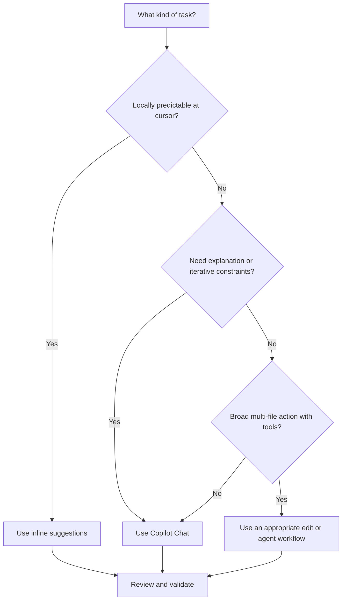

# Day 11: Developer Productivity Part 1

**Date**: 2026-07-19
**Domain**: Improve Developer Productivity with GitHub Copilot (10-15%)
**Subtopics**: Code generation, refactoring, documentation, legacy modernization, sample data, testing foundations, learning, review assistance, and validation
**Estimated study time**: 2 hours

---

## TL;DR (60-second skim)

- GitHub Copilot is a developer assistant: strong use cases include code, tests, explanations, documentation, refactoring, debugging, and pull request workflows.
- Use inline suggestions for cursor-local completions and repetitive code; use Chat for questions, explanations, iterative design, and broader or multi-step tasks.
- Generate boilerplate in small, reviewable slices and specify language, framework, version, constraints, inputs, outputs, and error behavior.
- Refactoring should preserve observable behavior; establish tests first, make incremental changes, and compare results.
- Legacy modernization is an iterative migration workflow, not a one-shot translation. Understand, document, test, convert, integrate, and validate.
- Copilot can scaffold unit and integration tests, assertions, edge cases, fixtures, and mocks, but developers must review and run every generated test.
- Code reviews and pull request summaries are advisory aids. They do not approve, merge, certify compliance, or replace human review and CI.
- Copilot output is non-deterministic and may be incorrect, insecure, outdated, or license-sensitive. Human accountability continues through review, testing, scanning, and policy enforcement.

---

## Learning Objectives

After this session, you should be able to:

1. Identify realistic, developer-focused Copilot use cases and reject exaggerated or unsupported claims.
2. Choose between inline suggestions and Copilot Chat based on task size, locality, and need for conversation.
3. Prompt for useful boilerplate, refactors, documentation, sample data, and unfamiliar API examples.
4. Apply a behavior-preserving workflow to refactoring and legacy modernization.
5. Distinguish unit-test scaffolding from integration-test design, test execution, and environment provisioning.
6. Evaluate generated tests for meaningful assertions, boundaries, failures, mocks, and false confidence.
7. Explain how code review and pull request summaries accelerate human review without becoming authoritative gates.
8. Validate generated output for correctness, security, privacy, licensing, compliance, and organizational standards.

---

## Key Concepts

### 1. The realistic Copilot productivity envelope

GitHub describes Copilot as an AI coding assistant. Its value is concentrated in software-development work where repository and editor context are useful.

**Common use cases**

- Complete variables, expressions, functions, and small code blocks while typing.
- Generate repetitive constructors, DTOs, serializers, handlers, configuration, and validation scaffolds.
- Explain selected code, unfamiliar syntax, error messages, and control flow.
- Draft unit tests, integration-test scaffolds, fixtures, and mocks.
- Add comments, docstrings, API documentation drafts, and examples.
- Suggest bounded refactors and identify readability or maintainability improvements.
- Summarize pull request changes and provide advisory review comments.
- Prototype a small implementation before refining it to production quality.

**Advanced but realistic use cases**

- Explore an unfamiliar SDK or framework through version-specific examples and follow-up questions.
- Trace data flow through legacy files before planning a migration.
- Propose an incremental modernization plan and create characterization tests.
- Translate a bounded component to another language while preserving documented behavior.
- Identify likely edge cases or missing tests from a selected implementation.
- Compare implementation approaches against explicit performance, security, or compatibility constraints.
- Reduce technical debt by finding duplicated logic, outdated patterns, missing tests, and weak documentation.

**Unsupported or exaggerated claims**

Copilot does not inherently:

- Replace source control, CI/CD, container registries, IDEs, QA teams, or human reviewers.
- Guarantee correct, secure, performant, compliant, or license-compatible code.
- Supply authoritative API documentation or legal advice.
- Manage non-development business operations such as payroll, contracts, advertising, or scheduling merely because they involve text.
- Automatically deploy, approve, merge, or provision test environments unless a separately configured agent/tool workflow explicitly performs an approved action.

The exam pattern is straightforward: prefer answers about **assisting developers with code, tests, explanations, documentation, and review**, and reject answers that turn Copilot into an autonomous business system or an infallible authority.

### 2. Code generation and repetitive boilerplate

Copilot performs well when intent is visible in nearby code and the requested pattern is common. Good targets include:

- Request/response models and mapping code.
- Constructors and property accessors.
- CRUD handler skeletons.
- Input validation branches.
- Serialization and deserialization.
- Configuration objects and adapters.
- Test setup and table-driven cases.
- Repetitive calls that follow an existing local pattern.

A useful prompt behaves like a small specification:

```text
Using TypeScript 5 and the repository's existing Express patterns, add a POST
handler for /orders. Validate quantity as a positive integer, return the existing
ProblemDetails shape for invalid input, call OrderService, and do not log payloads.
Generate only the handler and focused tests; do not add dependencies.
```

Include:

- Language, framework, and relevant version.
- Existing file, selection, or neighboring implementation to imitate.
- Inputs, outputs, state changes, and error behavior.
- Security and privacy constraints.
- Test framework and expected test categories.
- Boundaries such as "no new dependency" or "only change this function."

**Generation workflow**

1. Establish the smallest behavior to implement.
2. Give Copilot the relevant local context and constraints.
3. Generate a small slice rather than an entire subsystem.
4. Inspect imports, dependencies, APIs, error paths, and data handling.
5. Compile, lint, test, and scan.
6. Refine the prompt or edit manually.
7. Commit through the normal Git and pull request workflow.

Copilot accelerates writing. It does not remove engineering gates.

### 3. Inline suggestions vs. Chat

| Dimension | Inline suggestions | Copilot Chat |
| --- | --- | --- |
| Primary interaction | Autocomplete at the cursor | Natural-language conversation |
| Best scope | Line, expression, small function, repeated pattern | Explanation, design, refactor, tests, larger code section |
| Context style | Nearby code, cursor, open editor context | Selected files/regions, attached context, conversation history |
| Iteration | Accept, reject, edit, cycle alternatives | Ask follow-ups, add constraints, compare approaches |
| Typical use | Complete obvious boilerplate | Reason about unfamiliar or multi-step work |
| Repository effect | Suggestion changes code only when accepted | Proposed changes still require review/application |

Use **inline suggestions** when the next code is locally predictable. Use **Chat** when you need to ask why, compare alternatives, provide several constraints, or iterate over a broader task.

Neither surface bypasses version control. Accepted or applied code remains subject to compilation, tests, review, security scanning, and organizational policy.

### 4. Refactoring without changing behavior

Refactoring means restructuring code while preserving its observable behavior. Copilot can suggest:

- Better names and smaller functions.
- Reduced nesting and complexity.
- Removal of duplication.
- Separation of business logic from UI or data access.
- Replacement of brittle inheritance with simpler composition.
- Idiomatic language constructs.
- Performance improvements where behavior and measurement criteria are explicit.

**Safe refactoring sequence**

1. Ask Copilot to explain the selected code and identify assumptions.
2. Run or create characterization tests that capture current behavior, including odd legacy behavior that consumers rely on.
3. Request one bounded refactor and state that public behavior must remain unchanged.
4. Review the diff for accidental semantic changes.
5. Run tests, static analysis, and performance checks where relevant.
6. Repeat in small increments.

Example prompt:

```text
Explain this parser's observable behavior, side effects, and error cases. Then
propose a three-step refactor that preserves public signatures and output ordering.
Do not change behavior yet. Identify tests needed before each step.
```

**Exam trap:** "Refactor" does not mean "rewrite however Copilot prefers." Behavior preservation and validation are central.

### 5. Legacy modernization

Legacy modernization may involve unsupported languages, outdated frameworks, deprecated APIs, inconsistent naming, weak documentation, and missing tests. GitHub's modernization guidance uses Copilot Chat to understand code, document it, plan tests, convert incrementally, integrate, run tests, and refine.

A robust modernization loop is:

1. **Baseline**: build and run the current system where possible.
2. **Understand**: explain files, dependencies, data flow, invariants, and side effects.
3. **Document**: capture public behavior and uncertain assumptions.
4. **Characterize**: create tests around existing inputs and outputs before translation.
5. **Plan**: choose migration slices and compatibility boundaries.
6. **Convert**: translate one component or behavior at a time.
7. **Integrate**: wire the converted component into the target runtime.
8. **Validate**: compare old and new outputs, errors, performance, and security behavior.
9. **Review**: inspect generated code for target-language idioms and maintainability.

Copilot can assist with each step, but subject-matter knowledge of both the source system and target technology remains necessary. A syntactically valid translation can still change arithmetic, date handling, ordering, encoding, concurrency, or failure behavior.

### 6. Documentation, comments, and docstrings

Copilot can draft:

- Inline comments for non-obvious logic.
- Function, class, and module docstrings.
- Parameter, return-value, exception, side-effect, and example sections.
- README or API usage drafts.
- Explanations of legacy flow to support modernization.

| Artifact | Best purpose | Common failure |
| --- | --- | --- |
| Inline comment | Explain why a non-obvious decision exists | Merely repeats the next line of code |
| Docstring/API comment | Describe contract, parameters, returns, errors, side effects | Invents behavior not enforced by code |
| External guide | Explain setup, workflows, examples, architecture | Becomes stale when generated from partial context |

Generated documentation must be checked against implementation and tests. Copilot may confidently document an exception that is never thrown, omit a side effect, or infer the wrong units. Good documentation explains contracts and rationale rather than narrating syntax.

### 7. Sample data generation

Copilot can create synthetic fixtures, seed records, request payloads, CSV/JSON examples, and boundary datasets. Specify:

- Schema and required relationships.
- Valid, invalid, boundary, and adversarial categories.
- Deterministic seed or stable identifiers.
- Locale, time zone, encoding, and date requirements.
- Volume and uniqueness constraints.
- Prohibition on real personal, secret, customer, or production data.

Example:

```text
Generate 20 deterministic synthetic Order records matching this schema: 12 valid,
4 boundary, and 4 invalid. Use clearly fictional names, no real PII, ISO 8601 UTC
timestamps, stable IDs, and preserve customer-order referential integrity.
```

Generated sample data is not automatically representative. Check distributions, relationships, encoding, and whether tests accidentally depend on unrealistic values.

### 8. Learning unfamiliar APIs, frameworks, and languages

Copilot Chat reduces context switching by answering coding questions inside the development environment. Useful prompts request:

- A minimal runnable example.
- Explanation of parameters, return types, exceptions, and lifecycle.
- A version-specific comparison between old and current APIs.
- A test that demonstrates intended usage.
- An explanation of an actual compiler or runtime error.

Example:

```text
Show a minimal C# example for Azure SDK package <name and installed version> using
the existing dependency-injection setup. Explain client lifetime, cancellation,
retry behavior, and exceptions. Cite the API symbols I should verify in official docs.
```

Always verify package names, method signatures, versions, deprecations, authentication, and security guidance against official documentation. Copilot speeds discovery; it is not the authoritative vendor reference and does not install or license every dependency automatically.

### 9. Testing assistance: scaffolds, not certainty

GitHub's current testing tutorial covers both unit and integration tests. It notes that basic functions are easier to test and complex scenarios require more detailed prompts and strategies.

**Copilot can help generate:**

- Test files and test function skeletons.
- Arrange-Act-Assert structure.
- Typical, boundary, empty, null, invalid, and error cases.
- Assertions for return values, exceptions, state changes, and dependency calls.
- Parameterized or table-driven cases.
- Fixtures and deterministic sample data.
- Mock objects for databases, APIs, file systems, clocks, and other external dependencies.
- Integration-test scaffolding across real component boundaries.

**Unit vs. integration tests**

| Test type | Scope | Dependencies | Copilot's useful role | Developer responsibility |
| --- | --- | --- | --- | --- |
| Unit | One function/class behavior | Usually isolated with fakes/mocks | Generate focused cases and assertions | Confirm contract, isolation, and meaningful assertions |
| Integration | Several real components or infrastructure boundary | Real or representative dependencies | Scaffold setup, requests, cleanup, and verification | Provision environment, control data, run, diagnose, maintain |

Copilot can write test code. A Chat response alone does not prove that tests execute, pass, cover the right requirements, or detect regressions. CI/CD and test runners remain separate tools.

**High-quality test prompt checklist**

- Name the test framework and follow repository conventions.
- State the behavior, not merely the implementation lines.
- Ask for happy paths, invalid inputs, boundaries, errors, and side effects.
- Specify exact assertions and exception expectations.
- Mock only true external boundaries.
- Require deterministic time, randomness, and network behavior.
- Ask for integration cases separately from unit cases.
- Run mutation testing or deliberately break production code to verify tests can fail when risk warrants it.

**Generated-test validation**

Review each generated test for:

1. **Correct oracle**: Is the expected result derived from requirements rather than copied from the implementation?
2. **Meaningful assertion**: Does it verify behavior, not just "no exception" or a non-null value?
3. **Failure sensitivity**: Does the test fail if the implementation is intentionally broken?
4. **Boundary coverage**: Are zero, minimum, maximum, empty, null, malformed, and error paths relevant?
5. **Mock fidelity**: Does the mock use the real interface and realistic behavior?
6. **Isolation**: Is the test independent of ordering, wall clock, network, or shared state?
7. **Maintainability**: Are names clear and setup proportionate?
8. **Integration confidence**: Is there a real-boundary test where mocks could hide contract drift?

A generated test can reproduce the same misunderstanding as generated production code. Passing tests are not evidence if both implementation and expected values came from the same flawed assumption.

### 10. Code review and pull request summaries

Copilot code review can inspect changes and provide comments or suggested fixes. On GitHub.com, Copilot's review is a **Comment**, not an **Approve** or **Request changes** review. It does not count toward required approvals and does not block merging.

Pull request summaries can describe:

- The overall change.
- Files affected.
- Areas a reviewer may want to focus on.

They improve orientation and triage, especially for unfamiliar or noisy diffs. They can omit or mischaracterize intent, so authors should review and add business context, risk, rollout, and test evidence.

| Aid | Useful for | Not authoritative for |
| --- | --- | --- |
| Copilot code review | Additional issue spotting and suggested changes | Approval, merge decision, exhaustive defect detection |
| PR summary | Fast orientation to scope and impacted files | Proof of correctness, complete rationale, compliance sign-off |
| Human review | Intent, architecture, risk, maintainability, accountability | Automated execution of every check |
| CI/security tooling | Repeatable tests, builds, linting, scanning | Product intent and nuanced design judgment |

Keep branch protections, rulesets, CODEOWNERS, required reviews, tests, CodeQL, dependency review, and secret scanning in place.

### 11. Productivity and reduced context switching

Productivity gains come from shorter feedback loops:

- Ask about selected code without leaving the IDE.
- Generate a minimal example before searching broad forums.
- Explain an error and propose targeted diagnostics.
- Draft repetitive code and tests while preserving focus on design.
- Summarize a pull request before reading the full diff.
- Turn an unfamiliar component into a guided sequence of questions.

The goal is not maximum generated code. It is less time spent on mechanical work and tool switching while retaining deliberate thought for architecture, correctness, and risk.

### 12. Security, compliance, licensing, privacy, and correctness

Treat all Copilot output as untrusted proposed code until validated.

**Correctness controls**

- Compile and run the code.
- Compare behavior with requirements and known examples.
- Run unit, integration, and regression tests.
- Review error handling, concurrency, locales, time zones, precision, and performance.

**Security controls**

- Explicitly prompt for input validation, allowlists, safe failures, and established security libraries.
- Never hard-code credentials; use approved secret stores or environment mechanisms.
- Require HTTPS, certificate validation, timeouts, bounded retries, and backoff where relevant.
- Run SAST, dependency scanning, secret scanning, and other normal security checks.

**Privacy and compliance controls**

- Do not place secrets, credentials, regulated data, or unnecessary PII into prompts or sample data.
- Follow organization and enterprise Copilot policies, content exclusions, retention rules, and approved-use guidance.
- Require redacted structured logs and prevent raw request/response body dumping.
- Validate code against legal, regulatory, accessibility, data-residency, and internal requirements.

**Licensing controls**

- Code referencing can identify matches to public code and provide source/license details when matching suggestions are allowed.
- Review references and licenses; decide whether attribution, replacement, or removal is required.
- A filter or reference is an aid, not a legal certification. Keep dependency and license review in the delivery process.

**Human accountability**

The developer and organization remain accountable for accepted output. Copilot does not certify correctness, security, privacy, licensing, or compliance. Human review and established controls continue to govern what reaches production.

---

## Decision Frameworks

### Which Copilot surface should I use?



### Should Copilot generate this artifact?

| Question | If yes | If no |
| --- | --- | --- |
| Is it a software-development artifact? | Continue | Use the appropriate non-developer system or human expert |
| Can requirements and boundaries be stated? | Provide them explicitly | Clarify the task first |
| Can output be tested or reviewed? | Generate a small draft | Do not delegate blindly |
| Does it involve sensitive or regulated data? | Use approved policy-safe context only | Continue with normal safeguards |
| Is an authoritative decision required? | Use Copilot only as advisory input | Copilot may draft or scaffold |

### Refactor or modernize?

| Signal | Refactor | Modernize/migrate |
| --- | --- | --- |
| Runtime/language remains supported | Usually | Maybe |
| Public behavior should stay identical | Yes | Preserve or deliberately map behavior |
| Framework/runtime changes | Sometimes | Usually |
| Need compatibility strategy | Limited | Essential |
| Characterization tests first | Strongly recommended | Essential |
| Best change size | Small incremental diffs | Staged slices with integration checkpoints |

---

## Important Details for Exam

- Copilot's intended scope is coding and technology, not generic HR, legal, marketing, or administrative automation.
- Inline suggestions are autocomplete-style, cursor-local proposals; Chat supports natural-language, multi-turn work with selected context.
- Copilot can generate unit and integration test code, but complex scenarios require detailed prompts.
- Copilot does not replace the test runner, CI pipeline, QA process, or environment provisioning.
- Good tests cover core behavior, invalid input, boundaries, error handling, and side effects.
- Mocks isolate external dependencies; they do not replace all real-boundary integration tests.
- Refactoring restructures code without changing observable behavior.
- Modernization should proceed through understanding, documentation, tests, incremental conversion, integration, and validation.
- Copilot code review comments are advisory and do not satisfy required approvals.
- PR summaries accelerate understanding but must be reviewed and supplemented with intent and risk context.
- Generated responses are non-deterministic and may differ for the same prompt.
- Public-code matching/code referencing helps identify sources and licenses but does not provide automatic legal approval.
- Security and privacy requirements should be explicit in prompts and enforced by tooling.
- Human accountability remains throughout generation, acceptance, review, and deployment.

---

## Common Traps & Misconceptions

1. **Trap: Copilot guarantees secure and correct code.** Reality: it can produce incomplete, outdated, insecure, or incorrect output; review and testing are mandatory.
2. **Trap: Test generation means tests are run.** Reality: Copilot proposes test code; your runner and CI execute it.
3. **Trap: Generated tests prove correctness.** Reality: weak assertions, copied implementation assumptions, or unrealistic mocks can create false confidence.
4. **Trap: A review comment is an approval.** Reality: Copilot code review is advisory and does not satisfy required approvals.
5. **Trap: A PR summary is a compliance report.** Reality: it summarizes diffs and focus areas; it is not legal, security, or quality certification.
6. **Trap: Inline and Chat are interchangeable surfaces.** Reality: inline fits local completion; Chat fits conversation, explanation, and iterative reasoning.
7. **Trap: Modernization is one-shot language translation.** Reality: migration requires source-system understanding, tests, staged integration, and comparison.
8. **Trap: Documentation generated from code is automatically true.** Reality: inferred contracts and errors must be checked against implementation and requirements.
9. **Trap: Generated sample data is safe and representative by default.** Reality: demand synthetic data, privacy constraints, valid relationships, and realistic distributions.
10. **Trap: Copilot replaces official API docs.** Reality: it accelerates exploration, but versions, signatures, authentication, and deprecations require authoritative verification.
11. **Trap: Public-code filtering settles licensing.** Reality: code referencing supports review; organizational license and legal processes still apply.
12. **Trap: Productivity means accepting more code.** Reality: useful productivity reduces mechanical effort and context switching while preserving quality gates.

---

## Real-World Scenarios

### Scenario 1: Repetitive API handlers

A team needs twelve handlers following an established validation and error-response pattern. Use a neighboring handler as context, generate one handler and its tests, validate it, then repeat. Do not ask for an unreviewed twelve-file rewrite.

### Scenario 2: Unfamiliar SDK

A developer must call a newly adopted SDK. Use Chat for a minimal version-specific example, parameter and error explanations, and a focused test. Verify every symbol and authentication pattern against official vendor documentation.

### Scenario 3: Legacy batch conversion

A legacy program has no tests. First explain control and data flow, record behavior with characterization tests, and migrate one operation at a time. Compare source and target outputs before retiring the old path.

### Scenario 4: Payment tests

Copilot generates unit tests with mocked payment-provider responses. Review assertions and error cases, then add contract or integration coverage against an approved test environment. A mock cannot prove that the real provider contract still matches.

### Scenario 5: Large pull request

Use a Copilot PR summary for orientation and code review for another set of observations. Human reviewers still inspect the diff, intent, architecture, tests, security findings, and rollout plan; protected-branch checks remain authoritative.

---

## Cross-Domain Quiz Question Refreshers

Day 11's runner defaults to `--carryover 3`. Its recent-unique algorithm adds the last three unique assigned questions from prior days, which are Day 10 Domain 4 concepts.

| Concept | Key fact | Trap |
| --- | --- | --- |
| Configurable CLI prompt | Specify language/library, flags, types/allowed values, validation, exit behavior, help, and examples | A vague "make a CLI" prompt leaves UX and failure semantics undefined |
| Privacy-preserving logging | Define a structured schema and correlation ID; prohibit PII; redact tokens; keep events machine-parseable | Logging full bodies, user data, or secrets for convenience creates privacy and security risk |
| Secure generation constraints | Explicitly require input validation, safe secret handling, established libraries, and clear failures | Security is promptable and verifiable, not automatic merely because Copilot wrote the code |

---

## Quick Reference Card

| Need | Best Copilot use | Mandatory validation |
| --- | --- | --- |
| Repetitive code | Inline completion or bounded generation | Compile, lint, tests, local conventions |
| Explain unfamiliar code | Chat with selection/file context | Confirm against behavior and docs |
| Refactor | Chat plan plus small diffs | Characterization/regression tests |
| Modernize legacy code | Understand, document, test, migrate incrementally | Compare old/new behavior and integrate in stages |
| Documentation | Draft contract and examples | Verify every claim against code/requirements |
| Sample data | Generate deterministic synthetic categories | Privacy, schema, relationships, realism |
| Learn API/framework | Versioned minimal examples in Chat | Official docs and real execution |
| Unit tests | Cases, assertions, fixtures, mocks | Run and prove tests fail on defects |
| Integration tests | Setup and flow scaffolding | Real environment, cleanup, contract validation |
| Code review | Advisory comments and suggested fixes | Human review and required approvals |
| PR summary | Scope and review orientation | Read diff; add intent, risk, and test evidence |
| Compliance | Prompt constraints and review assistance | Organizational policy, scans, legal controls |

**Memory anchors**

- Inline = local completion.
- Chat = conversational reasoning.
- Refactor = preserve behavior.
- Modernize = understand, test, migrate, compare.
- Generate tests = write candidates, not execute or certify.
- Review/summary = advisory, not approval.
- Copilot assists; humans remain accountable.

---

## Hands-On Lab (15-20 minutes)

**Goal:** Practice a bounded refactor and test-generation workflow without adding dependencies.

1. Choose a small function in any local practice repository with at least one branch and one error path.
2. Ask Chat to explain its contract, side effects, assumptions, and edge cases. Do not request changes yet.
3. Ask for a test plan containing typical, boundary, invalid, and failure scenarios using the repository's existing framework.
4. Generate focused unit tests. Inspect every expected value and mock.
5. Run the tests and deliberately introduce one defect to confirm that a relevant test fails; then restore the implementation.
6. Ask for one readability refactor that preserves signatures and observable behavior.
7. Review the diff, rerun tests, and compare behavior.
8. Ask for a docstring describing parameters, returns, exceptions, and side effects; verify every statement.
9. Draft a three-bullet PR summary, then compare it with the actual diff and add missing risk/test context.

**Reflection questions**

- Which assertion came from a requirement, and which was inferred from implementation?
- Did a mock hide a real integration risk?
- Did the refactor preserve error types, ordering, and side effects?
- Which generated documentation claim required correction?

---

## Related Questions in questions.json

Assigned Day 11 IDs:

`q069`, `q073`, `q094`, `q138`, `q149`, `q151`, `q156`, `q163`, `q171`, `q172`, `q173`, `q174`, `q175`, `q176`, `q177`

These questions collectively test realistic developer use cases, unsupported claims, output validation, review and summary boundaries, unit-test scaffolding, inline-versus-Chat selection, unfamiliar API/framework learning, repetitive code, compliance, and continued human responsibility. The lesson intentionally teaches the decision rules without reproducing the answer key.

Quiz command:

```powershell
Set-Location 'd:\Projects\microsoft-exam-prep\GH-300 Prep'
python quiz_runner.py questions.json --day-lock 11 --carryover 3 --shuffle --open-images --web --port 8765
```

The command serves 15 Day 11 questions plus up to 3 prior-day carryover questions.

---

## Sources (verified during this session)

- [Best practices for using GitHub Copilot](https://docs.github.com/en/copilot/get-started/best-practices)
- [GitHub Copilot features](https://docs.github.com/en/copilot/get-started/features)
- [Responsible use of GitHub Copilot Chat in your IDE](https://docs.github.com/en/copilot/responsible-use-of-github-copilot-features/responsible-use-of-github-copilot-chat-in-your-ide)
- [Refactoring code with GitHub Copilot](https://docs.github.com/en/copilot/tutorials/refactor-code)
- [Modernizing legacy code with GitHub Copilot](https://docs.github.com/en/copilot/tutorials/modernize-legacy-code)
- [Using GitHub Copilot to migrate a project](https://docs.github.com/en/copilot/tutorials/migrate-a-project)
- [Writing tests with GitHub Copilot](https://docs.github.com/en/copilot/tutorials/write-tests)
- [Generating unit tests](https://docs.github.com/en/copilot/tutorials/copilot-cookbook/testing-code/generate-unit-tests)
- [Creating mock objects to abstract layers](https://docs.github.com/en/copilot/tutorials/copilot-cookbook/testing-code/create-mock-objects)
- [Review AI-generated code](https://docs.github.com/en/copilot/tutorials/review-ai-generated-code)
- [About GitHub Copilot code review](https://docs.github.com/en/copilot/concepts/agents/code-review)
- [Using GitHub Copilot code review](https://docs.github.com/en/copilot/how-tos/use-copilot-agents/request-a-code-review/use-code-review)
- [Responsible use of GitHub Copilot pull request summaries](https://docs.github.com/en/copilot/responsible-use/pull-request-summaries)
- [Creating a pull request summary with GitHub Copilot](https://docs.github.com/en/copilot/github-copilot-enterprise/copilot-pull-request-summaries)
- [GitHub Copilot code referencing](https://docs.github.com/en/copilot/concepts/completions/code-referencing)
- [Maintaining codebase standards in a GitHub Copilot rollout](https://docs.github.com/en/copilot/tutorials/roll-out-at-scale/govern-at-scale/maintain-codebase-standards)

---

## Notes (your own words - fill this in after studying)

- My rule for choosing inline vs. Chat:
- A generated-test failure mode I will watch for:
- My behavior-preserving modernization sequence:
- The quality gates that Copilot cannot replace:
- One exam trap I want to revisit:
