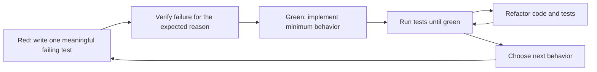
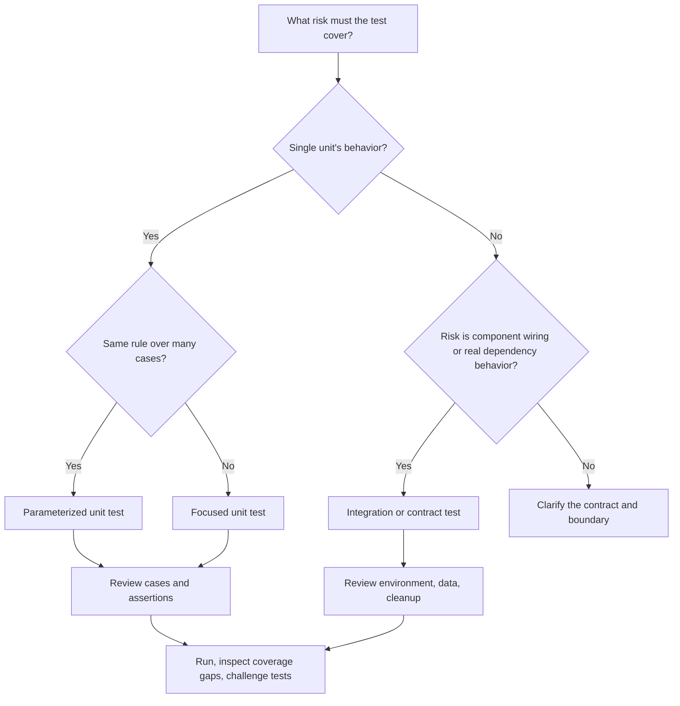
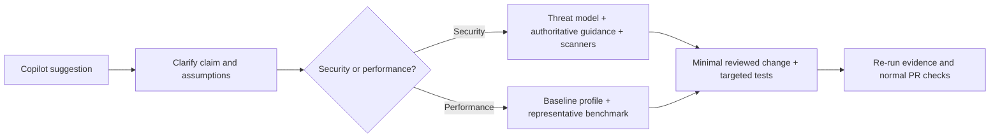

# Day 12: Developer Productivity Part 2

**Date**: 2026-07-20
**Domain**: Improve Developer Productivity with GitHub Copilot (10-15%)
**Subtopics**: Unit and integration test generation, edge cases and assertions, TDD, security suggestions, performance optimization, rapid prototyping, learning, context switching, agent responsibility, and usage metrics
**Estimated study time**: 2 hours

---

## TL;DR (60-second skim)

- Copilot drafts test structure, fixtures, mocks, parameterized cases, and initial assertions; developers still define intent, review output, and run checks.
- Unit tests isolate behavior; integration tests verify real collaboration boundaries.
- Strong prompts include selected code, framework/style, inputs and expected outcomes, edge cases, dependency strategy, and local conventions.
- TDD remains **red -> green -> refactor**; Copilot accelerates each step but does not remove the sequence.
- Suggestions do not imply execution: authorized agents may run tools, while configured CI owns required automation.
- Security suggestions require threat-aware review and scanning; performance suggestions require profiling and benchmarks.
- Coding-agent PRs remain team-owned, and usage metrics show activity trends rather than guaranteed correctness or productivity.

---

## Learning Objectives and Exam Relevance

After this session, you should be able to:

1. Choose unit, integration, parameterized, or TDD-oriented testing workflows.
2. Prompt for framework-appropriate tests with meaningful edge cases and assertions.
3. Validate generated setup, fixtures, mocks, assertions, determinism, coverage, and conventions.
4. Distinguish inline/Chat suggestions, Agent Mode tool execution, coding-agent PRs, and CI responsibility.
5. Verify security and performance suggestions with appropriate engineering evidence.
6. Use Copilot for prototypes and unfamiliar APIs without treating drafts as production-ready or authoritative.
7. Interpret usage metrics as adoption/activity signals rather than direct quality guarantees.

**Exam pattern**: prefer realistic answers where Copilot drafts, explains, scaffolds, or suggests while developers and configured systems retain responsibility for execution, correctness, review, security, and release. Reject claims that it guarantees results or replaces engineering gates.

---

## Key Concepts

### 1. Copilot's role in testing

Copilot can scaffold unit and integration tests, setup/teardown, fixtures, mocks, cases, assertions, and test refactors. It reduces repetitive authoring effort but does not establish correctness or completeness.

Copilot does not inherently establish that:

- The inferred behavior matches the real business requirement.
- Every assertion is meaningful.
- The selected mock boundary is correct.
- Important scenarios are complete.
- The suite is deterministic or non-flaky.
- The test command was run.
- CI executed or passed.
- Coverage is adequate.
- Passing tests prove an implementation is secure or correct.

The key mental model is:

> Copilot reduces test-authoring effort. The development team still defines intent and validates evidence.

### 2. Unit tests

A unit test verifies one small behavior in isolation. It should be fast, deterministic, focused, and free from unnecessary external I/O. Copilot is especially useful for Arrange-Act-Assert boilerplate, framework syntax, input partitions, exceptions, state changes, interaction checks, and parameterized cases.

Validate that the test expresses a requirement rather than copying implementation details, would fail for a real defect, mocks only appropriate boundaries, uses specific assertions, and follows repository conventions.

### 3. Integration tests

An integration test verifies collaboration across a meaningful boundary: application plus database, routing plus middleware and serialization, a client plus a test server, or modules using real dependency injection. Copilot can scaffold setup, seed data, requests, cleanup, and verification.

The team must decide which dependencies are real, how secrets and authorized environments are handled, how data is isolated and cleaned up, and what retry or consistency behavior is valid. Integration tests cost more to run and diagnose, so use them for collaboration risk rather than replacing focused unit coverage.

### 4. Test-type decision matrix

| Scenario                                   | Prefer                                   | Why                                          | Copilot prompt emphasis                         | Validation focus                          |
| ------------------------------------------ | ---------------------------------------- | -------------------------------------------- | ----------------------------------------------- | ----------------------------------------- |
| Pure calculation or validation rule        | Unit                                     | Small, deterministic contract                | Inputs, outputs, boundaries, exceptions         | Assertion precision and partitions        |
| Class with API/database dependency         | Unit with test double                    | Isolate local decisions                      | Mock only external boundary; verify calls       | Mock fidelity and over-mocking            |
| Serialization plus routing plus middleware | Integration                              | Risk lies in component wiring                | Real app host, request, expected response       | Configuration and cleanup                 |
| Repository query against real schema       | Integration                              | SQL/schema behavior matters                  | Test database, seed, transaction cleanup        | Data isolation and representative schema  |
| Same rule over many values                 | Parameterized unit                       | Compactly covers input partitions            | Framework syntax plus case table                | Case completeness and readable IDs        |
| New contract developed tests-first         | TDD loop                                 | Tests define behavior before code            | Acceptance criteria and one failing case        | Red state is meaningful; green is minimal |
| External vendor service                    | Unit plus selective contract/integration | Fast local feedback plus boundary confidence | Fake for unit; sandbox/contract for integration | Credentials, rate limits, determinism     |

### 5. Edge cases: derive them systematically

"Add edge cases" is weaker than naming risk dimensions. Partition the input and state space: missing/empty values; zero, negative, minimum/maximum, and values around thresholds; malformed or duplicate data; Unicode/locale/date boundaries; unauthorized or expired state; dependency errors/timeouts; concurrency and idempotency; and repeated or invalid lifecycle states.

**Prompting pattern**

```text
Using the selected function and the repository's existing pytest style, generate
parameterized unit tests for the documented behavior. Cover normal values, zero,
negative values, both sides of each threshold, invalid types, and dependency errors.
Use the existing fixtures, mock only the payment gateway, and give each case a
readable ID. Do not change production code.
```

Specific categories lead to better coverage than an unbounded request for "all edge cases."

### 6. Assertions are the test's evidence

A useful assertion checks an observable contract: exact result, expected error, state transition, persisted record/event, required dependency interaction, prohibited side effect, response contract, or invariant. Avoid asserting only a mock's configured value, duplicating production logic in expected values, broad shallow snapshots, or private implementation details.

A useful check is to introduce a deliberate defect or use mutation testing: if the test still passes, its assertion or scenario is not protecting the intended behavior.

### 7. Fixtures, setup/teardown, and mocks

Generated setup can hide risk. Fixtures should be deterministic, independent, realistically constrained, minimally scoped, safely cleaned up even after failure, and free from production secrets or customer data. Mocks should target a real external boundary, match its interface and important failures, avoid impossible responses, and not over-specify private call sequences.

Use real collaborators when the collaboration itself is what you need to test. Use test doubles when isolation and speed are the objective.

### 8. Parameterized and table-driven tests

Parameterized tests run one test definition against a table of cases. Examples include `pytest.mark.parametrize`, JUnit parameter sources, xUnit theories, Jest `test.each`, and Go table-driven loops.

An effective request includes:

1. The selected function/class and relevant nearby test example.
2. The exact framework and language version.
3. The desired parameterized/table-driven style.
4. Named inputs and expected outputs or expected errors.
5. Boundary, invalid, and negative cases.
6. Fixture and mocking constraints.
7. Readable case names/IDs.
8. A request not to alter production behavior unless explicitly intended.

**Bad prompt**

```text
Write tests.
```

**Better prompt**

```text
For the selected C# method, write xUnit [Theory] tests using MemberData and the
existing naming convention. Include valid tiers, exact threshold values, values
one unit around each threshold, invalid enum values, and expected exceptions.
Use decimal values exactly; do not change the method.
```

A parameterized test is not automatically comprehensive. The table still needs meaningful partitions and assertions.

### 9. Generated-test validation workflow

Use this sequence after Copilot drafts tests:

1. **Re-read the requirement**: state the contract independently of generated code.
2. **Review scope**: confirm unit vs. integration boundaries.
3. **Review structure**: naming, folders, framework, setup/teardown, and local conventions.
4. **Review fixtures**: realistic, deterministic, isolated, and safely cleaned up.
5. **Review mocks**: correct boundaries and representative behavior.
6. **Review assertions**: exact, observable, and able to catch realistic defects.
7. **Map cases**: happy, negative, boundary, error, side-effect, and concurrency paths as relevant.
8. **Run the narrow suite**: distinguish compile errors, test defects, and production defects.
9. **Measure coverage**: inspect line and branch gaps instead of accepting a percentage alone.
10. **Challenge the tests**: deliberately alter behavior or use mutation testing where risk justifies it.
11. **Run broader checks**: lint, static analysis, security scans, and CI.
12. **Review the diff**: ensure tests did not silently weaken production behavior or repository policy.

### 10. Coverage quantity is not test quality

Coverage answers whether code was executed, not whether behavior was meaningfully verified.

| Signal          | What it can tell you                 | What it cannot prove             |
| --------------- | ------------------------------------ | -------------------------------- |
| Line coverage   | Which lines ran                      | Assertions were correct          |
| Branch coverage | Which control-flow branches ran      | Input partitions were complete   |
| Test count      | Number of test cases                 | Tests protect important behavior |
| Passing suite   | Current examples passed              | Missing scenarios are correct    |
| Mutation score  | Whether tests catch injected changes | Entire specification is complete |

Use coverage to find untested behavior. Then inspect the missed branches and strengthen scenarios and assertions. A high percentage with shallow assertions can be less valuable than focused tests around critical contracts.

### 11. TDD with Copilot: red, green, refactor

TDD is a feedback discipline, not merely generating tests and implementation in one batch.



**Copilot-assisted TDD workflow**

1. Describe one behavior or acceptance criterion.
2. Ask Chat or Agent Mode to draft a focused test using project conventions.
3. Review the test and run it; confirm it fails for the intended missing behavior.
4. Ask for the smallest implementation change that makes it pass.
5. Run the focused and related suites.
6. Refactor names, duplication, and design while preserving green tests.
7. Repeat with the next case.

**Agent Mode nuance**

An IDE agent with approved tools may edit files and invoke the local test command. That execution is not guaranteed merely because a prompt generated test code. Inspect tool requests and results. Do not confuse a model saying "the tests should pass" with an observed test-run result.

**TDD traps**

- Generating implementation and tests together, then calling it tests-first.
- Deleting, skipping, or weakening a failing test merely to reach green.
- Failing for syntax/setup reasons instead of the missing behavior.
- Refactoring before establishing a green safety net.
- Treating compile success as test success.

### 12. Interaction modes and responsibility boundaries

| Surface/workflow           | Typical capability                                        | Can it execute tools?                                            | Output/ownership boundary                               |
| -------------------------- | --------------------------------------------------------- | ---------------------------------------------------------------- | ------------------------------------------------------- |
| Inline suggestion          | Cursor-local completion                                   | No, not by the suggestion itself                                 | Developer accepts/edits code and runs checks            |
| Ask/Chat response          | Explanation, snippets, test drafts, guidance              | A plain response does not execute merely by suggesting a command | Developer verifies and applies output                   |
| Edit workflow              | Proposed file edits over a bounded scope                  | Depends on product surface and approvals                         | Developer reviews edits and runs checks                 |
| IDE Agent Mode             | Multi-step edits and tool use in the authorized workspace | Yes, when tools are available/approved                           | Developer reviews tool actions, results, and final diff |
| Copilot cloud/coding agent | Works in a repository session/branch and can produce a PR | Operates in its configured environment                           | Team reviews the PR and enforces repository rules       |
| GitHub Actions/CI          | Configured build, test, scan, and deployment jobs         | Yes, according to workflow permissions                           | Repository automation reports required checks           |

**Exam rule**: writing a test is not running a test. An agent may run an available test tool, but CI does not happen automatically just because Copilot generated files. CI must be configured and triggered through the repository's automation.

### 13. Coding-agent pull request workflow

A coding/cloud agent can research a repository, plan, modify a branch, improve tests, and create a pull request. The resulting contribution requires the same engineering governance as other code.

**Team responsibilities**

- Read the task/session log and inspect the complete diff.
- Confirm requirements and scope.
- Verify local and CI test results.
- Require branch rules, protected branches, approvals, and status checks.
- Apply CODEOWNERS and specialist review where appropriate.
- Review dependencies, permissions, data handling, and security impact.
- Resolve comments and re-run affected checks.
- Decide whether and when to merge.

GitHub's code review documentation also states that Copilot reviews leave comments rather than approvals; they do not satisfy required human approvals or block merging by themselves.

### 14. Security improvement suggestions

Copilot can flag hardcoded secrets, validation/encoding gaps, injection and XSS risks, authorization errors, sensitive logging, unsafe cryptography/deserialization/file handling, vulnerable dependencies, and excessive permissions.

**Security workflow**

1. Give the relevant code, trust boundary, threat, framework/version, and organization rules.
2. Ask Copilot to identify findings and explain exploit conditions before changing code.
3. Verify the API and mitigation against official framework/security guidance.
4. Request a minimal fix and security-focused tests.
5. Review for behavioral regressions and new attack surface.
6. Run compiler/linter, dependency review, secret scanning, CodeQL/SAST, and applicable DAST.
7. Obtain human security review for high-impact code.
8. Merge only through normal policy gates.

Traps: a plausible fix may use an obsolete API or wrong sanitization context; passing tests do not prove absence of vulnerabilities; advisory review does not certify compliance; and UI validation cannot replace server-side authorization. Never provide secrets as prompt context.

GitHub documents built-in validation for cloud-agent output, including security analysis in supported workflows, but this supplements rather than removes team review and branch protections.

### 15. Performance optimization suggestions

Copilot can suggest better algorithms/data structures, less repeated work or allocation, batched I/O, fixes for N+1 queries, caching, pagination/streaming, resource cleanup, and safer concurrency or asynchronous patterns.

A suggestion is a hypothesis until measured.

**Performance workflow**

1. Define the workload, latency/throughput goal, resource constraints, and correctness invariants.
2. Profile or benchmark the baseline using representative data.
3. Give Copilot the hot path and measured evidence, not only an intuition.
4. Ask for alternatives and tradeoffs in complexity, memory, consistency, and maintainability.
5. Apply one bounded change.
6. Run correctness tests and the same benchmark/profiler.
7. Compare distributions and resources, not only one elapsed-time sample.
8. Keep the change only if the evidence supports it and the tradeoff is acceptable.

Traps: optimizing without a measured bottleneck, improving averages while harming tail latency/memory, unsafe cache invalidation, unrealistic benchmarks, and changing semantics or error behavior for speed.

### 16. Rapid prototyping

Copilot can turn a high-level development description into a small runnable draft: a route, script, component, adapter, parser, or proof of concept.

A productive prompt specifies runtime/dependencies, I/O boundary, one feasibility question, a minimal file shape, safe mock data, and explicit omissions.

Prototype workflow:

1. State the hypothesis to test.
2. Generate the smallest runnable draft.
3. Run it against representative examples.
4. Decide whether the approach is viable.
5. Discard it or harden it with architecture review, tests, validation, observability, security, and performance measurement.

A prototype is not production-ready merely because it runs.

### 17. Accelerating learning and reducing context switching

Copilot Chat can keep development questions near the code, reducing trips among documentation, search results, and unfamiliar files.

Useful tasks include explaining selected code and data flow, interpreting errors, showing a minimal API example, comparing approaches, explaining repository conventions, and drafting a small experiment.

For unfamiliar APIs, verify package/version, exact symbols, authentication, lifecycle/thread safety/disposal, error/retry/timeout behavior, deprecations, licensing, and support in official documentation.

Copilot remains a coding assistant. Developer-focused learning, experimentation, and implementation are in scope; unrelated payroll, legal, HR, or marketing operations are distractors in GH-300 scenarios.

### 18. Usage metrics: what they do and do not show

GitHub's current usage metrics documentation describes visibility into adoption and use across organizations, including engagement, activity, code generation, and pull request lifecycle trends. Metrics can be available through dashboards, APIs, and exports, with scope and aggregation differences.

Signals include active users, chat/feature activity, suggestions offered and accepted, user/agent code generation, and PR throughput or time-to-merge trends.

Interpret them carefully:

- Acceptance does not prove semantic correctness.
- More generated lines do not prove maintainability or security.
- Faster merge time does not prove better quality.
- Correlation after rollout does not by itself establish causation.
- Telemetry settings, network conditions, aggregation, and reporting delay can affect completeness.
- Usage data should be combined with engineering outcomes and qualitative feedback.

Pair adoption metrics with defect trends, change-failure rate, review findings, test quality, developer feedback, and task-specific measures. Activity alone cannot guarantee productivity or quality.

---

## Decision Frameworks

### Which test workflow should I use?



### Which Copilot surface should I use?

- Need a local completion or repetitive line: use inline suggestions.
- Need explanation, test draft, prompt iteration, or comparison: use Chat/Ask.
- Need bounded edits across files: use an edit workflow and review the diff.
- Need multi-step edits plus local tool execution: use Agent Mode with explicit scope and inspect tool results.
- Need asynchronous repository work and a branch/PR: delegate to the cloud/coding agent, then apply normal PR governance.
- Need repeatable required checks: configure CI/GitHub Actions; do not rely on generated text or an agent's claim.

### Security or performance suggestion?



---

## Comparisons

### Drafting vs. executing vs. governing

| Claim                      | Correct interpretation                                                              |
| -------------------------- | ----------------------------------------------------------------------------------- |
| "Copilot generated tests"  | Test code was proposed or written; no run result is implied.                        |
| "Agent ran tests"          | A tool invocation should have observable command output; it is still not CI.        |
| "CI passed"                | Configured automation reported successful required checks for a revision.           |
| "Copilot reviewed the PR"  | Advisory findings/comments were produced; required approvals still apply.           |
| "Coding agent opened a PR" | A contribution awaits team review, checks, security validation, and merge decision. |

### Test completeness vs. quality

| Weak proxy                | Stronger evaluation                                     |
| ------------------------- | ------------------------------------------------------- |
| Number of generated tests | Requirements and risk mapped to scenarios               |
| Line coverage alone       | Line + branch gaps inspected against behavior           |
| Tests compile             | Tests run and fail for deliberate defects               |
| Suite is green            | Assertions are specific and important cases are present |
| Many mocks                | Correct boundaries with representative behavior         |

### Security vs. performance verification

| Dimension         | Security suggestion                                        | Performance suggestion                             |
| ----------------- | ---------------------------------------------------------- | -------------------------------------------------- |
| Starting evidence | Threat model, data flow, trust boundaries                  | Profile, trace, benchmark, workload                |
| Main validation   | Review, tests, SAST/CodeQL, dependency and secret scanning | Repeatable benchmarks, profiling, resource metrics |
| Common regression | New vulnerability or authorization/data exposure issue     | Changed semantics, memory/tail-latency regression  |
| Human expertise   | Security/context owner                                     | System/domain/performance owner                    |
| Not sufficient    | "Looks safer" or tests pass                                | "Looks faster" or microbenchmark once              |

---

## Important Details for Exam

- GitHub's testing guidance explicitly covers both unit and integration tests.
- Basic functions often need less prompting; complex scenarios need detailed context and decomposition.
- Test generation commonly includes structures, setup/teardown, fixtures, mocks, cases, and initial assertions.
- Generated tests require review, refinement, execution, and coverage inspection.
- Parameterized-test prompts should name the target code, framework, test style, cases, and edge conditions.
- TDD order is tests first, implementation second, refactor third, with tests protecting the cycle.
- A plain suggestion or Chat response does not automatically run a test framework or CI.
- Agent Mode can invoke available tools when authorized; verify actual command output.
- CI execution belongs to configured automation such as GitHub Actions.
- Coding/cloud-agent pull requests remain subject to reviews, branch protections/rulesets, required checks, security checks, and team approval.
- Copilot code review comments are advisory and do not count as required approvals.
- Coverage indicates execution, not assertion quality or scenario completeness.
- Security fixes need authoritative validation and security tooling.
- Performance improvements need baseline and post-change measurement.
- Usage metrics show adoption, engagement, activity, code-generation, and PR-lifecycle trends; they do not guarantee correctness, quality, or causal productivity gains.
- Rapid prototypes and unfamiliar-API examples are drafts that require hardening and official-document verification.

---

## Common Traps and Misconceptions

1. **Generated or passing does not mean correct.** Review tests, fixtures, mocks, assertions, and requirements; challenge whether tests detect realistic defects.
2. **Coverage quantity is not suite quality.** Inspect untested behavior and assertion depth; ask for named boundary, invalid, error, state, and concurrency cases rather than "all cases."
3. **Generation is not execution, and Agent Mode is not CI.** Look for observed tool output; CI remains independently configured automation.
4. **Agent PRs and Copilot reviews do not remove accountability.** Teams retain branch rules, checks, security review, required approvals, and merge decisions.
5. **TDD is not simultaneous generation or weakened tests.** Establish a meaningful failure, implement to green, and refactor without deleting the safety signal.
6. **Security and performance suggestions are hypotheses.** Verify security with authoritative guidance/scanners and performance with representative before/after measurements.
7. **Activity, explanations, and prototypes are not outcome guarantees.** Usage needs quality evidence; unfamiliar APIs need official docs; runnable drafts need production hardening.

---

## Worked Scenario and Hands-On Exercise

### Scenario: discount eligibility service

A team is adding a function that decides whether an order qualifies for a discount. The rules include thresholds, customer status, expiration time, and a call to a remote entitlement service.

**Design the test strategy**

Use parameterized unit tests for thresholds/status, inject a deterministic clock, mock entitlement outcomes and failures, and add a controlled integration test for wiring and serialization. Assert decision plus reason, inspect branch gaps, and keep secrets outside tests and logs.

**Hands-on prompt sequence**

1. Select a small function in a local practice repository.
2. Ask Copilot to explain its observable contract and list input partitions without writing tests.
3. Correct the list from your own understanding.
4. Ask for framework-specific parameterized unit tests using the corrected cases and an existing test file as style context.
5. Review fixtures, mocks, assertions, naming, and determinism.
6. Run the focused test command yourself or approve an Agent Mode tool call.
7. Introduce one deliberate boundary defect and confirm the suite detects it.
8. Restore the code and inspect line/branch coverage.
9. Ask for one security concern and one performance hypothesis, then identify the scanner or measurement needed to verify each.

Expected outcome: explain why generation saved boilerplate effort while intent, execution, evidence, and release accountability remained with the engineering workflow.

---

## Cross-Domain Quiz Question Refreshers

| Concept                              | Key fact                                                                                                                                                 | Trap                                                                                                |
| ------------------------------------ | -------------------------------------------------------------------------------------------------------------------------------------------------------- | --------------------------------------------------------------------------------------------------- |
| Coding/cloud-agent PR responsibility | Agent-created branches and PRs require complete team review, tests/checks, security validation, branch protections/rulesets, and a human merge decision. | Treating an agent contribution as pre-approved or implicitly passing all checks.                    |
| Copilot code review                  | Produces advisory comments/suggestions and does not satisfy required approvals.                                                                          | Equating automated review with approval or a blocking quality gate.                                 |
| Usage metrics                        | Capture telemetry-derived adoption, engagement, activity, code-generation, and PR-lifecycle trends through dashboards/APIs/exports.                      | Interpreting usage as raw source storage, semantic correctness, or guaranteed productivity/quality. |
| Metrics interpretation               | Telemetry completeness and aggregation affect results; combine activity with engineering outcomes and developer feedback.                                | Claiming causation from acceptance rates, generated lines, or merge-time correlation alone.         |
| Agent/tool execution                 | An authorized agent can call tools and report observed results.                                                                                          | Assuming every Chat suggestion executes commands or that local execution is CI.                     |

---

## Quick Reference Card

```text
[Selected code/context] + [framework/version] + [behavioral contract] +
[test type/style] + [inputs/outputs/errors] + [edge partitions] +
[fixture/mock constraints] + [repository conventions] + [scope boundary]
```

After generation: verify contract, boundary, setup/fixtures/mocks, assertions, edge paths, conventions, actual run results, and coverage gaps. Copilot drafts; authorized agents may execute; CI runs configured checks; humans verify and decide.

---

## Concise Pre-Quiz Checklist

Before starting the quiz, confirm you can answer these without notes:

- Why must generated tests be reviewed even when they compile and pass?
- When should you choose a unit test, integration test, or parameterized test?
- What information makes a parameterized-test prompt effective?
- What does red-green-refactor require in sequence?
- What must be checked in assertions, fixtures, setup, mocks, and edge cases?
- How do suggestion generation, Agent Mode execution, cloud-agent PRs, and CI differ?
- How do you verify security and performance suggestions?
- Why are coverage and usage metrics useful but insufficient quality evidence?
- Why are prototypes and unfamiliar-API examples drafts rather than authority?

---

## Related Questions in questions.json

- `q178`: limits of AI-generated tests and continuing human validation.
- `q179`: tests-first assistance in a TDD workflow.
- `q180`: productivity gains from test boilerplate, lifecycle hooks, fixtures, and assertions.
- `q181`: rapid prototyping from a high-level development description.
- `q182`: unit-test templates from selected/local code and explicit prompts.
- `q183`: unit tests, integration-test scaffolding, and toolchain boundaries.
- `q184`: post-generation refinement of tests and missing cases.
- `q191`: Agent Mode within a red-green-refactor loop.
- `q213`: team accountability for coding-agent pull requests.
- `q224`: scope and limitations of Copilot usage metrics.
- `q225`: targeted TDD assistance from tests through implementation and refactoring.
- `q226`: reviewing assertions, fixtures, mocks, edge cases, execution, and coverage.
- `q227`: code-generation assistance versus CI/test-runner execution.
- `q230`: context-rich prompting for parameterized/table-driven tests.
- `q231`: coverage quantity versus behavioral and assertion quality.

Quiz command from inside `GH-300 Prep`:

```powershell
python quiz_runner.py questions.json --day-lock 12
```

---

## Sources (verified during this session)

- [Writing tests with GitHub Copilot](https://docs.github.com/en/copilot/tutorials/write-tests)
- [Generating unit tests](https://docs.github.com/en/copilot/tutorials/copilot-cookbook/testing-code/generate-unit-tests)
- [Creating mock objects to abstract layers](https://docs.github.com/en/copilot/tutorials/copilot-cookbook/testing-code/create-mock-objects)
- [Testing automation custom instructions](https://docs.github.com/en/copilot/tutorials/customization-library/custom-instructions/testing-automation)
- [Generate unit tests prompt file](https://docs.github.com/en/copilot/tutorials/customization-library/prompt-files/generate-unit-tests)
- [About GitHub Copilot cloud agent](https://docs.github.com/en/copilot/concepts/agents/cloud-agent/about-cloud-agent)
- [Use Copilot agents](https://docs.github.com/en/copilot/how-tos/copilot-on-github/use-copilot-agents)
- [Using GitHub Copilot code review on GitHub](https://docs.github.com/en/copilot/how-tos/copilot-on-github/use-copilot-agents/copilot-code-review)
- [Risks and mitigations for GitHub Copilot cloud agent](https://docs.github.com/en/copilot/concepts/agents/cloud-agent/risks-and-mitigations)
- [Maintaining codebase standards in a GitHub Copilot rollout](https://docs.github.com/en/copilot/tutorials/roll-out-at-scale/govern-at-scale/maintain-codebase-standards)
- [Code reviewer custom instructions](https://docs.github.com/en/copilot/tutorials/customization-library/custom-instructions/code-reviewer)
- [GitHub Copilot usage metrics](https://docs.github.com/en/copilot/concepts/copilot-usage-metrics/copilot-metrics)
- [Data available in Copilot usage metrics](https://docs.github.com/en/copilot/reference/copilot-usage-metrics/copilot-usage-metrics)
- [Interpreting usage and adoption metrics for GitHub Copilot](https://docs.github.com/en/copilot/reference/copilot-usage-metrics/interpret-copilot-metrics)
- [Measuring the success of a GitHub Copilot trial](https://docs.github.com/en/copilot/tutorials/roll-out-at-scale/measure-success)

---

## Notes (your own words - fill this in after studying)

_(Add your notes here.)_
