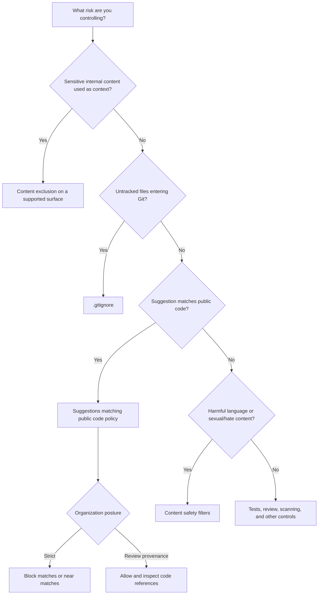

# Day 13: Privacy & Content Exclusions Part 1

**Date**: 2026-07-21
**Domain**: Configure Privacy, Content Exclusions, and Safeguards (10-15%)
**Subtopics**: Content exclusion configuration and scope; current exclusion syntax; suggestions matching public code; code referencing; context and data-flow refreshers
**Estimated study time**: 2 hours

---

## TL;DR (60-second skim)

- **Content exclusion is an input-context control**: it limits which files Copilot may use to form suggestions, chat responses, and code reviews on supported surfaces.
- It is available to organizations with **Copilot Business or Copilot Enterprise**.
- **Repository administrators, organization owners, and enterprise owners** can manage exclusions; a repository's **Maintain** role can view but not edit them.
- Current GitHub Docs do **not** document a `.copilotignore` file. Configure exclusions in GitHub settings or through the content-exclusion REST API using path rules and `fnmatch` patterns.
- `.gitignore` controls which untracked files Git considers for tracking; it does not create a Copilot context boundary.
- Current docs explicitly say content exclusion is **not supported** by Copilot CLI, Copilot cloud agent, or Agent mode in Copilot Chat in IDEs.
- **Suggestions matching public code** is an output policy: block a match/near-match, or allow it and expose code references such as source URLs and detected license names.
- The official wording is a suggestion **with about 150 characters of surrounding code** checked against public GitHub code. Treat “150” as the exam number, not as a universal exact-match minimum.

---

## Learning Objectives

After this session, you should be able to:

1. Distinguish input exclusion, Git tracking, public-code output handling, and safety filtering.
2. Choose repository, organization, or enterprise scope and identify its authorized editors.
3. Read current path-rule syntax and explain exclusion effects and unsupported surfaces.
4. Describe block versus allow-with-references behavior and the precise “about 150 characters” wording.
5. Explain cloud/context architecture and apply safe credential-storage principles.

---

## Key Concepts

### 1. The Input-versus-Output Mental Model

The fastest way to classify GH-300 governance questions is to ask what is being controlled.

| Concern                                                 | Control                                             | What it governs                                     |
| ------------------------------------------------------- | --------------------------------------------------- | --------------------------------------------------- |
| Sensitive repository content entering Copilot context   | Content exclusion                                   | Inputs Copilot can use on supported surfaces        |
| Untracked files being considered by Git                 | `.gitignore`                                        | Git tracking behavior                               |
| Suggestions that match or nearly match public code      | Suggestions matching public code / code referencing | Generated output handling and provenance visibility |
| Hate, discriminatory, sexual, or other harmful material | Content safety filters                              | Harmful input/output categories                     |
| Incorrect logic, bugs, or insecure design               | Review, tests, linters, scanners                    | Code quality and security validation                |

Content exclusion does not certify an output as original or license-safe.
Code referencing does not stop Copilot from reading an internal secret-bearing file.
Content safety filters do not repair a logical error.
Use the controls together, each for its own risk.

### 2. What Content Exclusion Does

Content exclusion tells Copilot to ignore specified content on supported surfaces.
According to current GitHub Docs, an affected file has these consequences:

- Inline suggestions are unavailable in the affected file.
- Its content does not inform inline suggestions in other files.
- Its content does not inform Copilot Chat responses on supported surfaces.
- It is not reviewed by Copilot code review.

This is why exclusion matters to prompting: a prompt is not only the text the user types.
The effective model request can include allowed context selected from files, editor state, conversation state, or repository retrieval.
Exclusion narrows that input boundary before supported Copilot features use the content.

Use cases include:

- Secret-bearing configuration directories.
- Proprietary algorithms or “crown-jewel” code.
- Regulated-data schemas and fixtures.
- Generated files that would add noise.
- Legacy directories that should not shape new suggestions.
- Files with licensing or contractual restrictions.

Content exclusion is not data deletion.
It does not remove a file from Git, rewrite history, change repository permissions, or disable Copilot for the entire repository.

### 3. Current Plan Availability

Current official documentation lists content exclusion for organizations with:

- **GitHub Copilot Business**
- **GitHub Copilot Enterprise**

It is an organization/enterprise governance capability, not a personal exclusion control exposed by Copilot Free, Pro, Pro+, or Max.

Exam phrasing often asks for the first organizational tier that introduces governance.
Business is the baseline organization plan; Enterprise also includes the capability and adds broader enterprise administration.

### 4. Roles and Permissions

| Role                      | Manage exclusions? | Scope                                                                               |
| ------------------------- | ------------------ | ----------------------------------------------------------------------------------- |
| Repository administrator  | Yes                | Own repository                                                                      |
| Organization owner        | Yes                | Users assigned Copilot through that organization; can target repositories and paths |
| Enterprise owner          | Yes                | Enterprise-level configuration across organizations/repositories                    |
| Repository role: Maintain | No; view only      | Can inspect repository exclusion settings                                           |
| Outside collaborator      | No                 | No exclusion-management authority by that status alone                              |
| General contributor       | No                 | No exclusion-management authority by that status alone                              |

The exam trap is the verb:

- **View** does not mean **create or edit**.
- Repository **Maintain** is not repository **Admin**.
- Repository administrators configure their repository; they do not set enterprise-wide rules.

### 5. Configuration Scopes

| Scope        | Use when                                                   | Manager                  |
| ------------ | ---------------------------------------------------------- | ------------------------ |
| Repository   | The boundary belongs to one repository                     | Repository administrator |
| Organization | Licensed users need rules across organization repositories | Organization owner       |
| Enterprise   | Multiple organizations need one boundary                   | Enterprise owner         |

Inherited exclusions are visible at lower scopes but cannot be edited there. The effective set is additive:

```text
enterprise exclusions
+ organization exclusions
+ repository exclusions
= effective excluded content for a supported surface
```

A child scope can add rules but cannot erase a parent rule.

### 6. Current Syntax: Path Rules, Not `.copilotignore`

#### Important correction to the study plan

As of the live official documentation checked on **2026-07-21**, GitHub does **not** document `.copilotignore` as a supported repository file for content exclusion.
The current mechanism is configured through GitHub's repository, organization, or enterprise settings, or the content-exclusion REST API.

Do not confuse these files:

| File/control                                | Current purpose                                                           |
| ------------------------------------------- | ------------------------------------------------------------------------- |
| `.gitignore`                                | Tells Git which untracked files should normally stay untracked            |
| `.github/copilot-instructions.md`           | Gives Copilot repository-wide instructions and preferences                |
| `.github/instructions/NAME.instructions.md` | Gives path-specific custom instructions where supported                   |
| Content exclusion settings                  | Establish Copilot input boundaries using paths/patterns                   |
| `.copilotignore`                            | Not documented by current official GitHub Docs as the exclusion mechanism |

If an exam item explicitly asserts `.copilotignore`, treat it as stale unless the item supplies a product/version-specific context.
For current-product questions, select the official content-exclusion settings mechanism.

#### Repository rule shape

Repository settings accept one path per YAML list line.
Comments can begin with `#`.
Path matching uses `fnmatch` pattern notation and is case-insensitive.

```yaml
# One exact repository-relative path
- "/src/regulated/customer-schema.json"

# A directory
- "/secrets/**"

# A filename wherever matched
- "secrets.json"

# A filename prefix
- "secret*"

# A file type / extension
- "*.pem"
- "*.key"
```

Use the examples to understand target categories, but consult the live docs when implementing complicated globs.
Pattern engines have edge cases; test the result rather than assuming shell-glob behavior.

#### Organization or enterprise rule shape

At broader scopes, keys identify repositories and values list paths/patterns:

```yaml
acme/payments-api:
  - "/src/crypto/**"
  - "*.pem"
```

Rules can target whole repositories, paths/directories, files, extensions/file types, and patterns. “Branches only” is not the target model tested here.

### 7. Testing and Auditing Exclusions

After saving an exclusion, verify it on a supported surface.
Allow time for propagation, then compare an affected file with a neighboring non-excluded file.
Confirm inline suggestions are unavailable in the excluded file and that supported Chat does not use a distinctive fact found only there.

Content-exclusion changes are auditable.
The organization audit log can show the `copilot.content_exclusion_changed` action, actor, timestamp, and exclusion details.
The REST API also exposes public-preview management endpoints; current API notes include limitations around comments and duplicate keys.

### 8. Critical Surface Limitations

Do not memorize “content exclusion applies everywhere.”
Current official docs explicitly state that these features do **not** support content exclusion:

- GitHub Copilot CLI.
- Copilot cloud agent.
- Agent mode in Copilot Chat in IDEs.

The current concept page lists support across common IDE inline/chat experiences and selected GitHub surfaces, but support varies by tool and feature.
GitHub.com and GitHub Mobile content-exclusion support is documented as public preview in the current concept page.

Exam strategy:

- If a question asks the general purpose, answer “limits allowed input context.”
- If it asks whether every surface honors it, use the current support matrix and limitations.
- Never assume an organization rule automatically protects an unsupported agentic or CLI workflow.
- For unsupported surfaces, use separate feature policies, repository access controls, least privilege, and task scoping.

### 9. Suggestions Matching Public Code

GitHub Copilot checks suggestions for matches with publicly available code.
Depending on the applicable policy and product behavior, a match can be:

- **Blocked/discarded**: the matching or near-matching suggestion is not shown.
- **Allowed with code references**: the suggestion can be shown and Copilot provides match details for review.

Code references can include:

- URLs to public files containing matching code.
- The name of the detected license, if one was found.
- Repository/source information that helps a developer inspect provenance.

This is not automatic legal approval.
A detected license name may be absent, incomplete, or require legal interpretation.
The developer and organization still decide whether to use, modify, attribute, or remove the suggestion.

### 10. Inline and Chat Code Referencing

For inline suggestions, referencing occurs after an accepted Copilot suggestion matches public code. User-written code and altered suggestions are not checked in the same way. GitHub says matches typically occur in less than one percent of suggestions.

For Chat, matching code can produce a link at the end of the response. Blocking withholds matching output; allowing enables provenance review but does not guarantee license compatibility.

### 11. The “About 150 Characters” Rule

The exact current wording matters.
GitHub's individual-policy documentation says that when blocking is enabled, Copilot checks a code suggestion **with its surrounding code of about 150 characters** against public code on GitHub.
If there is a match or near match, the suggestion is not shown.

Therefore:

- **150 is the exam-relevant number.**
- It refers to about 150 characters of surrounding code used with the suggestion during comparison.
- Current official wording includes **match or near match**, not only exact matches.
- It is misleading to define 150 as a universal “minimum exact suggestion length.”
- It is also wrong to say the entire file is always compared as one window.

#### Correction for q136-style wording

A question may ask for a “minimum length” and expect 150 based on older or simplified training material.
Retain 150 for the quiz, but understand that the live documentation does not frame it as a clean minimum-length threshold.
This precision prevents carrying a flawed mental model into real administration.

### 12. Code-Referencing Scopes and Policy Inheritance

Individual subscribers have a personal **Suggestions matching public code** setting; current individual documentation includes Free, Pro, and Pro+ for that policy surface. Organization-assigned seats inherit organization/enterprise policy, and a managed user cannot freely override it.

The durable scope model is:

```text
personal subscription -> individual setting
organization-assigned seat -> organization policy, within enterprise policy
enterprise-managed organizations -> enterprise decision first, then permitted org choice
```

Code referencing is not repository-only. Repository exclusion and public-code policy use different scopes and solve different problems.

### 13. Content Safety Filters

Content safety filtering addresses harmful categories rather than code correctness.
Examples of material that can be filtered include:

- Sexually explicit content.
- Hate speech or discriminatory language.
- Other harmful or inappropriate content categories under product safeguards.

These are not toxicity-filter grounds by themselves:

- A logical error.
- A compilation failure.
- A strong personal opinion that is not otherwise harmful content.
- A public-code match.

Use tests and review for correctness.
Use code referencing for public-code provenance.
Use content exclusion for sensitive context.
Use safety filtering for harmful content categories.

### 14. Privacy and Secure Credential Handling

Encryption is necessary but insufficient. Use a managed secret/key system such as Azure Key Vault, a managed HSM, or an equivalent service, with encryption, least-privilege identity/RBAC, rotation, expiry, auditing, alerting, secret scanning, and log redaction.

Never place plaintext keys in repositories, email, chat, or broad-access local files.

Content exclusion is not a secret manager.
It can reduce context exposure on supported surfaces, but credentials should never be committed merely because their path is excluded from Copilot.

### 15. Allowed Context and Cloud Processing

Copilot is cloud-backed. The durable exam architecture is:

```text
User prompt + allowed context
 -> Copilot client/surface
 -> GitHub Copilot cloud service (entitlement, policy, safeguards, orchestration)
 -> selected AI model
 -> response processing/references/client display
```

Policies shape allowed context on supported surfaces; they do not move inference entirely local. Processing is not GHES-only or CI-runner-only.

### 16. Local Context versus Repository-Aware Context

Inline completion is strongly shaped by code around the cursor, the active file, comments/docstrings, language, syntax, and recent edits.

Broader experiences can use repository indexing and semantic retrieval. An up-to-date index improves answers, but retrieval does not mean the entire repository is always sent; permissions, surface, selection, and policy still matter.

Exam trap: do not collapse “nearby editor context” and “repository index” into one mechanism.
Inline suggestions are local-context-heavy; repository-aware experiences can retrieve broader, relevant slices.

---

## Decision Frameworks

### Which Control Should I Choose?



## Comparisons

### Content Exclusion vs Related Controls

| Feature                    | Input or output?   | Primary question answered                               | Does not do                                     |
| -------------------------- | ------------------ | ------------------------------------------------------- | ----------------------------------------------- |
| Content exclusion          | Input              | What may supported Copilot features use as context?     | Manage Git tracking or certify output licensing |
| `.gitignore`               | Source control     | Which untracked files should Git normally ignore?       | Prevent Copilot context use by policy           |
| Code referencing           | Output             | Does a Copilot suggestion match public code, and where? | Exclude secret files from prompt context        |
| Block matching public code | Output             | Should matches/near-matches be withheld?                | Test code correctness                           |
| Safety filters             | Input/output harm  | Is the content in a harmful category?                   | Detect ordinary bugs or license compatibility   |
| Secret manager/HSM         | Credential storage | How are keys protected and accessed?                    | Govern Copilot output similarity                |

### Block vs Allow with References

| Policy posture | User experience                              | Governance implication                                       |
| -------------- | -------------------------------------------- | ------------------------------------------------------------ |
| Block          | Match or near-match is not shown             | Strictest public-code suggestion posture                     |
| Allow          | Matching output may be shown with references | Enables source/license review; does not grant legal approval |

### Local Context vs Repository Context

| Context mode               | Typical signals                                           | Key limitation                                                        |
| -------------------------- | --------------------------------------------------------- | --------------------------------------------------------------------- |
| Inline/local editor        | Cursor, nearby code, active file, comments/docstrings     | Does not imply whole-repository history is always used                |
| Repository-aware retrieval | Indexed repository content selected by semantic relevance | Retrieves relevant slices; constrained by access and feature behavior |
| Excluded content           | Removed from supported context paths                      | Unsupported surfaces require other controls                           |

---

## Important Details for Exam

- Domain weight: **10-15%**.
- Content exclusion plans: **Copilot Business and Copilot Enterprise**.
- Editors of exclusions: **repository administrators, organization owners, enterprise owners**.
- Repository **Maintain** role: **view, not edit**.
- Target types: repositories, files, paths/directories, extensions/file types, and patterns.
- Path matching: current docs describe **`fnmatch` patterns** and case-insensitive matching.
- Current configuration: GitHub settings or REST API, not an officially documented `.copilotignore` file.
- `.gitignore`: Git tracking only; no direct Copilot context guarantee.
- Excluded files: no inline suggestions in the file, no influence on other inline suggestions or supported Chat, and no Copilot code review.
- Unsupported for exclusion: **Copilot CLI, Copilot cloud agent, IDE Agent mode**.
- Public-code comparison: suggestion plus **about 150 surrounding characters**.
- Match behavior: **match or near match** can be blocked.
- Allow behavior: references can expose source file URLs and detected license name.
- Code references are provenance aids, not legal clearance.
- Personal and managed scopes differ: individual setting versus inherited org/enterprise policy.
- Copilot processing is cloud-backed and routes to a selected model.
- Content filters target harmful categories, not ordinary logic errors.
- Managed secret storage requires least privilege, auditing, rotation, and safe logging.

---

## Common Traps & Misconceptions

1. **Trap: “`.copilotignore` is the Copilot equivalent of `.gitignore`.”**
   Current official docs do not support that claim. Use content-exclusion settings/path rules.

2. **Trap: “`.gitignore` prevents ignored files from entering Copilot context.”**
   It controls Git tracking, not Copilot governance.

3. **Trap: “Content exclusion applies to every Copilot feature.”**
   Current docs list explicit exceptions: CLI, cloud agent, and IDE Agent mode.

4. **Trap: “Maintain can manage exclusions.”**
   Maintain can view; Admin can edit at repository scope.

5. **Trap: “Content exclusion blocks public-code-like output.”**
   Exclusion controls inputs. Public-code policy/code referencing controls matching outputs.

6. **Trap: “150 characters is the exact minimum suggestion length.”**
   Current wording is about checking a suggestion with roughly 150 characters of surrounding code.

7. **Trap: “Allow with references means license-approved.”**
   References support due diligence; your organization still owns the decision.

8. **Trap: “No code reference means guaranteed originality.”**
   Matching systems are safeguards, not mathematical originality proofs.

9. **Trap: “Toxicity filtering catches faulty logic.”**
   Harm filtering and correctness testing are different control families.

10. **Trap: “Encrypted keys are safe in source control.”**
    Store secrets in a managed vault/HSM with identity, access, rotation, and audit controls.

11. **Trap: “Copilot runs only in the IDE.”**
    The client sends prompts and allowed context to the Copilot cloud service and selected model.

12. **Trap: “Repository-aware means the whole repository is always sent.”**
    Indexing supports relevant retrieval; context selection remains bounded by the product and controls.

---

## Quick Reference Card

| Cue in a question                       | Map it to                                  |
| --------------------------------------- | ------------------------------------------ |
| “What Copilot can read/use as context”  | Content exclusion                          |
| “What Git tracks”                       | `.gitignore`                               |
| “Match or near-match to public code”    | Suggestions matching public code           |
| “Show source repository and license”    | Code referencing / allow with references   |
| “Hate/discriminatory or sexual content” | Content safety filtering                   |
| “API key protection”                    | Managed secret store/HSM + least privilege |
| “Nearby code/comments/docstrings”       | Local editor context                       |
| “Semantic repository retrieval”         | Repository indexing                        |
| “Where prompts are processed”           | Copilot cloud service + selected model     |
| “Who edits exclusions”                  | Repo admin, org owner, enterprise owner    |
| “Maintain role”                         | View only                                  |
| “Plans with exclusion”                  | Business and Enterprise                    |
| “Public-code comparison number”         | About 150 surrounding characters           |
| “CLI/cloud agent/IDE Agent mode”        | Exclusion not supported per current docs   |

Mnemonic:

```text
Exclude inputs.
Reference outputs.
Ignore for Git.
Filter harms.
Vault secrets.
```

---

## Cross-Domain Quiz Question Refreshers

| Concept                           | Key Fact                                                                                                                                        | Trap                                                                                     |
| --------------------------------- | ----------------------------------------------------------------------------------------------------------------------------------------------- | ---------------------------------------------------------------------------------------- |
| Secure credential handling (q030) | Use a managed secret/key store or HSM, least-privilege identity, rotation, auditing, and redacted logs                                          | Encryption alone does not make email, plaintext source, or broad-access files acceptable |
| Copilot cloud data flow (q064)    | Prompt plus allowed context goes to the Copilot cloud service and selected model under applicable policy/safeguards                             | Not local-only, GHES-only, or CI-runner-only processing                                  |
| Context architecture (q072)       | Inline suggestions use nearby code, active-file content, comments/docstrings; repository-aware features can retrieve indexed repository context | “Uses the whole repository history every time” is too broad                              |
| Harm filtering (q002)             | Content filters target harmful categories such as sexual content and hate/discrimination                                                        | Logical errors and ordinary opinions are not toxicity categories                         |

---

## Quiz-Alignment Checklist

This table identifies what each assigned question tests without giving answer letters or reproducing an answer key.

| Question ID | Concept covered                                                    | Review location                                |
| ----------- | ------------------------------------------------------------------ | ---------------------------------------------- |
| q002        | Harmful content categories versus code-quality issues              | Content Safety Filters; cross-domain refresher |
| q030        | Managed secret/key storage, least privilege, access control, audit | Privacy and Secure Credential Handling         |
| q051        | Edit roles versus view-only Maintain role                          | Roles and Permissions                          |
| q052        | Purpose of public-code matching and code references                | Suggestions Matching Public Code               |
| q064        | Copilot cloud service and selected-model processing                | Allowed Context and Cloud Processing           |
| q072        | Nearby editor context versus indexed repository context            | Local Context versus Repository-Aware Context  |
| q078        | Admin control that limits input context                            | What Content Exclusion Does                    |
| q079        | About 150 surrounding characters; block versus allow               | The “About 150 Characters” Rule                |
| q082        | Content exclusion versus `.gitignore`; `.copilotignore` correction | Current Syntax; comparison table               |
| q087        | Repository, path, directory, file type, pattern targets            | Current Syntax and Configuration Scopes        |
| q114        | Why exclusions bound the effective prompt context                  | What Content Exclusion Does                    |
| q115        | Current Business/Enterprise availability                           | Current Plan Availability                      |
| q136        | Simplified threshold wording versus current official wording       | “About 150 Characters” correction              |
| q140        | Policy handling public-code-like suggestions and references        | Code Referencing; Block vs Allow               |

---

## Related Questions in questions.json

Today's assigned set is **q002, q030, q051, q052, q064, q072, q078, q079, q082, q087, q114, q115, q136, and q140**. The quiz-alignment table above maps each ID to its teaching section without disclosing answer letters.

Quiz command:

```powershell
python quiz_runner.py questions.json --day-lock 13 --carryover 3 --shuffle --open-images --web --port 8765
```

The local runner source confirms support for `--day-lock`, `--carryover`, `--shuffle`, `--open-images`, `--web`, and `--port`.

---

## Sources (verified during this session)

- [Content exclusion for GitHub Copilot](https://docs.github.com/en/copilot/concepts/context/content-exclusion)
- [Excluding content from GitHub Copilot](https://docs.github.com/en/copilot/how-tos/configure-content-exclusion/exclude-content-from-copilot?tool=vscode)
- [Configure and audit content exclusion](https://docs.github.com/en/copilot/how-tos/configure-content-exclusion)
- [Reviewing changes to content exclusions](https://docs.github.com/en/copilot/how-tos/configure-content-exclusion/review-changes)
- [REST API endpoints for Copilot content exclusion management](https://docs.github.com/en/rest/copilot/copilot-content-exclusion-management)
- [GitHub Copilot code referencing](https://docs.github.com/en/copilot/concepts/completions/code-referencing)
- [Finding public code that matches GitHub Copilot suggestions](https://docs.github.com/en/copilot/how-tos/get-code-suggestions/find-matching-code?tool=vscode)
- [Managing Copilot policies as an individual subscriber](https://docs.github.com/en/copilot/how-tos/manage-your-account/manage-policies)
- [Managing policies and features for an organization](https://docs.github.com/en/copilot/how-tos/administer-copilot/manage-for-organization/manage-policies)
- [GitHub Copilot policies for enterprises and organizations](https://docs.github.com/en/copilot/concepts/policies)
- [Supported surfaces for GitHub Copilot policies](https://docs.github.com/en/copilot/reference/supported-surfaces-for-policies)
- [Indexing repositories for GitHub Copilot](https://docs.github.com/en/copilot/concepts/context/repository-indexing)
- [GitHub Copilot code suggestions in your IDE](https://docs.github.com/en/copilot/concepts/completions/code-suggestions)
- [Responsible use of GitHub Copilot Chat](https://docs.github.com/en/copilot/responsible-use/chat)
- [Adding repository custom instructions in your IDE](https://docs.github.com/en/copilot/how-tos/configure-custom-instructions-in-your-ide/add-repository-instructions-in-your-ide?tool=vscode)

---

## Notes (your own words — fill this in after studying)

- Input versus output control:
- `.gitignore` and `.copilotignore` correction:
- Roles, plans, and scopes:
- Precise 150-character wording:
- Surface limitation to remember:
- Questions to revisit after the quiz:
