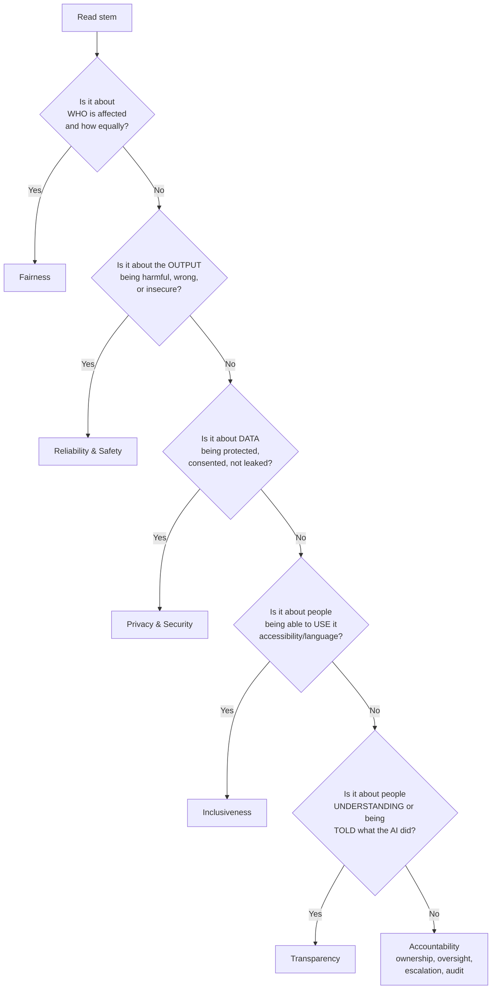

# Day 23: Responsible AI Focus Review

**Date**: 2026-07-31
**Domain**: Domain 1 — Use GitHub Copilot Responsibly (15–20%) + heavy mixed carryover (D2/D3/D4/D5/D6)
**Subtopics**: All 6 Microsoft Responsible AI principles, scenario→principle mapping, safety filters, human accountability, plus cross-domain refresh on plans, data flow, prompting, testing, and IP controls
**Estimated study time**: 2 hrs
**Exam date**: 2026-08-08 (8 days out)

---

## TL;DR (60-second skim)

- Six principles, memorize as **FRPITA**: **F**airness, **R**eliability & Safety, **P**rivacy & Security, **I**nclusiveness, **T**ransparency, **A**ccountability.
- **Fairness = no discrimination / unbiased / equitable outcomes / representative training data.** This is NOT Transparency. Burn this in.
- **Transparency = people can understand what the system did and why + disclosure of limitations.** It's about *explainability and disclosure*, never about bias.
- **Harmful / offensive / unsafe / insecure output → Reliability & Safety.** Not Transparency, not Inclusiveness.
- **Accountability = a human owns the outcome**: governance, escalation, incident reporting, audit trail, human review before merge.
- Plan direction rule: **Business = org admin controls** (policies, seats, usage reporting, content exclusion, audit logs). **Enterprise = GHEC-scoped enterprise integrations + GitHub.com repo-aware Chat + enterprise-wide governance.**
- **Content exclusion controls INPUT** (what Copilot may read). **Code referencing / duplication filter controls OUTPUT** (suggestions matching public code, ~150 chars of surrounding context).
- Copilot **never guarantees** correctness or security — the human review gate is permanent and non-negotiable.

---

## Learning Objectives

After this session you should be able to:

1. Name all six Responsible AI principles and state each one's one-line definition without hesitation.
2. Read a scenario stem, extract the trigger keyword, and map it to exactly one principle in under 5 seconds.
3. Disambiguate the four highest-collision pairs: Fairness↔Transparency, Reliability↔Privacy, Inclusiveness↔Fairness, Accountability↔Transparency.
4. Explain what Copilot's safety filters do and do not block.
5. Correctly pick Business vs Enterprise vs Pro vs Free from any stem.
6. Distinguish content exclusion from code referencing, and telemetry from model training.
7. Recognize a well-formed prompt and a well-scoped coding-agent task.

---

## Part 1 — The Six Principles, Deep Dive

Microsoft's Responsible AI Standard (v2) defines six principles. GitHub Copilot's responsible-use guidance and the MS Learn module *Responsible AI with GitHub Copilot* use exactly these six. There is no seventh principle. "Ethics", "Compliance", "Sustainability", "Explainability" as standalone answer options are **always distractors**.

### 1. Fairness — "AI systems should treat all people fairly"

**Definition**: The system produces **equitable outcomes** and does not systematically advantage or disadvantage groups. Similar cases get similar treatment.

**What it covers**:

- Bias in **training data** (unrepresentative, skewed, historically biased datasets).
- Uneven **quality of service** across demographics, languages, regions, skill levels.
- **Stereotyping** and allocation harms (loans, hiring, medical triage, credit).
- Mitigation practice: dataset balance checks, bias metrics (demographic parity, equal opportunity), rebalancing, threshold tuning, diverse evaluation sets, ongoing production monitoring.

**Trigger keywords in stems**: *fair, equitable, equally, discrimination, discriminatory, bias, biased, unbiased, representative data, diverse datasets, treats all people/groups the same, similar recommendations to people with similar circumstances.*

**Copilot-specific angle**: Copilot was trained on public code that may over-represent certain languages, idioms, and author populations. Suggestions can be lower quality for less-represented languages or non-English identifiers/comments. That is a **Fairness** issue.

> ⚠️ **THE #1 REPEAT MISS.** "Prevent discrimination", "avoid bias", "ensure unbiased training data", "representative dataset" are **Fairness**, and only Fairness. Transparency is a wrong answer to every one of those stems. There is no scenario where "bias in training data" maps to Transparency.

### 2. Reliability and Safety — "AI systems should perform reliably and safely"

**Definition**: The system behaves **predictably and consistently**, stays inside its intended scope, **fails safely**, and **does not produce harmful output** — under both expected and adversarial conditions.

**What it covers**:

- **Harmful, offensive, toxic, hateful, or explicit content generation.**
- **Insecure, outdated, or vulnerable code patterns** suggested by Copilot (e.g., SQL injection, hardcoded secrets, deprecated crypto).
- Hallucinated / non-existent APIs and packages.
- Non-determinism and inconsistency of output.
- Mitigation practice: pre-deployment evaluation, safety guardrails, **content filters**, red-teaming, robustness testing, live monitoring, incident response, fallback behavior, SAST/DAST/CodeQL/secret scanning, unit + integration tests, required CI checks.

**Trigger keywords**: *offensive, unsafe, harmful, toxic, hate speech, explicit, dependable, consistent, works as intended, robust, testing and validation, guardrails, insecure code pattern, vulnerable suggestion, fails gracefully.*

> ⚠️ **Repeat-miss trap (q027 family):** "An AI model generates offensive or unsafe content during testing. Which principle is most directly violated?" → **Reliability and Safety**. Candidates wrongly pick Inclusiveness (because offensive content feels like an inclusion problem) or Transparency. It is neither: harmful *output* = a safety failure.

**Copilot safety filters — what they block and don't block:**

| Blocked by Copilot safety filters                       | NOT blocked by safety filters (handled elsewhere)               |
| ------------------------------------------------------- | --------------------------------------------------------------- |
| Hate speech / discriminatory language                   | Code with logical errors → tests, review, linters                |
| Sexually explicit content                               | Poor style / bad naming → linters, formatters                    |
| Violent or self-harm content                            | Insecure dependencies → Dependabot, SCA scanning                 |
| Off-topic / abusive prompts (Copilot stays on coding)   | Strong personal opinions in comments → code review, not a filter |
| Prompt-injection style attempts to elicit harmful output | Suggestions matching public code → **code referencing filter**   |

Key separation: **safety filters ≠ public-code filter.** Safety filters deal with *harm*; the duplication/code-referencing filter deals with *IP and licensing*.

### 3. Privacy and Security — "AI systems should be secure and respect privacy"

**Definition**: Data is **protected, minimized, consented to, and not leaked or disclosed**. Access controls, encryption, and retention limits are respected.

**What it covers**:

- Secrets, credentials, PII, customer data appearing in prompts or suggestions.
- Training or fine-tuning on real customer data **without consent**.
- Data residency, retention, and access boundaries.
- Copilot controls that serve this principle: **content exclusion**, org/enterprise policies, no-training-on-private-code contractual terms for Business/Enterprise, secret scanning + push protection.

**Trigger keywords**: *personal data, PII, customer data, credentials, secrets, consent, leak, disclosure, confidential, encryption, data residency, retention.*

### 4. Inclusiveness — "AI systems should empower everyone and engage people"

**Definition**: The system is **usable and accessible** by people of all abilities, languages, cultures, and backgrounds. It removes barriers to participation.

**What it covers**:

- Accessibility (screen readers, keyboard navigation, contrast, captions).
- Localization and multi-language support.
- Designing with and for under-served communities.
- Copilot angle: helping developers with disabilities, non-native English speakers, or those new to a language participate more fully; voice/chat interfaces reducing barriers.

**Trigger keywords**: *accessibility, assistive technology, disability, all abilities, languages, cultures, global communities, barrier reduction, empower everyone, localization.*

> ⚠️ **Fairness vs Inclusiveness disambiguation**: Fairness = **outcomes are equitable** (no discriminatory result). Inclusiveness = **the product is usable by everyone** (no one is locked out of using it). "Model performs worse for group X" = Fairness. "People using a screen reader can't use the feature" = Inclusiveness.

### 5. Transparency — "AI systems should be understandable"

**Definition**: People can **understand how and why** the system produced an output, and are **told what the system is, its capabilities, and its limitations**.

**What it covers**:

- **Disclosure that AI was used** (labeling AI-generated code/PRs, telling users they're talking to AI).
- **Explainability**: why did the model suggest this? What context/data influenced it?
- **Documenting limitations**: "Copilot may produce incorrect or insecure code."
- Transparency Notes / model cards / system documentation.
- Copilot angle: telling teammates that a PR contains AI-generated code; documenting which model/plan is in use; Copilot Chat explaining its reasoning; code references showing the origin repo + license of a matching suggestion.

**Trigger keywords**: *understand how it works, explain the output, explainability, disclose, disclosure, inform users, communicate limitations, documentation of capabilities, users know they're interacting with AI, clarity about behavior.*

> ⚠️ **THE CRITICAL DRILL.** Transparency has **nothing to do with bias**. If the stem says "prevent discrimination / unbiased outcomes / representative data" → Fairness. If the stem says "users should understand why / be told it's AI / know the limitations" → Transparency. Test yourself: does the stem talk about *who is affected and how equally* (Fairness) or about *whether people can see and understand what happened* (Transparency)?

### 6. Accountability — "People should be accountable for AI systems"

**Definition**: **Humans and organizations remain responsible** for AI outcomes. There is a named owner, oversight, escalation, and the ability to intervene, correct, or roll back.

**What it covers**:

- **Human review before merge**; developer owns the code Copilot wrote.
- Governance structures: review boards, ownership, policy, CODEOWNERS, branch protection, required checks.
- **Audit trails**, incident logging, **escalating and documenting** what went wrong.
- Never "blaming the AI" — responsibility does not transfer to the tool.

**Trigger keywords**: *responsible for outcomes, accountable, oversight, governance, escalate, report the incident, document what went wrong, ownership, human in the loop, override, roll back, audit record, policy enforcement.*

**Combined scenarios (very common on GH-300):** a stem describes a leak of customer data used without consent, and asks which actions "demonstrate **Accountability** while addressing the **Privacy and Security** violation". The correct pair is always: (a) **remediate** — remove the sensitive data, report the incident, document the technical + process changes; and (b) **escalate + document transparently + enforce/update policy requiring consent + keep an auditable record**. Wrong options: "ignore it because the data was public", "quietly retrain on a different dataset without recording anything". *Quietly* is always wrong. *Public / eventually anonymized* never excuses a consent violation.

---

## Part 2 — Scenario → Principle Decision Table

Read the stem, find the strongest signal word, map it. Use this table as your primary recall device.

| Scenario signal in the stem                                          | Principle                |
| -------------------------------------------------------------------- | ------------------------ |
| Model gives worse suggestions for one language / demographic          | **Fairness**             |
| Training data is skewed / unrepresentative                            | **Fairness**             |
| "Prevent discrimination", "treat all people equally", "unbiased"      | **Fairness**             |
| Loan/hiring/medical AI gives different results to similar people      | **Fairness**             |
| Copilot generates offensive, hateful, or explicit text                | **Reliability & Safety** |
| Copilot suggests insecure / outdated / vulnerable code                | **Reliability & Safety** |
| System must be dependable, consistent, work as intended               | **Reliability & Safety** |
| Need robustness testing, guardrails, content filters, monitoring      | **Reliability & Safety** |
| Suggestion contains an API key, PII, or customer data                 | **Privacy & Security**   |
| Model trained on customer data without consent                        | **Privacy & Security**   |
| Need to prevent sensitive files being read as context                 | **Privacy & Security** (implemented via content exclusion) |
| Screen-reader users can't use the feature                             | **Inclusiveness**        |
| Serve people of different cultures, abilities, languages globally     | **Inclusiveness**        |
| Users must know they're interacting with AI                           | **Transparency**         |
| Team must document Copilot's limitations to developers                | **Transparency**         |
| "Users should understand how/why the system produced this output"     | **Transparency**         |
| Label PRs / code as AI-generated so reviewers know                    | **Transparency**         |
| Developer is responsible for reviewing and merging AI code            | **Accountability**       |
| Incident must be escalated, documented, and policy updated            | **Accountability**       |
| Need audit logs, ownership, oversight, ability to roll back           | **Accountability**       |
| Human-in-the-loop approval gate before production                     | **Accountability**       |

### Fast decision flow



---

## Part 3 — Repeat-Miss Disambiguation Drills

Cover the right-hand column and answer before revealing.

| Stem fragment                                                              | Principle |
| -------------------------------------------------------------------------- | --------- |
| "Ensure the model does not produce discriminatory hiring recommendations"   | Fairness |
| "Ensure candidates are told an AI screened their résumé"                    | Transparency |
| "Ensure the training dataset represents all user groups"                    | Fairness |
| "Publish a note describing the model's known limitations"                   | Transparency |
| "Copilot generated a slur in a code comment during testing"                 | Reliability & Safety |
| "A blind developer cannot navigate the Copilot Chat panel"                  | Inclusiveness |
| "Copilot suggested code containing a hardcoded AWS key"                     | Privacy & Security |
| "Copilot suggested a deprecated hashing algorithm"                          | Reliability & Safety |
| "Team must log who approved AI-generated changes"                           | Accountability |
| "Developer must review and test every Copilot suggestion before merge"      | Accountability |
| "Explain to the user which files informed the answer"                       | Transparency |
| "The model works well in English but poorly in Portuguese repos"            | Fairness |
| "Chat UI must support high-contrast themes and keyboard-only use"           | Inclusiveness |
| "Escalate and document the incident, update policy, keep audit record"      | Accountability |
| "Do not let Copilot read `/secrets/**` as context"                          | Privacy & Security |

**The one-sentence separator to memorize:**

> **Fairness** = *equal outcomes for people.* **Transparency** = *people can see and understand what the AI did.* **Reliability & Safety** = *the output itself is safe and correct.* **Privacy & Security** = *the data is protected.* **Inclusiveness** = *everyone can use it.* **Accountability** = *a human owns it.*

---

## Part 4 — Responsible Use of Copilot in Practice

These practical items sit inside Domain 1 and recur in scenario questions.

- **No guarantee of correctness or security.** Copilot suggestions are non-deterministic candidates. GitHub explicitly expects developers to **review, test, lint, scan, and validate**. Any option claiming Copilot "guarantees" correctness or security, or "automatically fixes insecure code", is wrong. Copilot does not auto-remediate.
- **Treat Copilot like a junior pair programmer.** Code review, unit/integration tests, SAST/DAST, dependency scanning, secret scanning before merge.
- **Agent-created PRs are still PRs.** Branch protections, required approvals, required status checks, and CODEOWNERS all still apply. Agent mode does not bypass governance.
- **Copilot code review comments are advisory.** In a security-sensitive repo: apply on a branch, run required checks, get owner/SME review. Never merge straight to main, never disable CODEOWNERS for AI-authored changes, and "CI passed" alone is not sufficient in sensitive code.
- **Scope agent tasks tightly — scoping is a safety control.** In a monorepo, name the packages/paths and request small reviewable per-package diffs. "Fix everything", "refactor as you see fit", "make it better" are always wrong answers.
- **Don't mask problems.** Flaky tests → isolate external deps with mocks/fakes, add deterministic fixtures, reduce timing sensitivity. Never disable tests, never blanket-retry, never bump global timeouts to hide failures.
- **Bias awareness is an active duty.** Review suggestions for biased naming, assumptions, or non-inclusive language; don't just accept.

---

## Cross-Domain Quiz Question Refreshers

Today's question set is heavily mixed. Everything below is fair game.

### A. Plans & Licensing (Domain 2) — the direction rule

**Individual tiers:** Copilot **Free**, Copilot **Pro**, Copilot **Pro+**.
**Organization tiers:** Copilot **Business**, Copilot **Enterprise**.
The current taxonomy is exactly: **Free / Pro / Pro+ (individual), Business / Enterprise (org)**. "Team" and "Premium" are legacy/fake names and are always distractors.

| Capability                                                       | Free | Pro | Pro+ | Business | Enterprise |
| ---------------------------------------------------------------- | :--: | :-: | :--: | :------: | :--------: |
| Individual use, limited completions/premium requests              | ✅ | ✅ | ✅ | ✅ | ✅ |
| Free for **verified** students, teachers, OSS maintainers         | — | ✅ (this is **Pro**, not Free) | — | — | — |
| Org license management + seat assignment                          | — | — | — | ✅ | ✅ |
| Org **policy controls**                                           | — | — | — | ✅ | ✅ |
| **Usage reporting / metrics**                                     | — | — | — | ✅ | ✅ |
| **Content exclusion** (repo/org level)                            | — | — | — | ✅ | ✅ |
| **Audit logs**                                                    | — | — | — | ✅ | ✅ |
| Enterprise-wide policy inheritance across multiple orgs           | — | — | — | — | ✅ |
| **GitHub.com repository-aware Copilot Chat**                      | — | — | — | — | ✅ |
| Enterprise integrations / advanced compliance                     | — | — | — | — | ✅ |

**Direction rule (memorize verbatim):**

- Stem mentions **org, licenses, policies, usage reporting, content exclusion, audit logs, "no enterprise integrations needed"** → **Business**.
- Stem mentions **enterprise integrations, GitHub.com repo-aware Chat, enterprise-wide governance across orgs, advanced compliance** → **Enterprise**.
- Stem mentions a **single developer / personal account / verified student-teacher-maintainer** → **Pro** (free-with-verification), not Free, never Business.
- **Business is available to orgs on GitHub Team AND Enterprise Cloud.** A GitHub **Team** org needing admin controls → **Business**.

**Sub-traps:**

- **Audit logs exist in Business too.** Audit logs alone do NOT prove Enterprise. Look for repo-aware Chat / enterprise integrations to justify Enterprise.
- **SSO is not a Copilot plan feature.** SSO is a GitHub **Enterprise Cloud org/enterprise** capability; Copilot Enterprise *uses* your org's existing SSO. Options saying "SSO is bundled with Copilot Enterprise as a plan feature" are wrong.
- **Premium Support with SLAs is a separate paid offering**, not bundled with any Copilot plan. It can be *paired with* Copilot Enterprise.
- **Free 30-day GHEC trial includes Copilot Business** (30 days, up to 50 licenses, plus Secret Protection/Code Security on GitHub.com trials). It does **not** include Copilot Enterprise, and GHEC does not bundle Copilot permanently.
- **GHES is not supported.** Copilot is a cloud service requiring GitHub.com / GHEC sign-in. No on-prem, no air-gapped, no GHES-only Chat, no self-hosted model. Copilot Enterprise specifically requires **GHEC**.
- **Who buys/assigns seats**: org owners for Business (single org); enterprise owners for enterprise-scoped plans (across orgs). Developers never purchase from the IDE.

### B. Copilot coding agent & features (Domain 2)

| Concept                          | Key fact                                                                                                 | Trap                                                              |
| -------------------------------- | -------------------------------------------------------------------------------------------------------- | ----------------------------------------------------------------- |
| `copilot-setup-steps.yml`        | Pre-installs runtimes/tools/deps in the agent's **ephemeral GitHub-hosted environment** so builds & tests run reliably | Asking devs to run `npm install` locally does nothing for the agent; never "disable tests" |
| Delegating a task to the agent   | Name the concrete feature, list the steps, define a done condition (tests pass → open PR)                 | "Fix everything", "refactor as you see fit", "make it better"     |
| Edit mode vs Agent mode          | Edit = user-driven targeted edits with diff preview; Agent = autonomous multi-step work, can open a PR    | Both still require review; agent does not bypass branch protection |
| Copilot review in sensitive repo | Advisory only: apply on a branch, run required checks, get owner review                                   | "Trust it if CI passes"; "merge to main to minimize drift"        |
| VS Code Copilot logs             | **Output panel → "GitHub Copilot"** + **extension logs folder**; deeper Electron logs via **Developer: Toggle Developer Tools → Console**; bundle with **"GitHub Copilot: Collect Diagnostics"** | Not on your GitHub.com profile; there is no `/logs` chat command  |
| Copilot Chat surfaces            | GitHub.com, VS Code, Visual Studio, JetBrains, Eclipse, Xcode, GitHub Mobile, Windows Terminal            | Surface availability ≠ feature set; repo-aware Chat is Enterprise |

### C. Data & architecture (Domain 3)

- **Copilot does not use your private code to train shared models.** For Business/Enterprise this is contractual and requires no user action. Individual plans (Free/Pro/Pro+) can have *interaction data* used for improvement, with an opt-out in personal privacy settings. Options saying "private code is always used to train" are wrong; so is tying training to a telemetry toggle.
- **Telemetry ≠ training.** Usage metrics aggregate activity and feature usage (completions, chat, agents) for reporting — not a dump of your source code, and not Enterprise-only.
- **Prompts are processed in the Copilot cloud service**, which relays to the selected model per GitHub's data pipeline. Nothing runs purely locally; nothing runs on GHES.

### D. Prompt engineering (Domain 4)

The universal rule: **the best prompt is the one that pins the most decision-relevant detail.** Ambiguity is fixed by **specificity, not brevity**.

A strong prompt names:

1. **Language / dialect / version** (e.g., "PostgreSQL 14", "Python 3.12", "xUnit").
2. **Context / schema / selection** (paste tables + columns; scope to a file or selection).
3. **The precise task and filters** (top 5 customers by revenue, last 30 days).
4. **Required mechanism** if you care (use a window function for rank; use recursion; O(n) space).
5. **Exact output shape** (columns `id, name, revenue, rank`; JSON schema; "no prose").
6. **Acceptance criteria / edge cases** (handle empty input, timeouts, nulls).
7. **Examples** — small, high-fidelity, project-idiomatic snippets act as **pattern anchors** for style, naming, and structure.

**When two prompt options look nearly identical, count the anchors.** The correct answer is the one that pins *strictly more* of: dialect+version, schema, time window, mechanism, and output columns. If option X has everything option Y has **plus** the dialect/version, X wins.

> ⚠️ **CI-ready output prompts (repeat miss):** when the stem asks for output a pipeline will consume, the correct answer always specifies (a) a **machine-readable format** (JSON/CSV/SARIF), (b) the **exact schema/fields**, and (c) an explicit **"no prose / no explanation / output only the JSON"** instruction. An option missing any of those three is weaker.

Prompt engineering improves **quality**, not **policy**: it cannot disable duplication detection, code referencing, or content exclusion, and it does not make output license-compliant.

### E. Productivity & testing (Domain 5)

| Concept                        | Key fact                                                                                     | Trap                                                        |
| ------------------------------ | -------------------------------------------------------------------------------------------- | ----------------------------------------------------------- |
| Copilot & testing productivity | Speeds up **boilerplate test structures, fixtures, setup/teardown, assertion scaffolds**     | Never "removes the need for tests", "guarantees all pass", or "auto-deploys" |
| Test types it scaffolds        | **Unit tests + integration test scaffolding**                                                 | Not specialized for E2E, perf/load, or compliance testing   |
| After tests are generated      | **Validate and refine** — meaningful assertions, conventions, edge cases, coverage           | Not "assume 100% coverage", not "rewrite from scratch"      |
| TDD with Agent Mode            | Scaffold **failing tests first** → agent implements until green → review and refactor (red-green-refactor) | Never delete/skip/disable failing tests to go green         |
| Correctness guarantee          | **None.** Developers must review and test.                                                    | "Copilot automatically fixes insecure code" is false        |
| Prototyping                    | Quick runnable drafts for features/experiments; harden with tests + security review after     | Not payroll, legal contracts, or manual QA                  |

### F. Privacy, IP, and policy controls (Domain 6)

**The two-control model — memorize the direction:**

| Control                                          | Direction  | What it does                                                                                                    |
| ------------------------------------------------ | ---------- | --------------------------------------------------------------------------------------------------------------- |
| **Content exclusion**                            | **INPUT**  | Prevents specified repos/paths/file types/patterns from being used as **context**. Enforced **in the Copilot service**, so it applies across **all surfaces** (IDE, GitHub.com, CLI, Mobile). Available in **Business + Enterprise**. |
| **Code referencing / duplication detection** ("suggestions matching public code") | **OUTPUT** | Checks a suggestion plus **~150 characters of surrounding context** against an index of **public** code on GitHub.com. **Block** = suppress the suggestion. **Allow** = show it with references (source repo URLs + license). |

Content exclusion does **not**: censor outputs resembling excluded files, disable Copilot in the repo, or remove files from git history.
Code referencing does **not**: compress prompts, disable chat history, or auto-attribute licenses in your repo. It **identifies/blocks**; a human still decides on attribution or removal.

Additional facts:

- Matching only covers **public GitHub code**. Private repos and code outside GitHub are not in the index.
- Only **accepted, unmodified** Copilot suggestions are checked for inline code referencing — code you wrote or heavily altered is not.
- Matches occur in **less than ~1%** of suggestions.
- **Configuration scopes for code referencing: individual account settings + organization/enterprise policies.** Not repository-only, not enterprise-only, not IDE-only.
- **Policy hierarchy: enterprise → organization → individual.** Lower scopes may only be **stricter**, never more permissive. If an enterprise **enforces** "Block matching public code", no org owner or repo admin can flip it to "Allow" — no exception for public vs private repos. If a user gets a seat through an org, their personal setting is inherited/overridden.
- IP indemnity (Copyright Commitment) for Business/Enterprise is conditioned on having the **duplication filter enabled**.

---

## Part 5 — Rapid-Recall Cheat Sheet

**Six principles, one line each:**

| Principle              | One-liner                                   | Its signature word |
| ---------------------- | ------------------------------------------- | ------------------ |
| Fairness               | Treat all people equitably                  | **bias**           |
| Reliability and safety | Perform reliably, fail safely, no harm      | **harmful**        |
| Privacy and security   | Protect data, respect consent               | **data**           |
| Inclusiveness          | Empower and engage everyone                 | **accessible**     |
| Transparency           | Be understandable; disclose limitations     | **understand**     |
| Accountability         | People remain responsible                   | **oversight**      |

**Plan picker in three questions:**

1. One person on a personal account? → **Free**, or **Pro** if verified student/teacher/OSS maintainer.
2. An org (Team or GHEC) needing seats, policies, exclusions, reporting, audit logs? → **Business**.
3. GHEC needing enterprise integrations, cross-org governance, or GitHub.com repo-aware Chat? → **Enterprise**.

**Never-true statements (auto-eliminate):**

- "Copilot guarantees correct / secure code."
- "Copilot automatically fixes insecure code."
- "Private code is always used to train Copilot models."
- "Telemetry includes raw file contents."
- "Copilot runs on GitHub Enterprise Server / fully on-prem / self-hosted."
- "An org can override an enterprise-enforced Copilot policy."
- "Agent-mode PRs can merge without review / bypass branch protection."
- "SSO is bundled as a Copilot plan feature."
- "Premium Support SLAs are included with a Copilot plan."
- "Content exclusion only works in VS Code."
- "Copilot Free is the free benefit for verified students." (It's **Pro**.)
- Any answer that disables tests, hides flakiness, or skips human review.

**Always-true statements (auto-favor):**

- Humans review, test, and own the output.
- More specific prompt = better answer.
- Tighter task scope = safer agent.
- Enterprise-enforced policy wins over org and individual.
- Content exclusion = input; code referencing = output.

---

## Hands-On Lab (optional, ~10 min)

1. Open your Copilot settings on GitHub.com (profile → **Copilot settings**) and locate **Suggestions matching public code**. Note whether it says Allow/Block, and whether it's inherited from an org (grayed out).
2. In VS Code, run **View → Output → GitHub Copilot**, then Command Palette → **Developer: Open Extension Logs Folder**, then Command Palette → **GitHub Copilot: Collect Diagnostics**. Skim the **Reachability** section — that's the exact troubleshooting chain the exam asks about.
3. Write one prompt for a CI-consumable task and check it against the three-part rule (machine-readable format + exact fields + "no prose").

---

## Quiz

Run from the `GH-300 Prep` folder:

```powershell
python quiz_runner.py --day-lock 23
```

Optional browser UI:

```powershell
python quiz_runner.py --day-lock 23 --web
```

25 questions: Responsible AI plus mixed carryover across plans, data/architecture, prompting, testing, and IP controls.

---

## Sources (verified 2026-07-30)

- [What is responsible AI? — Microsoft Support](https://support.microsoft.com/en-us/privacy/what-is-responsible-ai)
- [Responsible AI Principles and Approach — Microsoft AI](https://www.microsoft.com/en-us/ai/principles-and-approach)
- [What is Responsible AI — Azure Machine Learning, Microsoft Learn](https://learn.microsoft.com/en-us/azure/machine-learning/concept-responsible-ai)
- [Microsoft Responsible AI Standard v2 — General Requirements (PDF)](https://cdn-dynmedia-1.microsoft.com/is/content/microsoftcorp/microsoft/final/en-us/microsoft-brand/documents/Microsoft-Responsible-AI-Standard-General-Requirements.pdf)
- [MS Learn module source — Six principles of Responsible AI (Responsible AI with GitHub Copilot)](https://github.com/MicrosoftDocs/learn/blob/main/learn-pr/github/responsible-ai-with-github-copilot/includes/3-six-principles-of-responsible-ai.md)
- [Responsible AI for agent design — Microsoft Learn](https://learn.microsoft.com/en-us/agents/design-guidelines/responsible-ai)
- [GitHub Copilot code referencing — GitHub Docs](https://docs.github.com/en/enterprise-cloud@latest/copilot/concepts/completions/code-referencing)
- [Managing GitHub Copilot policies as an individual subscriber — GitHub Docs](https://docs.github.com/en/copilot/how-tos/manage-your-account/manage-policies)
- [Introducing code referencing for GitHub Copilot — The GitHub Blog (~150 characters of context)](https://github.blog/news-insights/product-news/introducing-code-referencing-for-github-copilot/)
- [Setting up a trial of GitHub Enterprise Cloud — GitHub Docs (trial includes Copilot Business)](https://docs.github.com/admin/overview/setting-up-a-trial-of-github-enterprise-cloud)

---

## Notes (your own words — fill this in after studying)

_(Write the Fairness-vs-Transparency separator here in your own words. If you can't write it from memory, re-read Part 3.)_
