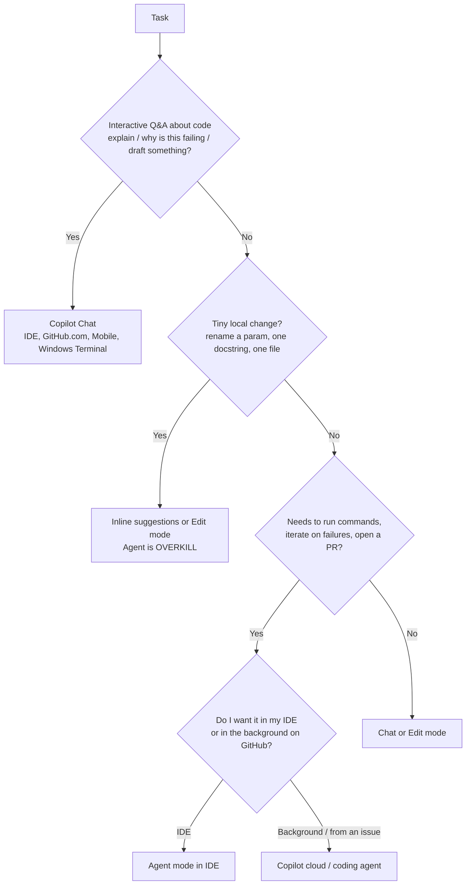

# Day 25: D4/D5 Focus Review — Prompt Engineering Nuances & Productivity Patterns

**Date**: 2026-08-02
**Domains**: D4 Apply Prompt Engineering and Context Crafting + D5 Improve Developer Productivity (with heavy D1/D2/D6 carryover)
**Subtopics**: Prompt specificity rules, constraint-encoded prompts, context crafting, test generation patterns, Chat vs Agent division of labor, plan tiers, Responsible AI principle mapping
**Estimated study time**: 2 hrs
**Exam date**: 2026-08-08 (6 days out)

---

## TL;DR (60-second skim)

- **The best prompt is always the most *constrained* one.** Format + exact fields + explicit prohibitions ("no prose", "no PII", "do not hardcode", "include rollback SQL") beats any prompt that merely describes intent.
- **Copilot drafts, humans validate.** Every D5 answer about generated tests, generated docs, generated code ends with "review and refine". Copilot never certifies correctness, never guarantees coverage, and never runs your CI.
- **Chat = draft/explain/explore. Agent = execute/iterate/PR.** Agent mode is *overkill* for a one-file, one-symbol change. Agent is *right* when the task list includes running commands and opening a PR.
- **Plan tiers are directional**: Business = org admin controls, policies, seat management, usage metrics, content exclusion. Enterprise = GHEC-scoped SSO/identity, advanced compliance, enterprise proxy/network, GitHub.com repo-aware Chat, enterprise support context. Don't over-correct everything to Business.
- **Public-code handling has three distinct mechanisms** — duplication detection filter (blocks), code referencing (shows the reference), content exclusion (controls what Copilot can read in the first place). Different sides of the pipeline; never interchangeable.

---

## Learning Objectives

After this session you should be able to:

1. Pick the strongest prompt from four superficially similar options by counting encoded constraints.
2. Write a CI-ready / machine-readable output prompt from memory.
3. State exactly what Copilot does and does *not* do for testing.
4. Choose between inline suggestions, Chat, Edit mode, Agent mode, and the cloud/coding agent for a given task size.
5. Map any Responsible AI stem keyword to the correct one of six principles.
6. Assign the right Copilot plan tier from admin-capability language in the stem.

---

## Part 1 — D4: Prompt Engineering Nuances

### 1.1 The official prompt-engineering ladder (GitHub Docs)

GitHub's documented strategies, in order:

| Strategy | What it means | Exam signal |
| --- | --- | --- |
| Start general, then get specific | One-line goal, then a bulleted requirement list | Prompts that lead with scenario then constraints |
| Give examples | Sample input, sample output, sample implementation | "provide snippets", "example I/O" |
| Break complex tasks into simpler tasks | Decompose into sequential small asks | "instead of one giant prompt…" |
| Avoid ambiguity | No "this"/"it"; name the function, the library, the file | "what does `createUser` do" beats "what does this do" |
| Indicate relevant code | Open relevant files, close irrelevant ones, highlight the selection, use `@workspace` / `@project` | Context-crafting questions |
| Experiment and iterate | Refine or delete-and-restart | "didn't get what you want →" |
| Keep history relevant | New thread per task; delete dead turns | Chat-history hygiene |
| Follow good coding practices | Consistent style, descriptive names, comments, modular structure, unit tests | "why are my suggestions poor?" |

### 1.2 The universal scoring rubric for "which prompt is best?"

This is the single highest-yield mental model for D4. Score each candidate prompt on:

1. **Output format pinned?** (JSON / YAML / table / SQL / diff / single-line-per-event)
2. **Exact schema/fields named?** (`level`, `event`, `requestId`; column name + type + default)
3. **Prohibitions stated?** ("no prose", "no PII", "no secrets in logs", "do not hardcode")
4. **Failure behavior stated?** (fail fast, exit non-zero, clear error)
5. **Escape hatch / safety rail?** (rollback SQL, no-downtime requirement, backfill rule)
6. **Scope bounded?** (which file, which package, which path)

**The option that scores highest wins. Every time.** Distractors typically fail by being permissive ("filter sensitive data later if needed"), vague ("in a way that works for your database engine"), or actively unsafe ("log the value for debugging", "commit the key to the repo, documented as private").

> Watch the distractor that *sounds* responsible — "document that it should not be shared publicly", "accept some downtime during a low-traffic window", "continue with limited functionality". Sounding careful is not the same as encoding a constraint.

### 1.3 DRILL — CI-ready / machine-readable output prompts (missed ~4×)

This pattern has cost you repeatedly. Burn it in.

**The correct answer shape is always these three parts together:**

```
1. A machine-readable FORMAT   → "output JSON" / "output valid YAML" / "output a unified diff"
2. An EXACT SCHEMA             → "fields: id, severity, file, line, message"
3. A SUPPRESSION CLAUSE        → "no prose, no markdown fences, no explanation, no commentary"
```

Optional 4th: **determinism/exit semantics** — "stable key ordering", "exit non-zero on failure", "one object per line (NDJSON)".

Memorise this template prompt:

```
Output ONLY valid JSON matching this schema:
{ "status": "pass|fail", "findings": [ { "file": string, "line": int, "rule": string, "severity": "low|medium|high" } ] }
No prose, no markdown code fences, no explanation. Keys in the order shown.
Exit non-zero if status is "fail".
```

**Why the distractors lose:**

| Distractor pattern | Why it fails |
| --- | --- |
| "Explain the results clearly so the team understands" | Prose defeats machine parsing |
| "Output JSON" (format only, no schema) | Field names/shape drift between runs → parser breaks |
| "Return a nicely formatted report" | Not machine-readable |
| "Use whatever structure makes sense" | No determinism |
| Includes format + schema but no "no prose" | Model wraps output in explanation/fences → parse failure |

**Trigger words in the stem that mean "pick the CI-ready prompt":** *pipeline, CI, automation, script consumes the output, parse programmatically, gate the build, fail the build, downstream tool, non-interactive.*

### 1.4 Security-constrained prompts (secrets)

The winning prompt encodes **all four**:

- **Source**: read from environment variable **or** a secrets manager
- **Prohibition**: do **not** hardcode; never commit to the repo
- **Failure**: **fail fast** if missing/invalid (not "fall back to a default key", not "continue with limited functionality")
- **Logging**: **log-safe** — no secrets in logs, redact tokens

Anything that adds a *fallback default key* or *logs the value for debugging* is disqualified regardless of how the rest of the option reads.

### 1.5 Privacy-constrained logging prompts

The winning prompt names:

- **Structured JSON** (not "verbose logging")
- **Schema**: `level`, `event`, `requestId` (+ error stack)
- **Correlation ID** so a request is traceable across services
- **Redaction rules**: no PII, redact tokens
- **Single line per event** (so log shippers can ingest it)

Disqualifiers: "include full request and response bodies", "include tokens in debug mode", "capture all fields and filter sensitive data later".

### 1.6 Operational / migration prompts

Safe DB-migration prompts pin:

- **Exact DDL** — column name, type (e.g. ENUM), default value
- **Backfill rule** — derive new column from the existing column
- **Online strategy** — explicitly "no downtime"
- **Rollback** — "include rollback SQL"

Disqualifiers: "accepting some downtime", "remove old fields later if needed", "in a way that works for your database engine".

### 1.7 Teaching Copilot your project style

Style is taught with **code, not prose**. Paste a short, real snippet from the codebase (imports, naming, error handling, assertion style, docstring format) and say "match this style". Also call out linters and test framework conventions. A paragraph describing "clean code" is a far weaker signal than eight lines of real code.

Related context-crafting levers (know these by name):

- **Custom instructions** (`.github/copilot-instructions.md`, `*.instructions.md` with `applyTo`) — persistent preferences
- **Prompt files** (`*.prompt.md`) — reusable parameterised prompts
- **Copilot Spaces** — curate code + docs + specs as grounding for a task
- **Agent skills** — folders of instructions/scripts Copilot loads when relevant
- **MCP servers** — external tools/data sources
- **Custom agents** — specialised agent configs with scoped tools/instructions
- **Copilot Memory** (public preview) — repo facts reused by cloud agent and code review

---

## Part 2 — D5: Productivity Patterns

### 2.1 What Copilot DOES for testing

- Generates **unit tests** from a highlighted function, signature, or NL prompt
- Scaffolds **integration tests** — setup/teardown, fixtures, initial assertions
- Produces **parameterised / table-driven** tests when asked
- Suggests **test names and assertions**
- Assists with **test refactoring**, naming, and fixture organisation

### 2.2 What Copilot does NOT do for testing

- Does **not** run your test framework in CI — that's GitHub Actions / your pipeline
- Does **not** guarantee 100% functional or edge-case coverage
- Does **not** specialise in end-to-end/UI automation, performance/load testing, or legal/regulatory compliance testing
- Does **not** replace review, coverage gates, or security scanning

> The exam's favourite D5 trap: an option that says Copilot "runs tests automatically in CI". Copilot writes test *code*; your automation platform *executes* it.

### 2.3 The mandatory post-generation step

After Copilot generates tests (or any code): **validate and refine.** Concretely — check assertions are meaningful, align naming/folder/framework conventions, add boundary/negative/error-path cases, run locally and in CI, measure coverage.

Both extremes are wrong answers: "ship it as-is / assume full coverage" **and** "ignore it and rewrite from scratch". Copilot output is a **starting point**, not a finished artifact and not garbage.

### 2.4 Productivity scope boundary

Copilot's productivity role is **developer-focused**: code, tests, docs, PR summaries, commit messages, explanations, refactors. Options about **business proposals, product strategy, HR/payroll, marketing copy, ad campaigns** are out-of-scope distractors — they exist to be eliminated on sight.

### 2.5 Other documented productivity surfaces

| Surface | What it produces |
| --- | --- |
| PR summaries | AI summary of changes, affected files, what reviewers should focus on |
| Copilot code review | AI review suggestions on a diff (parts in public preview) |
| Copilot in GitHub Desktop | Commit messages and descriptions from your changes |
| Next edit suggestions | Predicts *location* of your next edit plus the completion (VS Code, Visual Studio, Xcode, Eclipse) |
| Copilot CLI | Terminal-based agent; can add features/fix bugs and open a PR; session continues on GitHub.com or mobile |
| GitHub Spark (public preview) | Full-stack apps from natural-language prompts |

---

## Part 3 — Feature Selection: Which Copilot Surface?

### 3.1 Decision flow



### 3.2 Chat vs Agent — the split the exam tests

Given a task list like *"generate tests, update config, run tests, fix failures, open a PR"*:

- **Chat** → drafting the tests and the config changes; explaining failures
- **Agent** → running the commands, iterating on failures, creating the PR

Wrong-answer shapes: giving Chat the ability to run terminal commands and manage PRs autonomously; restricting the agent to only writing code while Chat orchestrates; using Chat for literally every step.

### 3.3 When Agent mode is overkill

Rename a parameter + update one docstring in one file → **inline / Edit mode / Chat**. The orchestration overhead of Agent mode buys nothing on a single-symbol, single-file edit.

Agent mode *is* justified for: regenerating a lockfile and re-running a multi-step build, fixing failures across multiple packages, anything ending in "…and open a PR".

Note: "bypass required reviews and branch protections" is never a valid capability of anything — it's a permanent distractor.

### 3.4 Coding / cloud agent — good vs bad task assignment

**Good candidates** (scoped, testable, PR-driven):

- Implementing a feature from a well-defined issue with acceptance criteria
- Bug fixes with reproduction steps
- Improving unit-test coverage on a documented service
- Small refactors that already have tests
- Docs updates, tech-debt cleanup, CSS/design-system token updates with visual regression tests
- Resolving merge conflicts

**Bad candidates** (keep human-led):

- Live production incidents / outages
- Anything involving **PII leakage**, **authentication failures**, or security trade-offs
- Rotating production credentials, live schema changes on prod
- Configuring enterprise SSO, audit logging, or other security-sensitive admin settings
- Broad, unscoped "fix everything" refactors

> **Keyword trigger**: the moment a stem says *production incident*, *PII*, *credentials*, *authentication*, or *identity/security settings* — the answer is "humans own this; use Copilot only for small reviewable pieces around it."

### 3.5 Monorepo scoping is a SAFETY control

In a monorepo, prevent unintended cross-package edits by **scoping the task to explicit paths/packages and requesting small, reviewable per-package diffs**. Not by disabling tests, not by force-pushing to main, not by letting it roam and cleaning up later. Task scoping is a control, not a preference.

### 3.6 Making agent runs faster and more reliable

Use **`.github/workflows/copilot-setup-steps.yml`** with a single `copilot-setup-steps` job to **pre-install runtimes, package managers, and dependencies** (including private packages) in the agent's ephemeral GitHub Actions environment before it starts work.

Disqualified alternatives: committing `node_modules`/`vendor` to the repo; a personal shell script in your home directory (the agent does not pick that up); disabling CI tests so runs "succeed".

---

## Part 4 — DRILL: Plan Tiers (directional rule)

**Do not over-correct everything to Business.** Read the *specific capability* named in the stem.

| Capability named in stem | Answer |
| --- | --- |
| Org-level **usage metrics / usage reporting / activity reports** | **Business** (Enterprise also has it — if the option set offers both and the question says "which plans", both are valid on a multi-select) |
| **Seat management**, **policy controls**, **content exclusion** | **Business** |
| Org visibility into usage **but explicitly not enterprise compliance** | **Business** |
| **SSO / enterprise identity provider** integration | **Enterprise** (relies on the GHEC org's IdP — Copilot Enterprise does not "include" SSO, it consumes it) |
| **Enterprise proxy / network configuration** | **Enterprise** |
| **Advanced compliance / enterprise audit** capabilities | **Enterprise** |
| **GitHub.com repository-aware Chat**, enterprise integrations | **Enterprise** |
| **Enterprise support SLAs** context | **Enterprise** (but the SLA itself comes from the GitHub Enterprise support agreement / **GitHub Premium Support purchased separately** — it is not bundled into any Copilot SKU) |
| Individual developer, no org admin surface | **Pro / Pro+** |
| No admin visibility at all, quota-limited | **Free** |

Additional plan facts to hold:

- **Copilot Pro is free for verified students, teachers, and maintainers of popular open source projects.**
- **GHEC does not bundle Copilot** — Copilot is a separate purchase.
- **"Copilot Premium" is not a plan.** (Premium *requests* are a usage concept; Premium *Support* is a separate GitHub support product.)
- **Copilot is not supported on GitHub Enterprise Server / on-prem.** GHES-only scenarios → Copilot is out.
- Org-level governance **starts at Business**; **Enterprise inherits it** and layers enterprise-scope capabilities on top.
- Copilot cloud agent is available on **all paid plans** (not Free).
- The **model switcher** for inline suggestions is automatic on Free/Pro; on Business/Enterprise the org/enterprise must enable **Editor preview features**.

---

## Part 5 — DRILL: Public Code & Content Controls (missed Day 24)

Three distinct mechanisms. Learn which side of the pipeline each sits on.

| Mechanism | Side | Trigger | Behavior | Scope |
| --- | --- | --- | --- | --- |
| **Duplication detection filter** ("Suggestions matching public code" = **Blocked**) | **Output** | Suggestion + ~150 characters of surrounding context matches public code on GitHub.com | **Suppresses the suggestion entirely.** Length/match based — **license-blind**; it does not care what license the public code carries | User (individual) and org/enterprise policy |
| **Code referencing** (policy = **Allowed**) | **Output** | Same matching engine, but you chose to allow matches | **Shows the suggestion plus references**: URLs of matching files and the license name, so you decide on attribution or removal | Same policy switch, opposite setting |
| **Content exclusion** (file exclusions) | **Input** | Repo/org config listing paths | Copilot **cannot read** those files — they never become context | Configured at **repository and organization** level (Business/Enterprise admin feature) |

**Disambiguation cheats:**

- Stem says "**exact/verbatim match**", "**blocked**", "**not shown**", "**~150 characters**" → **duplication detection**.
- Stem says "**similar but not identical**", "**shows a link**", "**license information**", "**attribution**" → **code referencing**.
- Stem says "**which files Copilot may use as context**", "**stop Copilot from seeing this directory**", "**secrets file**" → **content exclusion**.
- Matching is only against **public** GitHub.com repos. Private repos and non-GitHub code are not in the index. Index refreshes every few months, so recent code may be missed.
- Code referencing for inline suggestions only fires on **accepted** suggestions; code you wrote or heavily altered is not checked.

---

## Part 6 — DRILL: Responsible AI Principle Mapping

Six principles. Map by keyword, not by vibe.

| Principle | Owns | Keyword triggers |
| --- | --- | --- |
| **Fairness** | Equitable treatment across groups | **bias**, **representative/diverse data**, **prevent discrimination**, equal treatment, demographic parity, equal opportunity, uneven model performance across groups |
| **Reliability & Safety** | Dependable, safe operation | **risk assessment before deployment**, testing, validation, guardrails, fallback behavior, live monitoring, offensive/unsafe output handling |
| **Privacy & Security** | Protecting data and credentials | encryption, Key Vault / Managed HSM, RBAC / least privilege, key rotation, secrets scanning, no plaintext keys |
| **Inclusiveness** | Accessible, usable by everyone | accessibility, assistive tech, diverse abilities, language/locale reach |
| **Transparency** | Explainability & disclosure | **informing users AI is involved**, intended use, known **limitations**, high-level data sources and validation methods, model cards, change logs |
| **Accountability** | Humans stay responsible | governance, human oversight, ownership, escalation, review boards, audit trails, incident response, ability to override/roll back |

### The two traps that keep biting

**Trap 1 — Fairness vs Transparency.** "Bias / representative data / prevent discrimination" is **Fairness**. Transparency is about *telling people* how it works and what its limits are — not about *whether it treats groups equally*.

**Trap 2 — Transparency vs Accountability.** Transparency = *disclosure* (publish how it works, intended use, limitations, high-level data + validation info, while protecting PII and IP). Accountability = *someone is responsible* (governance, oversight, escalation, audit trail). Transparency **enables** Accountability; they are not the same answer.

**Trap 3 — Reliability & Safety vs Accountability.** "Establish processes to identify, assess, and mitigate risks **before deployment**" = **Reliability & Safety** (pre-deployment evaluation and guardrails). Accountability is about *who owns the outcome after* it ships.

**Trap 4 — Transparency ≠ radical disclosure.** Publishing every user's personal data or the full training dataset/source code is *not* Transparency — Transparency explicitly protects sensitive and proprietary details.

---

## Cross-Domain Quiz Question Refreshers

Concepts appearing in today's set that sit outside the core D4/D5 focus:

| Concept | Key fact | Trap |
| --- | --- | --- |
| Copilot Chat definition | Conversational NL Q&A about code — explain, generate tests, debug — across VS Code, Visual Studio, JetBrains, GitHub.com, Mobile, Windows Terminal | Confusing it with coding agent (multi-step execution) or with a *plan* name |
| Coding/cloud agent scope | Branch + PR + tests workflow for scoped code tasks | Assigning prod incidents, credential rotation, or SSO/audit config to it |
| Agent environment setup | `.github/workflows/copilot-setup-steps.yml`, single `copilot-setup-steps` job | Personal shell scripts are NOT auto-detected; committing `node_modules` doesn't help |
| Agent mode sizing | Overkill for a single-file, single-symbol edit | Assuming "newer feature = always better" |
| Monorepo control | Scope to explicit paths/packages, request per-package diffs | Treating scoping as a productivity nicety instead of a safety control |
| Plans — SSO | Enterprise (consumes the GHEC org's IdP) | Saying Copilot Enterprise "includes" SSO |
| Plans — usage metrics | Business (and Enterprise) | Assigning usage reporting to Pro or Free |
| Plans — proxy + advanced compliance | Enterprise | Over-correcting to Business |
| Plans — SLAs | Enterprise context; SLA itself from GitHub Enterprise support / Premium Support purchased separately | Thinking any Copilot SKU bundles an SLA |
| Copilot Pro free tier | Verified students, teachers, popular OSS maintainers | Thinking "Copilot Free" is the students' plan |
| GHES | Copilot not supported on GitHub Enterprise Server / on-prem | Assuming Enterprise plan covers self-hosted |
| Secrets storage (D6) | Key Vault / Managed HSM, RBAC, rotation, auditability | "Config file in the repo, documented as private" |
| RAI — Fairness | Bias, representative data, non-discrimination | Answering Transparency |
| RAI — Transparency | Disclose purpose, operation, limitations, high-level data + validation; protect PII/IP | Answering Accountability, or "release everything" |
| RAI — Accountability | Human ownership, governance, oversight, escalation, audit trails | Answering Transparency |
| RAI — Reliability & Safety | Pre-deployment risk assessment, testing, validation, monitoring | Answering Accountability |

---

## Quick Reference Card

**Prompt quality = count the constraints.** Format → schema → prohibitions → failure behavior → rollback → scope.

**CI-ready prompt = FORMAT + EXACT SCHEMA + "no prose".** All three, always.

**Secrets prompt = env/secret-manager + no hardcode + fail fast + log-safe.**

**Logging prompt = structured JSON + named fields + requestId + no PII/redact + one line per event.**

**Migration prompt = exact DDL + backfill + online/no-downtime + rollback SQL.**

**Testing**: Copilot writes unit tests + integration scaffolds, parameterised tests, fixtures, refactors. Copilot does *not* run CI, guarantee coverage, or do perf/e2e/compliance testing. Always validate and refine.

**Surface sizing**: one file/one symbol → inline or Edit. Explain/draft → Chat. Run commands + iterate + PR → Agent.

**Never delegate to the agent**: prod incidents, PII, auth failures, credential rotation, SSO/audit config.

**Business** = org controls, policies, seats, usage metrics, content exclusion.
**Enterprise** = SSO/identity, advanced compliance, proxy/network, GitHub.com repo-aware Chat, enterprise integrations.

**Blocked** → duplication detection suppresses (length-based, license-blind). **Allowed** → code referencing shows URL + license. **Content exclusion** → controls what Copilot can read at all.

**RAI**: bias→Fairness · disclose/limitations→Transparency · pre-deploy risk/testing→Reliability & Safety · encryption/keys→Privacy & Security · accessibility→Inclusiveness · governance/oversight→Accountability.

---

## Sources (verified 2026-08-01)

- [Prompt engineering for GitHub Copilot Chat](https://docs.github.com/en/copilot/concepts/prompting/prompt-engineering)
- [GitHub Copilot features](https://docs.github.com/en/copilot/get-started/features)
- [About GitHub Copilot cloud agent](https://docs.github.com/en/copilot/concepts/agents/cloud-agent/about-cloud-agent)
- [GitHub Copilot code referencing](https://docs.github.com/en/copilot/concepts/completions/code-referencing)
- [GitHub Copilot code suggestions in your IDE](https://docs.github.com/en/copilot/concepts/completions/code-suggestions)

---

## Quiz

Run from the `GH-300 Prep` folder:

```powershell
python quiz_runner.py --day-lock 25
```

Optional browser mode (better for long option text):

```powershell
python quiz_runner.py --day-lock 25 --web --port 8765
```

---

## Notes (your own words — fill this in after studying)

_(space for your own notes)_
